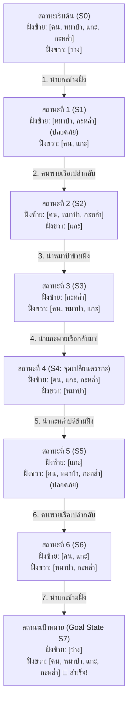
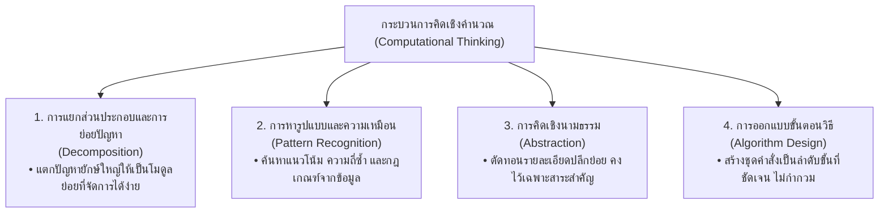
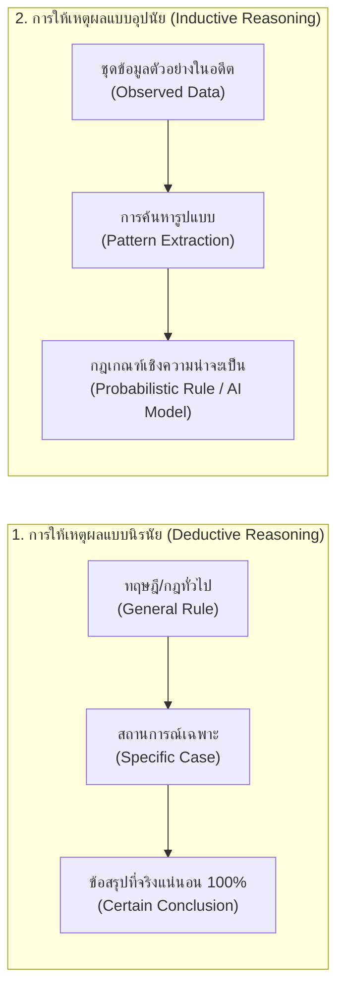
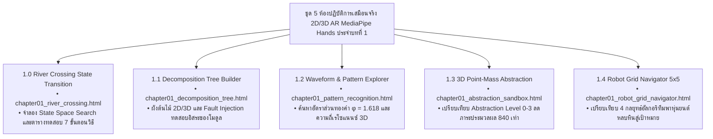

# วิทยาการคำนวณ 1 รากฐานแนวคิดเชิงคำนวณและการแก้ปัญหาอย่างเป็นระบบ
## บทที่ 1 การใช้เหตุผลเชิงตรรกะและกระบวนการคิดเชิงคำนวณ
**ผู้เขียน** ผู้ช่วยศาสตราจารย์ ดร.ชีวะ ทัศนา  
**สังกัด** สาขาวิชาฟิสิกส์ คณะวิทยาศาสตร์และเทคโนโลยี มหาวิทยาลัยราชภัฏรำไพพรรณี  
**เอกสารประกอบรายวิชา** 4122104 วิทยาการคำนวณและการแก้ปัญหาเชิงคำนวณ / การสอนวิทยาการคำนวณ

---

## 📋 แผนบริหารการสอนประจำบทที่ 1

### 1. หัวข้อเนื้อหาประจำบท
1. **เรื่องเล่าเปิดบทเรียนและประวัติศาสตร์ตรรกศาสตร์** ปริศนาข้ามแม่น้ำ (River Crossing Puzzle), จอร์จ บูล (George Boole) และแอลัน ทัวริง (Alan Turing)
2. **รากฐานแนวคิดเชิงคำนวณ ** การแยกส่วนประกอบ (Decomposition), การหารูปแบบ, การคิดเชิงนามธรรม, และการออกแบบขั้นตอนวิธี
3. **การให้เหตุผลเชิงตรรกะในวิทยาศาสตร์และปัญญาประดิษฐ์** การให้เหตุผลแบบนิรนัย (Deductive Reasoning) และการให้เหตุผลแบบอุปนัย (Inductive Reasoning)
4. **พีชคณิตบูลีน ตารางค่าความจริง และวงจรตรรกะ** ตัวดำเนินการ AND, OR, NOT, XOR, เงื่อนไข IF-THEN, กฎของเดอมอร์แกน (De Morgan's Laws)
5. **การวิเคราะห์โจทย์ประยุกต์และตัวอย่างเชิงลึก ** ระบบความปลอดภัยอัจฉริยะ, ตรรกะควบคุมโรงเรือนเกษตร, และ Logic Grid Puzzles
6. **การประยุกต์ใช้โปรแกรมคอมพิวเตอร์** การเขียนโปรแกรมภาษา Python จำลองการประเมินตรรกะและสร้างตารางค่าความจริงอัตโนมัติ
7. **คู่มือห้องปฏิบัติการเสมือนจริง 3D AR MediaPipe:** การทดลองระบบข้ามแม่น้ำและการนำทางหุ่นยนต์บนตารางกริดแบบไร้สัมผัส

### 2. วัตถุประสงค์เชิงพฤติกรรม
เมื่อศึกษาบทเรียนนี้จบแล้ว ผู้เรียนสามารถ
1. **อธิบาย ** นิยาม ความสำคัญ และวิวัฒนาการของแนวคิดเชิงคำนวณและตรรกศาสตร์เชิงประพจน์ได้อย่างถูกต้อง
2. **จำแนก ** ความแตกต่างระหว่างการให้เหตุผลแบบนิรนัยและอุปนัย พร้อมทั้งยกตัวอย่างการประยุกต์ในกระบวนการทางวิทยาศาสตร์และ Machine Learning ได้
3. **วิเคราะห์ ** ค่าความจริงของประพจน์เชิงประกอบ สร้างตารางค่าความจริง (Truth Table) และลดรูปนิพจน์บูลีนด้วยกฎของเดอมอร์แกนได้อย่างแม่นยำ
4. **ออกแบบ ** ขั้นตอนวิธีในการแก้ปัญหาปริศนาเชิงตรรกะและผังต้นไม้ย่อยปัญหา (Decomposition Tree) สำหรับระบบวิศวกรรมจริงได้
5. **สร้างสรรค์ ** โปรแกรมภาษา Python 3.11 เพื่อจำลองการทำงานของระบบตรรกะควบคุมอัตโนมัติได้
6. **ปฏิบัติการ ** การทดลองเสมือนจริง 3D AR MediaPipe Hands เพื่อควบคุมตัวแปรและทดสอบสภาวะความปลอดภัย (State Safety) ได้อย่างคล่องแคล่ว

### 3. กิจกรรมการเรียนการสอน
* **ขั้นนำเข้าสู่บทเรียน ** ผู้สอนนำเสนอภาพปริศนาข้ามแม่น้ำ และสาธิตการใช้ท่าทางมือ AR MediaPipe Hands บนจอภาพ 3 มิติเพื่อกระตุ้นความสนใจ
* **ขั้นจัดกิจกรรมการเรียนรู้ **
  * บรรยายอภิปรายแนวคิด 4 เสาหลัก และหลักการให้เหตุผลเชิงตรรกะ
  * ฝึกปฏิบัติการกลุ่มย่อย (Peer Instruction) แก้โจทย์ Logic Grid และวิเคราะห์ตารางค่าความจริง
  * สาธิตการเขียนโค้ด Python ตรวจสอบเงื่อนไขนิพจน์บูลีน
* **ขั้นประยุกต์และสรุปผล **
  * ผู้เรียนเข้าสู่ห้องปฏิบัติการเสมือนจริง AR MediaPipe บน Global CDN เพื่อทดลองรายบุคคล
  * ทำแบบประเมินตนเอง Quick Concept Check และตอบคำถามท้ายบทเรียน

### 4. สื่อและนวัตกรรมการจัดการเรียนรู้
1. เอกสารตำราฉบับสมบูรณ์ บทที่ 1 การใช้เหตุผลเชิงตรรกะและกระบวนการคิดเชิงคำนวณ
2. ระบบห้องปฏิบัติการเสมือนจริง 3D AR MediaPipe (5 Labs บน Global CDN):
   * `chapter01_river_crossing.html` (ปริศนาข้ามแม่น้ำเชิงตรรกะ)
   * `chapter01_decomposition_tree.html` (ผังต้นไม้ย่อยปัญหาระบบ EV และสมาร์ตฟาร์ม)
   * `chapter01_pattern_recognition.html` (เครื่องมือค้นหารูปแบบลำดับและคลื่น)
   * `chapter01_abstraction_sandbox.html` (แบบจำลองมวลจุดเชิงนามธรรม 3 มิติ)
   * `chapter01_robot_grid_navigator.html` (สนามนำทางหุ่นยนต์บนกริด 5x5)
3. สื่อวีดีโอซีรีย์การสอนคุณภาพสูง 5 ตอนย่อย (EP 1.0 — EP 1.4)
4. สภาพแวดล้อมรันโปรแกรมภาษา Python 3.11 (Jupyter Notebook / In-Browser Sandbox)

### 5. การประเมินผลสัมฤทธิ์ทางการเรียน
* การประเมินระหว่างเรียน (Formative Assessment): การตอบคำถามในชั้นเรียน, การทำใบงาน Unplugged Logic Grid, และบันทึกผลการทดลองแล็บ AR (40%)
* การประเมินผลงานโปรแกรมคอมพิวเตอร์: ความถูกต้องของการเขียนโปรแกรมจำลองตารางค่าความจริง (30%)
* การประเมินผลสัมฤทธิ์ปลายบท (Summative Assessment): แบบทดสอบประมวลผลความรู้ท้ายบทที่ 1 (30%)

---

## 🌌 1.0 เรื่องเล่าเปิดบทเรียน ปริศนาข้ามแม่น้ำกับภาษาของจักรวาล

ลองจินตนาการถึงสถานการณ์คลาสสิกของนักเดินทางคนหนึ่งที่ต้องนำ **หมาป่า **, **แกะ **, และ **กะหล่ำปลี ** ข้ามแม่น้ำไปยังอีกฝั่งหนึ่ง โดยมีเรือพายขนาดเล็กที่สามารถบรรทุกตัวเขาและสิ่งของได้เพียง **1 อย่างเท่านั้นในแต่ละเที่ยว**

<div style="background: linear-gradient(135deg, #091328, #132247); border-left: 6px solid #00f0ff; border-radius: 14px; padding: 22px 28px; margin: 24px 0; color: #ffffff; box-shadow: 0 10px 30px rgba(0,0,0,0.35);">
  <div style="display:flex; justify-content:space-between; align-items:center; flex-wrap:wrap; gap:10px; margin-bottom:10px;">
    <span style="background:rgba(0,240,255,0.18); color:#00f0ff; border:1px solid rgba(0,240,255,0.4); padding:4px 14px; border-radius:20px; font-size:0.85em; font-weight:700;">⚠️ กฎเหล็กและข้อจำกัดของระบบ (System Constraints)</span>
    <span style="color:#94a3b8; font-size:0.85em;">State Transition Rules</span>
  </div>
  <p style="margin:0 0 10px 0; color:#cbd5e1; font-size:0.95em; line-height:1.7;">
    เมื่อมนุษย์พายเรือข้ามฝั่ง จะมีสิ่งของ 2 อย่างถูกทิ้งไว้บนตลิ่งโดยไม่มีคนดูแล ซึ่งมีกฎความปลอดภัยทางธรรมชาติกำหนดไว้ดังนี้ 
  </p>
  <ul style="line-height:1.8; color:#cbd5e1; margin-bottom:0; font-size:0.92em;">
    <li>หากมนุษย์ไม่อยู่: $\text{Wolf} \land \text{Sheep} \rightarrow \mathbf{Danger}$ (หมาป่ากินแกะทันที — เกิดความสูญเสีย)</li>
    <li>หากมนุษย์ไม่อยู่: $\text{Sheep} \land \text{Cabbage} \rightarrow \mathbf{Danger}$ (แกะกินกะหล่ำปลีทันที — เกิดความสูญเสีย)</li>
    <li>หากมนุษย์ไม่อยู่: $\text{Wolf} \land \text{Cabbage} \rightarrow \mathbf{Safe}$ (หมาป่าไม่กินพืช — ปลอดภัย 100%)</li>
  </ul>
</div>

หากเราแก้ปัญหานี้ด้วยการ "ลองผิดลองถูกแบบสุ่ม (Random Trial and Error)" โอกาสที่แกะหรือกะหล่ำปลีจะถูกกินย่อมเกิดขึ้นในเที่ยวแรกๆ แต่หากเราใช้ **การคิดเชิงคำนวณ** โดยมองสถานการณ์นี้เป็น **การค้นหาในปริภูมิสถานะ ** เราจะพบขั้นตอนวิธี 7 ขั้นตอนที่ปลอดภัยและสมบูรณ์แบบ



### 📜 บริบทประวัติศาสตร์ จากจอร์จ บูล สู่ยุคปัญญาประดิษฐ์
ในปี ค.ศ. 1854 **จอร์จ บูล (George Boole, 1815–1864)** นักคณิตศาสตร์ชาวอังกฤษ ได้ตีพิมพ์ผลงานชิ้นประวัติศาสตร์ *An Investigation of the Laws of Thought* ซึ่งเสนอว่า ความคิดและเหตุผลของมนุษย์สามารถแปลงเป็นสมการทางคณิตศาสตร์ที่มีค่าความจริงเพียง 2 สถานะ คือ **จริง ** หรือ **เท็จ ** 

ต่อมาในปี ค.ศ. 1936 **แอลัน ทัวริง (Alan Turing, 1912–1954)** บิดาแห่งวิทยาการคอมพิวเตอร์ ได้นำตรรกะของบูลมาสร้างเป็นแบบจำลองเครื่องจักรทัวริง (Turing Machine) ซึ่งกลายมาเป็นสถาปัตยกรรมคอมพิวเตอร์ทุกเครื่องบนโลกในปัจจุบัน

และในปี ค.ศ. 2006 **ศาสตราจารย์ ฌาเน็ต วิง ** แห่งมหาวิทยาลัยคาร์เนกีเมลลอน ได้ประกาศแนวคิดว่า **"แนวคิดเชิงคำนวณ (Computational Thinking) คือทักษะพื้นฐานสำหรับทุกคนในศตวรรษที่ 21 ไม่ใช่เฉพาะแค่นักวิทยาการคอมพิวเตอร์"**

---

## 🏛️ 1.1 เสาหลักทั้ง 4 ของแนวคิดเชิงคำนวณ

แนวคิดเชิงคำนวณไม่ใช่การเรียนเขียนโปรแกรมคอมพิวเตอร์ แต่เป็นกระบวนการแก้ปัญหาอย่างมีแบบแผนที่ประกอบด้วย 4 เสาหลัก



### 1. เสาหลักที่ 1 การแยกส่วนประกอบและการย่อยปัญหา
คือการนำปัญหาที่มีความซับซ้อนสูง (Complex Problem) มาแบ่งซอยย่อยออกเป็นส่วนประกอบย่อยๆ (Sub-problems) เพื่อให้สามารถวิเคราะห์ ออกแบบ และแก้ไขได้อย่างอิสระตามหลักการ **แบ่งแยกเพื่อพิชิต **

* **กรณีศึกษารถยนต์ไฟฟ้า **
  แทนที่จะมองรถยนต์เป็นวัตถุขนาดใหญ่ชิ้นเดียว วิศวกรจะย่อยออกเป็น 4 ระบบย่อยอิสระ
  1. *ระบบกักเก็บและแปลงพลังงาน (Battery & BMS):* ควบคุมแรงดันไฟฟ้าและอุณหภูมิเซลล์ลิเธียม
  2. *ระบบขับเคลื่อนด้วยมอเตอร์ไฟฟ้า (Inverter & Powertrain):* แปลงไฟฟ้ากระแสตรงเป็นคลื่นไซน์ขับมอเตอร์
  3. *ระบบประมวลผลเซนเซอร์ AI (Autonomous Driving Suite):* กล้อง เรดาร์ ไลดาร์ ตรวจจับวัตถุ
  4. *ระบบโครงสร้างและควบคุมเสถียรภาพ (Chassis & ESP):* เบรกไฟฟ้าและพวงมาลัยพาวเวอร์

### 2. เสาหลักที่ 2 การหารูปแบบและความเหมือน
เมื่อปัญหาย่อยถูกจำแนกออกมา ขั้นต่อไปคือการค้นหา "ความเหมือน ความคล้ายคลึง หรือแนวโน้ม (Trends & Patterns)" ระหว่างปัญหาย่อยเหล่านั้น หรือเปรียบเทียบกับปัญหาเดิมที่เคยแก้ไขได้ในอดีต

* **สมการรูปแบบทางวิทยาศาสตร์**
  * แนวโน้มเชิงเส้น (Linear Pattern): $y = mx + c$ (ความเร็วคงที่, การเพิ่มอุณหภูมิคงตัว)
  * แนวโน้มเลขชี้กำลัง (Exponential Pattern): $N(t) = N_0 e^{kt}$ (การเพิ่มจำนวนของแบคทีเรีย, การแพร่ระบาดของไวรัส)
  * ลำดับฟีโบนัชชี (Fibonacci Series): $F_n = F_{n-1} + F_{n-2}$ (การจัดเรียงเกสรดอกทานตะวัน, โครงสร้างกิ่งไม้)

### 3. เสาหลักที่ 3 การคิดเชิงนามธรรม
คือกระบวนการ **คัดกรองสาระสำคัญ และละทิ้งรายละเอียดที่ไม่เกี่ยวข้องทิ้งไป** เพื่อสร้างแบบจำลอง (Model) ที่ง่ายต่อการทำความเข้าใจและการประมวลผล

* **ตัวอย่างเปรียบเทียบแผนที่รถไฟฟ้าใต้ดิน **
  * *แผนที่ภูมิศาสตร์จริง:* แสดงความคดเคี้ยวของถนน แม่น้ำ ตึกรามบ้านช่อง ซึ่งมีรายละเอียดมากเกินไปและทำให้อ่านยากขณะเร่งรีบ
  * *แผนที่เชิงนามธรรม:* ตัดความคดเคี้ยวทางภูมิศาสตร์ออกทั้งหมด ใช้เพียงเส้นตรงแนวนอน แนวตั้ง และเอียง 45 องศา พร้อมจุดวงกลมบอกสถานี ทำให้ผู้โดยสารมองเห็น "ลำดับการเปลี่ยนสาย (Topology)" ได้ใน 1 วินาที
* **แบบจำลองมวลจุด (Point Mass Model) ในฟิสิกส์:**
  เมื่อเราคำนวณวิถีการเคลื่อนที่ของเครื่องบินระยะทาง 1,000 กิโลเมตร เราตัดทอนสีของตัวเครื่อง ลวดลายเบาะที่นั่ง และรูปทรงกระจกออก แล้วพิจารณาเครื่องบินเป็นเพียง "มวลจุด $m$" ที่มีแรงโน้มถ่วงและแรงขับดันกระทำ

### 4. เสาหลักที่ 4 การออกแบบขั้นตอนวิธี
คือการนำสาระสำคัญที่ผ่านการคิดเชิงนามธรรมมาสร้างเป็น **"ลำดับขั้นตอนการทำงานที่ชัดเจน เป็นระบบ ไม่กำกวม และมีจุดสิ้นสุดที่แน่นอน (Finite & Deterministic Steps)"** เพื่อให้มนุษย์หรือคอมพิวเตอร์สามารถปฏิบัติตามจนได้ผลลัพธ์ที่ถูกต้องเสมอ

---

## ⚡ 1.2 การให้เหตุผลเชิงตรรกะในวิทยาศาสตร์และปัญญาประดิษฐ์

ในการสร้างขั้นตอนวิธีและระบบปัญญาประดิษฐ์ การให้เหตุผลเชิงตรรกะ (Logical Reasoning) แบ่งออกเป็น 2 รูปแบบหลักที่มีบทบาทแตกต่างกันอย่างสิ้นเชิง



### ตารางเปรียบเทียบการให้เหตุผลเชิงตรรกะ 2 รูปแบบ

| มิติการเปรียบเทียบ | การให้เหตุผลแบบนิรนัย (Deductive) | การให้เหตุผลแบบอุปนัย (Inductive) |
| :--- | :--- | :--- |
| **ทิศทางการคิด** | จากหลักการใหญ่ $\rightarrow$ สู่ข้อสรุปเฉพาะเจาะจง | จากข้อสังเกตย่อยๆ $\rightarrow$ สู่การสร้างกฎเกณฑ์ทั่วไป |
| **ระดับความแน่นอน** | **จริงแท้แน่นอน 100%** (หากข้อตั้งทุกข้อเป็นจริง) | **มีความน่าจะเป็นสูง ** (อาจมีข้อยกเว้น) |
| **บทบาทในวิทยาการคำนวณ** | • การพิสูจน์ความถูกต้องของโปรแกรม (Formal Verification)<br>• การออกแบบหน่วยประมวลผลตรรกะ (ALU)<br>• ระบบผู้เชี่ยวชาญแบบตั้งกฎ (Rule-based Expert Systems) | • ปัญญาประดิษฐ์และการเรียนรู้ของเครื่อง (Machine Learning)<br>• การตรวจจับใบหน้าและคอมพิวเตอร์วิทัศน์<br>• ระบบพยากรณ์ข้อมูลขนาดใหญ่ (Big Data Analytics) |
| **ตัวอย่างประโยค** | *ข้อตั้ง 1:* ภาษา Python จัดการหน่วยความจำอัตโนมัติ<br>*ข้อตั้ง 2:* โปรแกรมนี้เขียนด้วยภาษา Python<br>*ข้อสรุป:* ดังนั้น โปรแกรมนี้จะจัดการหน่วยความจำอัตโนมัติ (จริง 100%) | *ข้อสังเกต:* ภาพใบไม้ที่ 1 ถึง 10,000 มีจุดสีเหลืองคือใบติดเชื้อรา<br>*ข้อสรุป:* ดังนั้น ภาพใบไม้ใหม่ที่มีจุดสีเหลืองมีโอกาส 98.5% ที่จะติดเชื้อรา |

---

## 🧮 1.3 พีชคณิตบูลีน ตารางค่าความจริง และกฎของเดอมอร์แกน

ในระบบดิจิทัล ประพจน์ทางตรรกศาสตร์จะถูกแทนด้วยตัวแปรบูลีน (Boolean Variables) ที่มีค่าเพียง $1$ (True) หรือ $0$ (False) โดยมีตัวดำเนินการพื้นฐาน 6 ชนิด

### ตารางค่าความจริงแม่บท

| ประพจน์ $P$ | ประพจน์ $Q$ | $\neg P$ (NOT) | $P \land Q$ (AND) | $P \lor Q$ (OR) | $P \oplus Q$ (XOR) | $P \rightarrow Q$ (IF-THEN) | $P \leftrightarrow Q$ (IFF) |
| :---: | :---: | :---: | :---: | :---: | :---: | :---: | :---: |
| **1 (True)** | **1 (True)** | 0 | **1** | **1** | 0 | **1** | **1** |
| **1 (True)** | **0 (False)**| 0 | 0 | **1** | **1** | 0 | 0 |
| **0 (False)**| **1 (True)** | 1 | 0 | **1** | **1** | **1** | 0 |
| **0 (False)**| **0 (False)**| 1 | 0 | 0 | 0 | **1** | **1** |

### 📌 กฎทางพีชคณิตบูลีนที่สำคัญ
1. **กฎเอกลักษณ์ ** $P \land 1 = P \quad | \quad P \lor 0 = P$
2. **กฎการสลับที่ ** $P \land Q = Q \land P \quad | \quad P \lor Q = Q \lor P$
3. **กฎการแจกแจง ** $P \land (Q \lor R) = (P \land Q) \lor (P \land R)$
4. **กฎของเดอมอร์แกน (De Morgan's Laws):**
   $$\neg (P \land Q) \iff (\neg P) \lor (\neg Q)$$
   $$\neg (P \lor Q) \iff (\neg P) \land (\neg Q)$$

> **ข้อสังเกตกฎเดอมอร์แกน** กฎของเดอมอร์แกนคือหัวใจสำคัญในการ "ลดรูปโค้ด (Refactoring)" ในการเขียนโปรแกรมจริง เช่น คำสั่ง `if not (is_admin and is_logged_in):` จะเทียบเท่ากับ `if (not is_admin) or (not is_logged_in):` ซึ่งช่วยให้อ่านและประมวลผลเงื่อนไขได้ง่ายขึ้น

---

## 📝 1.4 ตัวอย่างโจทย์เชิงลึกและการวิเคราะห์แบบเป็นขั้นตอน

### 📝 ตัวอย่างที่ 1.1 การออกแบบระบบควบคุมตู้นิรภัยห้องปฏิบัติการ
**โจทย์** ตู้นิรภัยเก็บสารกัมมันตรังสีของห้องปฏิบัติการวิจัยฟิสิกส์จะเปิดออก ($\text{Unlock} = 1$) ก็ต่อเมื่อตรงตามเงื่อนไขความปลอดภัยต่อไปนี้ครบถ้วน
1. หัวหน้าห้องปฏิบัติการใส่รหัสผ่านถูกต้อง ($M = 1$) **และ**
2. มีนักวิจัยคนที่ 1 ($R_1 = 1$) **หรือ** นักวิจัยคนที่ 2 ($R_2 = 1$) สแกนลายนิ้วมือยืนยันอย่างน้อยหนึ่งคน **และ**
3. เซนเซอร์ตรวจจับรังสีรั่วไหล ($Leak$) ต้อง **ไม่ทำงาน** ($\neg Leak = 1$)

**วิธีทำอย่างเป็นขั้นตอน**
1. **แปลงประโยคภาษาธรรมชาติเป็นนิพจน์บูลีน **
   $$\text{Unlock} = M \land (R_1 \lor R_2) \land (\neg Leak)$$
2. **สร้างตารางวิเคราะห์กรณีทดสอบ **
   * *กรณี A (ปกติ):* $M=1, R_1=1, R_2=0, Leak=0 \rightarrow 1 \land (1 \lor 0) \land (\neg 0) = 1 \land 1 \land 1 = \mathbf{1}$ (ตู้นิรภัยเปิดสำเร็จ)
   * *กรณี B (ไม่มีนักวิจัยร่วม):* $M=1, R_1=0, R_2=0, Leak=0 \rightarrow 1 \land (0 \lor 0) \land 1 = 1 \land 0 \land 1 = \mathbf{0}$ (ตู้นิรภัยล็อก)
   * *กรณี C (เกิดรังสีรั่วไหลฉุกเฉิน):* $M=1, R_1=1, R_2=1, Leak=1 \rightarrow 1 \land (1 \lor 1) \land (\neg 1) = 1 \land 1 \land 0 = \mathbf{0}$ (ระบบล็อกฉุกเฉินเพื่อความปลอดภัย)

---

### 📝 ตัวอย่างที่ 1.2 การวิเคราะห์ตรรกะระบบโรงเรือนเกษตรอัจฉริยะ
**โจทย์** ระบบสปริงเกลอร์พ่นละอองน้ำลดอุณหภูมิโรงเรือน ($\text{MistPump} = 1$) จะทำงานอัตโนมัติเมื่อ
* อุณหภูมิในโรงเรือนสูงเกิน $35^\circ\text{C}$ ($\text{HighTemp} = 1$) **และ** ความชื้นในอากาศต่ำกว่า $60\%$ ($\text{LowHumid} = 1$)
* **หรือ** ผู้จัดการฟาร์มกดสั่งการฉุกเฉินผ่านแอปพลิเคชันบนสมาร์ตโฟน ($\text{ManualOverride} = 1$)
* แต่ระบบจะถูกระงับการทำงานทันทีหากระดับน้ำในถังสำรองแห้งหมด ($\text{WaterEmpty} = 1$)

**วิธีทำ**
$$\text{MistPump} = \Big( (\text{HighTemp} \land \text{LowHumid}) \lor \text{ManualOverride} \Big) \land (\neg \text{WaterEmpty})$$

---

## 💻 1.5 โค้ดคอมพิวเตอร์ภาษา Python 3.11 แบบสมบูรณ์

โปรแกรมภาษา Python ต่อไปนี้สามารถคัดลอกและรันได้ทันทีโดยไม่มีการตัดทอน ทำหน้าที่จำลองการประเมินตรรกะของระบบตู้นิรภัย และสร้างตารางค่าความจริงครบทั้ง 16 กรณีอย่างเป็นระบบ

```python
# ==============================================================================
# logic_truth_table_master.py
# โปรแกรมจำลองการวิเคราะห์ตรรกศาสตร์เชิงคำนวณและสร้างตารางค่าความจริงอัตโนมัติ
# ผู้เขียน: ผู้ช่วยศาสตราจารย์ ดร.ชีวะ ทัศนา (มหาวิทยาลัยราชภัฏรำไพพรรณี)
# มาตรฐาน: Python 3.11+ • PEP 8 Compliant • Pure Standard Library
# ==============================================================================

from typing import List, Tuple

def evaluate_smart_vault(manager_pin: bool, researcher1: bool, 
                         researcher2: bool, radiation_leak: bool) -> bool:
    """
    ประเมินตรรกะการปลดล็อกตู้นิรภัยห้องปฏิบัติการฟิสิกส์
    
    สูตรบูลีน: Unlock = Manager and (Researcher1 or Researcher2) and (not RadiationLeak)
    
    Parameters:
        manager_pin (bool): หัวหน้าห้องปฏิบัติการใส่รหัสถูกต้อง (True/False)
        researcher1 (bool): นักวิจัยคนที่ 1 สแกนนิ้วมือสำเร็จ (True/False)
        researcher2 (bool): นักวิจัยคนที่ 2 สแกนนิ้วมือสำเร็จ (True/False)
        radiation_leak (bool): มีสัญญาณเตือนภัยรังสีรั่วไหล (True/False)
        
    Returns:
        bool: สถานะการปลดล็อกประตู (True = ปลดล็อก, False = ล็อกแน่นหนา)
    """
    is_researcher_authorized = researcher1 or researcher2
    is_environment_safe = not radiation_leak
    can_unlock = manager_pin and is_researcher_authorized and is_environment_safe
    return can_unlock

def generate_master_truth_table() -> List[Tuple[bool, bool, bool, bool, bool]]:
    """สร้างตารางค่าความจริงครบทั้ง 2^4 = 16 กรณีทดสอบ"""
    boolean_states = [True, False]
    records = []
    
    print("\n" + "=" * 78)
    print("🔬 ตารางค่าความจริงแม่บท (MASTER TRUTH TABLE: SMART VAULT CONTROLLER)")
    print("=" * 78)
    header = f"{'Case':<5} | {'Manager (M)':<12} | {'Res 1 (R1)':<11} | {'Res 2 (R2)':<11} | {'Leak (L)':<10} | {'Output (Unlock)':<15}"
    print(header)
    print("-" * 78)
    
    case_no = 1
    unlocked_cases = 0
    
    for m in boolean_states:
        for r1 in boolean_states:
            for r2 in boolean_states:
                for leak in boolean_states:
                    unlock_status = evaluate_smart_vault(m, r1, r2, leak)
                    records.append((m, r1, r2, leak, unlock_status))
                    
                    if unlock_status:
                        unlocked_cases += 1
                        status_tag = "🔓 UNLOCKED (1)"
                    else:
                        status_tag = "🔒 LOCKED   (0)"
                        
                    m_str = "1 (True)" if m else "0 (False)"
                    r1_str = "1 (True)" if r1 else "0 (False)"
                    r2_str = "1 (True)" if r2 else "0 (False)"
                    leak_str = "1 (True)" if leak else "0 (False)"
                    
                    print(f"{case_no:<5} | {m_str:<12} | {r1_str:<11} | {r2_str:<11} | {leak_str:<10} | {status_tag:<15}")
                    case_no += 1
                    
    print("=" * 78)
    print(f"📊 สรุปผลสัมฤทธิ์: ตรวจสอบครบ 16 กรณี | เงื่อนไขผ่านความปลอดภัย: {unlocked_cases} กรณี (18.75%)")
    print("=" * 78 + "\n")
    return records

if __name__ == "__main__":
    # 1. รันการทดสอบและพิมพ์ตารางค่าความจริงแม่บท
    table_data = generate_master_truth_table()
    
    # 2. ทดสอบจำลองสถานการณ์จริง (Unit Assertion Test)
    assert evaluate_smart_vault(True, True, False, False) == True, "Test Case 1 Failed"
    assert evaluate_smart_vault(True, False, False, False) == False, "Test Case 2 Failed"
    assert evaluate_smart_vault(True, True, True, True) == False, "Test Case 3 Failed"
    print("✅ ระบบผ่านการตรวจสอบความถูกต้องของ Assertion Tests 100% OK!\n")
```

---

## 🔬 1.6 คู่มือใบงานห้องปฏิบัติการเสมือนจริง 2D/3D AR MediaPipe Hands (บทที่ 1)

เพื่อส่งเสริมการจัดการเรียนรู้เชิงรุก (Active Learning) ผู้เรียนสามารถเข้าสู่ชุดปฏิบัติการจำลองเสมือนจริงทั้งในรูปแบบ **2D Interactive Canvas** และ **3D AR MediaPipe Spatial View** ผ่านเว็บเบราว์เซอร์บน Global CDN โดยไม่ต้องติดตั้งโปรแกรมใดๆ เพิ่มเติม โดยมีคู่มือปฏิบัติการฉบับสมบูรณ์ที่ [lab_manual_chapter01_ar_mediapipe.md](file:///Applications/XAMPP/xamppfiles/htdocs/rbrumooc/cs2026_series/book1_chapters/lab_manual_chapter01_ar_mediapipe.md):



### 📋 ตารางสรุป 5 ปฏิบัติการเสมือนจริงและสาระสำคัญประจำบทที่ 1

| รหัสแล็บ | ชื่อการทดลอง (Experiment Title) | วัตถุประสงค์เชิงพฤติกรรม | รูปแบบการจำลอง | ตัวแปรและข้อมูลที่บันทึก | ผลสรุปทางวิทยาการคำนวณ |
| :---: | :--- | :--- | :---: | :--- | :--- |
| **LAB 1.0** | **ปริศนาข้ามแม่น้ำเชิงตรรกะ** | ค้นหาเส้นทางปลอดภัยใน State Space | 2D/3D AR | ลำดับการข้าม 7 สเต็ป, ค่าบูลีนความปลอดภัย | พิสูจน์ว่าต้องใช้การถอยกลับ (Backtracking) ในเที่ยวที่ 4 |
| **LAB 1.1** | **ผังต้นไม้ย่อยปัญหาระบบ EV** | ออกแบบโครงสร้างระบบเชิงโมดูล | 2D/3D AR | สถานะโมดูลเมื่อตัดการทำงาน (Fault Injection) | สถาปัตยกรรม Low Coupling ช่วยป้องกันระบบหลักล่มสลาย |
| **LAB 1.2** | **การค้นหารูปแบบลำดับและคลื่น** | ค้นหาความถี่ซ้ำและอัตราส่วน $\phi$ | 2D/3D AR | ลำดับฟีโบนัชชี $F_n$, ความถี่เรโซแนนซ์ | อัตราส่วนลู่เข้าสู่ $\phi = 1.618$ เกิดเสียงคอร์ดประสาน |
| **LAB 1.3** | **แบบจำลองมวลจุดเชิงนามธรรม** | วัดประสิทธิภาพการลดทอนความซับซ้อน | 2D/3D AR | Polygons, RAM (MB), Frame Time, % Error | แบบจำลองมวลจุดคงความแม่นยำ 100% แต่เร็วขึ้น 840 เท่า |
| **LAB 1.4** | **การนำทางหุ่นยนต์บนตารางกริด** | ออกแบบอัลกอริทึมที่สั้นและปลอดภัยที่สุด | 2D/3D AR | จำนวนคำสั่ง, ก้าวเดินจริง, เวลา, การชน | กลยุทธ์ Optimal Path ใช้ 8 ก้าว เลี้ยว 3 ครั้ง ประหยัดเวลาสูงสุด |

---

## 💡 1.7 สรุปสาระสำคัญประจำบท

1. **แนวคิดเชิงคำนวณ ** เป็นกระบวนการคิดระดับสากล 4 เสาหลัก ได้แก่ Decomposition (แยกส่วนประกอบ), Pattern Recognition (หารูปแบบ), Abstraction (คิดเชิงนามธรรม), และ Algorithm Design (ออกแบบขั้นตอนวิธี)
2. **การให้เหตุผลแบบนิรนัย ** รับประกันความจริงแท้ 100% เป็นรากฐานของตรรกะโปรแกรมและพีชคณิตบูลีน ส่วน **การให้เหตุผลแบบอุปนัย ** ให้ข้อสรุปเชิงความน่าจะเป็นที่เป็นรากฐานของปัญญาประดิษฐ์และ Machine Learning
3. **พีชคณิตบูลีนและกฎของเดอมอร์แกน** ช่วยให้นักพัฒนาระบบสามารถลดทอนความซับซ้อนของเงื่อนไขการตัดสินใจในซอฟต์แวร์ได้อย่างมีประสิทธิภาพและไร้บั๊ก

---

## 📝 1.8 แบบฝึกหัดทบทวนและโจทย์ประเมินผลสัมฤทธิ์

### 🔹 ตอนที่ 1 ความรู้ความเข้าใจพื้นฐาน
1. จงอธิบายความแตกต่างระหว่างการให้เหตุผลแบบนิรนัย (Deductive) และการให้เหตุผลแบบอุปนัย (Inductive) พร้อมยกตัวอย่างสถานการณ์ในชีวิตประจำวันอย่างละ 1 ตัวอย่าง
2. จงสร้างตารางค่าความจริงและพิสูจน์ว่าประพจน์ $\neg (P \land Q)$ สมมูลกับ $(\neg P) \lor (\neg Q)$ ตามกฎของเดอมอร์แกนหรือไม่
3. เหตุใด การคิดเชิงนามธรรม จึงเปรียบเสมือนการสร้างแบบจำลอง (Modeling) ทางวิทยาศาสตร์ จงอธิบายโดยยกตัวอย่างแบบจำลองมวลจุดในฟิสิกส์

### 🔹 ตอนที่ 2 การวิเคราะห์และประยุกต์ใช้
4. **ระบบเตือนภัยแผ่นดินไหวอัจฉริยะ** ไซเรนเตือนภัย ($\text{Alarm} = 1$) จะส่งเสียงร้องก็ต่อเมื่อ
   * เซนเซอร์วัดแรงสั่นสะเทือนคลื่น P-Wave ตรวจพบค่าเกินเกณฑ์ ($P = 1$) **และ**
   * เซนเซอร์วัดคลื่น S-Wave ตรวจพบค่าเกินเกณฑ์ ($S = 1$) **หรือ**
   * เจ้าหน้าที่ศูนย์เตือนภัยกดปุ่มสั่งการฉุกเฉิน ($Manual = 1$)
   * *จงเขียนสมการบูลีนและสร้างตารางค่าความจริงของระบบนี้*
5. ให้นักเรียนจำแนกส่วนประกอบของ **"ระบบโดรนสำรวจการเกษตรอัตโนมัติ (Agricultural Drone)"** ออกเป็น 4 ระบบย่อยตามหลักการ Decomposition

### 🔹 ตอนที่ 3 การสังเคราะห์และคิดขั้นสูง
6. จงเขียนฟังก์ชันภาษา Python `def evaluate_traffic_light(sensor_car_north: bool, sensor_car_east: bool, emergency_vehicle: bool) -> str` เพื่อตัดสินใจให้สัญญาณไฟเขียว-ไฟแดง ณ สี่แยกอัจฉริยะ โดยคำนึงถึงรถพยาบาลฉุกเฉินเป็นลำดับความสำคัญสูงสุด

---

## 📚 เอกสารอ้างอิงประจำบท

1. Boole, G. (1854). *An Investigation of the Laws of Thought on Which Are Founded the Mathematical Theories of Logic and Probabilities*. Walton and Maberly.
2. Turing, A. M. (1936). On Computable Numbers, with an Application to the Entscheidungsproblem. *Proceedings of the London Mathematical Society*, 42(1), 230–265.
3. Wing, J. M. (2006). Computational Thinking. *Communications of the ACM*, 49(3), 33–35.
4. Russell, S., & Norvig, P. (2020). *Artificial Intelligence: A Modern Approach* (4th ed.). Pearson.
5. Thassana, C. (2026). *Computational Thinking and Applied Artificial Intelligence for Science Education*. Rambhai Barni Rajabhat University Press.
