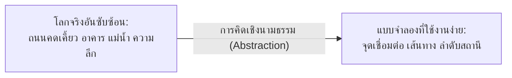
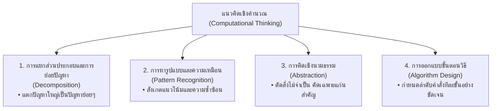

# วิทยาการคำนวณ 1: รากฐานแนวคิดเชิงคำนวณและการแก้ปัญหาอย่างเป็นระบบ
## บทที่ 2 เสาหลักทั้ง 4 ของแนวคิดเชิงคำนวณ
**ผู้เขียน:** ผู้ช่วยศาสตราจารย์ ดร.ชีวะ ทัศนา • สาขาวิชาฟิสิกส์ คณะวิทยาศาสตร์และเทคโนโลยี มหาวิทยาลัยราชภัฏรำไพพรรณี

---

## 🎯 ผลลัพธ์การเรียนรู้ประจำบท (Behavioral Learning Outcomes)
เมื่อศึกษาบทเรียนนี้จบแล้ว ผู้เรียนสามารถ:
1. **จำแนกและอธิบาย (Classify & Explain)** ความหมายและบทบาทของเสาหลักทั้ง 4 ในแนวคิดเชิงคำนวณ (Computational Thinking) ได้อย่างลึกซึ้ง
2. **ประยุกต์ใช้ (Apply)** เทคนิคการย่อยปัญหา (Decomposition) และการหารูปแบบ (Pattern Recognition) ในการวิเคราะห์ระบบทางวิทยาศาสตร์และชีวิตประจำวัน
3. **สร้างแบบจำลองนามธรรม (Abstract & Model)** โดยคัดกรองเฉพาะข้อมูลสำคัญและตัดรายละเอียดส่วนเกินออกได้อย่างเหมาะสม
4. **ออกแบบขั้นตอนวิธี (Design Algorithms)** ที่มีลำดับคำสั่งชัดเจน แม่นยำ และแปลงเป็นโค้ด Python เพื่อแก้ไขปัญหาได้อย่างสมบูรณ์

---

## 🌌 2.0 เรื่องเล่าเปิดบทเรียน: มนุษย์คิดอย่างไรเมื่อสร้างแผนที่ดาวและระบบรถไฟฟ้า

ลองมองดู **แผนผังเส้นทางรถไฟฟ้า BTS/MRT** หรือ **แผนที่เครือข่ายรถไฟใต้ดินกรุงลอนดอน (London Tube Map)** ที่ออกแบบโดย แฮร์รี เบก (Harry Beck) ในปี ค.ศ. 1931 

แผนที่นี้ไม่ได้แสดงความโค้งจริงของถนน ไม่ได้ระบุระยะทางตามมาตราส่วนทางภูมิศาสตร์จริง และไม่ได้บอกว่าสถานีใดอยู่ใต้ตึกใด แต่กลับเป็นแผนที่ที่ **คนนับล้านคนใช้งานได้ง่ายที่สุดในโลก** เพราะมันใช้ **การคิดเชิงนามธรรม (Abstraction)** สกัดเอาเฉพาะ "ลำดับสถานี" และ "จุดเชื่อมต่อ (Interchanges)" ออกมาเป็นเส้นตรงและมุม $45^\circ$ ที่เรียบง่าย



กระบวนการนี้คือหัวใจสำคัญของ **แนวคิดเชิงคำนวณ (Computational Thinking - CT)** ซึ่งไม่ใช่การคิดให้เหมือนเครื่องจักร แต่คือ **"การคิดแก้ปัญหาในระดับที่คอมพิวเตอร์หรือมนุษย์สามารถนำไปปฏิบัติตามได้อย่างมีประสิทธิภาพ"**

---

## 🏛️ 2.1 เสาหลักทั้ง 4 ของแนวคิดเชิงคำนวณ (The 4 Pillars of CT)



---

### เสาหลักที่ 1: การแยกส่วนประกอบและการย่อยปัญหา (Decomposition)
การแบ่งปัญหา ระบบ หรือวัตถุที่มีความซับซ้อนออกเป็นส่วนประกอบย่อยๆ (Sub-problems / Components) เพื่อให้ง่ายต่อการทำความเข้าใจ ออกแบบ และแก้ไข

* **ตัวอย่างทางวิทยาศาสตร์:** 
  * การศึกษาระบบนิเวศป่าชายเลน $\rightarrow$ แยกศึกษาเป็น: สภาพดินและน้ำ, สปีชีส์ของพืช (โกงกาง/แสม), สปีชีส์ของสัตว์ (ปูก้ามดาบ/ปลาตีน), และห่วงโซ่อาหาร
* **ตัวอย่างการพัฒนาซอฟต์แวร์:**
  * ระบบแอปพลิเคชันซื้อของออนไลน์ $\rightarrow$ แยกเป็น: ระบบค้นหาสินค้า, ระบบตะกร้าสินค้า, ระบบชำระเงิน, และระบบติดตามพัสดุ

---

### เสาหลักที่ 2: การหารูปแบบและความเหมือน (Pattern Recognition)
การค้นหาความเหมือน ความคล้ายคลึง แนวโน้ม (Trends) หรือความสัมพันธ์ที่เกิดขึ้นซ้ำๆ ในชุดข้อมูลหรือปัญหาที่เคยพบมาก่อน เพื่อนำวิธีการแก้ปัญหาเดิมมาปรับใช้ซ้ำ (Reusability)

* **ตัวอย่างทางฟิสิกส์และคณิตศาสตร์:**
  * การตกของผลแอปเปิล, การโคจรของดวงจันทร์รอบโลก, และการเหวี่ยงของลูกตุ้ม ล้วนมีรูปแบบความเร่งภายใต้ **กฎแรงโน้มถ่วงสากล ($F = G\frac{m_1 m_2}{r^2}$)** เหมือนกัน
* **ตัวอย่างในโปรแกรมมิ่ง:**
  * การคำนวณดอกเบี้ยทบต้น, การคำนวณการสลายตัวของสารกัมมันตรังสี, และการเติบโตของแบคทีเรีย ล้วนเป็นรูปแบบ **ฟังก์ชันเอกซ์โพเนนเชียล ($y = a \cdot e^{kt}$)**

---

### เสาหลักที่ 3: การคิดเชิงนามธรรม (Abstraction)
การคัดกรองสาระสำคัญ มุ่งเน้นเฉพาะข้อมูลที่จำเป็นต่อการแก้ปัญหา และละทิ้งรายละเอียดปลีกย่อยที่ไม่เกี่ยวข้องออกไป เพื่อสร้างเป็น **แบบจำลอง (Model)** หรือ **แม่แบบ (Template)**

<div style="background: linear-gradient(135deg, #eff6ff, #dbeafe); border-left: 5px solid #2563eb; border-radius: 12px; padding: 18px 22px; margin: 20px 0; color: #1e3a8a;">
  <h4 style="color: #1d4ed8; margin-top: 0;">💡 การเปรียบเทียบระหว่างโลกจริงกับแบบจำลองนามธรรม</h4>
  <p style="margin: 0; line-height: 1.75;">
    • <strong>ในวิชาฟิสิกส์:</strong> เมื่อเราคำนวณวิถีโพรเจกไทล์ของลูกฟุตบอล เราถือว่าลูกบอลเป็น <em>"มวลจุด (Point Mass)"</em> และตัดสีของลูกบอล ยี่ห้อ หรือรอยเปื้อนออกไป<br>
    • <strong>ในวิชาวิทยาการคำนวณ:</strong> เมื่อสร้างระบบจัดการข้อมูลนักเรียน เราเก็บเฉพาะ <em>"รหัสนักศึกษา, ชื่อ, เกรดเฉลี่ย"</em> โดยไม่ต้องบันทึกยี่ห้อรองเท้าที่นักเรียนใส่
  </p>
</div>

---

### เสาหลักที่ 4: การออกแบบขั้นตอนวิธี (Algorithm Design)
การพัฒนาชุดคำสั่งหรือลำดับขั้นตอนการปฏิบัติงานทีละขั้น (Step-by-step instructions) ที่มีความชัดเจน ไม่กำกวม และนำไปสู่ผลลัพธ์ที่ถูกต้องเสมอ

* **คุณสมบัติที่ดีของขั้นตอนวิธี:**
  1. มีจุดเริ่มต้นและจุดสิ้นสุดที่ชัดเจน (Finiteness)
  2. แต่ละขั้นตอนต้องแม่นยำ ปฏิบัติตามได้จริง (Definiteness & Feasibility)
  3. รับข้อมูลเข้าและให้ผลลัพธ์ที่ถูกต้อง (Input & Output Correctness)

---

## 📝 2.2 ตัวอย่างการประยุกต์ใช้เสาหลักทั้ง 4: การออกแบบระบบคัดแยกขยะอัจฉริยะ

<div style="background: #ffffff; border: 1px solid #cbd5e1; border-radius: 14px; margin-bottom: 20px; overflow: hidden; box-shadow: 0 4px 12px rgba(0,0,0,0.05);">
  <div style="background: #f8fafc; padding: 14px 20px; border-bottom: 1px solid #e2e8f0; display: flex; align-items: center; justify-content: space-between;">
    <span style="font-weight: 700; color: #059669; font-size: 1.05em;">📝 ตัวอย่างที่ 2.1: การพัฒนาระบบคัดแยกขยะรีไซเคิลด้วยแนวคิดเชิงคำนวณ</span>
    <span style="background: #d1fae5; color: #065f46; font-size: 0.80em; font-weight: 700; padding: 3px 10px; border-radius: 20px;">บูรณาการสิ่งแวดล้อม</span>
  </div>
  <div style="padding: 20px 24px; color: #334155; line-height: 1.8;">
    <p>
      <strong>โจทย์ปัญหา:</strong> โรงเรียนต้องการสร้างถังขยะอัจฉริยะที่สามารถตรวจจับและคัดแยกขยะออกเป็น 3 ประเภท ได้แก่ <em>ขยะพลาสติกใส, กระป๋องโลหะ, และเศษกระดาษ</em>
    </p>
    
    <details style="background: #f8fafc; border: 1px solid #cbd5e1; border-radius: 10px; padding: 14px 18px; margin-top: 12px; cursor: pointer;">
      <summary style="font-weight: 700; color: #059669;">👉 คลิกเพื่อดูการประยุกต์ใช้เสาหลักทั้ง 4</summary>
      <div style="margin-top: 14px; border-top: 1px dashed #cbd5e1; padding-top: 14px;">
        <ol style="padding-left: 20px;">
          <li><strong>Decomposition (ย่อยปัญหา):</strong> แยกปัญหาออกเป็น 3 ส่วน:
            <ul>
              <li>ส่วนตรวจจับคุณสมบัติกายภาพ (น้ำหนัก, ความโปร่งแสง, การนำไฟฟ้า)</li>
              <li>ส่วนประมวลผลและตัดสินใจ (Microcontroller Logic)</li>
              <li>ส่วนกลไกเปิด-ปิดฝาถัง (Servo Motor Actuators)</li>
            </ul>
          </li>
          <li><strong>Pattern Recognition (หารูปแบบ):</strong>
            <ul>
              <li>กระป๋องโลหะ: มีการนำไฟฟ้า ($Conductivity = True$) และน้ำหนักปานกลาง</li>
              <li>ขวดพลาสติกใส: แสงทะลุผ่านได้ ($Translucency > 80\%$) และไม่นำไฟฟ้า</li>
              <li>เศษกระดาษ: แสงทะลุผ่านไม่ได้ และไม่นำไฟฟ้า</li>
            </ul>
          </li>
          <li><strong>Abstraction (คิดเชิงนามธรรม):</strong>
            <ul>
              <li>สนใจเฉพาะ: ค่าเซนเซอร์นำไฟฟ้า (0/1), ค่าเซนเซอร์แสง (0-100), น้ำหนัก (g)</li>
              <li>ตัดทิ้ง: สีของฉลาก, รอยยับของขวด, ราคาของขยะ</li>
            </ul>
          </li>
          <li><strong>Algorithm Design (ขั้นตอนวิธี):</strong>
            <ul>
              <li>1. อ่านค่าเซนเซอร์ทั้ง 3 ตัว</li>
              <li>2. ถ้า $Conductivity == 1$ $\rightarrow$ สั่งมอเตอร์เปิดช่อง "ถังโลหะ"</li>
              <li>3. ถ้าไม่ใช่ และ $LightIntensity > 80$ $\rightarrow$ สั่งมอเตอร์เปิดช่อง "ถังพลาสติก"</li>
              <li>4. กรณีอื่นๆ $\rightarrow$ สั่งมอเตอร์เปิดช่อง "ถังกระดาษ/ทั่วไป"</li>
            </ul>
          </li>
        </ol>
      </div>
    </details>
  </div>
</div>

---

## 💻 2.3 โค้ดคอมพิวเตอร์จำลองเสาหลักทั้ง 4 (Python Implementation)

```python
# computational_thinking_waste_sorter.py
# โปรแกรมจำลองการคัดแยกขยะอัจฉริยะด้วยแนวคิดเชิงคำนวณ 4 เสาหลัก
# ผู้เขียน: ผศ.ดร.ชีวะ ทัศนา (มรภ.รำไพพรรณี)

class WasteItem:
    """Abstraction: สร้างแบบจำลองวัตถุขยะโดยสนใจเฉพาะคุณสมบัติที่จำเป็น"""
    def __init__(self, name: str, is_conductive: bool, light_transmittance: float, weight_grams: float):
        self.name = name
        self.is_conductive = is_conductive          # การนำไฟฟ้า (โลหะ)
        self.light_transmittance = light_transmittance  # การส่องผ่านของแสง (%)
        self.weight_grams = weight_grams            # น้ำหนัก (กรัม)

def sort_waste_algorithm(item: WasteItem) -> str:
    """Algorithm Design: ขั้นตอนวิธีในการตัดสินใจคัดแยกขยะลงถังที่ถูกต้อง"""
    if item.is_conductive:
        return "🥫 ถังขยะโลหะ (Metal Bin)"
    elif item.light_transmittance >= 75.0:
        return "🧴 ถังขยะพลาสติกใสรีไซเคิล (Plastic PET Bin)"
    elif item.weight_grams < 50.0 and item.light_transmittance < 30.0:
        return "📄 ถังขยะกระดาษ (Paper Bin)"
    else:
        return "🗑️ ถังขยะทั่วไป (General Waste Bin)"

def main():
    # ข้อมูลทดสอบ (Test Dataset)
    sample_wastes = [
        WasteItem("กระป๋องน้ำอัดลมอลูมิเนียม", is_conductive=True, light_transmittance=0.0, weight_grams=15.0),
        WasteItem("ขวดน้ำดื่ม PET ใส", is_conductive=False, light_transmittance=88.5, weight_grams=20.0),
        WasteItem("ใบปลิวกระดาษ A4", is_conductive=False, light_transmittance=10.0, weight_grams=5.0),
        WasteItem("เปลือกกล้วยหอม", is_conductive=False, light_transmittance=0.0, weight_grams=120.0),
    ]

    print("=" * 70)
    print("🤖 ระบบจำลองถังขยะอัจฉริยะ (Smart Waste Classifier Simulator)")
    print("=" * 70)

    for item in sample_wastes:
        assigned_bin = sort_waste_algorithm(item)
        print(f"📦 วัตถุ: {item.name:<25} | ผลลัพธ์: {assigned_bin}")

    print("=" * 70)

if __name__ == "__main__":
    main()
```

---

## 🧪 2.4 กิจกรรมปฏิบัติการแล็บ Unplugged: Master Chef Algorithm

### วัตถุประสงค์
ฝึกการย่อยปัญหาและออกแบบขั้นตอนวิธีการทำอาหารจานโปรดให้ละเอียดจนผู้อื่นสามารถทำตามแล้วได้รสชาติเหมือนกัน 100%

### ขั้นตอนกิจกรรม
1. ให้นักเรียนเลือกเมนูอาหาร 1 ชนิด (เช่น "ต้มยำกุ้งน้ำข้น")
2. ใช้ **Decomposition** แยกรายการวัตถุดิบ, เครื่องปรุง, และอุปกรณ์เครื่องครัว
3. ใช้ **Pattern Recognition** สังเกตขั้นตอนที่มีรูปแบบร่วมกับการทำต้มจืด (เช่น การต้มน้ำให้เดือดก่อนใส่เนื้อสัตว์)
4. ใช้ **Abstraction** ตัดรายละเอียดที่ไม่เกี่ยวข้องออก (เช่น ยี่ห้อของหม้อ, สีของจาน)
5. ใช้ **Algorithm Design** เขียนเป็นขั้นตอนแบบลำดับและมีเงื่อนไข เช่น *"ถ้ากุ้งเปลี่ยนเป็นสีส้ม ให้ปิดไฟทันที"*

---

## 💡 2.5 สรุปใจความสำคัญและแบบฝึกหัดท้ายบทที่ 2

### 📌 สรุปประเด็นสำคัญ
1. **Decomposition** ช่วยให้เราไม่ตื่นตระหนกกับปัญหาใหญ่ โดยซอยย่อยเป็นงานเล็กๆ ที่จัดการได้
2. **Pattern Recognition** ทำให้เราไม่ต้องคิดค้นวิธีแก้ปัญหาใหม่ตั้งแต่ศูนย์ทุกครั้ง
3. **Abstraction** ช่วยประหยัดทรัพยากรความคิดและหน่วยความจำคอมพิวเตอร์ โดยมองเห็นเฉพาะแก่นของปัญหา
4. **Algorithm Design** เปลี่ยนแนวคิดนามธรรมให้กลายเป็นชุดคำสั่งที่ปฏิบัติการได้จริง

---

### 📝 แบบฝึกหัดทบทวน 3 ระดับ (Exercises)

#### ระดับที่ 1: ความรู้ความเข้าใจพื้นฐาน (Basic Knowledge)
1. จงอธิบายว่าการที่แพทย์วินิจฉัยโรคของผู้ป่วยจากอาการไข้ ไอ เจ็บคอ จัดเป็นการใช้เสาหลักใดของแนวคิดเชิงคำนวณ เพราะเหตุใด
2. ในการสร้างโปรแกรมคำนวณเกรดเฉลี่ยสะสม (GPAX) ของนักศึกษา ข้อมูลใดต่อไปนี้เป็นข้อมูลสำคัญ (Essential) และข้อมูลใดควรถูกตัดทิ้งด้วยหลัก Abstraction:
   * รหัสวิชา, หน่วยกิต, เกรดที่ได้, ยี่ห้อโน้ตบุ๊กของนักศึกษา, เวลาที่เข้าเรียนคาบแรก

#### ระดับที่ 2: การวิเคราะห์และประยุกต์ใช้ (Analytical Application)
3. ให้นักเรียนใช้หลักการ **Decomposition** และ **Abstraction** วิเคราะห์ระบบ "ตู้จำหน่ายเครื่องดื่มอัตโนมัติ (Vending Machine)" โดยแจกแจงส่วนประกอบหลัก 4 ส่วน พร้อมระบุข้อมูลเข้า (Input) และข้อมูลออก (Output) ของแต่ละส่วน

#### ระดับที่ 3: การคิดขั้นสูงและบูรณาการ (Advanced Synthesis)
4. จงออกแบบขั้นตอนวิธี (Algorithm) สำหรับการจัดคิวผู้ป่วยในห้องฉุกเฉินโรงพยาบาล (Triage Algorithm) โดยใช้เสาหลักทั้ง 4 เพื่อจัดลำดับความเร่งด่วน 3 ระดับ (วิกฤตสีแดง, เร่งด่วนสีเหลือง, ไม่รุนแรงสีเขียว)
