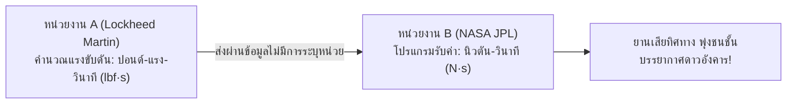
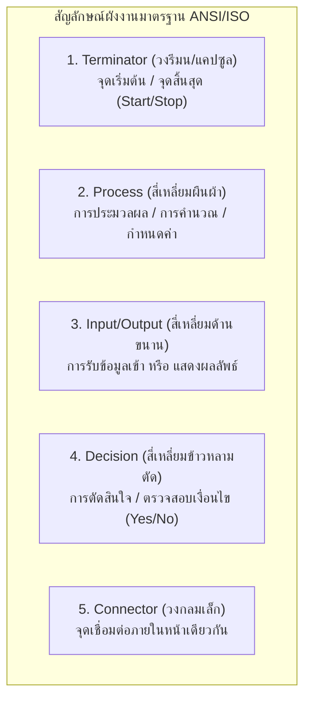
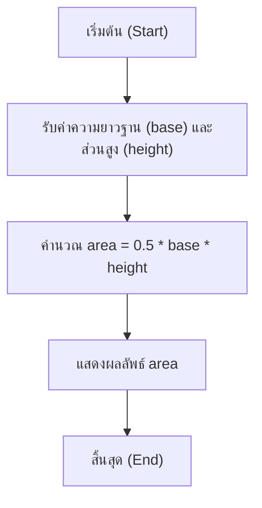
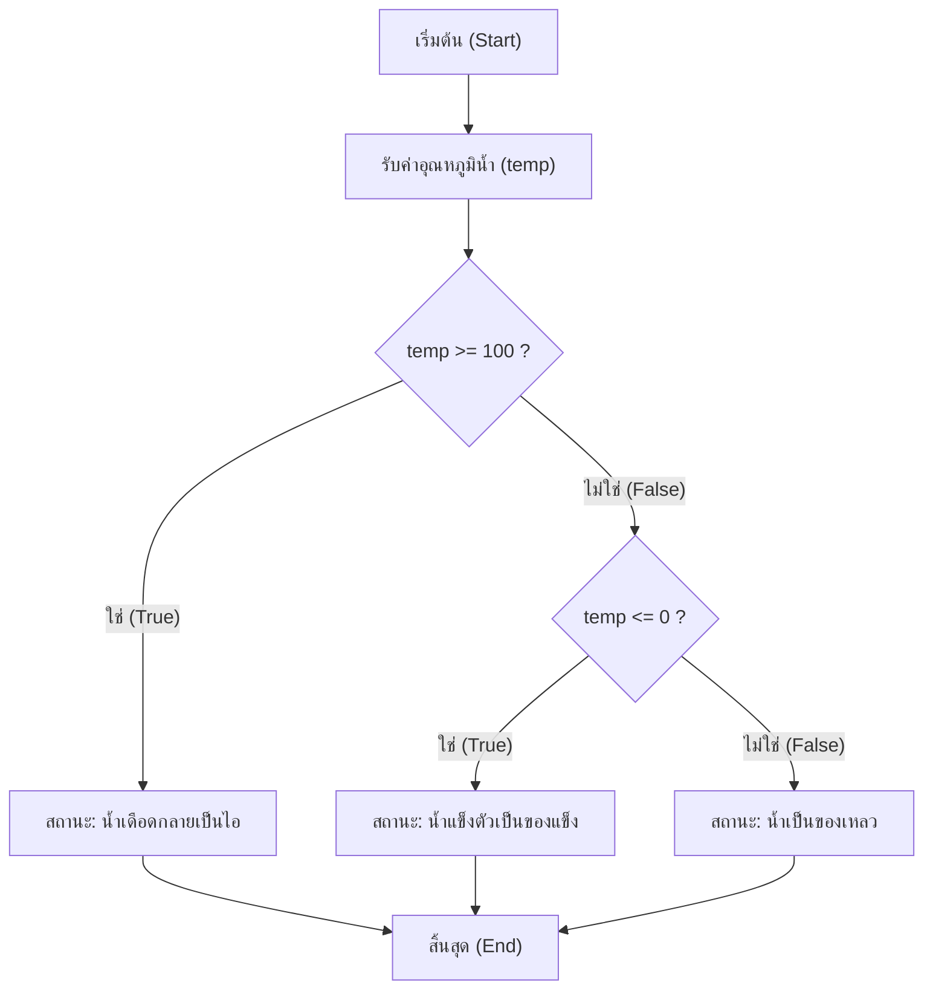
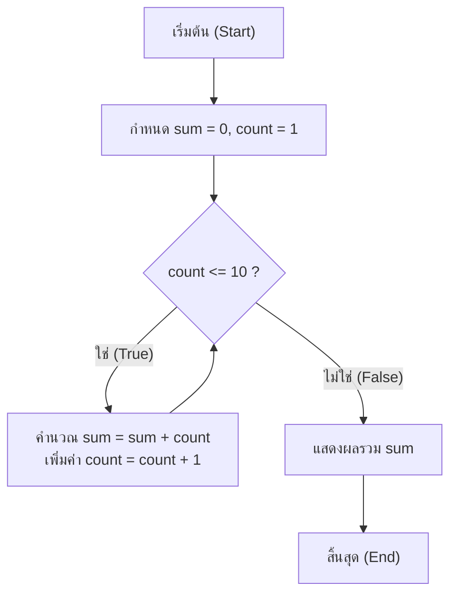

# วิทยาการคำนวณ 1 รากฐานแนวคิดเชิงคำนวณและการแก้ปัญหาอย่างเป็นระบบ
## บทที่ 3 การเขียนรหัสลำลองและผังงานมาตรฐาน
**ผู้เขียน** ผู้ช่วยศาสตราจารย์ ดร.ชีวะ ทัศนา • สาขาวิชาฟิสิกส์ คณะวิทยาศาสตร์และเทคโนโลยี มหาวิทยาลัยราชภัฏรำไพพรรณี

---

## 🎯 ผลลัพธ์การเรียนรู้ประจำบท
เมื่อศึกษาบทเรียนนี้จบแล้ว ผู้เรียนสามารถ
1. **อธิบาย ** ความหมาย วัตถุประสงค์ และประโยชน์ของการใช้รหัสลำลอง และผังงาน ในการสื่อสารขั้นตอนวิธี
2. **เลือกใช้และวาด ** สัญลักษณ์ผังงานตามมาตรฐานสากล ANSI/ISO ได้อย่างถูกต้องครบถ้วน
3. **แปลง ** โจทย์ปัญหาทางคณิตศาสตร์และวิทยาศาสตร์ให้อยู่ในรูปโครงสร้างควบคุม 3 รูปแบบ (เรียงลำดับ, ทางเลือก, ทำซ้ำ)
4. **ตรวจสอบความถูกต้อง ** ของขั้นตอนวิธีด้วยตารางตรวจสอบการทำงาน (Trace Table / Dry Run) ได้อย่างแม่นยำ

---

## 🌌 3.0 เรื่องเล่าเปิดบทเรียน ภารกิจพิชิตอวกาศกับความผิดพลาดระดับพันล้าน

ในปี ค.ศ. 1999 องค์การ NASA ต้องสูญเสียยานสำรวจดาวอังคาร **Mars Climate Orbiter** มูลค่ากว่า 125 ล้านดอลลาร์สหรัฐไปอย่างน่าเสียดาย สาเหตุเกิดจากความผิดพลาดง่ายๆ ในการส่งผ่านข้อมูลแรงขับดันระหว่าง 2 หน่วยงาน โดยหน่วยงานหนึ่งส่งข้อมูลในหน่วย **ปอนด์-วินาที (Imperial Unit)** แต่อีกหน่วยงานหนึ่งเขียนโปรแกรมรับข้อมูลโดยคิดว่าเป็นหน่วย **นิวตัน-วินาที (Metric SI Unit)**



เหตุการณ์นี้กลายเป็นบทเรียนครั้งประวัติศาสตร์ของวงการวิทยาการคอมพิวเตอร์ ที่ย้ำเตือนว่า **การมีขั้นตอนวิธีที่ชัดเจน มีการระบุข้อมูลเข้า ข้อมูลออก หน่วย และเงื่อนไขอย่างรัดกุมผ่านรหัสลำลองและผังงานมาตรฐาน** เป็นสิ่งจำเป็นยิ่งยวดก่อนที่จะเริ่มลงมือเขียนโค้ดภาษาคอมพิวเตอร์จริง

---

## 📜 3.1 การเขียนรหัสลำลองตามหลักสากล

**รหัสลำลอง** คือ การอธิบายขั้นตอนวิธีของการแก้ปัญหาด้วยภาษาที่กึ่งภาษาธรรมชาติและกึ่งภาษาโปรแกรม โดยไม่ยึดติดกับไวยากรณ์ (Syntax) ของภาษาคอมพิวเตอร์ภาษาใดภาษาหนึ่งโดยเฉพาะ

### คำสำคัญมาตรฐานสากล

| คำสำคัญ (Keyword) | ความหมาย | ตัวอย่างการใช้งาน |
| :--- | :--- | :--- |
| **INPUT / READ** | การรับข้อมูลเข้าจากภายนอก | `INPUT radius` |
| **OUTPUT / PRINT**| การแสดงผลลัพธ์ออกสู่หน้าจอ | `PRINT "Area = ", area` |
| **COMPUTE / SET** | การคำนวณและกำหนดค่าตัวแปร | `SET area = 3.14159 * radius * radius` |
| **IF ... THEN ... ELSE** | โครงสร้างทางเลือกการตัดสินใจ | `IF score >= 50 THEN PRINT "Pass" ELSE PRINT "Fail"` |
| **WHILE ... DO** | โครงสร้างการวนซ้ำแบบเช็คก่อนทำ | `WHILE count < 10 DO ... ENDWHILE` |
| **FOR ... TO** | โครงสร้างการวนซ้ำตามจำนวนรอบ | `FOR i = 1 TO 10 DO ... ENDFOR` |

---

## 📊 3.2 สัญลักษณ์ผังงานมาตรฐานสากล

**ผังงาน** คือ แผนภาพที่ใช้รูปทรงเรขาคณิตมาตรฐานสากลในการแสดงลำดับขั้นตอนการทำงานของระบบหรือโปรแกรม



<div style="background: linear-gradient(135deg, #fefce8, #fef9c3); border-left: 5px solid #ca8a04; border-radius: 12px; padding: 18px 22px; margin: 20px 0; color: #713f12;">
  <h4 style="color: #854d0e; margin-top: 0;">⚠️ กฎเหล็กในการเขียนผังงานที่ดี (Flowchart Best Practices)</h4>
  <ul style="margin: 0; line-height: 1.75;">
    <li>ผังงานต้องมีจุด <strong>Start เพียงจุดเดียว</strong> และจุด <strong>End/Stop ที่ชัดเจน</strong></li>
    <li>ทิศทางการไหลของข้อมูลควรอ่านจาก <strong>บนลงล่าง (Top-to-Bottom)</strong> และจาก <strong>ซ้ายไปขวา (Left-to-Right)</strong></li>
    <li>สัญลักษณ์การตัดสินใจ (Decision) ต้องมี <strong>เส้นทางออกอย่างน้อย 2 ทางเสมอ (True/False หรือ Yes/No)</strong></li>
    <li>หลีกเลี่ยงการลากเส้น Flowline ตัดข้ามกัน (หากจำเป็นให้ใช้สัญลักษณ์ Connector แทน)</li>
  </ul>
</div>

---

## 🔄 3.3 โครงสร้างการควบคุมหลัก 3 รูปแบบ

### 1. โครงสร้างแบบเรียงลำดับ
การทำงานทีละคำสั่งตามลำดับจากบนลงล่าง โดยไม่มีการข้ามขั้นตอนหรือวนกลับ



---

### 2. โครงสร้างแบบทางเลือก
การตรวจสอบเงื่อนไขทางตรรกะเพื่อเลือกดำเนินงานในเส้นทางใดเส้นทางหนึ่ง



---

### 3. โครงสร้างแบบวนซ้ำ
การทำงานในชุดคำสั่งเดิมซ้ำหลายรอบ จนกระทั่งเงื่อนไขที่กำหนดไม่เป็นจริง



---

## 📝 3.4 ตัวอย่างโจทย์คำนวณและการตรวจสอบด้วยตารางดรายรัน

<div style="background: #ffffff; border: 1px solid #cbd5e1; border-radius: 14px; margin-bottom: 20px; overflow: hidden; box-shadow: 0 4px 12px rgba(0,0,0,0.05);">
  <div style="background: #f8fafc; padding: 14px 20px; border-bottom: 1px solid #e2e8f0; display: flex; align-items: center; justify-content: space-between;">
    <span style="font-weight: 700; color: #4338ca; font-size: 1.05em;">📝 ตัวอย่างที่ 3.1: ขั้นตอนวิธีหาค่าตัวหารร่วมมาก (Greatest Common Divisor - GCD) แบบยูคลิด</span>
    <span style="background: #e0e7ff; color: #3730a3; font-size: 0.80em; font-weight: 700; padding: 3px 10px; border-radius: 20px;">ขั้นตอนวิธีคลาสสิก</span>
  </div>
  <div style="padding: 20px 24px; color: #334155; line-height: 1.8;">
    <p>
      <strong>รหัสลำลอง (Euclidean Algorithm Pseudocode):</strong>
    </p>
    <pre style="background:#0f172a; color:#38bdf8; padding:14px; border-radius:8px; font-family:monospace; line-height:1.5;">
START
  INPUT a, b
  WHILE b != 0 DO
    SET remainder = a MOD b
    SET a = b
    SET b = remainder
  ENDWHILE
  OUTPUT "GCD = ", a
END</pre>

    <p><strong>ตารางตรวจสอบการทำงาน (Trace Table) เมื่อทดสอบกับค่า $a = 48, b = 18$:</strong></p>
    <table style="width:100%; border-collapse:collapse; margin-top:10px; text-align:center;">
      <thead>
        <tr style="background:#1e293b; color:#f8fafc;">
          <th style="padding:8px; border:1px solid #475569;">รอบที่ (Iteration)</th>
          <th style="padding:8px; border:1px solid #475569;">ตัวแปร a</th>
          <th style="padding:8px; border:1px solid #475569;">ตัวแปร b</th>
          <th style="padding:8px; border:1px solid #475569;">เงื่อนไข (b != 0)</th>
          <th style="padding:8px; border:1px solid #475569;">remainder = a % b</th>
          <th style="padding:8px; border:1px solid #475569;">ค่าใหม่ a, b</th>
        </tr>
      </thead>
      <tbody>
        <tr style="background:#f8fafc;">
          <td style="padding:8px; border:1px solid #cbd5e1;">เริ่มต้น</td>
          <td style="padding:8px; border:1px solid #cbd5e1;">48</td>
          <td style="padding:8px; border:1px solid #cbd5e1;">18</td>
          <td style="padding:8px; border:1px solid #cbd5e1;">True</td>
          <td style="padding:8px; border:1px solid #cbd5e1;">48 % 18 = 12</td>
          <td style="padding:8px; border:1px solid #cbd5e1;">a=18, b=12</td>
        </tr>
        <tr>
          <td style="padding:8px; border:1px solid #cbd5e1;">รอบที่ 1</td>
          <td style="padding:8px; border:1px solid #cbd5e1;">18</td>
          <td style="padding:8px; border:1px solid #cbd5e1;">12</td>
          <td style="padding:8px; border:1px solid #cbd5e1;">True</td>
          <td style="padding:8px; border:1px solid #cbd5e1;">18 % 12 = 6</td>
          <td style="padding:8px; border:1px solid #cbd5e1;">a=12, b=6</td>
        </tr>
        <tr style="background:#f8fafc;">
          <td style="padding:8px; border:1px solid #cbd5e1;">รอบที่ 2</td>
          <td style="padding:8px; border:1px solid #cbd5e1;">12</td>
          <td style="padding:8px; border:1px solid #cbd5e1;">6</td>
          <td style="padding:8px; border:1px solid #cbd5e1;">True</td>
          <td style="padding:8px; border:1px solid #cbd5e1;">12 % 6 = 0</td>
          <td style="padding:8px; border:1px solid #cbd5e1;">a=6, b=0</td>
        </tr>
        <tr>
          <td style="padding:8px; border:1px solid #cbd5e1;">รอบที่ 3</td>
          <td style="padding:8px; border:1px solid #cbd5e1;">6</td>
          <td style="padding:8px; border:1px solid #cbd5e1;">0</td>
          <td style="padding:8px; border:1px solid #cbd5e1; color:#ef4444; font-weight:700;">False (จบลูป)</td>
          <td style="padding:8px; border:1px solid #cbd5e1;">-</td>
          <td style="padding:8px; border:1px solid #cbd5e1; color:#10b981; font-weight:700;">ผลลัพธ์ GCD = 6</td>
        </tr>
      </tbody>
    </table>
  </div>
</div>

---

## 💻 3.5 โค้ดคอมพิวเตอร์ภาษา Python ที่ตรงกับผังงาน

```python
# euclidean_gcd_algorithm.py
# โปรแกรมหา ห.ร.ม. (GCD) ตามขั้นตอนวิธีของยูคลิด
# ผู้เขียน: ผศ.ดร.ชีวะ ทัศนา (มรภ.รำไพพรรณี)

def compute_gcd(a: int, b: int) -> int:
    """คำนวณค่า ห.ร.ม. ด้วย Euclidean Algorithm พร้อมพิมพ์ขั้นตอนการทำงาน"""
    print(f"🔍 เริ่มต้นคำนวณ ห.ร.ม. ของ {a} และ {b}")
    step = 1
    while b != 0:
        remainder = a % b
        print(f"   ขั้นตอนที่ {step}: {a} = ({b} * {a // b}) + เศษ {remainder}")
        a = b
        b = remainder
        step += 1
    print(f"🎯 ผลลัพธ์สุดท้าย ห.ร.ม. คือ: {a}\n")
    return a

if __name__ == "__main__":
    test_num1 = 48
    test_num2 = 18
    gcd_result = compute_gcd(test_num1, test_num2)
    
    # ทดสอบกรณีอื่นเพิ่มเติม
    compute_gcd(1071, 462)
```

---

## 💡 3.6 สรุปใจความสำคัญและแบบฝึกหัดท้ายบทที่ 3

### 📌 สรุปประเด็นสำคัญ
1. **รหัสลำลอง** ช่วยให้เราโฟกัสกับโครงสร้างตรรกะ โดยไม่ต้องกังวลเรื่องการพิมพ์ผิดไวยากรณ์ภาษาโปรแกรม
2. **ผังงาน** ให้ภาพรวมทิศทางการทำงานของระบบที่มองเห็นได้ชัดเจน เหมาะสำหรับการสื่อสารระหว่างนักพัฒนากับผู้ใช้งาน
3. **Trace Table** คือเครื่องมือทรงพลังที่สุดในการค้นหาข้อผิดพลาดทางตรรกะ (Logic Errors) ตั้งแต่ก่อนคอมไพล์โค้ด

---

### 📝 แบบฝึกหัดทบทวน 3 ระดับ

#### ระดับที่ 1 ความรู้ความเข้าใจพื้นฐาน
1. จงจับคู่สัญลักษณ์ผังงานต่อไปนี้กับหน้าที่การทำงาน
   * (A) สี่เหลี่ยมผืนผ้า, (B) สี่เหลี่ยมข้าวหลามตัด, (C) สี่เหลี่ยมด้านขนาน, (D) วงรีแคปซูล
2. จงระบุความแตกต่างระหว่างคำสั่ง `WHILE ... DO` กับ `DO ... WHILE` ในการเขียนรหัสลำลอง

#### ระดับที่ 2 การวิเคราะห์และประยุกต์ใช้
3. จงเขียนรหัสลำลองและผังงานสำหรับคำนวณรากของสมการกำลังสอง $ax^2 + bx + c = 0$ โดยพิจารณาค่าดิสคริมิแนนต์ $D = b^2 - 4ac$:
   * ถ้า $D > 0$ มี 2 รากจริง: $x = \frac{-b \pm \sqrt{D}}{2a}$
   * ถ้า $D = 0$ มี 1 รากจริง: $x = \frac{-b}{2a}$
   * ถ้า $D < 0$ ไม่มีรากที่เป็นจำนวนจริง (รากเป็นจำนวนเชิงซ้อน)

#### ระดับที่ 3 การคิดขั้นสูงและบูรณาการ
4. จงสร้างผังงานและ Trace Table สำหรับขั้นตอนวิธีตรวจสอบว่าตัวเลขจำนวนเต็มบวก $N$ ที่รับเข้ามาเป็น **"จำนวนเฉพาะ (Prime Number)"** หรือไม่
