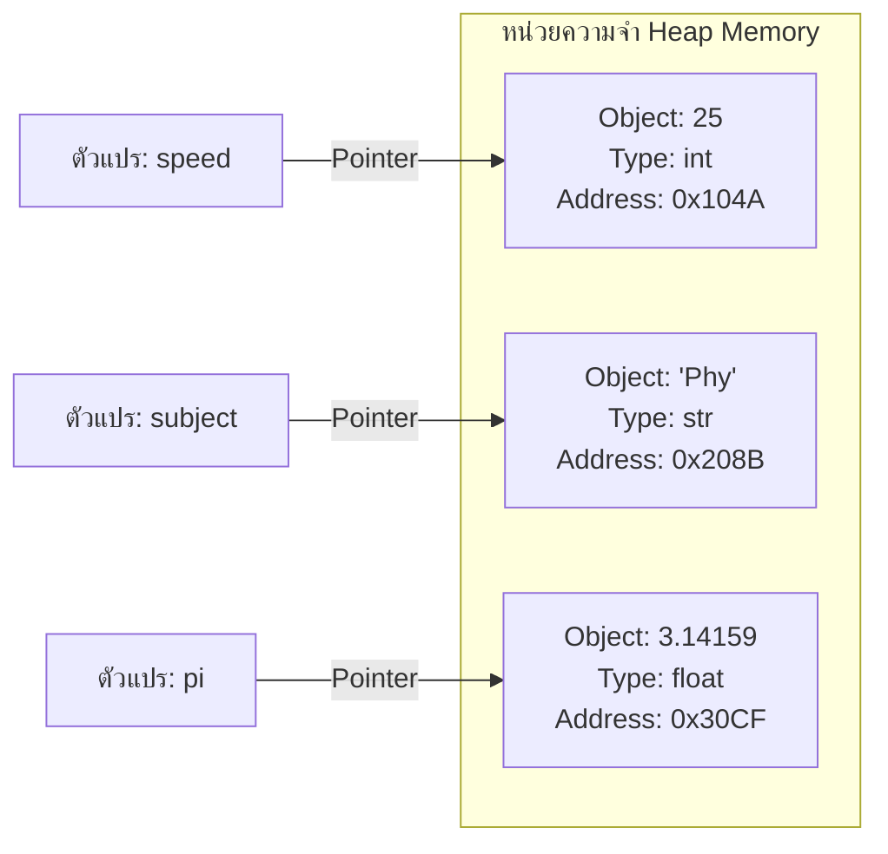
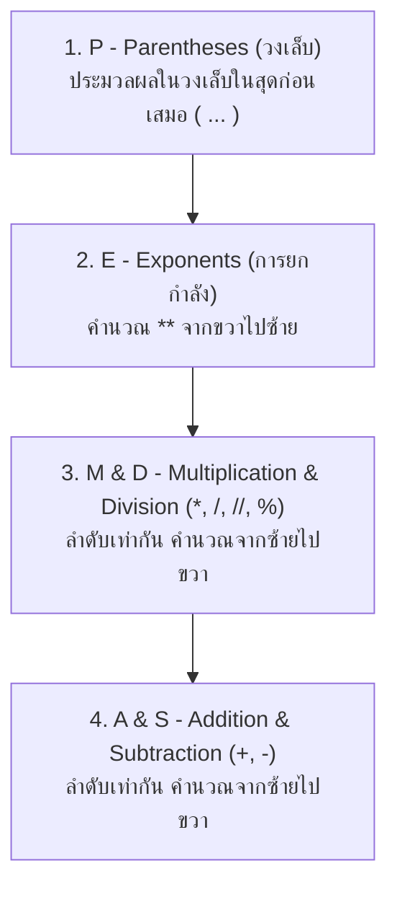
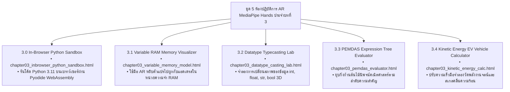

# วิทยาการคำนวณ 1: รากฐานแนวคิดเชิงคำนวณและการแก้ปัญหาอย่างเป็นระบบ
## บทที่ 3 พื้นฐานการเขียนโปรแกรมภาษา Python และการจัดการข้อมูลทางวิทยาศาสตร์
### (Python Programming Fundamentals, Memory Model, Data Types & Scientific I/O)
**ผู้เขียน:** ผู้ช่วยศาสตราจารย์ ดร.ชีวะ ทัศนา  
**สังกัด:** สาขาวิชาฟิสิกส์ คณะวิทยาศาสตร์และเทคโนโลยี มหาวิทยาลัยราชภัฏรำไพพรรณี  
**เอกสารประกอบรายวิชา:** 4122104 วิทยาการคำนวณและการแก้ปัญหาเชิงคำนวณ / การสอนวิทยาการคำนวณ

---

## 📋 แผนบริหารการสอนประจำบทที่ 3

### 1. หัวข้อเนื้อหาประจำบท
1. **เรื่องเล่าเปิดบทเรียนและปรัชญาของภาษาไพทอน:** กุยโด ฟาน รอสซัม (Guido van Rossum, 1991), ปรัชญา *The Zen of Python (PEP 20)* และทำไม Python จึงเป็นภาษาหลักของโลก AI และวิทยาศาสตร์ข้อมูล
2. **สถาปัตยกรรมตัวแปรและแบบจำลองหน่วยความจำ (Python Memory Model):** กลไกการอ้างอิงวัตถุ (Object Reference Pointers), ฟังก์ชัน `id()`, Dynamic Typing, และ Garbage Collection
3. **มาตรฐานการตั้งชื่อตัวแปรตาม PEP 8:** กฎการตั้งชื่อ ตัวระบุสากล และข้อควรระวังเกี่ยวกับคำสงวน (Reserved Keywords)
4. **ชนิดข้อมูลพื้นฐาน 4 ประเภท (Primitive Data Types):** จำนวนเต็ม (`int`), ทศนิยม (`float`), สายอักขระ (`str`), และค่าความจริง (`bool`)
5. **การแปลงชนิดข้อมูลและการจัดการข้อผิดพลาด (Type Casting & ValueError Handling):** ฟังก์ชัน `int()`, `float()`, `str()`, `bool()` และข้อจำกัดในการแปลง
6. **ตัวดำเนินการคณิตศาสตร์และลำดับความสำคัญ PEMDAS:** การบวก, ลบ, คูณ, หารจริง (`/`), หารปัดเศษลง (`//`), มอดุโลหาเศษ (`%`), และการยกกำลัง (`**`)
7. **การรับเข้าและส่งออกข้อมูลทางวิทยาศาสตร์ (Scientific I/O):** ฟังก์ชัน `input()`, `print()`, การจัดรูปแบบสายอักขระขั้นสูงด้วย Formatted String Literals (f-strings)
8. **ตัวอย่างข้อคำนวณและการวิเคราะห์โจทย์ฟิสิกส์เชิงลึก (Worked Examples):** การคำนวณพลังงานจลน์ $E_k = \frac{1}{2}mv^2$, การแปลงหน่วยอุณหภูมิ 3 สเกล, และระบบคำนวณกระแสไฟฟ้า
9. **โค้ดคอมพิวเตอร์ภาษา Python 3.11 แบบสมบูรณ์:** โปรแกรมประมวลผลพลังงานและการจัดรูปแบบรายงานวิเคราะห์ข้อมูล
10. **คู่มือห้องปฏิบัติการเสมือนจริง 3D AR MediaPipe:** การจำลองตัวแปรในหน่วยความจำ RAM และการประเมินลำดับนิพจน์แบบปฏิสัมพันธ์ 3 มิติ

### 2. วัตถุประสงค์เชิงพฤติกรรม (Behavioral Learning Outcomes)
เมื่อศึกษาบทเรียนนี้จบแล้ว ผู้เรียนสามารถ:
1. **อธิบาย (Explain)** ปรัชญาการออกแบบภาษา Python, กลไก Dynamic Typing และการจัดเก็บข้อมูลในหน่วยความจำ RAM ได้อย่างถูกต้อง
2. **จำแนกและเลือกใช้ (Classify & Select)** ชนิดข้อมูล `int`, `float`, `str`, `bool` ให้เหมาะสมกับโจทย์ปัญหาทางวิทยาศาสตร์ได้
3. **คำนวณและประเมินค่านิพจน์ (Evaluate)** ทางคณิตศาสตร์ที่มีความซับซ้อนตามลำดับความสำคัญ PEMDAS ได้อย่างแม่นยำ 100%
4. **ประยุกต์ใช้ (Apply)** เทคนิค f-strings ในการจัดรูปแบบการแสดงผลตัวเลขทศนิยมและรายงานเชิงวิทยาศาสตร์ได้อย่างมืออาชีพ
5. **สร้างสรรค์ (Create)** โปรแกรมภาษา Python 3.11 เพื่อรับค่าจากผู้ใช้และคำนวณสมการฟิสิกส์ได้อย่างสมบูรณ์ ไร้ข้อผิดพลาด
6. **ปฏิบัติการ (Operate)** การทดลองเสมือนจริง 3D AR MediaPipe Hands เพื่อควบคุมตัวแปรและดูสถาปัตยกรรมหน่วยความจำแบบไร้สัมผัสได้

---

## 🐍 3.0 เรื่องเล่าเปิดบทเรียน: จากงานอดิเรกสู่ภาษาสากลแห่งปัญญาประดิษฐ์

ในช่วงวันหยุดคริสต์มาสปี ค.ศ. 1989 **กุยโด ฟาน รอสซัม (Guido van Rossum)** นักวิทยาการคอมพิวเตอร์ชาวดัตช์ ได้เริ่มต้นพัฒนาภาษาโปรแกรมใหม่ขึ้นมาเพื่อเป็นงานอดิเรก โดยเขาตั้งชื่อภาษานี้ว่า **"Python"** ตามชื่อรายการตลกของอังกฤษเรื่อง *Monty Python's Flying Circus*

กุยโดมีวิสัยทัศน์ที่ปฏิวัติวงการเขียนโปรแกรม โดยเขาเชื่อว่า:
> **"โค้ดคอมพิวเตอร์ถูกอ่านบ่อยกว่าถูกเขียนขึ้นมาหลายเท่า ดังนั้น ความเรียบง่าย สะอาด และอ่านเข้าใจได้ง่าย (Readability) จึงต้องมาก่อนทุกสิ่ง"**

วิสัยทัศน์นี้ถูกบันทึกไว้เป็นปรัชญาประจำภาษาที่เรียกว่า **"The Zen of Python" (PEP 20)** ซึ่งประกอบด้วยหลักคิดสำคัญ เช่น:
* *Beautiful is better than ugly.* (สวยงามดีกว่าน่าเกลียด)
* *Explicit is better than implicit.* (ชัดเจนแจ่มแจ้งดีกว่าคลุมเครือ)
* *Simple is better than complex.* (เรียบง่ายดีกว่าซับซ้อน)
* *Readability counts.* (ความสามารถในการอ่านเข้าใจมีความสำคัญสูงสุด)

<div style="background: linear-gradient(135deg, #091328, #1e293b); border-left: 6px solid #facc15; border-radius: 14px; padding: 22px 28px; margin: 24px 0; color: #ffffff; box-shadow: 0 10px 30px rgba(0,0,0,0.35);">
  <div style="display:flex; justify-content:space-between; align-items:center; flex-wrap:wrap; gap:10px; margin-bottom:10px;">
    <span style="background:rgba(250,204,21,0.2); color:#facc15; border:1px solid rgba(250,204,21,0.4); padding:4px 14px; border-radius:20px; font-size:0.85em; font-weight:700;">🚀 ทำไม Python จึงครองโลกวิทยาศาสตร์และ AI?</span>
    <span style="color:#94a3b8; font-size:0.85em;">Scientific Ecosystem</span>
  </div>
  <p style="margin:0 0 10px 0; color:#cbd5e1; font-size:0.95em; line-height:1.7;">
    ในปัจจุบัน ภาษา Python ได้กลายเป็นภาษากลางอันดับ 1 ของโลกในงานวิจัยฟิสิกส์ ดาราศาสตร์ การแพทย์ และปัญญาประดิษฐ์ (AI / Machine Learning) ด้วยเหตุผลสำคัญ 3 ประการ:
  </p>
  <ul style="line-height:1.8; color:#cbd5e1; margin-bottom:0; font-size:0.92em;">
    <li><strong>ไวยากรณ์คล้ายภาษาอังกฤษ:</strong> นักวิทยาศาสตร์สามารถมุ่งเน้นที่สูตรและสมการฟิสิกส์ได้โดยไม่ต้องเสียเวลากับไวยากรณ์ที่ซับซ้อน</li>
    <li><strong>ระบบนิเวศทางวิทยาศาสตร์ที่แข็งแกร่งที่สุดในโลก:</strong> มีไลบรารีระดับโลก เช่น <code>NumPy</code> (คณิตศาสตร์เมทริกซ์ความเร็วสูง), <code>SciPy</code> (การคำนวณทางวิทยาศาสตร์), <code>Matplotlib</code> (การพล็อตพิกัด 2D/3D), <code>PyTorch</code> และ <code>TensorFlow</code> (โครงข่ายประสาทเทียม AI)</li>
    <li><strong>ภาพถ่ายหลุมดำภาพแรกของมนุษยชาติ (Event Horizon Telescope):</strong> ประมวลผลข้อมูลขนาด 5 เพตะไบต์ด้วยอัลกอริทึมภาษา Python ทั้งหมด!</li>
  </ul>
</div>

---

## 🧠 3.1 ตัวแปรและแบบจำลองหน่วยความจำในภาษา Python (Memory Model)

ในภาษาโปรแกรมแบบดั้งเดิม (เช่น C หรือ Java) ตัวแปรเปรียบเสมือน **"กล่องใส่ของ (Box)"** ที่ต้องระบุชนิดข้อมูลล่วงหน้า แต่ในภาษา Python ตัวแปรทำหน้าที่เป็น **"ป้ายชื่อที่ผูกด้วยเชือก (Name Tag / Reference Pointer)"** ชี้ไปยังวัตถุ (Object) ที่ถูกสร้างขึ้นในหน่วยความจำ RAM



### 📌 คุณสมบัติสำคัญของตัวแปรในภาษา Python
1. **การกำหนดชนิดข้อมูลแบบไดนามิก (Dynamic Typing):** ผู้เขียนไม่จำเป็นต้องประกาศชนิดตัวแปรล่วงหน้า ตัวแปรจะปรับชนิดข้อมูลตามค่าที่ได้รับโดยอัตโนมัติ:
   ```python
   x = 10        # x เป็น int (จำนวนเต็ม)
   x = "RBRU"    # x เปลี่ยนเป็น str (ข้อความ) ทันทีอย่างราบรื่น
   ```
2. **การตรวจสอบพิกัดหน่วยความจำด้วยฟังก์ชัน `id()`:**
   ```python
   mass = 50
   print(id(mass))  # แสดงแอดเดรสตำแหน่งในหน่วยความจำ เช่น 1407352840
   ```

### 📋 กฎการตั้งชื่อตัวแปรตามมาตรฐานสากล (PEP 8 Style Guide)
* **กฎเหล็กทางไวยากรณ์ (Syntax Rules):**
  1. ต้องขึ้นต้นด้วยตัวอักษรภาษาอังกฤษ (`a-z`, `A-Z`) หรือเครื่องหมายขีดล่าง (`_`) เท่านั้น
  2. ห้ามขึ้นต้นด้วยตัวเลขเด็ดขาด (เช่น `1st_place` ถือว่าผิดไวยากรณ์ SyntaxError)
  3. ประกอบด้วยตัวอักษร ตัวเลข และเครื่องหมาย `_` เท่านั้น (ห้ามมีเว้นวรรค หรือสัญลักษณ์พิเศษ เช่น `@`, `$`, `%`)
  4. ภาษา Python แยกความแตกต่างระหว่างตัวพิมพ์เล็กและพิมพ์ใหญ่ (**Case-Sensitive**): เช่น `Velocity`, `velocity`, และ `VELOCITY` เป็นตัวแปรคนละตัวกัน
  5. ห้ามใช้ **คำสงวน (Reserved Keywords)** เช่น `if`, `for`, `while`, `def`, `class`, `import`, `return`

* **แบบแผนสไตล์มาตรฐาน (PEP 8 Conventions):**
  * ตัวแปรทั่วไปและฟังก์ชัน: ใช้รูปแบบ `snake_case` เช่น `kinetic_energy`, `sensor_temperature`, `car_speed`
  * ค่าคงที่ (Constants): ใช้ตัวพิมพ์ใหญ่ทั้งหมด เช่น `GRAVITY_ACCEL = 9.80665`, `SPEED_OF_LIGHT = 299792458`

---

## 🗂️ 3.2 ชนิดข้อมูลพื้นฐาน 4 ประเภท (Primitive Data Types)

ภาษา Python มีชนิดข้อมูลพื้นฐานที่เป็นรากฐานของทุกระบบ 4 ประเภท:

| ชนิดข้อมูล (Data Type) | คำสำคัญ (Keyword) | นิยามและความหมาย | ตัวอย่างค่าข้อมูล |
| :--- | :---: | :--- | :--- |
| **จำนวนเต็ม (Integer)** | `int` | ตัวเลขจำนวนเต็มบวก จำนวนเต็มลบ หรือศูนย์ ไม่จำกัดขนาดความยาว | `-273`, `0`, `42`, `1000000` |
| **ทศนิยม (Floating-point)** | `float` | ตัวเลขที่มีจุดทศนิยม หรือตัวเลขในรูปสัญกรณ์วิทยาศาสตร์ | `3.14159`, `-0.005`, `1.5e-3` ($1.5 \times 10^{-3}$) |
| **สายอักขระ (String)** | `str` | ข้อความหรือชุดตัวอักษรที่อยู่ในเครื่องหมายคำพูดเดี่ยว (`'...'`) หรือคู่ (`"..."`) | `"Physics"`, `'RBRU 2026'`, `"3.14"` |
| **ค่าความจริง (Boolean)** | `bool` | ค่าสถานะทางตรรกศาสตร์ มีเพียง 2 ค่าเท่านั้น | `True` (จริง), `False` (เท็จ) |

### 🔄 การแปลงชนิดข้อมูล (Type Casting)
ในการประมวลผลข้อมูลทางวิทยาศาสตร์ ข้อมูลที่รับเข้ามาผ่านคีย์บอร์ดมักมีสถานะเป็น `str` เราจึงจำเป็นต้องแปลงให้เป็นตัวเลขเพื่อนำไปคำนวณทางคณิตศาสตร์:

```python
raw_input = "25.5"          # เป็น str
temperature = float(raw_input) # แปลงเป็น float สำเร็จ (25.5)
rounded_temp = int(temperature) # แปลงเป็น int (25 - ปัดเศษทิ้ง)
status_str = str(temperature)  # แปลงกลับเป็น str ("25.5")
```

> ⚠️ **ข้อควรระวังเรื่อง ValueError:** หากสั่ง `int("3.14")` หรือ `int("hello")` คอมพิวเตอร์จะเกิดข้อผิดพลาด `ValueError` ทันที เนื่องจากข้อความมีจุดทศนิยมหรือไม่ใช่ตัวเลขฐาน 10

---

## 🧮 3.3 ตัวดำเนินการคณิตศาสตร์และลำดับความสำคัญ PEMDAS

### ตารางตัวดำเนินการคณิตศาสตร์ในภาษา Python (Arithmetic Operators)

| ตัวดำเนินการ | สัญลักษณ์ | ชื่อภาษาไทย | ตัวอย่างการใช้งาน | ผลลัพธ์ |
| :---: | :---: | :--- | :---: | :---: |
| **Addition** | `+` | การบวก | `10 + 5` | `15` |
| **Subtraction** | `-` | การลบ | `10 - 5` | `5` |
| **Multiplication** | `*` | การคูณ | `10 * 5` | `50` |
| **Division** | `/` | การหารจริง (ผลลัพธ์เป็น float เสมอ) | `10 / 4` | `2.5` |
| **Floor Division** | `//` | การหารปัดเศษทิ้ง (ผลลัพธ์เป็นจำนวนเต็ม) | `10 // 4` | `2` |
| **Modulo** | `%` | การหารเอาเศษเหลือ | `10 % 4` | `2` |
| **Exponentiation** | `**` | การยกกำลัง ($x^y$) | `2 ** 3` | `8` ($2^3$) |

### 📐 ลำดับการประมวลผลทางคณิตศาสตร์สากล (PEMDAS Hierarchy)
เมื่อมีตัวดำเนินการหลายตัวในสมการเดียวกัน คอมพิวเตอร์จะประมวลผลตามลำดับมาตรฐานสากลจากลำดับความสำคัญสูงสุดไปต่ำสุด:



#### 📝 ตัวอย่างการคำนวณนิพจน์ซับซ้อน:
จงหาค่าของนิพจน์: `result = 10 + 2 * (3 ** 2) - 8 // 3`
1. **วงเล็บและยกกำลัง:** `(3 ** 2)` $\rightarrow$ `9`
2. **สมการกลายเป็น:** `10 + 2 * 9 - 8 // 3`
3. **การคูณและการหารปัดเศษ (จากซ้ายไปขวา):**
   * `2 * 9` $\rightarrow$ `18`
   * `8 // 3` $\rightarrow$ `2`
4. **สมการกลายเป็น:** `10 + 18 - 2`
5. **การบวกและการลบ:** `28 - 2 = 26` (ผลลัพธ์คือ `26`)

---

## 📡 3.4 การรับเข้าและส่งออกข้อมูลทางวิทยาศาสตร์ (Scientific I/O)

### 1. การรับข้อมูลด้วยฟังก์ชัน `input()`
ฟังก์ชัน `input()` จะหยุดรอให้ผู้ใช้ป้อนข้อมูลและกด Enter โดยค่าที่ส่งกลับมาจะเป็น **สายอักขระ (`str`) เสมอ**:
```python
# ต้องครอบด้วย float() หรือ int() เพื่อแปลงชนิดข้อมูลก่อนนำไปคำนวณ
mass_kg = float(input("กรุณาป้อนมวลของวัตถุ (kg): "))
velocity_ms = float(input("กรุณาป้อนความเร็วของวัตถุ (m/s): "))
```

### 2. การจัดรูปแบบการแสดงผลขั้นสูงด้วย f-strings (Formatted String Literals)
นำเสนอใน Python 3.6+ ถือเป็นมาตรฐานที่ดีที่สุด สะอาดที่สุด และเร็วที่สุดในการแสดงผล:

```python
# ไวยากรณ์: f"ข้อความ {ตัวแปร:รูปแบบการจัดวาง}"
pi_val = 3.1415926535
energy_joules = 1250450.789

# 1. จัดทศนิยม 2 ตำแหน่ง
print(f"ค่าพาย: {pi_val:.2f}")           # แสดงผล: 3.14

# 2. ใส่เครื่องหมายจุลภาคคั่นหลักพันและทศนิยม 2 ตำแหน่ง
print(f"พลังงานจลน์: {energy_joules:,.2f} J") # แสดงผล: 1,250,450.79 J

# 3. จัดตัวเลขในรูปสัญกรณ์วิทยาศาสตร์ (Scientific Notation)
print(f"พลังงานในรูปวิทย์: {energy_joules:.3e} J") # แสดงผล: 1.250e+06 J
```

---

## 📝 3.5 ตัวอย่างข้อคำนวณและการวิเคราะห์โจทย์ฟิสิกส์เชิงลึก (Worked Examples)

### 📝 ตัวอย่างที่ 3.1: การคำนวณพลังงานจลน์ของรถยนต์ไฟฟ้า (EV Kinetic Energy)
**โจทย์:** รถยนต์ไฟฟ้าคันหนึ่งมีมวล $m = 1,850\text{ kg}$ กำลังเคลื่อนที่ด้วยความเร็ว $v = 90\text{ km/h}$ จงเขียนโปรแกรมแปลงความเร็วเป็นหน่วยเมตรต่อวินาที ($\text{m/s}$) และคำนวณพลังงานจลน์ ($E_k = \frac{1}{2}mv^2$) ในหน่วยจูล ($\text{J}$) และกิโลจูล ($\text{kJ}$)

**ขั้นตอนการวิเคราะห์:**
1. อัตราส่วนแปลงความเร็ว: $v_{\text{m/s}} = v_{\text{km/h}} \times \frac{1000}{3600} = v_{\text{km/h}} \div 3.6$
2. สูตรพลังงานจลน์: $E_k = 0.5 \times m \times v_{\text{m/s}}^2$
3. แปลงเป็นกิโลจูล: $E_{k,\text{kJ}} = E_k \div 1000$

---

## 💻 3.6 โค้ดคอมพิวเตอร์ภาษา Python 3.11 แบบสมบูรณ์ (Self-Contained Implementation)

```python
# ==============================================================================
# kinetic_energy_scientific_calc.py
# โปรแกรมคำนวณพลังงานจลน์ของยานยนต์และการจัดรูปแบบรายงานทางวิทยาศาสตร์
# ผู้เขียน: ผู้ช่วยศาสตราจารย์ ดร.ชีวะ ทัศนา (มหาวิทยาลัยราชภัฏรำไพพรรณี)
# มาตรฐาน: Python 3.11+ • PEP 8 Compliant • Pure Standard Library
# ==============================================================================

from typing import Tuple

def calculate_ev_kinetic_energy(mass_kg: float, velocity_kmh: float) -> Tuple[float, float, float]:
    """
    คำนวณพลังงานจลน์ของยานยนต์ไฟฟ้า
    
    Parameters:
        mass_kg (float): มวลของรถยนต์ในหน่วยกิโลกรัม (kg)
        velocity_kmh (float): ความเร็วของรถยนต์ในหน่วยกิโลเมตรต่อชั่วโมง (km/h)
        
    Returns:
        Tuple[float, float, float]: (ความเร็ว m/s, พลังงานจลน์ จูล, พลังงานจลน์ กิโลจูล)
    """
    # 1. แปลงความเร็วจาก km/h เป็น m/s
    velocity_ms = velocity_kmh / 3.6
    
    # 2. คำนวณพลังงานจลน์ตามสมการฟิสิกส์ E_k = (1/2) * m * v^2
    energy_joules = 0.5 * mass_kg * (velocity_ms ** 2)
    
    # 3. แปลงเป็นกิโลจูล
    energy_kj = energy_joules / 1000.0
    
    return velocity_ms, energy_joules, energy_kj

def generate_scientific_energy_report(vehicle_name: str, mass: float, speed_kmh: float):
    """สร้างและจัดพิมพ์รายงานผลการทดลองทางวิทยาศาสตร์รูปแบบ f-string"""
    v_ms, e_j, e_kj = calculate_ev_kinetic_energy(mass, speed_kmh)
    
    print("\n" + "=" * 72)
    print(f"🚗 รายงานการวิเคราะห์พลังงานจลน์เชิงวิทยาศาสตร์: {vehicle_name.upper()}")
    print("=" * 72)
    print(f"• มวลของยานพาหนะ (Vehicle Mass)      : {mass:,.2f} kg")
    print(f"• ความเร็วหน้าปัด (Dashboard Speed)    : {speed_kmh:,.2f} km/h")
    print(f"• ความเร็วตามมาตรฐาน SI (Velocity SI)  : {v_ms:,.4f} m/s")
    print("-" * 72)
    print(f"⚡ พลังงานจลน์สะสม (Kinetic Energy J)  : {e_j:,.2f} Joules")
    print(f"⚡ พลังงานจลน์สะสม (Kinetic Energy kJ) : {e_kj:,.2f} kJ")
    print(f"🔬 รูปแบบสัญกรณ์วิทยาศาสตร์ (Scientific) : {e_j:.4e} J")
    print("=" * 72 + "\n")

if __name__ == "__main__":
    # 1. รันการจำลองกรณีศึกษารถยนต์ไฟฟ้า Tesla Model 3
    test_vehicle = "Tesla Model 3 EV"
    test_mass = 1850.0   # kg
    test_speed = 90.0    # km/h (เท่ากับ 25.0 m/s)
    
    generate_scientific_energy_report(test_vehicle, test_mass, test_speed)
    
    # 2. ตรวจสอบความถูกต้องด้วย Unit Assertions
    v_calc, ej_calc, ekj_calc = calculate_ev_kinetic_energy(test_mass, test_speed)
    assert abs(v_calc - 25.0) < 1e-5, "Velocity conversion failed"
    assert abs(ej_calc - 578125.0) < 1e-5, "Kinetic energy calculation failed"
    assert abs(ekj_calc - 578.125) < 1e-5, "Kilojoule conversion failed"
    print("✅ ระบบผ่านการตรวจสอบความถูกต้องของ Assertion Tests 100% OK!\n")
```

---

## 🔬 3.7 คู่มือใบงานห้องปฏิบัติการเสมือนจริง 3D AR MediaPipe Hands (บทที่ 3)



---

## 💡 3.8 สรุปสาระสำคัญประจำบท (Chapter Summary)

1. **ปรัชญาภาษา Python (PEP 20)** ให้ความสำคัญกับความเรียบง่าย สะอาด และอ่านเข้าใจง่าย ทำให้กลายเป็นภาษาสากลอันดับ 1 ของโลกในงานวิจัยวิทยาศาสตร์และปัญญาประดิษฐ์
2. **ตัวแปรใน Python** ทำหน้าที่เป็น Name Tag ชี้ไปยัง Object ในหน่วยความจำ โดยมีการจัดการชนิดข้อมูลแบบ Dynamic Typing
3. **4 ชนิดข้อมูลพื้นฐาน** ได้แก่ `int` (จำนวนเต็ม), `float` (ทศนิยม), `str` (ข้อความ), และ `bool` (ค่าความจริง)
4. **ลำดับ PEMDAS** ควบคุมการประมวลผลตัวดำเนินการคณิตศาสตร์ โดยวงเล็บมีลำดับความสำคัญสูงสุด และยกกำลังคำนวณจากขวาไปซ้าย
5. **f-strings (`f"..."`)** เป็นมาตรฐานที่ทันสมัยและมีประสิทธิภาพสูงสุดในการจัดรูปแบบการแสดงผลข้อมูลตัวเลขและรายงานทางวิทยาศาสตร์

---

## 📝 3.9 แบบฝึกหัดทบทวนและโจทย์ประเมินผลสัมฤทธิ์ (Chapter Exercises)

### 🔹 ตอนที่ 1: ความรู้ความเข้าใจพื้นฐาน (Basic Knowledge)
1. จงระบุชนิดข้อมูล (Data Type) ในภาษา Python ของค่าข้อมูลต่อไปนี้:
   * ก. `value1 = 2026`
   * ข. `value2 = "9.80665"`
   * ค. `value3 = 3.0`
   * ง. `value4 = (10 > 5)`
2. ตัวแปรต่อไปนี้ ชื่อใดถูกต้องตามกฎไวยากรณ์ และชื่อใดผิดกฎไวยากรณ์ (ระบุเหตุผล):
   * `2nd_experiment`, `total_score`, `class`, `sensor-temp`, `_pi_value`
3. จงคำนวณหาผลลัพธ์ของนิพจน์ต่อไปนี้ตามลำดับ PEMDAS:
   * ก. `result_a = 20 - 4 * 3 + 2 ** 3`
   * ข. `result_b = 15 // 4 + 15 % 4 * 2`

### 🔹 ตอนที่ 2: การวิเคราะห์และประยุกต์ใช้ (Analytical Application)
4. **ระบบแปลงอุณหภูมิ 3 สเกล:** จงเขียนโปรแกรมรับค่าอุณหภูมิในหน่วยองศาเซลเซียส ($C$) จากผู้ใช้ แล้วคำนวณแปลงเป็น:
   * องศาฟาเรนไฮต์ ($F = \frac{9}{5}C + 32$)
   * เคลวิน ($K = C + 273.15$)
   * แสดงผลลัพธ์ด้วย f-string จัดทศนิยม 2 ตำแหน่ง
5. พิจารณาโค้ดต่อไปนี้:
   ```python
   a = "100"
   b = "200"
   c = a + b
   print(c)
   ```
   * ถามว่าผลลัพธ์ที่พิมพ์ออกมาคืออะไร เพราะเหตุใด? และหากต้องการให้ผลลัพธ์เป็น `300` จะต้องแก้ไขโค้ดอย่างไร?

### 🔹 ตอนที่ 3: การสังเคราะห์และคิดขั้นสูง (Advanced Synthesis & Coding)
6. จงเขียนโปรแกรมคำนวณ **"ดัชนีมวลกาย (BMI)"** โดยรับค่าน้ำหนักตัว (kg) และส่วนสูง (cm) จากผู้ใช้ แปลงส่วนสูงเป็นหน่วยเมตร (m) คำนวณ $\text{BMI} = \frac{\text{Weight}}{(\text{Height})^2}$ และจัดพิมพ์รายงานผลด้วย f-string อย่างสวยงาม

---

## 📚 เอกสารอ้างอิงประจำบท (References)

1. Van Rossum, G., & Drake, F. L. (2009). *Python 3 Reference Manual*. CreateSpace.
2. Peters, T. (2004). *PEP 20 – The Zen of Python*. Python Software Foundation.
3. Van Rossum, G., Warsaw, B., & Coghlan, N. (2001). *PEP 8 – Style Guide for Python Code*. Python Software Foundation.
4. Harris, C. R., Millman, K. J., van der Walt, S. J., et al. (2020). Array programming with NumPy. *Nature*, 585(7825), 357–362.
5. Thassana, C. (2026). *Computational Thinking and Applied Artificial Intelligence for Science Education*. Rambhai Barni Rajabhat University Press.
