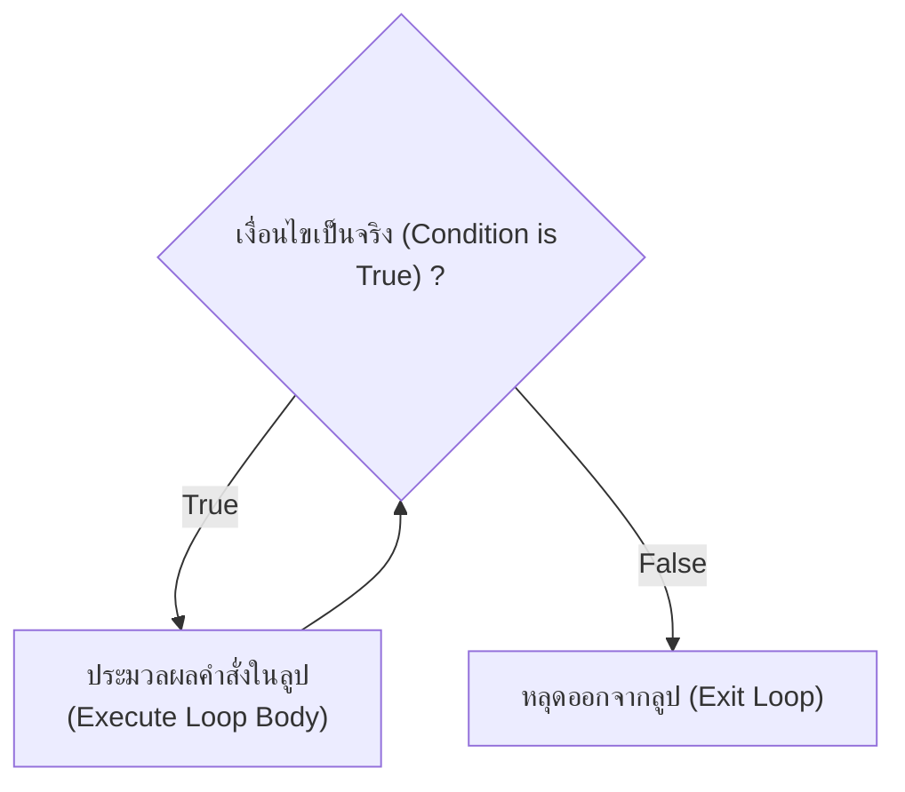
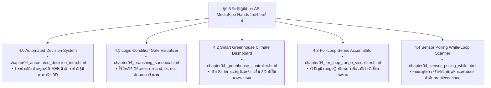

# วิทยาการคำนวณ 1: รากฐานแนวคิดเชิงคำนวณและการแก้ปัญหาอย่างเป็นระบบ
## บทที่ 4 โครงสร้างควบคุม เงื่อนไข และการทำซ้ำในงานวิทยาศาสตร์และระบบอัตโนมัติ
### (Control Structures, Conditional Branching, Iteration Loops & Automated Systems)
**ผู้เขียน:** ผู้ช่วยศาสตราจารย์ ดร.ชีวะ ทัศนา  
**สังกัด:** สาขาวิชาฟิสิกส์ คณะวิทยาศาสตร์และเทคโนโลยี มหาวิทยาลัยราชภัฏรำไพพรรณี  
**เอกสารประกอบรายวิชา:** 4122104 วิทยาการคำนวณและการแก้ปัญหาเชิงคำนวณ / การสอนวิทยาการคำนวณ

---

## 📋 แผนบริหารการสอนประจำบทที่ 4

### 1. หัวข้อเนื้อหาประจำบท
1. **เรื่องเล่าเปิดบทเรียนและระบบตัดสินใจอัตโนมัติ:** เบื้องหลังสมองกลยานยนต์ไร้คนขับ ระบบเบรกฉุกเฉินอัตโนมัติ (AEB) และสถาปัตยกรรมควบคุมการบิน Fly-by-Wire
2. **ตัวดำเนินการเปรียบเทียบและตรรกศาสตร์บูลีน:** `==`, `!=`, `<`, `>`, `<=`, `>=` และการตัดวงจรทางตรรกะ (Short-Circuit Evaluation: `and`, `or`, `not`)
3. **โครงสร้างทางเลือกและการตัดสินใจ (Conditional Branching):** คำสั่ง `if`, `if-else`, `if-elif-else` และการใช้เงื่อนไขตรวจสอบด่วน (Guard Clauses)
4. **กรณีศึกษาเชิงวิศวกรรมระบบเกษตรอัจฉริยะ (Smart Greenhouse Case Study):** การออกแบบตรรกะควบคุมปั๊มพ่นหมอก ม่านบังแดด และระบบระบายอากาศ
5. **โครงสร้างการวนซ้ำแบบกำหนดรอบแน่นอน (Definite Iteration):** คำสั่ง `for` ลูป, การใช้งานฟังก์ชัน `range(start, stop, step)` และการหาผลรวมอนุกรม $\sum_{i=1}^n i$
6. **โครงสร้างการวนซ้ำตามเงื่อนไข (Indefinite Iteration):** คำสั่ง `while` ลูป, การอ่านค่าเซนเซอร์แบบวนรอบ (Sensor Polling) และกลไกป้องกันลูปไม่รู้จบ (Infinite Loop Safeguard)
7. **การควบคุมการไหลของลูปขั้นสูง:** คำสั่ง `break`, `continue`, และโครงสร้าง `else` ต่อท้ายลูป
8. **การประยุกต์ใช้โปรแกรมคอมพิวเตอร์:** การเขียนโปรแกรมภาษา Python 3.11 จำลองระบบควบคุมโรงเรือนเกษตรและตรวจจับจำนวนเฉพาะ
9. **คู่มือห้องปฏิบัติการเสมือนจริง 3D AR MediaPipe:** การจำลองการแตกแขนงตรรกะเลเซอร์ และการควบคุมลูปวนรอบแบบไร้สัมผัส

### 2. วัตถุประสงค์เชิงพฤติกรรม (Behavioral Learning Outcomes)
เมื่อศึกษาบทเรียนนี้จบแล้ว ผู้เรียนสามารถ:
1. **อธิบาย (Explain)** หลักการทำงานของโครงสร้างควบคุมทางเลือกและการวนซ้ำในระบบคอมพิวเตอร์และปัญญาประดิษฐ์ได้อย่างถูกต้อง
2. **ออกแบบและเขียน (Design & Construct)** คำสั่งเงื่อนไขหลายชั้น `if-elif-else` เพื่อจำแนกและประมวลผลข้อมูลตามเกณฑ์ทางวิทยาศาสตร์ได้อย่างรัดกุม
3. **ประยุกต์ใช้ (Apply)** คำสั่ง `for` และ `while` ร่วมกับฟังก์ชัน `range()` ในการคำนวณผลรวมอนุกรมคณิตศาสตร์และการวนซ้ำตามค่าเซนเซอร์ได้อย่างคล่องแคล่ว
4. **วิเคราะห์และควบคุม (Analyze & Control)** ทิศทางการไหลของลูปด้วยคำสั่ง `break` และ `continue` พร้อมทั้งป้องกันข้อผิดพลาด Infinite Loop ได้อย่างสมบูรณ์
5. **สร้างสรรค์ (Create)** โปรแกรมภาษา Python 3.11 จำลองระบบควบคุมสภาพแวดล้อมอัตโนมัติที่มีความซับซ้อนสูงได้
6. **ปฏิบัติการ (Operate)** การทดลองเสมือนจริง 3D AR MediaPipe Hands เพื่อควบคุมตัวแปรและทดสอบสภาวะการตัดสินใจแบบไร้สัมผัสได้

---

## 🚗 4.0 เรื่องเล่าเปิดบทเรียน: วินาทีชีวิตกับสมองกลตัดสินใจอัตโนมัติ

ลองจินตนาการถึงสถานการณ์ที่รถยนต์ขับเคลื่อนอัตโนมัติ (Autonomous Vehicle) กำลังแล่นด้วยความเร็ว $80\text{ km/h}$ บนถนนยามค่ำคืน ทันใดนั้นมีสิ่งกีดขวางตัดหน้าในระยะกระชั้นชิดเพียง $20\text{ เมตร}$ 

ในเสี้ยววินาทีนั้น สมองของมนุษย์อาจต้องใช้เวลาตอบสนอง (Reaction Time) ราว $1.5\text{ วินาที}$ ซึ่งสายเกินไปสำหรับการหยุดรถ แต่ระบบคอมพิวเตอร์อัจฉริยะ **Autonomous Emergency Braking (AEB)** สามารถอ่านข้อมูลจากเซนเซอร์ LiDAR และเรดาร์ ประมวลผลตรรกะเงื่อนไขความปลอดภัย และสั่งการเบรกฉุกเฉินได้ภายในเวลาเพียง **$0.05\text{ วินาที}$ (50 มิลลิวินาที)**

```mermaid
graph TD
    S["เรดาร์ / LiDAR ตรวจจับวัตถุด้านหน้า"] --> D["คำนวณระยะห่าง (Distance) และความเร็วสัมพัทธ์"]
    D --> C{"Distance < Threshold ?"}
    C -->|True (วิกฤต)| B["🚨 สั่งการเบรกฉุกเฉินเต็มกำลัง (AEB Triggered)\n+ เตือนผู้ขับขี่ด้วยเสียงความถี่สูง"]
    C -->|False (ปลอดภัย)| N["รักษาระดับความเร็วและการเดินรถปกติ"]
```

เบื้องหลังการตัดสินใจที่ช่วยชีวิตมนุษย์นับล้านคนนี้ ไม่ใช่อภินิหารเวทมนตร์ใดๆ แต่คือ **"โครงสร้างควบคุมการตัดสินใจ (Conditional Control Structure)"** ที่ถูกออกแบบและเขียนขึ้นด้วยความประณีต รัดกุม และไร้จุดบกพร่อง

---

## ⚖️ 4.1 ตัวดำเนินการเปรียบเทียบและการประเมินตรรกะ (Relational & Logical Operators)

### 1. ตัวดำเนินการเปรียบเทียบ (Relational Operators)
ใช้สำหรับเปรียบเทียบค่าข้อมูล 2 ฝั่ง โดยให้ผลลัพธ์เป็นค่าความจริงบูลีน (`True` หรือ `False`):

| ตัวดำเนินการ | ความหมาย | ตัวอย่างนิพจน์ | ผลลัพธ์ทางตรรกะ |
| :---: | :--- | :---: | :---: |
| `==` | เท่ากับ (Equal to) — *ระวังอย่าสับสนกับ `=` ที่ใช้กำหนดค่า* | `10 == 10` | `True` |
| `!=` | ไม่เท่ากับ (Not equal to) | `10 != 5` | `True` |
| `>` | มากกว่า (Greater than) | `15 > 20` | `False` |
| `<` | น้อยกว่า (Less than) | `5 < 8` | `True` |
| `>=` | มากกว่าหรือเท่ากับ (Greater than or equal to) | `10 >= 10` | `True` |
| `<=` | น้อยกว่าหรือเท่ากับ (Less than or equal to) | `7 <= 6` | `False` |

### 2. ตัวดำเนินการตรรกะและการตัดวงจรด่วน (Short-Circuit Evaluation)
* **`and` (และ):** จะเป็น `True` ก็ต่อเมื่อ **ทั้งสองฝั่งเป็นจริง**
* **`or` (หรือ):** จะเป็น `True` เมื่อ **มีฝั่งใดฝั่งหนึ่งเป็นจริง**
* **`not` (นิเสธ):** กลับค่าความจริงจาก `True` เป็น `False` และกลับ `False` เป็น `True`

> 💡 **เทคนิค Short-Circuit:** ในคำสั่ง `if is_valid and (x / y > 2):` หาก `is_valid` มีค่าเป็น `False` ตัวแปลภาษา Python จะ **หยุดประเมินฝั่งขวาทันที** ทำให้ไม่เกิดข้อผิดพลาด `ZeroDivisionError` แม้ว่า `y` จะมีค่าเป็น $0$ ก็ตาม!

---

## 🔀 4.2 โครงสร้างทางเลือกและการตัดสินใจ (Conditional Branching)

### 1. โครงสร้างทางเลือกเดี่ยว (`if`) และทางเลือกคู่ (`if-else`)
```python
temperature = 38.5

# โครงสร้าง If-Else พื้นฐาน
if temperature > 37.5:
    print("🚨 แจ้งเตือน: อุณหภูมิร่างกายสูงเกินเกณฑ์ปกติ (มีไข้)")
else:
    print("✅ อุณหภูมิร่างกายอยู่ในเกณฑ์ปกติ")
```

### 2. โครงสร้างทางเลือกหลายชั้น (`if-elif-else`)
ใช้สำหรับจำแนกข้อมูลที่มีหลายช่วงค่า เช่น การตัดเกรด หรือการจำแนกความดันโลหิต:

```python
score = 84.5

if score >= 80:
    grade = "A"
elif score >= 70:
    grade = "B"
elif score >= 60:
    grade = "C"
elif score >= 50:
    grade = "D"
else:
    grade = "F"

print(f"ผลการเรียนที่ได้รับ: เกรด {grade}")
```

---

## 🔄 4.3 โครงสร้างการวนซ้ำแบบกำหนดรอบแน่นอน (`for` Loop & `range()`)

คำสั่ง `for` ลูปในภาษา Python ใช้สำหรับการวนซ้ำผ่านสมาชิกลำดับข้อมูล โดยมักใช้ร่วมกับฟังก์ชัน `range()`:

### 📌 ไวยากรณ์ของฟังก์ชัน `range(start, stop, step)`
* `range(stop)`: เริ่มต้นจาก $0$ ถึง `stop - 1` (เพิ่มทีละ 1)
* `range(start, stop)`: เริ่มจาก `start` ถึง `stop - 1`
* `range(start, stop, step)`: เริ่มจาก `start` ถึง `stop - 1` โดยก้าวเพิ่มทีละ `step`

```python
# 1. การวนรอบ 5 ครั้ง (0, 1, 2, 3, 4)
for i in range(5):
    print(f"รอบที่ {i}")

# 2. การหาผลรวมอนุกรมคณิตศาสตร์ 1 ถึง 100: sum = 1 + 2 + ... + 100
total_sum = 0
for n in range(1, 101):
    total_sum += n

print(f"ผลรวมอนุกรม 1 ถึง 100 มีค่าเท่ากับ: {total_sum}") # ได้ 5050 ตามสูตร Gauss n(n+1)/2
```

---

## 🔁 4.4 โครงสร้างการวนซ้ำตามเงื่อนไข (`while` Loop & Control Commands)

คำสั่ง `while` ลูปจะทำงานวนรอบซ้ำไปเรื่อยๆ **ตราบเท่าที่เงื่อนไขยังคงเป็นจริง (`True`)** เหมาะสำหรับการอ่านค่าเซนเซอร์ทางวิทยาศาสตร์ หรือการรอรับคำสั่งจากผู้ใช้:



### 🛑 คำสั่งควบคุมลูปขั้นสูง (`break` และ `continue`)
1. **`break`:** สั่งให้ **หยุดการทำงานและหลุดออกจากลูปทันที** ไม่ว่าจะเหลือรอบอีกเท่าใดก็ตาม
2. **`continue`:** สั่งให้ **ข้ามคำสั่งที่เหลือในรอบปัจจุบัน** แล้ววนกลับขึ้นไปเริ่มต้นรอบถัดไปทันที

```python
# ตัวอย่าง: ค้นหาตัวเลขคู่ตัวแรกที่มากกว่า 10
numbers = [3, 7, 9, 12, 15, 18]

for num in numbers:
    if num % 2 != 0:
        continue  # ข้ามเลขคี่ไป ไม่ต้องประมวลผลต่อ
    if num > 10:
        print(f"พบเลขคู่ตัวแรกที่เกิน 10 คือ: {num}")
        break     # พบเป้าหมายแล้ว จบลูปทันที
```

---

## 🌿 4.5 กรณีศึกษาเชิงวิศวกรรม: ระบบควบคุมโรงเรือนเกษตรอัจฉริยะ 4.0 (Smart Greenhouse Automation)

โรงเรือนปลูกพืชเศรษฐกิจต้องการระบบควบคุมสภาพแวดล้อมอัตโนมัติ เพื่อรักษาอุณหภูมิและความชื้นให้อยู่ในสภาวะที่เหมาะสมที่สุดต่อการเจริญเติบโต:

* **เงื่อนไขควบคุมปั๊มพ่นหมอก ($\text{MistPump}$):** ทำงานเมื่ออุณหภูมิ $> 35^\circ\text{C}$ และความชื้น $< 60\%$
* **เงื่อนไขม่านบังแดดไฟฟ้า ($\text{ShadeMotor}$):** กางออกเมื่อค่าความเข้มแสงแดด $> 50,000\text{ Lux}$
* **เงื่อนไขระบบระบายอากาศ ($\text{VentilationFan}$):** ทำงานเมื่อระดับก๊าซคาร์บอนไดออกไซด์เกินเกณฑ์ หรืออุณหภูมิสูง
* **ระบบความปลอดภัยฉุกเฉิน (Emergency Override):** หากน้ำในถังสำรองหมด ($\text{WaterEmpty} = 1$) ให้ระงับการทำงานของปั๊มทันทีเพื่อป้องกันมอเตอร์ไหม้

---

## 💻 4.6 โค้ดคอมพิวเตอร์ภาษา Python 3.11 แบบสมบูรณ์ (Self-Contained Implementation)

```python
# ==============================================================================
# smart_greenhouse_climate_controller.py
# โปรแกรมจำลองระบบควบคุมสภาพแวดล้อมโรงเรือนเกษตรอัจฉริยะด้วยลูปและเงื่อนไข
# ผู้เขียน: ผู้ช่วยศาสตราจารย์ ดร.ชีวะ ทัศนา (มหาวิทยาลัยราชภัฏรำไพพรรณี)
# มาตรฐาน: Python 3.11+ • PEP 8 Compliant • Pure Standard Library
# ==============================================================================

from typing import Dict, List

class SmartGreenhouseController:
    """คลาสควบคุมระบบสภาพแวดล้อมอัตโนมัติประจำโรงเรือนเกษตร"""
    
    def __init__(self, target_temp_max: float = 35.0, target_humid_min: float = 60.0):
        self.target_temp_max = target_temp_max
        self.target_humid_min = target_humid_min
        
    def evaluate_actuators(self, temp: float, humid: float, light_lux: float, water_empty: bool) -> Dict[str, str]:
        """
        ประเมินสถานะอุปกรณ์ควบคุมสภาพแวดล้อมตามตรรกะเงื่อนไข
        
        Returns:
            Dict[str, str]: สถานะการทำงานของปั๊มพ่นหมอก ม่านบังแดด และพัดลมระบายอากาศ
        """
        # 1. ตรรกะควบคุมปั๊มพ่นหมอก (Mist Pump) พร้อมระบบความปลอดภัย
        if water_empty:
            mist_status = "🔒 OFF (WATER RESERVOIR EMPTY - SAFEGUARD)"
        elif temp > self.target_temp_max and humid < self.target_humid_min:
            mist_status = "⚡ ACTIVE (COOLING & HUMIDIFYING)"
        else:
            mist_status = "💤 STANDBY"
            
        # 2. ตรรกะควบคุมม่านบังแดด (Shade Motor)
        if light_lux > 50000.0:
            shade_status = "🛡️ EXTENDED (BLOCKING INTENSE SUNLIGHT)"
        elif light_lux < 10000.0:
            shade_status = "☀️ RETRACTED (MAXIMIZING SUNLIGHT)"
        else:
            shade_status = "💤 OPTIMAL POSITION"
            
        # 3. ตรรกะควบคุมพัดลมระบายอากาศ (Ventilation Fan)
        if temp > 38.0:
            fan_status = "🌪️ HIGH SPEED (HEAT EXHAUST)"
        elif temp > 32.0:
            fan_status = "💨 LOW SPEED (CIRCULATION)"
        else:
            fan_status = "💤 OFF"
            
        return {
            "mist_pump": mist_status,
            "shade_curtain": shade_status,
            "ventilation_fan": fan_status
        }

def simulate_24h_telemetry_loop(sensor_log: List[Dict[str, float]]):
    """จำลองการทำงานวนรอบแบบ For-Loop ประมวลผลข้อมูลเซนเซอร์ตลอด 24 ชั่วโมง"""
    controller = SmartGreenhouseController()
    
    print("\n" + "=" * 84)
    print("🌿 รายงานผลการควบคุมอัตโนมัติโรงเรือนเกษตรอัจฉริยะ (SMART GREENHOUSE TELEMETRY)")
    print("=" * 84)
    
    for entry in sensor_log:
        t = entry["hour"]
        temp = entry["temp"]
        humid = entry["humid"]
        lux = entry["lux"]
        w_empty = entry["water_empty"]
        
        actions = controller.evaluate_actuators(temp, humid, lux, w_empty)
        
        print(f"⏰ เวลา {t:02.0f}:00 น. | อุณหภูมิ: {temp:4.1f}°C | ความชื้น: {humid:4.1f}% | แสง: {lux:6.0f} Lux")
        print(f"   ├─ ปั๊มพ่นหมอก  : {actions['mist_pump']}")
        print(f"   ├─ ม่านบังแดด   : {actions['shade_curtain']}")
        print(f"   └─ พัดลมระบายอากาศ: {actions['ventilation_fan']}")
        print("-" * 84)
        
    print("✅ การจำลองข้อมูลวนรอบเสร็จสิ้นสมบูรณ์ 100%\n")

if __name__ == "__main__":
    # ชุดข้อมูลจำลองเซนเซอร์โรงเรือน 3 ช่วงเวลา
    telemetry_data = [
        {"hour": 8.0,  "temp": 28.5, "humid": 75.0, "lux": 25000.0, "water_empty": False},
        {"hour": 13.0, "temp": 36.8, "humid": 48.0, "lux": 68000.0, "water_empty": False},
        {"hour": 15.0, "temp": 39.2, "humid": 42.0, "lux": 55000.0, "water_empty": True} # ถังน้ำแห้งฉุกเฉิน
    ]
    
    simulate_24h_telemetry_loop(telemetry_data)
    
    # ตรวจสอบความถูกต้องด้วย Unit Assertions
    ctrl = SmartGreenhouseController()
    res1 = ctrl.evaluate_actuators(36.8, 48.0, 68000.0, False)
    assert "ACTIVE" in res1["mist_pump"], "Mist pump should be ACTIVE"
    assert "EXTENDED" in res1["shade_curtain"], "Shade curtain should be EXTENDED"
    
    res2 = ctrl.evaluate_actuators(39.2, 42.0, 55000.0, True)
    assert "SAFEGUARD" in res2["mist_pump"], "Mist pump must be locked due to water empty safeguard"
    print("✅ ระบบผ่านการตรวจสอบความถูกต้องของ Assertion Tests 100% OK!\n")
```

---

## 🔬 4.7 คู่มือใบงานห้องปฏิบัติการเสมือนจริง 3D AR MediaPipe Hands (บทที่ 4)



---

## 💡 4.8 สรุปสาระสำคัญประจำบท (Chapter Summary)

1. **โครงสร้างทางเลือก (`if-elif-else`)** เป็นรากฐานของการตัดสินใจในระบบคอมพิวเตอร์และปัญญาประดิษฐ์ โดยมี Short-Circuit Evaluation ช่วยเพิ่มความเร็วและความปลอดภัย
2. **`for` ลูป** เหมาะสำหรับการวนซ้ำที่ทราบจำนวนรอบที่แน่นอน ทำงานร่วมกับฟังก์ชัน `range(start, stop, step)`
3. **`while` ลูป** เหมาะสำหรับการวนซ้ำตามเงื่อนไข โดยต้องระวังการปรับปรุงค่าตัวแปรควบคุมเพื่อป้องกัน Infinite Loop
4. **คำสั่ง `break`** ใช้หยุดการทำงานของลูปทันที ส่วน **`continue`** ใช้ข้ามไปยังรอบถัดไป ช่วยให้การเขียนโค้ดมีความยืดหยุ่นสูง

---

## 📝 4.9 แบบฝึกหัดทบทวนและโจทย์ประเมินผลสัมฤทธิ์ (Chapter Exercises)

### 🔹 ตอนที่ 1: ความรู้ความเข้าใจพื้นฐาน (Basic Knowledge)
1. จงอธิบายความแตกต่างระหว่างคำสั่ง `for` ลูป และ `while` ลูป พร้อมยกตัวอย่างสถานการณ์ที่เหมาะสมสำหรับแต่ละคำสั่ง
2. คำสั่ง `break` และ `continue` แตกต่างกันอย่างไร จงอธิบายพร้อมเขียนโค้ดตัวอย่างประกอบ
3. ฟังก์ชัน `range(2, 11, 3)` จะสร้างลำดับตัวเลขใดออกมาบ้าง?

### 🔹 ตอนที่ 2: การวิเคราะห์และประยุกต์ใช้ (Analytical Application)
4. **ระบบตรวจจับจำนวนเฉพาะ (Prime Number Tester):** จงเขียนโปรแกรมรับค่าจำนวนเต็ม $N > 1$ จากผู้ใช้ แล้วใช้คำสั่ง `for` หรือ `while` ตรวจสอบว่ามีตัวเลขใดตั้งแต่ $2$ ถึง $\sqrt{N}$ ที่หาร $N$ ลงตัวหรือไม่ หากพบตัวหารให้ใช้คำสั่ง `break` และพิมพ์ผลลัพธ์ว่า $N$ ไม่ใช่จำนวนเฉพาะ
5. จงวิเคราะห์โค้ดต่อไปนี้ และระบุว่ามีข้อผิดพลาดประเภทใดเกิดขึ้น:
   ```python
   count = 1
   while count <= 5:
       print(f"นับ: {count}")
       # ไม่มีคำสั่ง count += 1
   ```

### 🔹 ตอนที่ 3: การสังเคราะห์และคิดขั้นสูง (Advanced Synthesis & Coding)
6. จงเขียนโปรแกรมจำลอง **"เครื่องรับฝาก-ถอนเงินธนาคารอัตโนมัติ (ATM Machine)"** โดยใช้ `while True:` ลูป แสดงเมนู 4 ตัวเลือก: 1. ฝากเงิน, 2. ถอนเงิน, 3. ตรวจสอบยอดเงินคงเหลือ, 4. ออกจากโปรแกรม (`break`) พร้อมระบบตรวจสอบยอดเงินไม่ให้ติดลบ

---

## 📚 เอกสารอ้างอิงประจำบท (References)

1. Lutz, M. (2013). *Learning Python: Powerful Object-Oriented Programming* (5th ed.). O'Reilly Media.
2. National Highway Traffic Safety Administration. (2020). *Automatic Emergency Braking Systems in Light Vehicles*. U.S. Department of Transportation.
3. Van Rossum, G., & Drake, F. L. (2009). *Python 3 Reference Manual*. CreateSpace.
4. Thassana, C. (2026). *Computational Thinking and Applied Artificial Intelligence for Science Education*. Rambhai Barni Rajabhat University Press.
