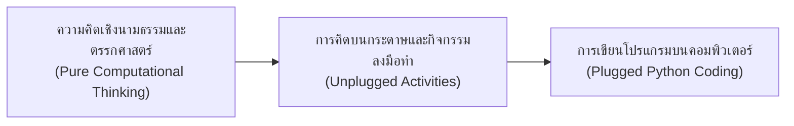
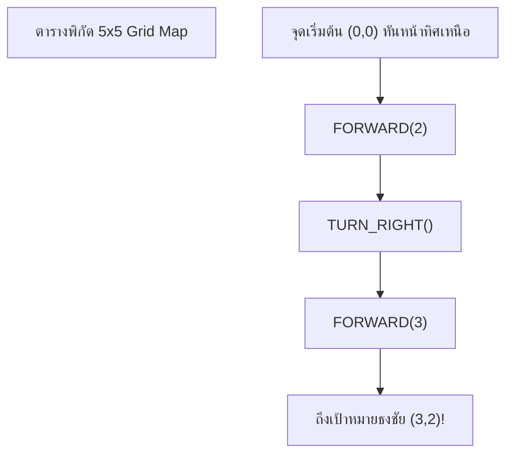
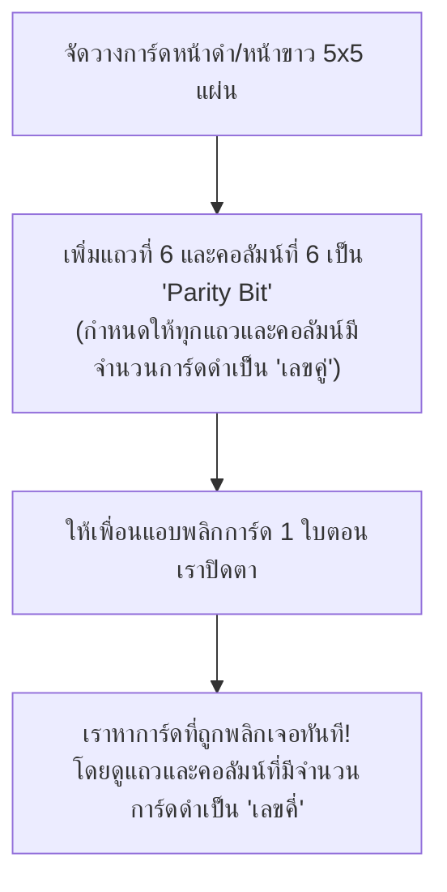

# วิทยาการคำนวณ 1: รากฐานแนวคิดเชิงคำนวณและการแก้ปัญหาอย่างเป็นระบบ
## บทที่ 4 กิจกรรม Unplugged Coding ในชีวิตประจำวัน
**ผู้เขียน:** ผู้ช่วยศาสตราจารย์ ดร.ชีวะ ทัศนา • สาขาวิชาฟิสิกส์ คณะวิทยาศาสตร์และเทคโนโลยี มหาวิทยาลัยราชภัฏรำไพพรรณี

---

## 🎯 ผลลัพธ์การเรียนรู้ประจำบท (Behavioral Learning Outcomes)
เมื่อศึกษาบทเรียนนี้จบแล้ว ผู้เรียนสามารถ:
1. **อธิบาย (Explain)** หลักการและความสำคัญของกิจกรรม Unplugged Coding ในการพัฒนาทักษะการคิดเชิงคำนวณโดยไม่ต้องพึ่งพาคอมพิวเตอร์
2. **จำลองและแก้ปัญหา (Simulate & Solve)** ปัญหาการนำทาง การแปลงเลขฐานสอง การบีบอัดข้อมูลภาพ และการตรวจจับข้อผิดพลาด (Error Detection) ผ่านกิจกรรมเชิงรุก
3. **จัดระเบียบและสื่อสาร (Organize & Communicate)** ขั้นตอนวิธีให้กับเพื่อนร่วมชั้นและสามารถค้นหาจุดบกพร่อง (Debugging) ในชีวิตจริงได้อย่างเป็นระบบ
4. **เชื่อมโยง (Bridge)** ประสบการณ์จากกิจกรรม Unplugged ไปสู่การเขียนโปรแกรมคอมพิวเตอร์ด้วยภาษา Python

---

## 🌌 4.0 เรื่องเล่าเปิดบทเรียน: วิทยาการคอมพิวเตอร์ที่เกิดก่อนเครื่องคอมพิวเตอร์

หลายคนเข้าใจว่า **"วิทยาการคอมพิวเตอร์ (Computer Science)"** คือเรื่องของเครื่องจักร แป้นพิมพ์ และหน้าจออิเล็กทรอนิกส์ แต่ในความเป็นจริง บิดาและมารดาแห่งวิทยาการคอมพิวเตอร์อย่าง **เอดา เลิฟเลซ (Ada Lovelace)** และ **แอลัน ทัวริง (Alan Turing)** ได้คิดค้นขั้นตอนวิธีและทฤษฎีการคำนวณขึ้นบน **กระดาษ ปากกา และสมองมนุษย์** ตั้งแต่ก่อนที่คอมพิวเตอร์ไฟฟ้าเครื่องแรกของโลกจะถูกสร้างขึ้นเกือบหนึ่งร้อยปี!



**Unplugged Coding** จึงเป็นสะพานแห่งการเรียนรู้ที่ยอดเยี่ยมที่สุด ที่ช่วยให้ผู้เรียนทุกวัยเข้าใจมโนทัศน์อันลึกซึ้งของวิทยาการคำนวณผ่านการเล่นเกม บอร์ดเกม การเคลื่อนไหวร่างกาย และการแก้ปริศนากายภาพ

---

## 🎲 4.1 กิจกรรมที่ 1: การสั่งการหุ่นยนต์มนุษย์และตารางพิกัด (Human Robot Grid Navigation)

### แนวคิดทางวิทยาการคอมพิวเตอร์:
* การจัดลำดับคำสั่ง (Sequential Execution), ตัวแปรทิศทาง (State/Orientation), และการแก้ไขจุดบกพร่อง (Debugging)

### กฎกติกาและชุดคำสั่งสากล (Instruction Set):
1. ผู้เรียนแบ่งเป็น 2 บทบาท: **"โปรแกรมเมอร์ (Programmer)"** และ **"หุ่นยนต์มนุษย์ (Robot)"**
2. หุ่นยนต์มนุษย์จะถูกปิดตา และสามารถทำตามคำสั่งที่ได้รับจากการ์ดคำสั่ง 4 ใบเท่านั้น:
   * ⬆️ `FORWARD(1)` : ก้าวไปข้างหน้า 1 ช่อง
   * ↩️ `TURN_LEFT()` : หมุนตัวไปทางซ้าย $90^\circ$ (อยู่กับที่)
   * ↪️ `TURN_RIGHT()`: หมุนตัวไปทางขวา $90^\circ$ (อยู่กับที่)
   * 🛑 `STOP()`       : หยุดการทำงาน



### การดีบักในชีวิตจริง (Real-time Debugging):
หากหุ่นยนต์เดินชนสิ่งกีดขวาง โปรแกรมเมอร์จะต้อง **Trace ย้อนกลับ** ไปดูว่าคำสั่งที่บรรทัดใดเกิดความคลาดเคลื่อนทางพิกัด $(x, y)$ เพื่อแก้ไขชุดคำสั่งให้ถูกต้อง

---

## 🖼️ 4.2 กิจกรรมที่ 2: ศิลปะพิกเซลและการบีบอัดข้อมูลภาพ (Pixel Art & Run-Length Encoding)

### แนวคิดทางวิทยาการคอมพิวเตอร์:
* ระบบเลขฐานสอง (Binary System), การแทนค่าข้อมูลภาพ (Bitmap Representation), และการบีบอัดข้อมูลแบบไม่สูญเสีย (Lossless Data Compression)

### หลักการแทนค่าภาพขาว-ดำ:
กำหนดให้ **0 แทนพิกเซลสีขาว** และ **1 แทนพิกเซลสีดำ**

<div style="background: #ffffff; border: 1px solid #cbd5e1; border-radius: 12px; padding: 18px; margin: 16px 0;">
  <h4 style="color: #0284c7; margin-top: 0;">ตัวอย่างการแปลงภาพอักษร "T" ขนาด 5x5 พิกเซล</h4>
  <div style="display: flex; gap: 24px; flex-wrap: wrap; align-items: center;">
    <div>
      <p style="font-family: monospace; font-size: 1.2em; line-height: 1.4; margin: 0; background: #0f172a; color: #38bdf8; padding: 12px 16px; border-radius: 8px;">
        แถวที่ 1: 1 1 1 1 1<br>
        แถวที่ 2: 0 0 1 0 0<br>
        แถวที่ 3: 0 0 1 0 0<br>
        แถวที่ 4: 0 0 1 0 0<br>
        แถวที่ 5: 0 0 1 0 0
      </p>
    </div>
    <div style="flex: 1;">
      <p style="color: #334155; line-height: 1.7; margin: 0;">
        <strong>การบีบอัดแบบ Run-Length Encoding (RLE):</strong><br>
        แทนที่จะส่งข้อมูลทั้ง 25 บิต เราสามารถบันทึกจำนวนตัวเลขที่ซ้ำกัน:<br>
        • แถว 1: <code>5B</code> (ดำ 5 ตัว)<br>
        • แถว 2-5: <code>2W 1B 2W</code> (ขาว 2, ดำ 1, ขาว 2)<br>
        <em>ช่วยลดขนาดข้อมูลลงได้มากกว่า 50%!</em>
      </p>
    </div>
  </div>
</div>

---

## 🃏 4.3 กิจกรรมที่ 3: มายากลไพ่ตรวจจับและแก้ไขข้อผิดพลาด (Parity Bit Card Trick)

### แนวคิดทางวิทยาการคอมพิวเตอร์:
* การตรวจสอบความถูกต้องของข้อมูลในการส่งผ่านเครือข่ายอินเทอร์เน็ต (Error Detection & Correction)



นี่คือหลักการเดียวกับที่ชิปความจำของคอมพิวเตอร์และดาวเทียมอวกาศใช้ในการแก้ไขข้อผิดพลาดของข้อมูลจากคลื่นรังสีคอสมิก (Single Event Upset - SEU)

---

## 💻 4.4 โค้ดคอมพิวเตอร์ Python: ตัวแปลงและบีบอัดภาพ RLE

```python
# run_length_encoding_compressor.py
# โปรแกรมจำลองการบีบอัดข้อมูลภาพด้วยวิธี Run-Length Encoding (RLE)
# ผู้เขียน: ผศ.ดร.ชีวะ ทัศนา (มรภ.รำไพพรรณี)

def compress_rle(binary_string: str) -> str:
    """บีบอัดสตริงบิต 0/1 ด้วยอัลกอริทึม Run-Length Encoding"""
    if not binary_string:
        return ""
    
    compressed = []
    current_char = binary_string[0]
    count = 1
    
    for char in binary_string[1:]:
        if char == current_char:
            count += 1
        else:
            compressed.append(f"{count}{current_char}")
            current_char = char
            count = 1
    compressed.append(f"{count}{current_char}")
    
    return " ".join(compressed)

def decompress_rle(compressed_string: str) -> str:
    """คลายการบีบอัดสตริง RLE กลับเป็นสตริงบิตต้นฉบับ"""
    tokens = compressed_string.split()
    decompressed = []
    for token in tokens:
        count = int(token[:-1])
        char = token[-1]
        decompressed.append(char * count)
    return "".join(decompressed)

if __name__ == "__main__":
    # ตัวอย่างข้อมูลภาพไอคอน 8x8 บิต
    original_bitmap = "00011000" + "00111100" + "01111110" + "11111111" + "11111111" + "01111110" + "00111100" + "00011000"
    
    print("=" * 65)
    print(f"📦 ข้อมูลบิตดั้งเดิม ({len(original_bitmap)} บิต):")
    print(original_bitmap)
    
    compressed = compress_rle(original_bitmap)
    print(f"\n⚡ ข้อมูลหลังบีบอัด RLE:")
    print(compressed)
    
    restored = decompress_rle(compressed)
    print(f"\n🔄 ข้อมูลหลังคลายการบีบอัด: {restored}")
    print(f"✅ ความถูกต้อง 100%: {original_bitmap == restored}")
    print("=" * 65)
```

---

## 💡 4.5 สรุปใจความสำคัญและแบบฝึกหัดท้ายบทที่ 4

### 📌 สรุปประเด็นสำคัญ
1. **Unplugged Coding** มุ่งเน้นการเสริมสร้างกระบวนการคิดมากกว่าการจำไวยากรณ์ภาษาโปรแกรม
2. **การแทนค่าด้วยเลขฐานสองและ RLE** แสดงให้เห็นว่าคอมพิวเตอร์จัดเก็บภาพ เสียง และวิดีโอได้อย่างมีประสิทธิภาพอย่างไร
3. **Parity Bits** เป็นบทพิสูจน์ว่าตรรกะคณิตศาสตร์ที่เรียบง่ายสามารถสร้างระบบป้องกันความผิดพลาดที่เสถียรระดับสากลได้

---

### 📝 แบบฝึกหัดทบทวน 3 ระดับ (Exercises)

#### ระดับที่ 1: ความรู้ความเข้าใจพื้นฐาน (Basic Knowledge)
1. จงแปลงสตริงฐานสองต่อไปนี้ให้อยู่ในรูปรหัสบีบอัด RLE: `000001111100001111111100`
2. ในระบบ Even Parity หากข้อมูลที่ส่งคือ `1 0 1 1 0 0 1` บิตพาริตีต่อท้ายจะต้องเป็น `0` หรือ `1` เพราะเหตุใด

#### ระดับที่ 2: การวิเคราะห์และประยุกต์ใช้ (Analytical Application)
3. ให้นักเรียนเขียนชุดคำสั่งการ์ดหุ่นยนต์ (Forward, Turn Left, Turn Right) เพื่อพาหุ่นยนต์เดินจากจุด $(1,1)$ ไปยัง $(4,5)$ บนตาราง 2 มิติ โดยหลีกเลี่ยงหลุมพรางที่จุด $(2,3)$ และ $(3,4)$

#### ระดับที่ 3: การคิดขั้นสูงและบูรณาการ (Advanced Synthesis)
4. จงออกแบบกิจกรรม Unplugged สำหรับสอนเรื่อง **"การค้นหาข้อมูลแบบทวิภาค (Binary Search)"** โดยใช้อุปกรณ์ในชีวิตประจำวัน เช่น กล่องของขวัญ หรือพจนานุกรมเล่มหนา พร้อมเขียนใบบันทึกผลและเกณฑ์การประเมิน
