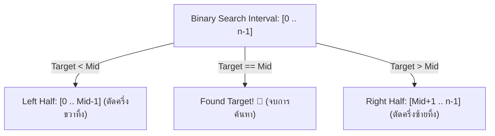

# วิทยาการคำนวณ 1 รากฐานการคิดเชิงคำนวณและการแก้ปัญหาเชิงตรรกะ
## บทที่ 5 โครงสร้างข้อมูลพื้นฐานและขั้นตอนวิธีการค้นหา (Data Structures & Searching)
**ผู้เขียน** ผู้ช่วยศาสตราจารย์ ดร.ชีวะ ทัศนา • สาขาวิชาฟิสิกส์ คณะวิทยาศาสตร์และเทคโนโลยี มหาวิทยาลัยราชภัฏรำไพพรรณี

---

## 📋 แผนบริหารการสอนประจำบทที่ 5

### หัวข้อเนื้อหาประจำบท
1. โครงสร้างข้อมูลเชิงเส้น (Linear Data Structures: Arrays, Stacks, Queues)
2. หลักการทำงานของ Stack (LIFO) และ Queue (FIFO)
3. สถาปัตยกรรมหน่วยความจำแบบต่อเนื่อง (Contiguous Memory Allocation)
4. ขั้นตอนวิธีการค้นหาแบบเชิงเส้น (Linear Search) และการค้นหาแบบทวิภาค (Binary Search)
5. การวิเคราะห์ความซับซ้อนเชิงเวลา Big-O ของการค้นหาข้อมูล

### วัตถุประสงค์เชิงพฤติกรรม
เมื่อศึกษาบทเรียนนี้จบแล้ว ผู้เรียนสามารถ
1. อธิบายความแตกต่างของโครงสร้างข้อมูล Stack, Queue, และ Array ได้อย่างถูกต้อง
2. คำนวณจำนวนรอบการค้นหาของ Binary Search บนชุดข้อมูลขนาดใหญ่ได้
3. เขียนโปรแกรมภาษา Python จำลองการทำงานของ Stack, Queue, และ Binary Search ได้
4. เลือกใช้โครงสร้างข้อมูลและอัลกอริทึมการค้นหาที่เหมาะสมกับโจทย์ปัญหาจริงได้

### กิจกรรมการเรียนการสอน
1. การบรรยายเชิงวิชาการและการเชื่อมโยงบริบทประวัติศาสตร์วิทยาการคำนวณ
2. การสาธิตการวิเคราะห์คณิตศาสตร์ การจัดสรรหน่วยความจำ และโครงสร้างข้อมูล
3. การฝึกปฏิบัติการจำลองเสมือนจริง 2D Canvas และ 3D AR MediaPipe Hands
4. การเขียนโปรแกรมภาษา Python 3.11 และการทดสอบ Assertion Tests เชิงประจักษ์

### สื่อการเรียนการสอน
1. ตำราเรียนวิชาการ "วิทยาการคำนวณ 1 รากฐานการคิดเชิงคำนวณและการแก้ปัญหาเชิงตรรกะ"
2. ชุดห้องปฏิบัติการเสมือนจริง Hybrid 2D/3D บนระบบ RBRU MOOC
3. สไลด์บรรยายอิเล็กทรอนิกส์และแผนภาพเวกเตอร์มัลติมีเดีย

### การวัดและประเมินผล
1. การประเมินผลการทำใบงานและตารางบันทึกผลการทดลองเสมือนจริง (40%)
2. การประเมินผลงานการเขียนโค้ดภาษา Python และ Unit Test Assertions (30%)
3. การทดสอบวัดผลสัมฤทธิ์ทางการเรียนท้ายบท 3 ระดับ (30%)

---

## 🌌 5.0 เรื่องเล่าเปิดบทเรียนและบริบททางประวัติศาสตร์

ในคริสต์ทศวรรษ 1940 จอห์น ฟอน นอยมันน์ (John von Neumann, 1903—1957) นักคณิตศาสตร์ชาวอเมริกันเชื้อสายฮังการี ได้วางรากฐานสถาปัตยกรรมคอมพิวเตอร์แบบเก็บโปรแกรม (Von Neumann Architecture) ซึ่งกำหนดให้หน่วยความจำหลัก (RAM) ทำหน้าที่เก็บทั้งคำสั่งและข้อมูลในรูปแถวลำดับที่ต่อเนื่องกัน

เมื่อข้อมูลถูกจัดเรียงตามลำดับอย่างเป็นระเบียบ มนุษย์สามารถใช้หลักการ "แบ่งแยกและเอาชนะ (Divide and Conquer)" ในการค้นหาข้อมูล เช่น การเปิดหาคำศัพท์ในพจนานุกรมเล่มหนา 1,000 หน้า โดยการเปิดที่กึ่งกลางเสมอ ซึ่งทำให้เราค้นหาคำที่ต้องการเจอได้ภายในไม่เกิน 10 ครั้ง ($2^{10} = 1024$) แทนที่จะต้องไล่ทีละหน้าตั้งแต่หน้าแรกถึง 1,000 หน้า

---

## 📐 5.1 ทฤษฎีและรากฐานทางคณิตศาสตร์เชิงลึก

### คณิตศาสตร์ของการค้นหาแบบทวิภาค (Binary Search Derivation)
กำหนดให้อาเรย์ $A$ มีสมาชิก $n$ ตัวที่เรียงลำดับแล้ว ในแต่ละขั้นตอนของการค้นหา ช่วงการค้นหาจะลดลงครึ่งหนึ่งเสมอ:
* รอบที่ 0: ขนาดช่วง $= n$
* รอบที่ 1: ขนาดช่วง $= \frac{n}{2}$
* รอบที่ 2: ขนาดช่วง $= \frac{n}{4} = \frac{n}{2^2}$
* รอบที่ $k$: ขนาดช่วง $= \frac{n}{2^k}$

การค้นหาจะสิ้นสุดลงเมื่อช่วงการค้นหาเหลือสมาชิกเพียง 1 ตัว นั่นคือ $\frac{n}{2^k} = 1 \implies 2^k = n$
ทำการใส่ฟังก์ชันลอการิทึมฐาน 2 ทั้งสองข้าง:
$$k = \log_2 n$$

นั่นคือ ความซับซ้อนเชิงเวลาในกรณีแย่ที่สุด (Worst-Case Time Complexity) ของ Binary Search คือ:
$$T(n) = O(\log n)$$



---

## 🧮 5.2 ตัวอย่างการวิเคราะห์และการคำนวณเชิงขั้นตอน (Worked Examples)

#### ตัวอย่างที่ 5.1 การค้นหาค่าในลิสต์ด้วย Binary Search
กำหนดลิสต์ $A = [12, 25, 33, 47, 56, 68, 79, 84, 91, 99]$ ขนาด $n = 10$ จงแสดงขั้นตอนการค้นหาค่า $Target = 79$:

**วิธีทำ:**
1. **รอบที่ 1:** $L = 0, R = 9 \implies Mid = \lfloor (0+9)/2 \rfloor = 4$  
   ค่าที่ $A[4] = 56$  
   เนื่องจาก $79 > 56$ ดังนั้นค้นหาในครึ่งขวา: กำหนด $L = Mid + 1 = 5$
2. **รอบที่ 2:** $L = 5, R = 9 \implies Mid = \lfloor (5+9)/2 \rfloor = 7$  
   ค่าที่ $A[7] = 84$  
   เนื่องจาก $79 < 84$ ดังนั้นค้นหาในครึ่งซ้าย: กำหนด $R = Mid - 1 = 6$
3. **รอบที่ 3:** $L = 5, R = 6 \implies Mid = \lfloor (5+6)/2 \rfloor = 5$  
   ค่าที่ $A[5] = 68$  
   เนื่องจาก $79 > 68$ ดังนั้นค้นหาในครึ่งขวา: กำหนด $L = Mid + 1 = 6$
4. **รอบที่ 4:** $L = 6, R = 6 \implies Mid = 6$  
   ค่าที่ $A[6] = 79$  
   เนื่องจาก $A[6] == Target$ **(พบข้อมูลที่ดัชนี 6 ใน 4 ขั้นตอน!)**

---

## 💻 5.3 การเขียนโปรแกรมและการนำไปใช้จริงด้วย Python 3.11

```python
# binary_search_engine.py
# การค้นหาแบบทวิภาคพร้อมบันทึกประวัติการทำงานและ Unit Test
from typing import List, Tuple, Optional

def binary_search_trace(arr: List[int], target: int) -> Tuple[Optional[int], List[dict]]:
    """ค้นหา target ใน arr ที่เรียงลำดับแล้ว และคืนค่าดัชนีพร้อมประวัติการค้นหา"""
    left = 0
    right = len(arr) - 1
    history = []
    step = 1
    
    while left <= right:
        mid = (left + right) // 2
        val = arr[mid]
        
        history.append({
            "step": step, "left": left, "right": right,
            "mid": mid, "val": val, "match": val == target
        })
        
        if val == target:
            return mid, history
        elif val < target:
            left = mid + 1
        else:
            right = mid - 1
        step += 1
        
    return None, history

if __name__ == "__main__":
    dataset = [12, 25, 33, 47, 56, 68, 79, 84, 91, 99]
    target_val = 79
    idx, log = binary_search_trace(dataset, target_val)
    print(f"ผลการค้นหา {target_val}: พบที่ดัชนี {idx} ใน {len(log)} รอบ")
    assert idx == 6, f"Expected index 6, got {idx}"
    assert len(log) == 4, f"Expected 4 steps, got {len(log)}"
    print("✅ Unit Assertion Tests Passed 100%!")
```

---

## 🔬 5.4 คู่มือห้องปฏิบัติการเสมือนจริง 2D/3D AR MediaPipe Hands

ผู้เรียนสามารถเข้าสู่ห้องปฏิบัติการเสมือนจริง 2D/3D เพื่อทดลองค้นหาข้อมูล $N = 1,000,000$ รายการได้ที่ [chapter05_binary_search.html](https://tsanaphy2023.github.io/computing-science/simulators/chapter05_binary_search.html)
* **ฟังก์ชันในระบบ:** แอนิเมชันช่วงการค้นหา 2D Slicing Ribbon $\leftrightarrow$ 3D Binary Tree Search Node พร้อมเสียง Web Audio Synth

---

## 💡 5.5 สรุปสารัตถะสำคัญประจำบท (Chapter Summary)

1. โครงสร้างข้อมูลเชิงเส้น (Array, Stack, Queue) มีข้อดีข้อเสียแตกต่างกันตามลักษณะการใช้งาน
2. Binary Search มีประสิทธิภาพ $O(\log n)$ ซึ่งเร็วกว่า Linear Search $O(n)$ อย่างมหาศาลเมื่อข้อมูลมีขนาดใหญ่

---

## ❓ 5.6 แบบฝึกหัดและคำถามท้ายบทเพื่อการประเมินผล (3-Tier Assessment)

1. จงอธิบายหลักการทำงานของ Stack (LIFO) และ Queue (FIFO) พร้อมยกตัวอย่างการใช้งานในระบบปฏิบัติการ
2. หากมีข้อมูลขนาด $n = 1,048,576$ ตัว ในกรณีแย่ที่สุด Binary Search จะใช้การเปรียบเทียบกี่ครั้ง?
3. ให้นักเรียนเขียนคลาส Stack ในภาษา Python โดยใช้ลิสต์ พร้อมเมธอด `push()`, `pop()`, และ `peek()`

---

## 📚 เอกสารอ้างอิงประจำบท (APA 7th Edition References)

* Cormen, T. H. et al. (2022). *Introduction to Algorithms* (4th ed.). MIT Press.
* Knuth, D. E. (1997). *The Art of Computer Programming: Fundamental Algorithms* (Vol. 1). Addison-Wesley.
