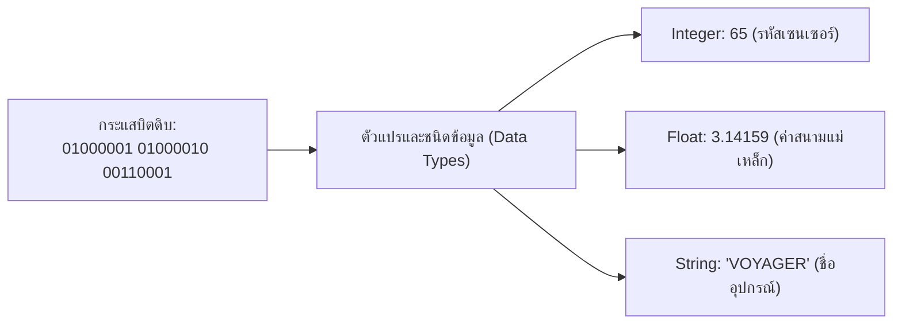
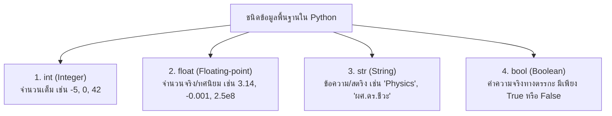

# วิทยาการคำนวณ 1 รากฐานแนวคิดเชิงคำนวณและการแก้ปัญหาอย่างเป็นระบบ
## บทที่ 5 ตัวแปร ชนิดข้อมูล และการรับส่งข้อมูลเบื้องต้น
**ผู้เขียน** ผู้ช่วยศาสตราจารย์ ดร.ชีวะ ทัศนา • สาขาวิชาฟิสิกส์ คณะวิทยาศาสตร์และเทคโนโลยี มหาวิทยาลัยราชภัฏรำไพพรรณี

---

## 🎯 ผลลัพธ์การเรียนรู้ประจำบท
เมื่อศึกษาบทเรียนนี้จบแล้ว ผู้เรียนสามารถ
1. **อธิบาย ** หลักการทำงานของตัวแปร หน่วยความจำ และความแตกต่างระหว่างชนิดข้อมูลพื้นฐานในคอมพิวเตอร์
2. **เลือกใช้และแปลง ** ชนิดข้อมูล (int, float, str, bool) ให้สอดคล้องกับตัวแปรทางวิทยาศาสตร์และคณิตศาสตร์ได้อย่างถูกต้อง
3. **คำนวณนิพจน์ ** ตามลำดับความสำคัญของตัวดำเนินการ (Operator Precedence / PEMDAS) ได้อย่างแม่นยำ
4. **เขียนโปรแกรม ** เพื่อรับข้อมูลเข้าจากผู้ใช้ ประมวลผล และแสดงผลลัพธ์ด้วย f-string อย่างสวยงามและเป็นมืออาชีพ

---

## 🌌 5.0 เรื่องเล่าเปิดบทเรียน กล่องความจำและรหัสพันธุกรรมดิจิทัล

เมื่อยานสำรวจอวกาศ **Voyager 1** ส่งสัญญาณข้อมูลระยะไกลกลับมายังโลกจากระยะทางกว่า 24,000 ล้านกิโลเมตร สัญญาณที่เดินทางผ่านคลื่นวิทยุเป็นเพียงกระแสตัวเลขฐานสอง `0` และ `1` ที่ไม่มีป้ายบอกว่าตัวเลขไหนคือ อุณหภูมิของอวกาศ, ตัวเลขไหนคือ ความเร็วของยาน, หรือตัวเลขไหนคือ ภาพถ่ายของดาวเสาร์

สิ่งที่ทำให้นักวิทยาศาสตร์ของ NASA อ่านข้อมูลเหล่านี้เข้าใจได้คือ **ระบบชนิดข้อมูล (Data Types) และตัวแปร (Variables)** ที่กำหนดไว้ล่วงหน้าว่า
* ข้อมูล 16 บิตแรก ให้ตีความเป็น **จำนวนเต็ม ** แทนรหัสเซนเซอร์
* ข้อมูล 32 บิตถัดมา ให้ตีความเป็น **ทศนิยม ** แทนค่าสนามแม่เหล็กในหน่วยเทสลา
* ข้อมูล 64 บิตถัดมา ให้ตีความเป็น **ข้อความ ** แทนชื่ออุปกรณ์



ตัวแปรและชนิดข้อมูลจึงเปรียบเสมือน **กล่องความจำติดป้ายชื่อ** ที่ช่วยให้คอมพิวเตอร์และมนุษย์เข้าใจความหมายของข้อมูลได้อย่างถูกต้องตรงกัน

---

## 📦 5.1 แนวคิดเรื่องตัวแปรและกฎการตั้งชื่อ

**ตัวแปร ** คือ ชื่อที่ถูกกำหนดขึ้นเพื่อใช้อ้างอิงถึงพื้นที่จัดเก็บข้อมูลในหน่วยความจำแรม (RAM) ของคอมพิวเตอร์

<div style="background: linear-gradient(135deg, #f8fafc, #f1f5f9); border-left: 5px solid #0284c7; border-radius: 12px; padding: 18px 22px; margin: 20px 0; color: #0f172a;">
  <h4 style="color: #0369a1; margin-top: 0;">📌 กฎเหล็กในการตั้งชื่อตัวแปรในภาษา Python (Identifiers Rules)</h4>
  <ol style="margin: 0; line-height: 1.75;">
    <li>ต้องขึ้นต้นด้วย <strong>ตัวอักษรภาษาอังกฤษ (A-Z, a-z)</strong> หรือเครื่องหมาย <strong>ขีดล่าง (Underscore: <code>_</code>)</strong> เท่านั้น (ห้ามขึ้นต้นด้วยตัวเลข)</li>
    <li>ตัวอักษรพิมพ์เล็กและพิมพ์ใหญ่มีความหมายแตกต่างกัน (<strong>Case-sensitive</strong> เช่น <code>temp</code>, <code>Temp</code>, <code>TEMP</code> คือคนละตัวแปร)</li>
    <li>ห้ามมีช่องว่าง (Space) หรืออักขระพิเศษ เช่น <code>@, $, %, #, -, +, *, /</code></li>
    <li>ห้ามใช้คำสงวนในภาษา Python (Reserved Keywords เช่น <code>if, else, for, while, def, class, import, True, False</code>)</li>
    <li><strong>รูปแบบแนะนำ (PEP 8):</strong> ใช้แบบ <code>snake_case</code> สำหรับตัวแปรทั่วไป (เช่น <code>student_score</code>, <code>laser_wavelength</code>) และ <code>ALL_CAPS</code> สำหรับค่าคงที่ (เช่น <code>SPEED_OF_LIGHT = 299792458</code>)</li>
  </ol>
</div>

---

## 🧬 5.2 สี่ชนิดข้อมูลพื้นฐาน



### การแปลงชนิดข้อมูล
เมื่อรับข้อมูลเข้าผ่านฟังก์ชัน `input()` คอมพิวเตอร์จะคืนค่าเป็น **String เสมอ** ดังนั้นจำเป็นต้องแปลงชนิดข้อมูลก่อนนำไปคำนวณทางคณิตศาสตร์

```python
raw_input = input("กรุณากรอกระยะทาง (เมตร): ")  # ได้ str เช่น "150.5"
distance = float(raw_input)                     # แปลงเป็น float เพื่อนำไปคำนวณ
```

---

## ➗ 5.3 ตัวดำเนินการทางคณิตศาสตร์และลำดับ PEMDAS

| ตัวดำเนินการ | สัญลักษณ์ | ตัวอย่างคำนวณ | ผลลัพธ์ | ความหมายทางฟิสิกส์/คณิตศาสตร์ |
| :--- | :---: | :---: | :---: | :--- |
| **การบวก ** | `+` | `10 + 5` | `15` | การรวมปริมาณสเกลาร์ |
| **การลบ ** | `-` | `10 - 5` | `5` | การหาผลต่างหรือการกระจัด |
| **การคูณ ** | `*` | `10 * 5` | `50` | การคำนวณพื้นที่ / แรง $F = ma$ |
| **การหารจริง ** | `/` | `10 / 4` | `2.5` (float) | การคำนวณความเร็ว $v = s/t$ |
| **การหารปัดเศษ **| `//`| `10 // 4` | `2` (int) | การหาจำนวนรอบที่เต็มหน่วย |
| **มอดุโล/เศษเหลือ (Modulo)** | `%` | `10 % 4` | `2` | การตรวจสอบเลขคู่คี่ / คาบเวลา |
| **การยกกำลัง ** | `**` | `2 ** 3` | `8` | การคำนวณพลังงานจลน์ $v^2$ |

<div style="background: linear-gradient(135deg, #ecfdf5, #d1fae5); border-left: 5px solid #10b981; border-radius: 12px; padding: 18px 22px; margin: 20px 0; color: #064e3b;">
  <h4 style="color: #047857; margin-top: 0;">⚡ ลำดับความสำคัญของตัวดำเนินการ (Operator Precedence / PEMDAS)</h4>
  <p style="margin: 0; line-height: 1.8;">
    1. <strong>P - Parentheses:</strong> วงเล็บ <code>(...)</code> ทำงานก่อนเสมอ<br>
    2. <strong>E - Exponentiation:</strong> ยกกำลัง <code>**</code><br>
    3. <strong>MD - Multiplication & Division:</strong> คูณ หาร มอดุโล <code>* , / , // , %</code> (จากซ้ายไปขวา)<br>
    4. <strong>AS - Addition & Subtraction:</strong> บวก ลบ <code>+ , -</code> (จากซ้ายไปขวา)
  </p>
</div>

---

## 📝 5.4 ตัวอย่างโจทย์คำนวณฟิสิกส์ โปรแกรมคำนวณพลังงานจลน์ ($E_k$)

<div style="background: #ffffff; border: 1px solid #cbd5e1; border-radius: 14px; margin-bottom: 20px; overflow: hidden; box-shadow: 0 4px 12px rgba(0,0,0,0.05);">
  <div style="background: #f8fafc; padding: 14px 20px; border-bottom: 1px solid #e2e8f0; display: flex; align-items: center; justify-content: space-between;">
    <span style="font-weight: 700; color: #0284c7; font-size: 1.05em;">📝 ตัวอย่างที่ 5.1: การคำนวณพลังงานจลน์ของยานยนต์ EV</span>
    <span style="background: #e0f2fe; color: #0369a1; font-size: 0.80em; font-weight: 700; padding: 3px 10px; border-radius: 20px;">สูตรฟิสิกส์พื้นฐาน</span>
  </div>
  <div style="padding: 20px 24px; color: #334155; line-height: 1.8;">
    <p>
      <strong>โจทย์:</strong> รถยนต์ไฟฟ้ามวล $m = 1,500\text{ kg}$ กำลังเคลื่อนที่ด้วยความเร็ว $v = 20\text{ m/s}$ ($72\text{ km/h}$) จงเขียนโปรแกรมคำนวณพลังงานจลน์ตามสมการ $E_k = \frac{1}{2}mv^2$ พร้อมจัดรูปแบบการแสดงผลด้วย f-string
    </p>
    
    <details style="background: #f8fafc; border: 1px solid #cbd5e1; border-radius: 10px; padding: 14px 18px; margin-top: 12px; cursor: pointer;">
      <summary style="font-weight: 700; color: #0284c7;">👉 คลิกเพื่อดูวิธีทำและขั้นตอนคำนวณอย่างละเอียด</summary>
      <div style="margin-top: 14px; border-top: 1px dashed #cbd5e1; padding-top: 14px;">
        <ol style="padding-left: 20px;">
          <li><strong>กำหนดตัวแปร:</strong> <code>mass = 1500.0</code>, <code>velocity = 20.0</code></li>
          <li><strong>ตั้งสมการคำนวณ:</strong> <code>ek = 0.5 * mass * (velocity ** 2)</code></li>
          <li><strong>แทนค่า:</strong> $E_k = 0.5 \times 1500 \times (20^2) = 750 \times 400 = 300,000\text{ จูล (J)}$ หรือ $300\text{ kJ}$</li>
          <li><strong>แสดงผลด้วย f-string:</strong> <code>print(f"พลังงานจลน์ = {ek:,.2f} J ({ek/1000:.1f} kJ)")</code></li>
        </ol>
      </div>
    </details>
  </div>
</div>

---

## 💻 5.5 โค้ดคอมพิวเตอร์ Python สมบูรณ์แบบ

```python
# kinetic_energy_calculator.py
# โปรแกรมคำนวณพลังงานจลน์และแสดงผลข้อมูลเชิงวิทยาศาสตร์
# ผู้เขียน: ผศ.ดร.ชีวะ ทัศนา (มรภ.รำไพพรรณี)

def calculate_kinetic_energy(mass_kg: float, velocity_ms: float) -> float:
    """คำนวณพลังงานจลน์จากสูตร Ek = 0.5 * m * v^2"""
    return 0.5 * mass_kg * (velocity_ms ** 2)

def main():
    print("=" * 65)
    print("🚗 โปรแกรมคำนวณพลังงานจลน์ของยานยนต์ (Kinetic Energy Calculator)")
    print("=" * 65)
    
    try:
        # รับข้อมูลเข้าและแปลงชนิดข้อมูล
        car_model = input("ระบุรุ่นของยานยนต์: ").strip()
        mass_input = float(input("กรุณากรอกมวลของยานยนต์ (kg): "))
        velocity_kmh = float(input("กรุณากรอกความเร็วของยานยนต์ (km/h): "))
        
        # ตรวจสอบความสมเหตุสมผลของข้อมูล
        if mass_input <= 0 or velocity_kmh < 0:
            print("⚠️ ข้อผิดพลาด: มวลและความเร็วต้องเป็นค่าบวกเท่านั้น!")
            return
        
        # แปลงความเร็วจาก km/h เป็น m/s (หารด้วย 3.6)
        velocity_ms = velocity_kmh / 3.6
        
        # คำนวณพลังงาน
        ek_joules = calculate_kinetic_energy(mass_input, velocity_ms)
        ek_kilojoules = ek_joules / 1000.0
        
        # แสดงผลลัพธ์ด้วย f-string จัดรูปแบบตัวเลข
        print("\n" + "-" * 65)
        print(f"📊 ผลการวิเคราะห์พลังงานสำหรับ: {car_model}")
        print(f"   • มวลของยานยนต์:        {mass_input:,.2f} kg")
        print(f"   • ความเร็วการเคลื่อนที่:  {velocity_kmh:.2f} km/h ({velocity_ms:.2f} m/s)")
        print(f"   • พลังงานจลน์สะสม (Ek):  {ek_joules:,.2f} จูล (J)")
        print(f"   • คิดเป็นกิโลจูล (kJ):    {ek_kilojoules:,.2f} kJ")
        print("-" * 65)
        
    except ValueError:
        print("❌ เกิดข้อผิดพลาด: กรุณากรอกตัวเลขที่ถูกต้องเท่านั้น!")

if __name__ == "__main__":
    main()
```

---

## 💡 5.6 สรุปใจความสำคัญและแบบฝึกหัดท้ายบทที่ 5

### 📌 สรุปประเด็นสำคัญ
1. ตัวแปรคือชื่ออ้างอิงพื้นที่ความจำในคอมพิวเตอร์ ต้องตั้งชื่อให้สื่อความหมายตามมาตรฐาน `snake_case`
2. การเลือกชนิดข้อมูลที่ถูกต้อง (`int`, `float`, `str`, `bool`) มีผลโดยตรงต่อความถูกต้องและการใช้หน่วยความจำ
3. การคำนวณทางคณิตศาสตร์ในคอมพิวเตอร์ยึดตามลำดับ **PEMDAS** เสมอ หากต้องการให้ทำส่วนใดก่อนต้องใส่วงเล็บ `(...)`

---

### 📝 แบบฝึกหัดทบทวน 3 ระดับ

#### ระดับที่ 1 ความรู้ความเข้าใจพื้นฐาน
1. ตัวแปรต่อไปนี้ ชื่อใดถูกต้องตามกฎการตั้งชื่อของ Python และชื่อใดผิดกฎ (พร้อมบอกเหตุผล):
   * `2nd_experiment`, `total_score`, `class`, `laser-wavelength`, `_sensorValue`
2. ผลลัพธ์ของนิพจน์ต่อไปนี้ใน Python มีค่าเท่าใด และเป็นชนิดข้อมูลใด
   * (A) `10 + 3 * 2 ** 2`
   * (B) `17 // 5 + 17 % 5`
   * (C) `float(5) + int(20)`

#### ระดับที่ 2 การวิเคราะห์และประยุกต์ใช้
3. จงเขียนโปรแกรม Python คำนวณค่าไฟฟ้าในบ้านตามสูตร
   $$\text{หน่วยไฟฟ้า (Units)} = \frac{\text{กำลังวัตต์ (Watts)} \times \text{ชั่วโมงที่เปิดใช้งาน (Hours)}}{1000}$$
   และคำนวณค่าไฟรวม = $\text{หน่วยไฟฟ้า} \times 4.50\text{ บาท}$ พร้อมแสดงผลลัพธ์ทศนิยม 2 ตำแหน่ง

#### ระดับที่ 3 การคิดขั้นสูงและบูรณาการ
4. จงเขียนโปรแกรมคำนวณดัชนีมวลกาย (BMI) ตามสูตร
   $$BMI = \frac{\text{น้ำหนัก (kg)}}{(\text{ส่วนสูง (m)})^2}$$
   โดยให้ผู้ใช้กรอกส่วนสูงในหน่วย **เซนติเมตร ** และน้ำหนักในหน่วย **กิโลกรัม ** พร้อมตรวจสอบว่าหากผู้ใช้กรอกค่าส่วนสูงหรือน้ำหนักติดลบ ให้แจ้งเตือนข้อผิดพลาดทันที
