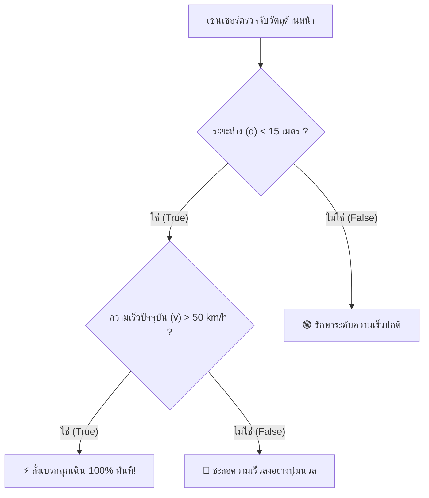
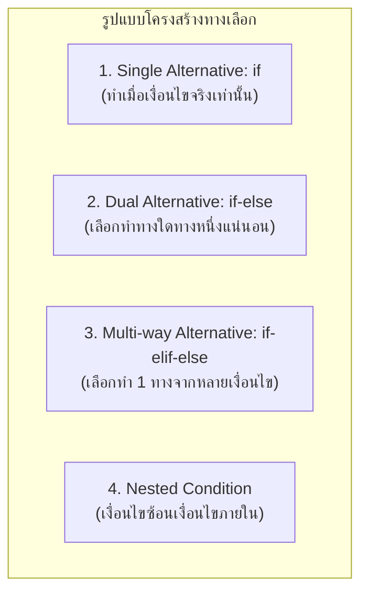

# วิทยาการคำนวณ 1: รากฐานแนวคิดเชิงคำนวณและการแก้ปัญหาอย่างเป็นระบบ
## บทที่ 6 โครงสร้างทางเลือกและการตัดสินใจแบบมีเงื่อนไข
**ผู้เขียน:** ผู้ช่วยศาสตราจารย์ ดร.ชีวะ ทัศนา • สาขาวิชาฟิสิกส์ คณะวิทยาศาสตร์และเทคโนโลยี มหาวิทยาลัยราชภัฏรำไพพรรณี

---

## 🎯 ผลลัพธ์การเรียนรู้ประจำบท (Behavioral Learning Outcomes)
เมื่อศึกษาบทเรียนนี้จบแล้ว ผู้เรียนสามารถ:
1. **อธิบาย (Explain)** กลไกการทำงานของโครงสร้างการควบคุมแบบมีเงื่อนไขในคอมพิวเตอร์
2. **ประเมินค่า (Evaluate)** นิพจน์เปรียบเทียบและนิพจน์ตรรกะแบบหลายชั้นได้อย่างถูกต้องแม่นยำ
3. **ออกแบบและเขียนโปรแกรม (Design & Code)** โครงสร้างทางเลือก `if`, `if-else`, `if-elif-else` และเงื่อนไขซ้อน (Nested Conditions) เพื่อแก้ปัญหาในสถานการณ์จริง
4. **ประยุกต์ใช้ (Apply)** โครงสร้างเงื่อนไขในการพัฒนาระบบควบคุมอัตโนมัติและระบบเตือนภัยอัจฉริยะ

---

## 🌌 6.0 เรื่องเล่าเปิดบทเรียน: วินาทีแห่งการตัดสินใจของยานยนต์ไร้คนขับ

เมื่อรถยนต์ขับเคลื่อนอัตโนมัติ (Autonomous Vehicle) แล่นอยู่บนท้องถนนด้วยความเร็ว 80 กิโลเมตรต่อชั่วโมง กล้องและเซนเซอร์ LiDAR จะส่งข้อมูลภาพหลายล้านจุดต่อวินาทีเข้าสู่สมองกลประมวลผล คอมพิวเตอร์ต้องทำการตัดสินใจในเสี้ยววินาที:



การตัดสินใจที่แม่นยำและรวดเร็วเช่นนี้ เกิดขึ้นจาก **โครงสร้างการควบคุมแบบมีเงื่อนไข (Conditional Control Structures)** ซึ่งเป็นกลไกที่ทำให้คอมพิวเตอร์สามารถ "คิดและเลือกปฏิบัติ" ได้อย่างชาญฉลาดตามสถานการณ์แวดล้อม

---

## ⚖️ 6.1 ตัวดำเนินการเปรียบเทียบและตรรกะ (Relational & Logical Operators)

### 1. ตัวดำเนินการเปรียบเทียบ (Relational Operators)
คืนค่าเป็นบูลีน `True` หรือ `False` เสมอ:

| ตัวดำเนินการ | ความหมาย | ตัวอย่าง | ผลลัพธ์ |
| :---: | :--- | :---: | :---: |
| `==` | เท่ากับ (Equal to) | `5 == 5` | `True` |
| `!=` | ไม่เท่ากับ (Not equal to) | `5 != 3` | `True` |
| `>` | มากกว่า (Greater than) | `10 > 20` | `False` |
| `<` | น้อยกว่า (Less than) | `10 < 20` | `True` |
| `>=` | มากกว่าหรือเท่ากับ (Greater than or equal) | `15 >= 15` | `True` |
| `<=` | น้อยกว่าหรือเท่ากับ (Less than or equal) | `12 <= 8` | `False` |

<div style="background: linear-gradient(135deg, #fef2f2, #fee2e2); border-left: 5px solid #ef4444; border-radius: 12px; padding: 18px 22px; margin: 20px 0; color: #7f1d1d;">
  <h4 style="color: #991b1b; margin-top: 0;">⚠️ ข้อผิดพลาดที่พบบ่อยมากที่สุดในมือใหม่!</h4>
  <p style="margin: 0; line-height: 1.75;">
    • เครื่องหมายเท่ากับอันเดียว (<code>=</code>) คือ <strong>การกำหนดค่าตัวแปร (Assignment)</strong> เช่น <code>x = 10</code><br>
    • เครื่องหมายเท่ากับคู่ (<code>==</code>) คือ <strong>การเปรียบเทียบค่าความเท่ากัน (Equality Comparison)</strong> เช่น <code>if x == 10:</code>
  </p>
</div>

---

## 🔀 6.2 สถาปัตยกรรมโครงสร้างทางเลือกใน Python



### ไวยากรณ์และการเยื้องหน้า (Indentation Syntax)
ในภาษา Python **การเยื้องหน้า 4 ช่องว่าง (4 Spaces Indentation)** มีความสำคัญอย่างยิ่ง เพราะเป็นการระบุขอบเขต (Block Scope) ของคำสั่งที่อยู่ภายใต้เงื่อนไข:

```python
# รูปแบบ if-elif-else มาตรฐาน
if condition_1:
    # คำสั่งที่ทำเมื่อ condition_1 เป็น True
    statement_block_1
elif condition_2:
    # คำสั่งที่ทำเมื่อ condition_1 เป็น False แต่ condition_2 เป็น True
    statement_block_2
else:
    # คำสั่งที่ทำเมื่อไม่มีเงื่อนไขใดเป็น True เลย
    statement_block_default
```

---

## 📝 6.3 ตัวอย่างโจทย์ประยุกต์: ระบบควบคุมโรงเรือนเกษตรอัจฉริยะ (Smart Greenhouse)

<div style="background: #ffffff; border: 1px solid #cbd5e1; border-radius: 14px; margin-bottom: 20px; overflow: hidden; box-shadow: 0 4px 12px rgba(0,0,0,0.05);">
  <div style="background: #f8fafc; padding: 14px 20px; border-bottom: 1px solid #e2e8f0; display: flex; align-items: center; justify-content: space-between;">
    <span style="font-weight: 700; color: #16a34a; font-size: 1.05em;">📝 ตัวอย่างที่ 6.1: ระบบตัดสินใจควบคุมสปริงเกอร์และพัดลมระบายอากาศ</span>
    <span style="background: #dcfce7; color: #15803d; font-size: 0.80em; font-weight: 700; padding: 3px 10px; border-radius: 20px;">เกษตรอัจฉริยะ IoT</span>
  </div>
  <div style="padding: 20px 24px; color: #334155; line-height: 1.8;">
    <p>
      <strong>เงื่อนไขการทำงาน:</strong>
      <br>1. หากอุณหภูมิ $Temp > 35^\circ\text{C}$ <strong>และ</strong> ความชื้นในดิน $Moisture < 40\%$ $\rightarrow$ <em>เปิดพัดลมระบายอากาศและเปิดสปริงเกอร์รดน้ำทันที</em>
      <br>2. หากอุณหภูมิ $Temp > 35^\circ\text{C}$ แต่ความชื้นในดินเพียงพอ $\rightarrow$ <em>เปิดเฉพาะพัดลมระบายอากาศ</em>
      <br>3. หากอุณหภูมิปกติ แต่ความชื้นในดิน $Moisture < 40\%$ $\rightarrow$ <em>เปิดเฉพาะสปริงเกอร์รดน้ำ</em>
      <br>4. กรณีอื่นๆ สภาพแวดล้อมเหมาะสม $\rightarrow$ <em>ปิดอุปกรณ์ทั้งหมด อยู่ในโหมดประหยัดพลังงาน</em>
    </p>
  </div>
</div>

---

## 💻 6.4 โค้ดคอมพิวเตอร์ Python จำลองระบบควบคุมโรงเรือน

```python
# smart_greenhouse_controller.py
# โปรแกรมจำลองระบบควบคุมสภาพแวดล้อมโรงเรือนเกษตรอัจฉริยะ
# ผู้เขียน: ผศ.ดร.ชีวะ ทัศนา (มรภ.รำไพพรรณี)

def evaluate_greenhouse_environment(temperature_celsius: float, soil_moisture_percent: float) -> dict:
    """ประเมินสถานะและสั่งการอุปกรณ์ควบคุมอัตโนมัติ"""
    fan_status = False
    sprinkler_status = False
    alert_message = ""
    
    if temperature_celsius > 35.0 and soil_moisture_percent < 40.0:
        fan_status = True
        sprinkler_status = True
        alert_message = "🔥 วิกฤต: อุณหภูมิสูงจัดและดินแห้งแล้ง รดน้ำและระบายความร้อนเต็มกำลัง!"
    elif temperature_celsius > 35.0:
        fan_status = True
        sprinkler_status = False
        alert_message = "☀️ อุณหภูมิสูง: เปิดพัดลมระบายความร้อน"
    elif soil_moisture_percent < 40.0:
        fan_status = False
        sprinkler_status = True
        alert_message = "💧 ดินแห้ง: เปิดระบบสปริงเกอร์พ่นละอองน้ำ"
    else:
        fan_status = False
        sprinkler_status = False
        alert_message = "🌱 สภาพแวดล้อมเหมาะสม: ระบบทำงานในโหมดประหยัดพลังงาน"
        
    return {
        "fan": "ON" if fan_status else "OFF",
        "sprinkler": "ON" if sprinkler_status else "OFF",
        "message": alert_message
    }

def main():
    print("=" * 65)
    print("🌿 ระบบควบคุมโรงเรือนเกษตรอัจฉริยะ (Smart Greenhouse Controller)")
    print("=" * 65)
    
    # ชุดข้อมูลทดสอบ 4 สถานการณ์
    test_cases = [
        {"name": "ช่วงเที่ยงวันแดดจัดแล้ง", "temp": 38.5, "moisture": 25.0},
        {"name": "ช่วงบ่ายลมร้อนดินชุ่ม", "temp": 36.2, "moisture": 65.0},
        {"name": "ช่วงเช้าอากาศเย็นแต่ดินแห้ง", "temp": 28.0, "moisture": 32.0},
        {"name": "ช่วงเย็นสภาพอากาศสมบูรณ์", "temp": 29.5, "moisture": 55.0},
    ]
    
    for case in test_cases:
        result = evaluate_greenhouse_environment(case["temp"], case["moisture"])
        print(f"\n📊 กรณี: {case['name']}")
        print(f"   • เซนเซอร์: อุณหภูมิ {case['temp']:.1f}°C | ความชื้นดิน {case['moisture']:.1f}%")
        print(f"   • สถานะพัดลม:    [{result['fan']}]")
        print(f"   • สถานะสปริงเกอร์: [{result['sprinkler']}]")
        print(f"   • ข้อความระบบ:    {result['message']}")
        
    print("\n" + "=" * 65)

if __name__ == "__main__":
    main()
```

---

## 💡 6.5 สรุปใจความสำคัญและแบบฝึกหัดท้ายบทที่ 6

### 📌 สรุปประเด็นสำคัญ
1. โครงสร้างเงื่อนไขทำให้โปรแกรมมีความยืดหยุ่นและปรับพฤติกรรมได้ตามข้อมูลนำเข้า
2. การใช้ `if-elif-else` มีประสิทธิภาพสูงกว่าการเขียน `if` เดี่ยวๆ หลายตัวติดกัน เพราะคอมพิวเตอร์จะหยุดตรวจสอบทันทีที่เจอเงื่อนไขที่เป็นจริงเงื่อนไขแรก
3. ควรระมัดระวังการเปรียบเทียบ `==` และการเยื้องหน้า 4 ช่องว่าง

---

### 📝 แบบฝึกหัดทบทวน 3 ระดับ (Exercises)

#### ระดับที่ 1: ความรู้ความเข้าใจพื้นฐาน (Basic Knowledge)
1. จงระบุผลลัพธ์ของโค้ดต่อไปนี้:
```python
x = 15
if x > 20:
    print("A")
elif x > 10:
    print("B")
elif x > 5:
    print("C")
else:
    print("D")
```
2. จงแปลงเงื่อนไขทางคณิตศาสตร์ $10 \le score \le 20$ ให้อยู่ในรูปนิพจน์ภาษา Python ที่ถูกต้อง

#### ระดับที่ 2: การวิเคราะห์และประยุกต์ใช้ (Analytical Application)
3. จงเขียนโปรแกรมรับค่าน้ำหนักพัสดุ (กิโลกรัม) และคำนวณค่าจัดส่งตามตารางอัตราก้าวหน้า:
   * น้ำหนักไม่เกิน 1 kg: 40 บาท
   * น้ำหนักเกิน 1 kg แต่ไม่เกิน 5 kg: 70 บาท
   * น้ำหนักเกิน 5 kg แต่ไม่เกิน 10 kg: 120 บาท
   * น้ำหนักเกิน 10 kg ขึ้นไป: 120 บาท + กิโลกรัมละ 20 บาทส่วนที่เกิน

#### ระดับที่ 3: การคิดขั้นสูงและบูรณาการ (Advanced Synthesis)
4. จงเขียนโปรแกรมตรวจสอบว่าปี พ.ศ. หรือ ค.ศ. ที่รับเข้ามาเป็น **"ปีอธิกสุรทิน (Leap Year)"** หรือไม่ โดยมีกฎทางดาราศาสตร์คือ:
   * ปี ค.ศ. ที่หารด้วย 4 ลงตัว เป็นปีอธิกสุรทิน
   * **ยกเว้น** ปีที่หารด้วย 100 ลงตัว จะไม่เป็นปีอธิกสุรทิน
   * **แต่ถ้า** ปีนั้นหารด้วย 400 ลงตัว จะกลับมาเป็นปีอธิกสุรทินอีกครั้ง
