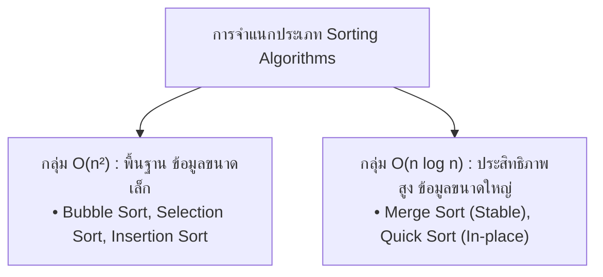

# วิทยาการคำนวณ 1 รากฐานการคิดเชิงคำนวณและการแก้ปัญหาเชิงตรรกะ
## บทที่ 6 ขั้นตอนวิธีการจัดเรียงข้อมูลและการวิเคราะห์ความซับซ้อน (Sorting & Big-O Complexity)
**ผู้เขียน** ผู้ช่วยศาสตราจารย์ ดร.ชีวะ ทัศนา • สาขาวิชาฟิสิกส์ คณะวิทยาศาสตร์และเทคโนโลยี มหาวิทยาลัยราชภัฏรำไพพรรณี

---

## 📋 แผนบริหารการสอนประจำบทที่ 6

### หัวข้อเนื้อหาประจำบท
1. ความสำคัญของการจัดเรียงข้อมูลในระบบคอมพิวเตอร์
2. อัลกอริทึมพื้นฐาน: Bubble Sort, Selection Sort, Insertion Sort ($O(n^2)$)
3. อัลกอริทึมขั้นสูง: Merge Sort, Quick Sort ($O(n \log n)$)
4. การพิสูจน์ขอบเขตล่างของการจัดเรียงแบบเปรียบเทียบ $\Omega(n \log n)$
5. ความเสถียรของการจัดเรียง (Sorting Stability) และการใช้หน่วยความจำในที่เดิม (In-place Sorting)

### วัตถุประสงค์เชิงพฤติกรรม
เมื่อศึกษาบทเรียนนี้จบแล้ว ผู้เรียนสามารถ
1. อธิบายและจำลองขั้นตอนการทำงานของ Bubble, Insertion, Merge, และ Quick Sort ได้
2. เปรียบเทียบความซับซ้อนเชิงเวลาใน Best, Average, และ Worst Cases ของแต่ละอัลกอริทึมได้
3. เขียนโปรแกรมภาษา Python เพื่อจัดเรียงข้อมูลและวัดประสิทธิภาพเชิงประจักษ์ได้
4. เลือกใช้อัลกอริทึมการจัดเรียงที่เหมาะสมกับขนาดและลักษณะของข้อมูลได้

### กิจกรรมการเรียนการสอน
1. การบรรยายเชิงวิชาการและการเชื่อมโยงบริบทประวัติศาสตร์วิทยาการคำนวณ
2. การสาธิตการวิเคราะห์คณิตศาสตร์ การจัดสรรหน่วยความจำ และโครงสร้างข้อมูล
3. การฝึกปฏิบัติการจำลองเสมือนจริง 2D Canvas และ 3D AR MediaPipe Hands
4. การเขียนโปรแกรมภาษา Python 3.11 และการทดสอบ Assertion Tests เชิงประจักษ์

### สื่อการเรียนการสอน
1. ตำราเรียนวิชาการ "วิทยาการคำนวณ 1 รากฐานการคิดเชิงคำนวณและการแก้ปัญหาเชิงตรรกะ"
2. ชุดห้องปฏิบัติการเสมือนจริง Hybrid 2D/3D บนระบบ RBRU MOOC
3. สไลด์บรรยายอิเล็กทรอนิกส์และแผนภาพเวกเตอร์มัลติมีเดีย

### การวัดและประเมินผล
1. การประเมินผลการทำใบงานและตารางบันทึกผลการทดลองเสมือนจริง (40%)
2. การประเมินผลงานการเขียนโค้ดภาษา Python และ Unit Test Assertions (30%)
3. การทดสอบวัดผลสัมฤทธิ์ทางการเรียนท้ายบท 3 ระดับ (30%)

---

## 🌌 6.0 เรื่องเล่าเปิดบทเรียนและบริบททางประวัติศาสตร์

ในคริสต์ศักราช 1945 จอห์น ฟอน นอยมันน์ ได้คิดค้นขั้นตอนวิธี **Merge Sort** ซึ่งเป็นอัลกอริทึมการจัดเรียงข้อมูลแบบแบ่งแยกและเอาชนะตัวแรกของโลก ต่อมาในปี 1959 เซอร์ โทนี ฮอร์ (Sir Charles Antony Richard Hoare, 1934—ปัจจุบัน) นักวิทยาการคอมพิวเตอร์ชาวอังกฤษ ได้คิดค้น **Quick Sort** ซึ่งเป็นอัลกอริทึมการจัดเรียงที่ได้รับความนิยมสูงสุดในระบบปฏิบัติการและไลบรารีมาตรฐานทั่วโลกตราบจนปัจจุบัน

---

## 📐 6.1 ทฤษฎีและรากฐานทางคณิตศาสตร์เชิงลึก

### การพิสูจน์ขอบเขตล่างของการจัดเรียงแบบเปรียบเทียบ (Comparison Sort Lower Bound)
การจัดเรียงข้อมูล $n$ ตัว สามารถมองเป็นต้นไม้การตัดสินใจ (Decision Tree) ที่มีใบไม้แทนการเรียงสับเปลี่ยนที่เป็นไปได้ทั้งหมด $n!$ แบบ:
ความสูงของต้นไม้การตัดสินใจ $h$ คือจำนวนครั้งการเปรียบเทียบที่น้อยที่สุดในกรณีแย่ที่สุด:
$$2^h \ge n! \implies h \ge \log_2(n!)$$

จากสูตรการประมาณค่าของสเตอร์ลิง (Stirling's Approximation): $\ln(n!) \approx n \ln n - n$
$$\log_2(n!) = \Theta(n \log n)$$
ดังนั้น ไม่มีอัลกอริทึมการจัดเรียงแบบเปรียบเทียบใดๆ ในโลกที่ทำได้เร็วกว่า $\Omega(n \log n)$ ในกรณีแย่ที่สุด!



---

## 🧮 6.2 ตัวอย่างการวิเคราะห์และการคำนวณเชิงขั้นตอน (Worked Examples)

#### ตัวอย่างที่ 6.1 การจำลองขั้นตอนของ Insertion Sort
กำหนดให้อาเรย์ $A = [5, 2, 4, 6, 1, 3]$ จงแสดงสถานะของอาเรย์หลังจบรอบที่ $i = 1, 2, 3$:

**วิธีทำ:**
* **เริ่มต้น:** $[5, 2, 4, 6, 1, 3]$
* **รอบที่ 1 ($key=2$):** แทรก 2 หน้า 5 $\implies [2, 5, 4, 6, 1, 3]$
* **รอบที่ 2 ($key=4$):** แทรก 4 ระหว่าง 2 และ 5 $\implies [2, 4, 5, 6, 1, 3]$
* **รอบที่ 3 ($key=6$):** 6 มากกว่า 5 อยู่ตำแหน่งเดิม $\implies [2, 4, 5, 6, 1, 3]$
* **รอบที่ 4 ($key=1$):** แทรก 1 หน้าสุด $\implies [1, 2, 4, 5, 6, 3]$
* **รอบที่ 5 ($key=3$):** แทรก 3 ระหว่าง 2 และ 4 $\implies [1, 2, 3, 4, 5, 6]$ **(จัดเรียงสมบูรณ์)**

---

## 💻 6.3 การเขียนโปรแกรมและการนำไปใช้จริงด้วย Python 3.11

```python
# sorting_algorithms_benchmark.py
import time, random
from typing import List

def quick_sort(arr: List[int]) -> List[int]:
    """Quick Sort O(N log N) Implementation"""
    if len(arr) <= 1:
        return arr
    pivot = arr[len(arr) // 2]
    left = [x for x in arr if x < pivot]
    middle = [x for x in arr if x == pivot]
    right = [x for x in arr if x > pivot]
    return quick_sort(left) + middle + quick_sort(right)

def bubble_sort(arr: List[int]) -> List[int]:
    """Bubble Sort O(N^2) Implementation"""
    a = arr.copy()
    n = len(a)
    for i in range(n):
        swapped = False
        for j in range(0, n - i - 1):
            if a[j] > a[j+1]:
                a[j], a[j+1] = a[j+1], a[j]
                swapped = True
        if not swapped:
            break
    return a

if __name__ == "__main__":
    test_data = [random.randint(1, 1000) for _ in range(1000)]
    t0 = time.perf_counter()
    _ = quick_sort(test_data)
    t_quick = time.perf_counter() - t0
    
    t0 = time.perf_counter()
    _ = bubble_sort(test_data)
    t_bubble = time.perf_counter() - t0
    
    print(f"Quick Sort (1000 items): {t_quick:.6f} s")
    print(f"Bubble Sort (1000 items): {t_bubble:.6f} s (ช้ากว่า {(t_bubble/t_quick):.1f} เท่า)")
    assert quick_sort([3, 1, 2]) == [1, 2, 3], "Test Passed!"
```

---

## 🔬 6.4 คู่มือห้องปฏิบัติการเสมือนจริง 2D/3D AR MediaPipe Hands

ผู้เรียนสามารถเข้าสู่ชุดจำลองเสมือนจริง 2D/3D เพื่อทดลองประลองความเร็วของอัลกอริทึมจัดเรียงได้ที่ [chapter06_sorting_arena.html](https://tsanaphy2023.github.io/computing-science/simulators/chapter06_sorting_arena.html)

---

## 💡 6.5 สรุปสารัตถะสำคัญประจำบท (Chapter Summary)

1. อัลกอริทึม $O(n^2)$ เหมาะกับข้อมูลขนาดเล็กและโค้ดที่ต้องการความเรียบง่าย
2. Merge Sort และ Quick Sort เป็นตัวเลือกหลักในการประมวลผลข้อมูลขนาดใหญ่ด้วยประสิทธิภาพ $O(n \log n)$

---

## ❓ 6.6 แบบฝึกหัดและคำถามท้ายบทเพื่อการประเมินผล (3-Tier Assessment)

1. จงอธิบายความหมายของ "Stable Sorting" และเหตุใดจึงสำคัญในการจัดเรียงฐานข้อมูลหลายคอลัมน์
2. ให้นักเรียนวิเคราะห์ Worst Case ของ Quick Sort ว่าเกิดขึ้นเมื่อใด และมีวิธีป้องกันอย่างไร?

---

## 📚 เอกสารอ้างอิงประจำบท (APA 7th Edition References)

* Hoare, C. A. R. (1962). Quicksort. *The Computer Journal*, 5(1), 10-15.
* Sedgewick, R. (1978). Implementing Quicksort programs. *Communications of the ACM*, 21(10), 847-857.
