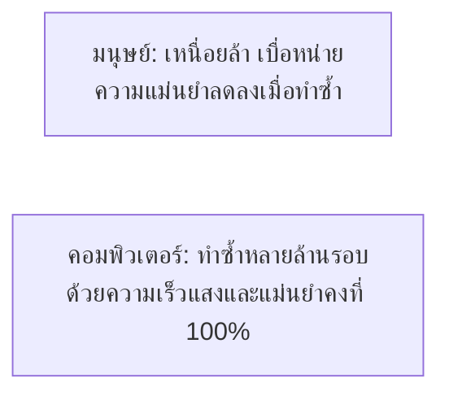
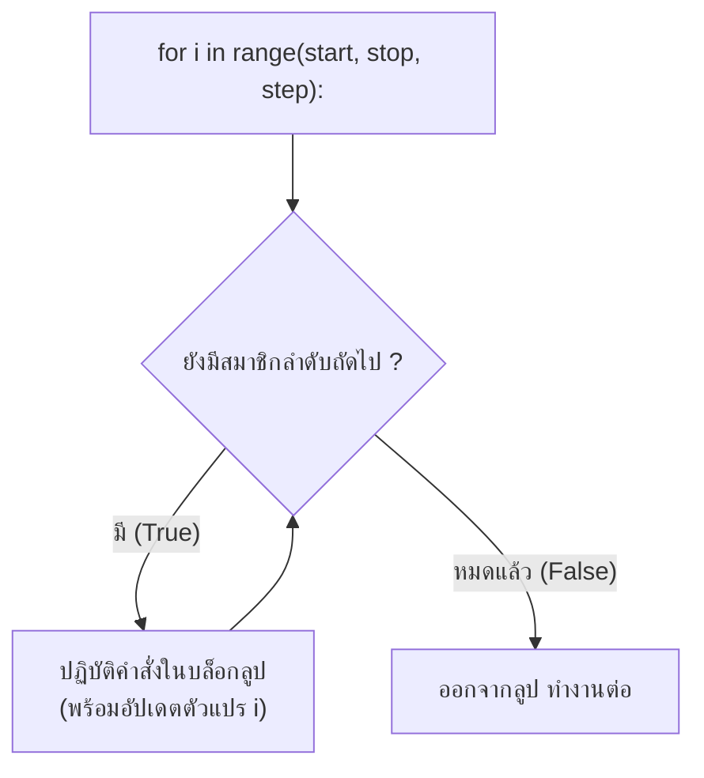
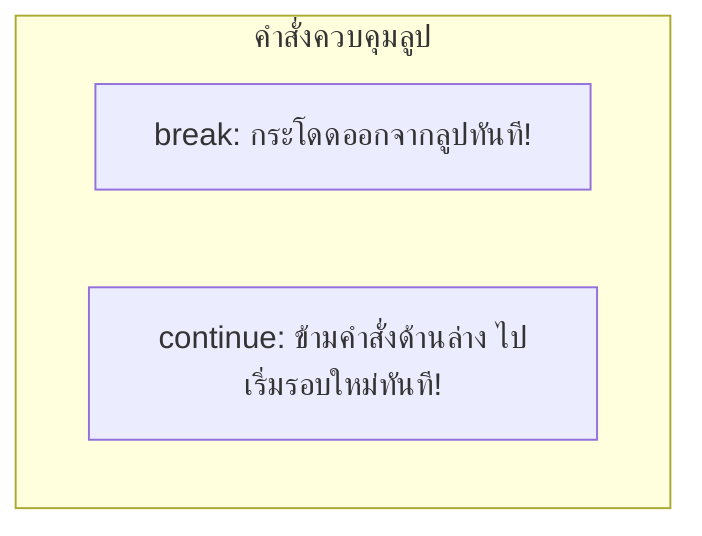

# วิทยาการคำนวณ 1: รากฐานแนวคิดเชิงคำนวณและการแก้ปัญหาอย่างเป็นระบบ
## บทที่ 7 โครงสร้างการทำงานซ้ำและการวนลูป
**ผู้เขียน:** ผู้ช่วยศาสตราจารย์ ดร.ชีวะ ทัศนา • สาขาวิชาฟิสิกส์ คณะวิทยาศาสตร์และเทคโนโลยี มหาวิทยาลัยราชภัฏรำไพพรรณี

---

## 🎯 ผลลัพธ์การเรียนรู้ประจำบท (Behavioral Learning Outcomes)
เมื่อศึกษาบทเรียนนี้จบแล้ว ผู้เรียนสามารถ:
1. **อธิบาย (Explain)** ความแตกต่างและหลักการเลือกระหว่างการวนซ้ำที่ทราบจำนวนรอบแน่นอน (`for`) และการวนซ้ำตามเงื่อนไข (`while`)
2. **ประยุกต์ใช้ (Apply)** ฟังก์ชัน `range()` ในการสร้างลำดับตัวเลขทั้งแบบนับเพิ่ม นับลด และการข้ามช่วง
3. **ควบคุมทิศทางการวนลูป (Control Loop Flow)** ด้วยคำสั่ง `break` และ `continue` ได้อย่างมีประสิทธิภาพและป้องกันปัญหาลูปไม่รู้จบ (Infinite Loop)
4. **พัฒนาโปรแกรม (Develop Python Programs)** เพื่อคำนวณผลรวมอนุกรมทางคณิตศาสตร์ แฟกทอเรียล และการจำลองข้อมูลทางวิทยาศาสตร์

---

## 🌌 7.0 เรื่องเล่าเปิดบทเรียน: พลังแห่งการทำซ้ำล้านครั้งในเสี้ยววินาที

หากขอให้มนุษย์บวกเลข $1 + 2 + 3 + ... + 1,000,000$ ด้วยมือเปล่า เราอาจต้องใช้เวลาหลายสัปดาห์และมีความเป็นไปได้สูงมากที่จะบวกเลขผิดพลาด แต่สำหรับไมโครโปรเซสเซอร์ในคอมพิวเตอร์ การคำนวณซ้ำแบบนี้ 1 ล้านรอบ ใช้เวลาเพียง **ไม่ถึง 0.005 วินาที** และมีความแม่นยำ 100%



พลังที่แท้จริงของวิทยาการคอมพิวเตอร์จึงอยู่ที่ **โครงสร้างการทำงานซ้ำ (Iteration / Loop Structure)** ซึ่งช่วยลดการเขียนโค้ดที่ซ้ำซ้อนจากหลายพันบรรทัดให้เหลือเพียงไม่กี่บรรทัดได้อย่างน่าอัศจรรย์

---

## 🔄 7.1 การวนซ้ำด้วย for loop และฟังก์ชัน range()

ใช้เมื่อ **ทราบจำนวนรอบของการวนซ้ำที่แน่นอนล่วงหน้า (Definite Loop)**



### ฟังก์ชัน `range(start, stop, step)`:
* `range(5)` $\rightarrow$ สร้างลำดับ `0, 1, 2, 3, 4` (เริ่มต้นที่ 0 และสิ้นสุดก่อน 5 เสมอ)
* `range(1, 11)` $\rightarrow$ สร้างลำดับ `1, 2, 3, ..., 10`
* `range(2, 21, 2)` $\rightarrow$ สร้างลำดับเลขคู่ `2, 4, 6, ..., 20`
* `range(10, 0, -1)` $\rightarrow$ นับถอยหลัง `10, 9, 8, ..., 1`

---

## 🔁 7.2 การวนซ้ำด้วย while loop และการป้องกันลูปไม่รู้จบ

ใช้เมื่อ **ไม่ทราบจำนวนรอบที่แน่นอน แต่ต้องการให้ทำซ้ำไปเรื่อยๆ ตราบใดที่เงื่อนไขยังเป็นจริง (Indefinite Loop)**

```python
# รูปแบบ while loop มาตรฐาน
count = 1                  # 1. กำหนดค่าเริ่มต้นตัวนับ
while count <= 5:          # 2. ตรวจสอบเงื่อนไข
    print("นับรอบที่:", count)
    count += 1             # 3. สำคัญมาก! ต้องมีการอัปเดตค่าเพื่อไม่ให้เกิด Infinite Loop
```

<div style="background: linear-gradient(135deg, #fef2f2, #fee2e2); border-left: 5px solid #ef4444; border-radius: 12px; padding: 18px 22px; margin: 20px 0; color: #7f1d1d;">
  <h4 style="color: #991b1b; margin-top: 0;">🛑 ข้อควรระวัง: ปัญหาลูปไม่รู้จบ (Infinite Loop)</h4>
  <p style="margin: 0; line-height: 1.75;">
    หากเงื่อนไขของ <code>while</code> เป็น <code>True</code> เสมอ และไม่มีคำสั่งอัปเดตตัวแปรหรือคำสั่ง <code>break</code> โปรแกรมจะทำงานค้างและกินทรัพยากร CPU 100% (สามารถหยุดการทำงานได้ด้วยการกด <code>Ctrl + C</code> ในเทอร์มินัล)
  </p>
</div>

---

## ⚡ 7.3 คำสั่งควบคุมพิเศษ: break และ continue

* **`break`**: สั่ง **ยกเลิกและออกจากลูปทันที** โดยไม่สนใจเงื่อนไขหรือรอบที่เหลือ
* **`continue`**: สั่ง **ข้ามการทำงานที่เหลือในรอบปัจจุบัน** แล้วกระโดดไปเริ่มรอบถัดไปทันที



---

## 📝 7.4 ตัวอย่างโจทย์คำนวณ: การหาค่าแฟกทอเรียลและการตรวจจำนวนเฉพาะ

<div style="background: #ffffff; border: 1px solid #cbd5e1; border-radius: 14px; margin-bottom: 20px; overflow: hidden; box-shadow: 0 4px 12px rgba(0,0,0,0.05);">
  <div style="background: #f8fafc; padding: 14px 20px; border-bottom: 1px solid #e2e8f0; display: flex; align-items: center; justify-content: space-between;">
    <span style="font-weight: 700; color: #7c3aed; font-size: 1.05em;">📝 ตัวอย่างที่ 7.1: การคำนวณค่า $N!$ (Factorial) และผลรวมอนุกรม</span>
    <span style="background: #ede9fe; color: #6d28d9; font-size: 0.80em; font-weight: 700; padding: 3px 10px; border-radius: 20px;">คณิตศาสตร์เชิงคำนวณ</span>
  </div>
  <div style="padding: 20px 24px; color: #334155; line-height: 1.8;">
    <p>
      <strong>นิยาม:</strong> $N! = 1 \times 2 \times 3 \times ... \times N$ (โดย $0! = 1$)
    </p>
    <p><strong>ตัวอย่างการคำนวณ $5!$:</strong> $5! = 1 \times 2 \times 3 \times 4 \times 5 = 120$</p>
  </div>
</div>

---

## 💻 7.5 โค้ดคอมพิวเตอร์ Python สมบูรณ์แบบ

```python
# loop_math_and_prime_checker.py
# โปรแกรมคำนวณอนุกรม แฟกทอเรียล และตรวจสอบจำนวนเฉพาะ
# ผู้เขียน: ผศ.ดร.ชีวะ ทัศนา (มรภ.รำไพพรรณี)

def calculate_factorial(n: int) -> int:
    """คำนวณค่าแฟกทอเรียล n! ด้วย for loop"""
    if n < 0:
        raise ValueError("แฟกทอเรียลไม่นิยามสำหรับจำนวนลบ")
    result = 1
    for i in range(1, n + 1):
        result *= i
    return result

def is_prime(number: int) -> bool:
    """ตรวจสอบว่าตัวเลขเป็นจำนวนเฉพาะหรือไม่ด้วยการวนลูปทดสอบตัวหาร"""
    if number <= 1:
        return False
    if number == 2:
        return True
    if number % 2 == 0:
        return False
        
    # ตรวจสอบตัวหารที่เป็นเลขคี่ตั้งแต่ 3 ถึง sqrt(number)
    limit = int(number ** 0.5) + 1
    for d in range(3, limit, 2):
        if number % d == 0:
            return False
    return True

def main():
    print("=" * 65)
    print("🔢 โปรแกรมคำนวณแฟกทอเรียลและค้นหาจำนวนเฉพาะ")
    print("=" * 65)
    
    # 1. ทดสอบคำนวณแฟกทอเรียล
    test_n = 6
    fact_val = calculate_factorial(test_n)
    print(f"📌 ค่าของ {test_n}! = {fact_val:,}")
    
    # 2. ค้นหาจำนวนเฉพาะในช่วง 1 ถึง 50
    print("\n🔍 รายการจำนวนเฉพาะในช่วง 1 ถึง 50:")
    prime_list = []
    for num in range(1, 51):
        if is_prime(num):
            prime_list.append(num)
            
    print("   " + ", ".join(map(str, prime_list)))
    print(f"📊 พบจำนวนเฉพาะทั้งหมด: {len(prime_list)} จำนวน")
    print("=" * 65)

if __name__ == "__main__":
    main()
```

---

## 💡 7.6 สรุปใจความสำคัญและแบบฝึกหัดท้ายบทที่ 7

### 📌 สรุปประเด็นสำคัญ
1. ใช้ `for loop` เมื่อทราบจำนวนรอบ และใช้ `while loop` เมื่อต้องการวนซ้ำตามเงื่อนไข
2. ฟังก์ชัน `range(start, stop, step)` มีค่าสิ้นสุดก่อน `stop` เสมอ
3. การตรวจสอบจำนวนเฉพาะที่มีประสิทธิภาพ สามารถวนลูปตรวจสอบตัวหารได้ถึงเพียง $\sqrt{N}$

---

### 📝 แบบฝึกหัดทบทวน 3 ระดับ (Exercises)

#### ระดับที่ 1: ความรู้ความเข้าใจพื้นฐาน (Basic Knowledge)
1. จงระบุว่าโค้ดต่อไปนี้จะพิมพ์คำว่า `"Hello"` กี่ครั้ง:
```python
for i in range(1, 10, 2):
    print("Hello")
```
2. จงระบุผลลัพธ์ของโค้ดต่อไปนี้:
```python
total = 0
for i in range(1, 6):
    if i == 3:
        continue
    total += i
print(total)
```

#### ระดับที่ 2: การวิเคราะห์และประยุกต์ใช้ (Analytical Application)
3. จงเขียนโปรแกรม Python แสดง **ตารางแม่สูตรคูณ (Multiplication Table)** แม่ 2 ถึง แม่ 12 ด้วยการใช้ Nested Loop (ลูปซ้อนลูป)

#### ระดับที่ 3: การคิดขั้นสูงและบูรณาการ (Advanced Synthesis)
4. จงเขียนโปรแกรมจำลอง **เกมทายตัวเลขปริศนา (Number Guessing Game)** โดยให้คอมพิวเตอร์สุ่มตัวเลขจำนวนเต็ม $1-100$ แล้วให้ผู้ใช้ทายตัวเลขผ่าน `while loop` พร้อมบอกใบ้ว่า *"มากเกินไป"* หรือ *"น้อยเกินไป"* และสรุปจำนวนครั้งที่ทายเมื่อทายถูกต้อง
