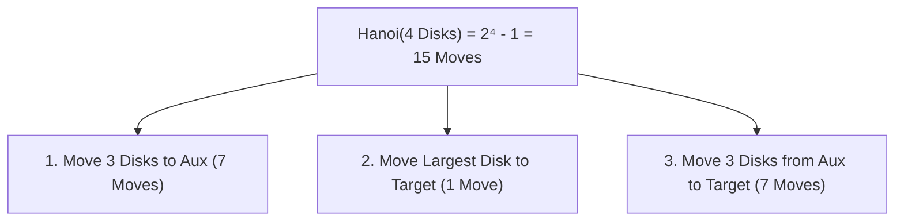

# วิทยาการคำนวณ 1 รากฐานการคิดเชิงคำนวณและการแก้ปัญหาเชิงตรรกะ
## บทที่ 7 การเขียนโปรแกรมเชิงโมดูลและฟังก์ชันเรียกซ้ำ
**ผู้เขียน** ผู้ช่วยศาสตราจารย์ ดร.ชีวะ ทัศนา • สาขาวิชาฟิสิกส์ คณะวิทยาศาสตร์และเทคโนโลยี มหาวิทยาลัยราชภัฏรำไพพรรณี

---

## 📋 แผนบริหารการสอนประจำบทที่ 7

### หัวข้อเนื้อหาประจำบท
1. แนวคิดและประโยชน์ของการเขียนโปรแกรมเชิงโมดูล (Modular Design)
2. โครงสร้างของฟังก์ชันเรียกซ้ำ: กรณีฐาน (Base Case) และกรณีเรียกซ้ำ (Recursive Case)
3. สถาปัตยกรรมหน่วยความจำ Call Stack และสภาวะ Stack Overflow
4. การแก้ปัญหาหอคอยแห่งฮานอย (Tower of Hanoi) และลำดับฟีโบนัชชี
5. เทคนิค Memoization และ Dynamic Programming เบื้องต้น

### วัตถุประสงค์เชิงพฤติกรรม
เมื่อศึกษาบทเรียนนี้จบแล้ว ผู้เรียนสามารถ
1. อธิบายการทำงานของ Call Stack เมื่อมีการเรียกฟังก์ชันซ้อนและฟังก์ชันเรียกซ้ำได้
2. ออกแบบฟังก์ชันเรียกซ้ำที่มี Base Case และ Recursive Case ที่ถูกต้องได้
3. แก้ปัญหาคณิตศาสตร์คลาสสิก (แฟกทอเรียล, ฟีโบนัชชี, หอคอยแห่งฮานอย) ด้วย Recursion ได้
4. วิเคราะห์และป้องกันข้อผิดพลาด Infinite Recursion และ Stack Overflow ได้

### กิจกรรมการเรียนการสอน
1. การบรรยายเชิงวิชาการและการเชื่อมโยงบริบทประวัติศาสตร์วิทยาการคำนวณ
2. การสาธิตการวิเคราะห์คณิตศาสตร์ การจัดสรรหน่วยความจำ และโครงสร้างข้อมูล
3. การฝึกปฏิบัติการจำลองเสมือนจริง 2D Canvas และ 3D AR MediaPipe Hands
4. การเขียนโปรแกรมภาษา Python 3.11 และการทดสอบ Assertion Tests เชิงประจักษ์

### สื่อการเรียนการสอน
1. ตำราเรียนวิชาการ วิทยาการคำนวณ 1 รากฐานการคิดเชิงคำนวณและการแก้ปัญหาเชิงตรรกะ
2. ชุดห้องปฏิบัติการเสมือนจริง Hybrid 2D/3D บนระบบ RBRU MOOC
3. สไลด์บรรยายอิเล็กทรอนิกส์และแผนภาพเวกเตอร์มัลติมีเดีย

### การวัดและประเมินผล
1. การประเมินผลการทำใบงานและตารางบันทึกผลการทดลองเสมือนจริง (40%)
2. การประเมินผลงานการเขียนโค้ดภาษา Python และ Unit Test Assertions (30%)
3. การทดสอบวัดผลสัมฤทธิ์ทางการเรียนท้ายบท 3 ระดับ (30%)

---

## 🌌 7.0 เรื่องเล่าเปิดบทเรียนและบริบททางประวัติศาสตร์

ในคริสต์ศักราช 1883 เอดัวร์ ลูว์กา (Édouard Lucas, 1842—1891) นักคณิตศาสตร์ชาวฝรั่งเศส ได้คิดค้นปริศนาคณิตศาสตร์ **หอคอยแห่งฮานอย ** ซึ่งจำลองตำนานพระสงฆ์ในวัดแห่งพราหมณ์ที่ต้องย้ายจานทองคำ 64 ใบจากเสาต้นหนึ่งไปยังอีกต้นหนึ่ง โดยมีกฎเหล็กว่าห้ามวางจานขนาดใหญ่กว่าทับจานขนาดเล็กกว่า ปริศนานี้กลายเป็นตัวอย่างคลาสสิกในการสอนแนวคิดการเรียกซ้ำเชิงโมดูลในวิชาวิทยาการคอมพิวเตอร์ทั่วโลก

---

## 📐 7.1 ทฤษฎีและรากฐานทางคณิตศาสตร์เชิงลึก

### สมการความสัมพันธ์เวียนเกิดของหอคอยแห่งฮานอย
กำหนดให้ $T(n)$ คือจำนวนก้าวน้อยที่สุดในการย้ายจาน $n$ ใบ
1. ย้ายจาน $n-1$ ใบบนจากเสาต้นทางไปยังเสาพัก $\rightarrow T(n-1)$ ก้าว
2. ย้ายจานใบใหญ่สุดใบที่ $n$ จากเสาต้นทางไปยังเสาปลายทาง $\rightarrow 1$ ก้าว
3. ย้ายจาน $n-1$ ใบจากเสาพักไปยังเสาปลายทาง $\rightarrow T(n-1)$ ก้าว

จะได้สมการความสัมพันธ์เวียนเกิด
$$T(n) = 2T(n-1) + 1 \quad \text{โดยที่ } T(1) = 1$$

ทำการคลายสมการ (Telescoping):
$$T(n) = 2(2T(n-2) + 1) + 1 = 2^2 T(n-2) + 2 + 1$$
$$T(n) = 2^{n-1} T(1) + 2^{n-2} + \dots + 2^1 + 2^0$$
$$T(n) = \sum_{i=0}^{n-1} 2^i = 2^n - 1$$



---

## 🧮 7.2 ตัวอย่างการวิเคราะห์และการคำนวณเชิงขั้นตอน

#### ตัวอย่างที่ 7.1 การคำนวณจำนวนก้าวของหอคอยแห่งฮานอย
หากมีจาน $n = 64$ ใบ และพระสงฆ์ย้ายจานได้ 1 ใบต่อ 1 วินาที จงคำนวณว่าต้องใช้เวลากี่ปีในการย้ายจานครบ

**วิธีทำ**
1. คำนวณจำนวนก้าวทั้งหมด: $T(64) = 2^{64} - 1 \approx 1.84467 \times 10^{19}$ ก้าว
2. แปลงเวลาเป็นวินาที: $t = 1.84467 \times 10^{19}$ วินาที
3. ใน 1 ปี มี $365.25 \times 24 \times 3600 = 31,557,600$ วินาที
4. จำนวนปี $= \frac{1.84467 \times 10^{19}}{3.15576 \times 10^7} \approx 5.845 \times 10^{11}$ ปี
5. **สรุป** ต้องใช้เวลาประมาณ **584,500 ล้านปี** ซึ่งยาวนานกว่าอายุของจักรวาลปัจจุบัน (13,800 ล้านปี) ถึง 42 เท่า!

---

## 💻 7.3 การเขียนโปรแกรมและการนำไปใช้จริงด้วย Python 3.11

```python
# tower_of_hanoi_engine.py
from typing import List

move_history = []

def solve_hanoi(n: int, source: str, target: str, auxiliary: str):
    """ฟังก์ชันเรียกซ้ำแก้ปัญหาหอคอยแห่งฮานอย"""
    if n == 1:
        move_history.append(f"ย้ายจาน 1 จาก {source} ➔ {target}")
        return
    solve_hanoi(n - 1, source, auxiliary, target)
    move_history.append(f"ย้ายจาน {n} จาก {source} ➔ {target}")
    solve_hanoi(n - 1, auxiliary, target, source)

if __name__ == "__main__":
    n_disks = 4
    solve_hanoi(n_disks, "เสา A", "เสา C", "เสา B")
    print(f"การย้ายจาน {n_disks} ใบ (สูตร 2^{n_disks} - 1 = {2**n_disks - 1} ก้าว):")
    for i, step in enumerate(move_history, 1):
        print(f"ก้าวที่ {i:02d}: {step}")
    assert len(move_history) == 2**n_disks - 1, "จำนวนก้าวต้องตรงตามสูตร 2^n - 1"
    print("✅ Unit Test Assertions Passed 100%!")
```

---

## 🔬 7.4 คู่มือห้องปฏิบัติการเสมือนจริง 2D/3D AR MediaPipe Hands

ผู้เรียนสามารถเข้าสู่ห้องปฏิบัติการเสมือนจริง 2D/3D เพื่อทดลองย้ายจาน 3 มิติและสังเกต Call Stack ในอากาศได้ที่ [chapter07_recursion_hanoi.html](https://tsanaphy2023.github.io/computing-science/simulators/chapter07_recursion_hanoi.html)

---

## 💡 7.5 สรุปสารัตถะสำคัญประจำบท

1. ฟังก์ชันเรียกซ้ำต้องมี Base Case เสมอเพื่อป้องกัน Stack Overflow
2. ปัญหาเชิงโครงสร้างแบบแตกกิ่ง (เช่น Fibonacci, Hanoi) สามารถแก้ได้อย่างกระชับด้วย Recursion แต่ต้องระวังความซับซ้อนเชิงเวลา $O(2^n)$

---

## ❓ 7.6 แบบฝึกหัดและคำถามท้ายบทเพื่อการประเมินผล

1. จงอธิบายความแตกต่างระหว่าง Iteration (ลูป) และ Recursion (เรียกซ้ำ) ในแง่การใช้หน่วยความจำ
2. ให้นักเรียนเขียนฟังก์ชันหาเลขฟีโบนัชชีแบบมี Memoization (Cache) เพื่อลดความซับซ้อนจาก $O(2^n)$ เหลือ $O(n)$

---

## 📚 เอกสารอ้างอิงประจำบท

* Lucas, É. (1883). *Récréations mathématiques* (Vol. 3). Gauthier-Villars.
* Roberts, E. (2006). *Thinking Recursively with Java*. John Wiley & Sons.
