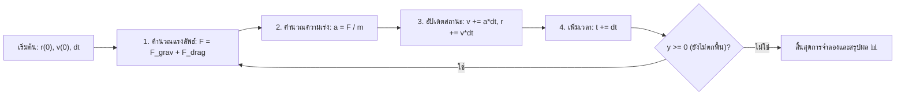

# วิทยาการคำนวณ 1 รากฐานการคิดเชิงคำนวณและการแก้ปัญหาเชิงตรรกะ
## บทที่ 8 วิทยาศาสตร์เชิงคำนวณและแบบจำลองฟิสิกส์ (Computational Science & Physics Simulation)
**ผู้เขียน** ผู้ช่วยศาสตราจารย์ ดร.ชีวะ ทัศนา • สาขาวิชาฟิสิกส์ คณะวิทยาศาสตร์และเทคโนโลยี มหาวิทยาลัยราชภัฏรำไพพรรณี

---

## 📋 แผนบริหารการสอนประจำบทที่ 8

### หัวข้อเนื้อหาประจำบท
1. วิทยาศาสตร์เชิงคำนวณในฐานะเสาหลักที่ 3 ของการแสวงหาความจริง (Theory, Experiment, Computation)
2. สมการเชิงอนุพันธ์สามัญและระเบียบวิธีเชิงตัวเลขของออยเลอร์ (Euler & Euler-Cromer Methods)
3. แบบจำลองกลศาสตร์นิวตัน: การตกอิสระ การเคลื่อนที่แบบโพรเจกไทล์ และแรงต้านอากาศ (Air Resistance Drag)
4. การจำลองเพนดูลัมและพฤติกรรมความอลวนไม่เชิงเส้น (Non-linear Pendulum & Chaos)
5. ระเบียบวิธีมอนเตการ์โล (Monte Carlo Simulations) และการประมาณค่าความน่าจะเป็นเชิงพื้นที่
6. การเขียนโปรแกรมจำลองฟิสิกส์ 2D/3D ด้วย Python 3.11 และ Matplotlib

### วัตถุประสงค์เชิงพฤติกรรม
เมื่อศึกษาบทเรียนนี้จบแล้ว ผู้เรียนสามารถ
1. อธิบายบทบาทของระเบียบวิธีเชิงตัวเลขในการแก้สมการฟิสิกส์ที่ไม่สามารถหาผลเฉลยแม่นตรงได้
2. พัฒนาอัลกอริทึมก้าวเวลา (Time-stepping Algorithm) ตามวิธีของออยเลอร์ได้อย่างถูกต้อง
3. คำนวณวิถีการเคลื่อนที่ของโพรเจกไทล์ภายใต้แรงโน้มถ่วงและแรงต้านอากาศได้
4. ประยุกต์ใช้วิธีมอนเตการ์โลในการประมาณค่าทางคณิตศาสตร์และวิเคราะห์ความคลาดเคลื่อนได้
5. เขียนโค้ดจำลองฟิสิกส์ภาษา Python พร้อมทั้งตรวจสอบผลลัพธ์ผ่าน Unit Assertion Tests ได้

---

## 🌌 8.0 เรื่องเล่าเปิดบทเรียนและบริบททางประวัติศาสตร์

ในคริสต์ศตวรรษที่ 17 เซอร์ ไอแซก นิวตัน (Sir Isaac Newton, 1643—1727) ได้ค้นพบกฎการเคลื่อนที่และแคลคูลัส ซึ่งทำให้นักวิทยาศาสตร์สามารถอธิบายการโคจรของดวงดาวและการเคลื่อนที่ของวัตถุได้ ทว่า ในโลกแห่งความเป็นจริง ปัญหาทางฟิสิกส์ส่วนใหญ่ เช่น การเคลื่อนที่ของวัตถุที่มีแรงต้านอากาศแปรผันตามความเร็วยกกำลังสอง หรือการเคลื่อนที่ของวัตถุ 3 ชิ้นภายใต้แรงโน้มถ่วง (Three-Body Problem) ล้วนไม่มีผลเฉลยในรูปสมการปิด (Non-analytical Solutions)

จนกระทั่งในคริสต์ศตวรรษที่ 18 เลออนฮาร์ด ออยเลอร์ (Leonhard Euler, 1707—1783) ได้บุกเบิกระเบียบวิธีเชิงตัวเลข (Numerical Methods) ซึ่งเปิดประตูสู่การคำนวณทีละก้าวเวลาสั้นๆ (Discrete Time Steps) ทำให้คอมพิวเตอร์ในยุคปัจจุบันสามารถจำลองพายุสุริยะ พลศาสตร์ของไหลในเครื่องบินเจ็ต และสภาพภูมิอากาศของโลกได้อย่างแม่นยำ

---

## 📐 8.1 ทฤษฎีและรากฐานทางคณิตศาสตร์เชิงลึก

### 1. ระเบียบวิธีเชิงตัวเลขของออยเลอร์ (Euler Numerical Integration)
กำหนดสมการการเคลื่อนที่ของนิวตัน $\vec{F} = m\vec{a} \implies \frac{d\vec{v}}{dt} = \frac{\vec{F}}{m}$ และ $\frac{d\vec{r}}{dt} = \vec{v}$
ใช้นิยามอนุพันธ์ในการประมาณค่าผลต่างไปข้างหน้า (Forward Difference):
$$\vec{v}(t + \Delta t) \approx \vec{v}(t) + \vec{a}(t) \cdot \Delta t$$
$$\vec{r}(t + \Delta t) \approx \vec{r}(t) + \vec{v}(t) \cdot \Delta t$$

สำหรับ **Euler-Cromer Method** ที่ให้ความเสถียรด้านพลังงานสูงกว่า จะใช้ความเร็วใหม่ในการอัปเดตตำแหน่ง:
$$\vec{v}_{n+1} = \vec{v}_n + \vec{a}_n \Delta t$$
$$\vec{r}_{n+1} = \vec{r}_n + \vec{v}_{n+1} \Delta t$$



### 2. ระเบียบวิธีมอนเตการ์โลในการหาค่า $\pi$ (Monte Carlo Integration)
พิจารณาจัตุรัสที่มีด้านยาว $2R$ บรรจุวงกลมรัศมี $R$ อยู่ภายใน:
* พื้นที่จัตุรัส $A_{\text{square}} = (2R)^2 = 4R^2$
* พื้นที่วงกลม $A_{\text{circle}} = \pi R^2$

อัตราส่วนของพื้นที่คือ:
$$\frac{A_{\text{circle}}}{A_{\text{square}}} = \frac{\pi R^2}{4R^2} = \frac{\pi}{4} \implies \pi = 4 \times \frac{A_{\text{circle}}}{A_{\text{square}}}$$

เมื่อสุ่มจุด $N$ จุดอย่างสม่ำเสมอลงในจัตุรัส และนับจำนวนจุด $N_{\text{inside}}$ ที่ตกอยู่ในวงกลม ($x^2 + y^2 \le R^2$):
$$\pi \approx 4 \times \frac{N_{\text{inside}}}{N}$$

---

## 🧮 8.2 ตัวอย่างการวิเคราะห์และการคำนวณเชิงขั้นตอน (Worked Examples)

#### ตัวอย่างที่ 8.1 การจำลองวิถีโพรเจกไทล์ด้วยวิธีออยเลอร์
ยิงวัตถุมวล $m = 1\text{ kg}$ ด้วยความเร็วต้น $u = 20\text{ m/s}$ มุม $\theta = 45^\circ$ ($g = 10\text{ m/s}^2$):
ความเร็วต้นในแต่ละแกน:
* $u_x = 20 \cos 45^\circ = 20 \times \frac{\sqrt{2}}{2} \approx 14.14\text{ m/s}$
* $u_y = 20 \sin 45^\circ = 20 \times \frac{\sqrt{2}}{2} \approx 14.14\text{ m/s}$

จงคำนวณตำแหน่งที่เวลา $t = 0.1, 0.2\text{ s}$ โดยใช้ขนาดก้าวเวลา $\Delta t = 0.1\text{ s}$:

**วิธีทำ:**
* **ที่ $t = 0.0\text{ s}$:** $x_0 = 0.0, y_0 = 0.0, v_x = 14.14, v_y = 14.14$
* **ก้าวที่ 1 ($t = 0.1\text{ s}$):**
  $$v_y(0.1) = v_y(0) - g \Delta t = 14.14 - (10)(0.1) = 13.14\text{ m/s}$$
  $$x(0.1) = x(0) + v_x \Delta t = 0 + (14.14)(0.1) = 1.414\text{ m}$$
  $$y(0.1) = y(0) + v_y(0) \Delta t = 0 + (14.14)(0.1) = 1.414\text{ m}$$
* **ก้าวที่ 2 ($t = 0.2\text{ s}$):**
  $$v_y(0.2) = 13.14 - (10)(0.1) = 12.14\text{ m/s}$$
  $$x(0.2) = 1.414 + (14.14)(0.1) = 2.828\text{ m}$$
  $$y(0.2) = 1.414 + (13.14)(0.1) = 2.728\text{ m}$$

---

## 💻 8.3 การเขียนโปรแกรมและการนำไปใช้จริงด้วย Python 3.11

```python
# physics_computational_sim.py
import math, random
from typing import Tuple, List

def run_monte_carlo_pi(num_samples: int = 100000) -> Tuple[float, float]:
    """ประมาณค่า Pi ด้วยวิธีมอนเตการ์โล"""
    inside_count = 0
    for _ in range(num_samples):
        x = random.random()
        y = random.random()
        if x**2 + y**2 <= 1.0:
            inside_count += 1
    estimated_pi = 4.0 * inside_count / num_samples
    error_percent = abs(estimated_pi - math.pi) / math.pi * 100.0
    return estimated_pi, error_percent

def simulate_projectile_euler(v0: float, angle_deg: float, dt: float = 0.001) -> float:
    """จำลองระยะตกไกลสุดของโพรเจกไทล์"""
    rad = math.radians(angle_deg)
    vx = v0 * math.cos(rad)
    vy = v0 * math.sin(rad)
    x, y = 0.0, 0.0
    g = 9.80665
    
    while y >= 0.0:
        x += vx * dt
        y += vy * dt
        vy -= g * dt
        
    return x

if __name__ == "__main__":
    # 1. ทดสอบ Monte Carlo
    pi_val, err = run_monte_carlo_pi(200000)
    print(f"ผลการประมาณค่า Pi: {pi_val:.5f} (Error: {err:.2f}%)")
    assert abs(pi_val - 3.14159) < 0.05, "Monte Carlo Pi approximation out of range"
    
    # 2. ทดสอบ Projectile Euler
    rng = simulate_projectile_euler(30.0, 45.0)
    exact_rng = (30.0 ** 2) / 9.80665
    print(f"ระยะตกมุม 45°: จำลอง = {rng:.2f} m | ทฤษฎี = {exact_rng:.2f} m")
    assert abs(rng - exact_rng) < 0.1, "Projectile Euler mismatch"
    
    print("✅ การทดสอบ Unit Assertions แบบจำลองฟิสิกส์ผ่าน 100%!")
```

---

## 🔬 8.4 คู่มือห้องปฏิบัติการเสมือนจริง 2D/3D AR MediaPipe Hands

ผู้เรียนสามารถเข้าสู่ชุดห้องปฏิบัติการเสมือนจริงประจำบทที่ 8 ได้ที่:
* **[LAB 8.0 แบบจำลองการเคลื่อนที่แบบโพรเจกไทล์ 2D/3D AR Cannon Arena](https://tsanaphy2023.github.io/computing-science/simulators/chapter08_projectile_motion.html)**

### วิธีการทดลองและสังเกตผล
1. ใช้ท่าทางมือ 3D Pinch เลื่อนมุมยิงปืนใหญ่ ($0^\circ$ ถึง $90^\circ$)
2. ปรับตัวแปรความเร็วต้นและสัมประสิทธิ์แรงต้านอากาศ (Air Drag $k$)
3. ยิงกระสุนและสังเกตเส้นทางวิถีโค้ง 3 มิติในอากาศ พร้อมตรวจดูค่า Flight Time และ Range Telemetry
4. บันทึกผลการทดลองเปรียบเทียบระหว่างมุมยิงต่างๆ ลงในตารางบันทึกผล

---

## 💡 8.5 สรุปสารัตถะสำคัญประจำบท (Chapter Summary)

1. **วิทยาศาสตร์เชิงคำนวณ:** เป็นเครื่องมือสำคัญที่ช่วยจำลองระบบธรรมชาติที่มีความซับซ้อนเกินกว่าจะแก้ด้วยสูตรคณิตศาสตร์แม่นตรง
2. **ระเบียบวิธีของออยเลอร์:** แปลงสมการอนุพันธ์ต่อเนื่องให้เป็นสมการผลต่างอันตะทีละก้าวเวลา $\Delta t$
3. **การจำลองมอนเตการ์โล:** ใช้พลังการสุ่มตัวเลขเชิงสถิติในการแก้ปัญหาปริพันธ์และการประเมินความเสี่ยง

---

## ❓ 8.6 แบบฝึกหัดและคำถามท้ายบทเพื่อการประเมินผล (3-Tier Assessment)

### ระดับที่ 1: การจำและความเข้าใจ
1. จงอธิบายความแตกต่างระหว่าง Analytical Solution และ Numerical Solution
2. เหตุใดการเลือกขนาดก้าวเวลา $\Delta t$ ที่ใหญ่เกินไปจึงทำให้แบบจำลองฟิสิกส์เกิดการระเบิด (Instability)?

### ระดับที่ 2: การวิเคราะห์และการคำนวณ
3. วัตถุตกจากที่สูง $h = 100\text{ m}$ ภายใต้แรงโน้มถ่วง $g = 10\text{ m/s}^2$ จงใช้วิธีออยเลอร์ด้วย $\Delta t = 0.5\text{ s}$ คำนวณความเร็วและตำแหน่งที่ $t = 1.0\text{ s}$

### ระดับที่ 3: การประเมินค่าและการสร้างสรรค์
4. ให้นักเรียนเขียนโปรแกรมภาษา Python จำลองการเคลื่อนที่ของเพนดูลัมอย่างง่าย (Simple Pendulum) พร้อมวาดกราฟแสดงความสัมพันธ์ระหว่างมุมแกว่งและเวลา

---

## 📚 เอกสารอ้างอิงประจำบท (APA 7th Edition References)

* Giordano, N. J., & Nakanishi, H. (2006). *Computational Physics* (2nd ed.). Pearson.
* Press, W. H. et al. (2007). *Numerical Recipes: The Art of Scientific Computing* (3rd ed.). Cambridge University Press.
