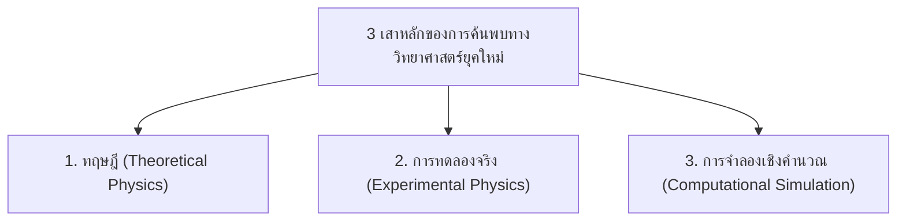

# วิทยาการคำนวณ 1 รากฐานแนวคิดเชิงคำนวณและการแก้ปัญหาอย่างเป็นระบบ
## บทที่ 8 การประยุกต์แก้ปัญหาทางคณิตศาสตร์และวิทยาศาสตร์เบื้องต้น
**ผู้เขียน** ผู้ช่วยศาสตราจารย์ ดร.ชีวะ ทัศนา • สาขาวิชาฟิสิกส์ คณะวิทยาศาสตร์และเทคโนโลยี มหาวิทยาลัยราชภัฏรำไพพรรณี

---

## 🎯 ผลลัพธ์การเรียนรู้ประจำบท
เมื่อศึกษาบทเรียนนี้จบแล้ว ผู้เรียนสามารถ
1. **บูรณาการ ** องค์ความรู้ด้านตรรกะ ตัวแปร เงื่อนไข และการวนซ้ำ เข้ากับทฤษฎีทางคณิตศาสตร์และวิทยาศาสตร์
2. **สร้างแบบจำลองเชิงคำนวณ ** เพื่อจำลองปรากฏการณ์ฟิสิกส์ในรูปแบบช่วงเวลาไม่ต่อเนื่อง (Discrete Time Steps $\Delta t$)
3. **วิเคราะห์และแปลความหมาย ** ข้อมูลผลการทดลองเสมือนจริง และคำนวณค่าคลาดเคลื่อน (Percentage Error) ได้อย่างถูกต้อง
4. **พัฒนาโครงงานโปรแกรมมิ่งขนาดเล็ก ** เพื่อแก้ไขปัญหาจริงในชีวิตประจำวันและชุมชน

---

## 🌌 8.0 เรื่องเล่าเปิดบทเรียน วิทยาศาสตร์เชิงคำนวณกับการทดลองเสมือนจริง

ในอดีต การค้นพบทางวิทยาศาสตร์เกิดขึ้นจาก 2 ขาหลัก คือ **ทฤษฎี ** บนแผ่นกระดาษ และ **การทดลองจริง ** ในห้องปฏิบัติการ แต่ในศตวรรษที่ 21 ขาที่สามที่มีบทบาทสำคัญอย่างยิ่งยวดคือ **"วิทยาศาสตร์เชิงคำนวณ (Computational Science & Simulation)"**



การจำลองด้วยคอมพิวเตอร์ช่วยให้นักวิทยาศาสตร์สามารถ
* ศึกษาปรากฏการณ์ที่อันตรายเกินไป (เช่น ปฏิกิริยานิวเคลียร์ฟิวชัน)
* ศึกษาปรากฏการณ์ที่ใช้เวลายาวนานนับล้านปี (เช่น การวิวัฒนาการของดวงดาว)
* ศึกษาปรากฏการณ์ที่มีขนาดเล็กระดับอะตอม (เช่น โครงสร้างโปรตีนและอนุภาคนาโน)

---

## 🔬 8.1 แบบจำลองที่ 1 การเคลื่อนที่แบบโพรเจกไทล์

การเคลื่อนที่ของวัตถุภายใต้แรงโน้มถ่วงของโลก ($g \approx 9.81\text{ m/s}^2$) โดยแยกพิจารณาใน 2 มิติอย่างอิสระ

<div style="background: linear-gradient(135deg, #f0fdf4, #dcfce7); border-left: 5px solid #16a34a; border-radius: 12px; padding: 18px 22px; margin: 20px 0; color: #14532d;">
  <h4 style="color: #15803d; margin-top: 0;">📐 สมการฟิสิกส์ของการเคลื่อนที่แบบโพรเจกไทล์</h4>
  <p style="margin: 0; line-height: 1.8;">
    • <strong>แกนราบ (แกน X):</strong> ความเร็วคงที่ $\rightarrow x(t) = (v_0 \cos\theta) \cdot t$<br>
    • <strong>แกนดิ่ง (แกน Y):</strong> ความเร่งคงที่ $g$ $\rightarrow y(t) = (v_0 \sin\theta) \cdot t - \frac{1}{2}gt^2$<br>
    • <strong>ความสูงสูงสุด ($H$):</strong> $H = \frac{v_0^2 \sin^2\theta}{2g}$<br>
    • <strong>ระยะตกไกลสุด ($R$):</strong> $R = \frac{v_0^2 \sin(2\theta)}{g}$ (ตกไกลสุดเมื่อยิงมุม $\theta = 45^\circ$)
  </p>
</div>

---

## ☢️ 8.2 แบบจำลองที่ 2 การสลายตัวของสารกัมมันตรังสีและครึ่งชีวิต

ธาตุกัมมันตรังสีจะสลายตัวตามเวลาโดยมีอัตราลดลงเป็นฟังก์ชันเอกซ์โพเนนเชียล
$$N(t) = N_0 \left(\frac{1}{2}\right)^{\frac{t}{T_{1/2}}}$$

โดยที่
* $N_0$ คือ ปริมาณสารตั้งต้น
* $N(t)$ คือ ปริมาณสารที่เหลืออยู่ ณ เวลา $t$
* $T_{1/2}$ คือ **ครึ่งชีวิต ** ของสาร

---

## 💻 8.3 โค้ดคอมพิวเตอร์ Python ชุดจำลองการทดลองฟิสิกส์เสมือนจริง

```python
# stem_physics_simulation_lab.py
# โปรแกรมจำลองการเคลื่อนที่แบบโพรเจกไทล์และการสลายตัวของสารกัมมันตรังสี
# ผู้เขียน: ผศ.ดร.ชีวะ ทัศนา (มรภ.รำไพพรรณี)

import math

def simulate_projectile(v0: float, angle_deg: float, dt: float = 0.05):
    """จำลองวิถีการเคลื่อนที่ของโพรเจกไทล์ทีละช่วงเวลา dt"""
    g = 9.81
    theta_rad = math.radians(angle_deg)
    
    vx = v0 * math.cos(theta_rad)
    vy0 = v0 * math.sin(theta_rad)
    
    total_time = (2.0 * vy0) / g
    max_height = (vy0 ** 2) / (2.0 * g)
    max_range = (v0 ** 2 * math.sin(2.0 * theta_rad)) / g
    
    print("=" * 65)
    print(f"🚀 ผลการจำลองการเคลื่อนที่แบบโพรเจกไทล์ (v0 = {v0} m/s, θ = {angle_deg}°)")
    print("=" * 65)
    print(f"   • เวลาลอยในอากาศรวม (T): {total_time:.2f} วินาที")
    print(f"   • ความสูงสูงสุด (H):      {max_height:.2f} เมตร")
    print(f"   • ระยะตกไกลสุด (R):       {max_range:.2f} เมตร")
    print("-" * 65)
    print(f"{'เวลา t (s)':<12} | {'พิกัด X (m)':<15} | {'พิกัด Y (m)':<15} | {'ความเร็ว Vy (m/s)':<15}")
    print("-" * 65)
    
    t = 0.0
    while t <= total_time + dt:
        x = vx * t
        y = (vy0 * t) - (0.5 * g * (t ** 2))
        vy = vy0 - (g * t)
        
        if y < 0:
            y = 0.0
            
        print(f"{t:<12.2f} | {x:<15.2f} | {y:<15.2f} | {vy:<15.2f}")
        
        if y == 0.0 and t > 0:
            break
        t += dt
        
    print("=" * 65)

def simulate_radioactive_decay(initial_atoms: int, half_life_years: float, total_years: float):
    """จำลองการสลายตัวของสารกัมมันตรังสีตามคาบครึ่งชีวิต"""
    print(f"\n☢️ ผลการจำลองการสลายตัวของสารกัมมันตรังสี (N0 = {initial_atoms:,}, T1/2 = {half_life_years} ปี)")
    print("=" * 65)
    print(f"{'ปีที่ (Year)':<15} | {'จำนวนอะตอมที่เหลือ':<22} | {'คิดเป็นร้อยละ (%)':<15}")
    print("-" * 65)
    
    steps = int(total_years / half_life_years)
    for step in range(steps + 1):
        year = step * half_life_years
        remaining = initial_atoms * ((0.5) ** step)
        percent = (remaining / initial_atoms) * 100.0
        print(f"{year:<15.1f} | {int(remaining):<22,d} | {percent:<15.2f}%")
    print("=" * 65)

if __name__ == "__main__":
    # 1. ทดสอบการเคลื่อนที่โพรเจกไทล์
    simulate_projectile(v0=25.0, angle_deg=45.0, dt=0.5)
    
    # 2. ทดสอบการสลายตัวของคาร์บอน-14 (Carbon-14 Half-life = 5,730 ปี)
    simulate_radioactive_decay(initial_atoms=1000000, half_life_years=5730.0, total_years=28650.0)
```

---

## 🏆 8.4 กิจกรรมโครงงานมินิแคปสโตน

### หัวข้อโครงงาน ระบบคำนวณและจำลองการปล่อยจรวดขวดน้ำอัจฉริยะ
* **เป้าหมาย** ให้นักเรียนสร้างโปรแกรมรับค่าปริมาณน้ำ (มวล), แรงดันลม, และมุมยิง เพื่อทำนายระยะตกไกลสุดของจรวดขวดน้ำ แล้วนำไปทดลองยิงจริงในสนามเพื่อเปรียบเทียบค่าคลาดเคลื่อน (Error Analysis)

### เกณฑ์การประเมิน 

| มิติการประเมิน | ดีเยี่ยม (4 คะแนน) | ดี (3 คะแนน) | พอใช้ (2 คะแนน) | ต้องปรับปรุง (1 คะแนน) |
| :--- | :--- | :--- | :--- | :--- |
| **1. ความถูกต้องทางทฤษฎี** | นำสูตรฟิสิกส์มาใช้คำนวณถูกต้องแม่นยำ 100% | คำนวณถูกต้องแต่มีหน่วยผิดพลาดเล็กน้อย | สูตรคลาดเคลื่อนในบางพารามิเตอร์ | สูตรไม่ถูกต้อง |
| **2. คุณภาพของโค้ด** | มีโครงสร้าง if, loops, ฟังก์ชัน สะอาดและอ่านง่าย | โค้ดทำงานได้ถูกต้อง แต่อ่านเข้าใจยาก | โค้ดมีข้อผิดพลาดบางกรณี | โค้ดรันไม่ผ่าน |
| **3. การวิเคราะห์ผล** | เปรียบเทียบผลจำลองกับการทดลองจริงอย่างลึกซึ้ง | มีการเปรียบเทียบแต่ขาดการวิเคราะห์สาเหตุ | บันทึกเฉพาะข้อมูลดิบ | ไม่มีการวิเคราะห์ |

---

## 💡 8.5 สรุปภาพรวมชุดตำราเล่มที่ 1 และการก้าวต่อไปสู่เล่มที่ 2

ขอแสดงความยินดีกับผู้เรียนทุกท่านที่ได้สำเร็จการศึกษา **เล่มที่ 1: รากฐานแนวคิดเชิงคำนวณและการแก้ปัญหาอย่างเป็นระบบ**! 

ท่านได้เรียนรู้และสั่งสมทักษะครบถ้วนตั้งแต่
1. การใช้เหตุผลเชิงตรรกะแบบนิรนัยและอุปนัย
2. เสาหลักทั้ง 4 ของแนวคิดเชิงคำนวณ (Decomposition, Pattern, Abstraction, Algorithm)
3. รหัสลำลองและผังงานมาตรฐานสากล
4. กิจกรรม Unplugged Coding และความเข้าใจระบบคอมพิวเตอร์
5. พื้นฐานการเขียนโปรแกรม Python (ตัวแปร, ชนิดข้อมูล, เงื่อนไข, การวนลูป)
6. การประยุกต์แก้ปัญหาทางคณิตศาสตร์และวิทยาศาสตร์

🚀 **ในเล่มที่ 2 (ระดับกลาง)** ท่านจะได้ยกระดับสู่การออกแบบขั้นตอนวิธีขั้นสูง การวิเคราะห์ประสิทธิภาพ Big-O โครงสร้างข้อมูลเชิงลึก และการพัฒนาโปรแกรมวิทยาศาสตร์ที่ซับซ้อนยิ่งขึ้น!

---

### 📝 แบบฝึกหัดทบทวน 3 ระดับ

#### ระดับที่ 1 ความรู้ความเข้าใจพื้นฐาน
1. ในการเคลื่อนที่แบบโพรเจกไทล์ หากต้องการให้วัตถุตกไปได้ระยะไกลที่สุดตามแนวราบ ต้องยิงด้วยมุมกี่องศา และเพราะเหตุใด
2. สารกัมมันตรังสีชนิดหนึ่งมีครึ่งชีวิต 10 วัน หากเริ่มต้นมีสารอยู่ 800 กรัม เมื่อเวลาผ่านไป 30 วัน จะเหลือสารนี้อยู่กี่กรัม

#### ระดับที่ 2 การวิเคราะห์และประยุกต์ใช้
3. จงเขียนฟังก์ชัน Python คำนวณ **คาบการแกว่งของลูกตุ้มอย่างง่าย ** ตามสูตร $T = 2\pi\sqrt{\frac{L}{g}}$ โดยรับค่าความยาวเชือก $L$ (เมตร) และคำนวณคาบ $T$ (วินาที)

#### ระดับที่ 3 การคิดขั้นสูงและบูรณาการ
4. จงเขียนโปรแกรมจำลองการคำนวณการเติบโตของประชากรแบคทีเรียตามฟังก์ชันเอกซ์โพเนนเชียล $P(t) = P_0 \cdot 2^{\frac{t}{g}}$ โดยรับค่าประชากรตั้งต้น ($P_0$), ระยะเวลาแบ่งตัวทวีคูณ ($g$), และจำลองจำนวนประชากรแบคทีเรียในทุกๆ 1 ชั่วโมงตลอด 24 ชั่วโมง
