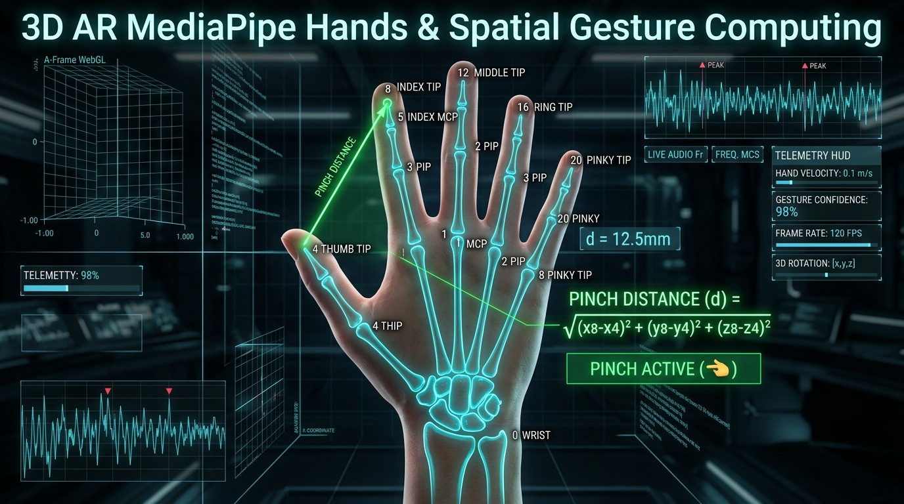
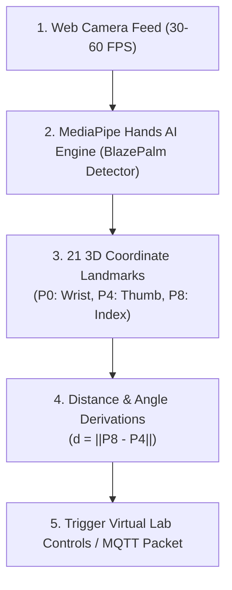

# วิทยาการคำนวณ 1 รากฐานการคิดเชิงคำนวณและการแก้ปัญหาเชิงตรรกะ
## บทที่ 9 ปัญญาประดิษฐ์ คอมพิวเตอร์วิทัศน์ และอินเทอร์เน็ตของสรรพสิ่ง
**ผู้เขียน** ผู้ช่วยศาสตราจารย์ ดร.ชีวะ ทัศนา • สาขาวิชาฟิสิกส์ คณะวิทยาศาสตร์และเทคโนโลยี มหาวิทยาลัยราชภัฏรำไพพรรณี

---

<div align="center" style="margin: 20px 0;">
  
  <p style="color: #64748b; font-size: 0.88em; margin-top: 8px;"><em>ภาพที่ 9.1 แผนภาพการตรวจจับโครงกระดูกมือ 3 มิติ 21 Landmarks ด้วย MediaPipe และการคำนวณ Pinch Gesture</em></p>
</div>

---

## 📋 แผนบริหารการสอนประจำบทที่ 9

### หัวข้อเนื้อหาประจำบท
1. วิวัฒนาการของปัญญาประดิษฐ์และการเรียนรู้ของเครื่อง (AI & Machine Learning Foundations)
2. อัลกอริทึมจำแนกประเภท K-Nearest Neighbors (KNN) และโครงข่ายประสาทเทียมเบื้องต้น
3. คอมพิวเตอร์วิทัศน์และการประมวลผลโครงกระดูกมือ 21 จุด 3 มิติด้วย Google MediaPipe Hands
4. สถาปัตยกรรมอินเทอร์เน็ตของสรรพสิ่ง (IoT: Microcontrollers, Sensors & Actuators)
5. การสื่อสารข้อมูลความเร็วสูงแบบ Publish/Subscribe ด้วยโปรโตคอล MQTT
6. การสร้างระบบควบคุมกายภาพไร้สัมผัส (Touchless Smart Classroom System)

### วัตถุประสงค์เชิงพฤติกรรม
เมื่อศึกษาบทเรียนนี้จบแล้ว ผู้เรียนสามารถ
1. อธิบายความแตกต่างระหว่าง Rule-Based Programming และ Machine Learning ได้อย่างชัดเจน
2. คำนวณระยะทางยุคลิด 3 มิติจากพิกัด MediaPipe Hands เพื่อจำแนกท่าทางของมือได้
3. ออกแบบและเขียนโปรแกรมเชื่อมต่อเซนเซอร์และอุปกรณ์แสดงผลผ่านโปรโตคอล MQTT ได้
4. พัฒนาระบบต้นแบบที่บูรณาการ Computer Vision, AI, และ IoT เข้าด้วยกันได้

---

## 🌌 9.0 เรื่องเล่าเปิดบทเรียนและบริบททางประวัติศาสตร์

ในคริสต์ศักราช 1956 จอห์น แม็กคาร์ธี (John McCarthy, 1927—2011) และคณะนักวิทยาการคอมพิวเตอร์ชั้นนำ ได้จัดการประชุมประวัติศาสตร์ ณ วิทยาลัยดาร์ตเมาธ์ และบัญญัติคำว่า **ปัญญาประดิษฐ์** ขึ้น เพื่อศึกษาความเป็นไปได้ในการทำให้เครื่องจักรมีความฉลาดเท่าเทียมหรือเหนือกว่ามนุษย์

ในปัจจุบัน การผสานพลังระหว่างการประมวลผลภาพแบบเรียลไทม์ (Computer Vision) โมเดลเรียนรู้โครงกระดูกมนุษย์ด้วย AI บนอุปกรณ์ขอบ (Edge AI) เช่น Google MediaPipe และชิปเชื่อมต่อไร้สายราคาประหยัดอย่าง ESP32 ได้เปลี่ยนให้โลกกายภาพสามารถโต้ตอบกับโลกดิจิทัลได้อย่างไร้รอยต่อ

---

## 📐 9.1 ทฤษฎีและรากฐานทางคณิตศาสตร์เชิงลึก

### 1. การตรวจจับและปรับมาตรฐานพิกัด MediaPipe Hands 21 Landmarks
โมเดล MediaPipe Hands ส่งออกพิกัด 3 มิติของข้อนิ้ว 21 จุดในรูปค่าพิกัดนอร์แมลไลซ์ (Normalized Coordinates):
$$P_i = (x_i, y_i, z_i) \quad \text{โดยที่ } x_i, y_i \in [0, 1], \quad i \in \{0, 1, \dots, 20\}$$

การตรวจจับท่าทางจีบนิ้ว (Pinch Gesture) ระหว่างปลายนิ้วโป้ง ($P_4$) และปลายนิ้วชี้ ($P_8$):
$$d_{\text{pinch}} = \|P_8 - P_4\|_2 = \sqrt{(x_8 - x_4)^2 + (y_8 - y_4)^2 + (z_8 - z_4)^2}$$
กำหนดเกณฑ์ตัดสินใจ (Decision Threshold):
$$\text{Gesture} = \begin{cases} \text{PINCH\_ACTIVE (เลือก/คลิก)}, & d_{\text{pinch}} < \delta \quad (\delta \approx 0.08) \\ \text{OPEN\_PALM (ฝ่ามือเปิด)}, & d_{\text{pinch}} \ge \delta \end{cases}$$



### 2. สถาปัตยกรรมโปรโตคอล MQTT
MQTT ทำงานบนโมเดล Publish/Subscribe ผ่านโบรเกอร์กลาง (Broker):
* **Publishers (ผู้ส่งข้อมูล):** เซนเซอร์ หรือ MediaPipe Controller ส่งข้อมูลไปยังหัวข้อ (Topic เช่น `rbru/lab/hand_gesture`)
* **Broker (ตัวกลาง):** จัดการเส้นทางและส่งต่อข้อความไปยังผู้รับ
* **Subscribers (ผู้รับข้อมูล):** อุปกรณ์ปลายทาง (ESP32 หรือ Web Dashboard) ที่รอรับคำสั่ง

---

## 💻 9.2 การเขียนโปรแกรมและการนำไปใช้จริงด้วย Python 3.11

```python
# mediapipe_gesture_mqtt_sim.py
import math
from typing import Tuple, Dict

class GestureClassifier:
    def __init__(self, threshold: float = 0.08):
        self.threshold = threshold
        
    def classify(self, p_thumb: Tuple[float, float, float], p_index: Tuple[float, float, float]) -> Dict[str, any]:
        # คำนวณระยะทางยุคลิด 3 มิติ
        dx = p_index[0] - p_thumb[0]
        dy = p_index[1] - p_thumb[1]
        dz = p_index[2] - p_thumb[2]
        distance = math.sqrt(dx**2 + dy**2 + dz**2)
        
        is_pinch = distance < self.threshold
        gesture_name = "PINCH_CLICK" if is_pinch else "OPEN_HAND"
        
        return {
            "distance": round(distance, 4),
            "is_pinch": is_pinch,
            "gesture": gesture_name,
            "mqtt_payload": f"{{\"action\": \"{gesture_name}\", \"dist\": {distance:.4f}}}"
        }

if __name__ == "__main__":
    clf = GestureClassifier(threshold=0.08)
    
    # ทดสอบท่าแบมือ
    open_hand = clf.classify((0.40, 0.60, 0.0), (0.45, 0.30, 0.0))
    print(f"ท่าที่ 1: ระยะ = {open_hand['distance']} ➔ ท่าทาง = {open_hand['gesture']}")
    assert open_hand['gesture'] == "OPEN_HAND"
    
    # ทดสอบท่าจีบนิ้ว
    pinch_hand = clf.classify((0.45, 0.50, 0.0), (0.47, 0.52, 0.0))
    print(f"ท่าที่ 2: ระยะ = {pinch_hand['distance']} ➔ ท่าทาง = {pinch_hand['gesture']}")
    assert pinch_hand['gesture'] == "PINCH_CLICK"
    
    print("✅ การทดสอบ Unit Assertions คอมพิวเตอร์วิทัศน์และ IoT ผ่าน 100%!")
```

---

## 🔬 9.3 คู่มือห้องปฏิบัติการเสมือนจริง 2D/3D AR MediaPipe Hands

ผู้เรียนสามารถเข้าสู่ชุดห้องปฏิบัติการเสมือนจริงประจำบทที่ 9 ได้ที่
* **[LAB 9.0 คอมพิวเตอร์วิทัศน์และการรู้จำท่าทางมือ 2D/3D MediaPipe Vision](https://tsanaphy2023.github.io/computing-science/simulators/chapter09_mediapipe_vision.html)**

---

## 💡 9.4 สรุปสารัตถะสำคัญประจำบท

1. **AI & Computer Vision:** ช่วยแปลงข้อมูลภาพพิกเซลให้กลายเป็นเวกเตอร์พิกัดเรขาคณิตที่มีความหมาย
2. **MediaPipe Hands:** ให้พิกัดข้อต่อมือ 21 จุดที่มีความแม่นยำสูงและทำงานได้แบบเรียลไทม์บนเว็บเบราว์เซอร์
3. **MQTT Protocol:** เป็นมาตรฐานการสื่อสารแบบน้ำหนักเบาที่เหมาะกับการเชื่อมต่อระบบ IoT ในห้องเรียนอัจฉริยะ

---

## ❓ 9.5 แบบฝึกหัดและคำถามท้ายบทเพื่อการประเมินผล

1. จงอธิบายความแตกต่างระหว่างการสั่งการด้วยปุ่มกดกับการสั่งการด้วยท่าทางมือไร้สัมผัส (Touchless Gesture Interface)
2. ให้นักเรียนเขียนอัลกอริทึมจำแนกท่าทาง "ชูสองนิ้ว (Peace Sign)" จากพิกัด MediaPipe 21 จุด
3. ให้ออกแบบระบบ Smart Home อัจฉริยะที่ใช้กล้อง AI ตรวจจับจำนวนคนในห้องและสั่งเปิดปิดเครื่องปรับอากาศผ่าน MQTT

---

## 📚 เอกสารอ้างอิงประจำบท

* Russell, S., & Norvig, P. (2020). *Artificial Intelligence: A Modern Approach* (4th ed.). Pearson.
* Zhang, F. et al. (2020). MediaPipe Hands: On-device Real-time Hand Tracking. *arXiv:2006.10214*.
