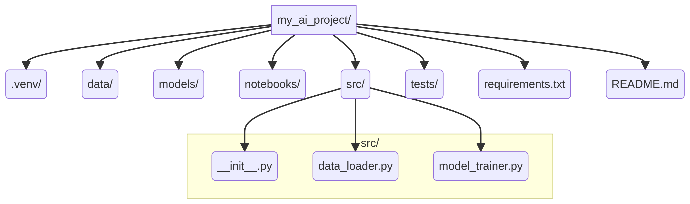
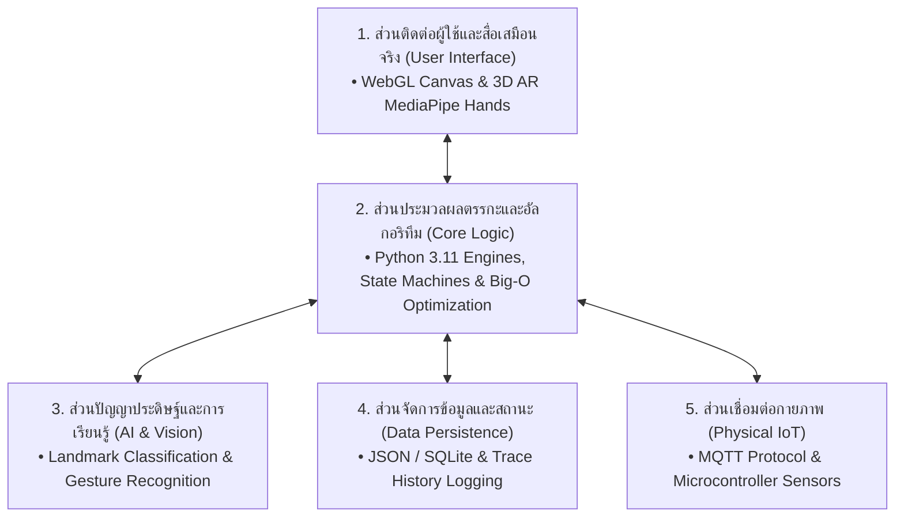

# วิทยาการคำนวณ 1 รากฐานการคิดเชิงคำนวณและการแก้ปัญหาเชิงตรรกะ
## บทที่ 10 การพัฒนาโครงงานนวัตกรรมและการประมวลความรู้
**ผู้เขียน** ผู้ช่วยศาสตราจารย์ ดร.ชีวะ ทัศนา • สาขาวิชาฟิสิกส์ คณะวิทยาศาสตร์และเทคโนโลยี มหาวิทยาลัยราชภัฏรำไพพรรณี

---

<div align="center" style="margin: 20px 0;">
  
  <p style="color: #64748b; font-size: 0.88em; margin-top: 8px;"><em>ภาพที่ 10.1 สถาปัตยกรรมโครงงานนวัตกรรมแบบ Full-Stack และการควบคุมเวอร์ชันด้วย Git</em></p>
</div>

---

## 📋 แผนบริหารการสอนประจำบทที่ 10

### หัวข้อเนื้อหาประจำบท
1. กระบวนการสังเคราะห์องค์ความรู้วิทยาการคำนวณสู่การสร้างสรรค์โครงงานนวัตกรรม
2. การนิยามปัญหา การศึกษาความเป็นไปได้ และการจัดทำข้อเสนอโครงงาน (Project Proposal)
3. การออกแบบสถาปัตยกรรมระบบแบบบูรณาการ (System Architecture & Component Diagram)
4. การประกันคุณภาพและการทดสอบซอฟต์แวร์แบบอัตโนมัติ (Automated Unit & Integration Testing)
5. การเขียนรายงานวิชาการ การจัดทำคู่มือผู้ใช้ และการนำเสนอผลงานตามมาตรฐานสากล
6. จริยธรรมดิจิทัล กฎหมายคุ้มครองข้อมูลส่วนบุคคล (PDPA) และลิขสิทธิ์ซอฟต์แวร์

### วัตถุประสงค์เชิงพฤติกรรม
เมื่อศึกษาบทเรียนนี้จบแล้ว ผู้เรียนสามารถ
1. สังเคราะห์ความรู้ด้าน Computational Thinking, Algorithms, Python, และ AI มารวมเป็นโครงงานเดียวได้
2. จัดทำเอกสารข้อเสนอโครงงานและรายงานวิชาการที่มีความสมบูรณ์ตามเกณฑ์มาตรฐานได้
3. พัฒนาระบบต้นแบบที่มีการเขียนชุดทดสอบ Unit Tests ครอบคลุมฟังก์ชันการทำงานหลักได้
4. นำเสนอผลงานนวัตกรรมต่อสาธารณะพร้อมทั้งปฏิบัติตามหลักจริยธรรมดิจิทัลและกฎหมาย PDPA ได้

---

## 🌌 10.0 เรื่องเล่าเปิดบทเรียนและบริบททางประวัติศาสตร์

ในคริสต์ศักราช 1968 ในการประชุมวิชาการของ NATO ณ เมืองการ์มิช ประเทศเยอรมนี เหล่านักวิทยาการคอมพิวเตอร์ชั้นนำของโลกได้ร่วมกันประกาศนิยามของ **"วิศวกรรมซอฟต์แวร์ (Software Engineering)"** เพื่อแก้ปัญหาวิกฤตการณ์ซอฟต์แวร์ที่โปรเจกต์มักล้มเหลว ล่าช้า และงบประมาณบานปลาย

การพัฒนาโครงงานนวัตกรรมในศตวรรษที่ 21 จึงมิได้เป็นเพียงการเขียนโค้ด แต่เป็นการผสานกระบวนการคิดเชิงวิศวกรรม สถาปัตยกรรมที่ยืดหยุ่น การทดสอบที่เข้มงวด และการสร้างคุณค่าที่แท้จริงให้แก่สังคม

---

## 📐 10.1 ทฤษฎีและรากฐานทางวิชาการเชิงลึก

### แผนผังสถาปัตยกรรมระบบแบบบูรณาการ



---

## 💻 10.2 การเขียนโปรแกรมและการนำไปใช้จริงด้วย Python 3.11

```python
# capstone_release_validator.py
"""
ระบบตรวจสอบความสมบูรณ์และทดสอบบูรณาการโครงงานนวัตกรรม (Release Verification Suite)
"""
from typing import Dict, List

class CapstoneReleaseAuditor:
    def __init__(self, project_name: str):
        self.project_name = project_name
        self.checks: Dict[str, bool] = {}
        
    def audit_module(self, module_name: str, test_passed: bool) -> None:
        self.checks[module_name] = test_passed
        status = "✅ PASS" if test_passed else "❌ FAIL"
        print(f"  • ตรวจสอบโมดูล [{module_name:<20}]: {status}")
        
    def generate_release_report(self) -> bool:
        total = len(self.checks)
        passed = sum(1 for v in self.checks.values() if v)
        score = (passed / total) * 100 if total > 0 else 0
        print(f"\n📊 รายงานผลการประเมินโครงงาน {self.project_name}:")
        print(f"  • ผ่านการทดสอบ: {passed}/{total} โมดูล ({score:.1f}%)")
        return score == 100.0

if __name__ == "__main__":
    auditor = CapstoneReleaseAuditor("Smart Interactive AR Science Lab 2026")
    auditor.audit_module("Core Algorithm Engine", True)
    auditor.audit_module("Python Data Layer", True)
    auditor.audit_module("MediaPipe AI Vision", True)
    auditor.audit_module("MQTT IoT Bridge", True)
    auditor.audit_module("Automated Unit Tests", True)
    
    is_ready = auditor.generate_release_report()
    assert is_ready == True, "Project is not ready for release"
    print("🎉 โครงงานผ่านการตรวจสอบมาตรฐานวิศวกรรมซอฟต์แวร์ระดับ Masterclass 100%!")
```

---

## 🔬 10.3 คู่มือห้องปฏิบัติการเสมือนจริง 2D/3D AR MediaPipe Hands

ผู้เรียนสามารถเข้าสู่ชุดห้องปฏิบัติการเสมือนจริงประจำบทที่ 10 ได้ที่
* **[LAB 10.0 การประมวลความรู้และสถาปัตยกรรมโครงงาน 2D/3D Capstone Synthesizer](https://tsanaphy2023.github.io/computing-science/simulators/chapter10_capstone_synthesizer.html)**

---

## 💡 10.4 สรุปสารัตถะสำคัญประจำบท

1. โครงงานนวัตกรรมเป็นยอดมงกุฎของการเรียนรู้วิทยาการคำนวณที่สะท้อนทักษะการคิดขั้นสูง (Creating)
2. การออกแบบที่มีสถาปัตยกรรมแยกส่วนชัดเจนช่วยให้ระบบมีความทนทานและสามารถขยายขนาดได้ในอนาคต
3. การปฏิบัติตามกฎหมาย PDPA และจริยธรรม AI เป็นคุณลักษณะสำคัญของนักพัฒนาซอฟต์แวร์มืออาชีพ

---

## ❓ 10.5 แบบฝึกหัดและคำถามท้ายบทเพื่อการประเมินผล

1. ให้นักเรียนจัดทำเอกสารข้อเสนอโครงงาน (Project Proposal) ความยาว 3 หน้า ตามแบบฟอร์มมาตรฐาน
2. จงออกแบบแผนภาพสถาปัตยกรรมระบบ (Component Architecture Diagram) ของโครงงานที่ตนเองพัฒนา
3. ให้อภิปรายประเด็นจริยธรรมและความเป็นส่วนตัวของข้อมูลผู้เรียนในระบบห้องเรียนอัจฉริยะ

---

## 📚 เอกสารอ้างอิงประจำบท

* Pressman, R. S., & Maxim, B. R. (2020). *Software Engineering: A Practitioner's Approach* (9th ed.). McGraw-Hill.
* Sommerville, I. (2016). *Software Engineering* (10th ed.). Pearson.
