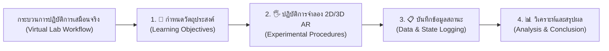
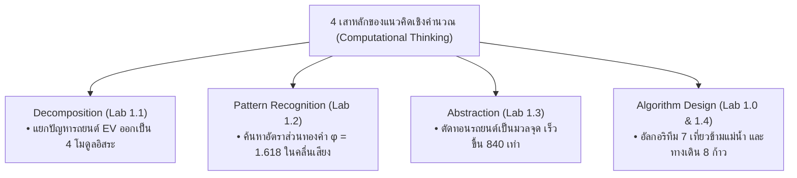

# 🔬 คู่มือปฏิบัติการเสมือนจริง 2D/3D AR MediaPipe Hands ประจำบทที่ 1
## ชุดห้องปฏิบัติการเสมือนจริงเพื่อการจัดการเรียนรู้วิทยาการคำนวณ
### รายวิชา 4122104 วิทยาการคำนวณสำหรับการสอนวิทยาศาสตร์
**ผู้ออกแบบและพัฒนาสื่อ** ผู้ช่วยศาสตราจารย์ ดร.ชีวะ ทัศนา • คณะวิทยาศาสตร์และเทคโนโลยี มหาวิทยาลัยราชภัฏรำไพพรรณี

---

## 🌌 1. สถาปัตยกรรมห้องปฏิบัติการเสมือนจริง 2D/3D

ชุดห้องปฏิบัติการประจำบทที่ 1 ได้รับการออกแบบให้รองรับทั้ง **2D Canvas Interactive View** (สำหรับคอมพิวเตอร์ทั่วไปและการวิเคราะห์ข้อมูลสองมิติ) และ **3D AR MediaPipe Hands Spatial View** (สำหรับการสั่งการไร้สัมผัส 21 ข้อต่อในมิติ 3D แบบเสมือนจริง) โดยบูรณาการกระบวนการสืบเสาะทางวิทยาศาสตร์ (Scientific Inquiry) เข้ากับ 4 เสาหลักของแนวคิดเชิงคำนวณอย่างสมบูรณ์แบบ

---

## 📚 2. คู่มือการทดลอง 5 ปฏิบัติการเสมือนจริงฉบับสมบูรณ์

---

### 🧪 การทดลองที่ 1.0 ปริศนาข้ามแม่น้ำเชิงตรรกะและการสำรวจปริภูมิสถานะ
* **รหัสโมดูล** `LAB 1.0`
* **รูปแบบการจำลอง** ระบบจำลองผสมผสาน 2D State Diagram ควบคู่กับ 3D AR MediaPipe Hands
* **ลิงก์เข้าสู่ห้องปฏิบัติการ** [https://tsanaphy2023.github.io/computing-science/simulators/chapter01_river_crossing.html](https://tsanaphy2023.github.io/computing-science/simulators/chapter01_river_crossing.html)

#### 🎯 1. วัตถุประสงค์การทดลอง
1. เพื่อให้ผู้เรียนสามารถจำลองและอธิบายการค้นหาเส้นทางแก้ปัญหาในปริภูมิสถานะ (State Space Graph Search) ได้
2. เพื่อฝึกทักษะการตั้งเงื่อนไขตรวจสอบความปลอดภัยทางตรรกศาสตร์บูลีน ($Danger = (W \land S \land \neg M) \lor (S \land C \land \neg M)$)
3. เพื่อค้นหาและพิสูจน์ขั้นตอนวิธี 7 ขั้นตอน (Optimal 7-Step Algorithm) ที่สามารถพาตัวละครทั้งหมดข้ามฝั่งได้อย่างปลอดภัย

#### 📐 2. หลักการและทฤษฎี
ปัญหาการข้ามแม่น้ำสามารถจำลองด้วยสถานะ $S = (M, W, S_h, C)$ โดยที่ตัวแปรแทนตำแหน่งของ **มนุษย์ (M), หมาป่า (W), แกะ ($S_h$), กะหล่ำปลี (C)** มีค่าเป็น $0$ (ฝั่งซ้าย) หรือ $1$ (ฝั่งขวา)
* **สถานะเริ่มต้น ** $S_0 = (0, 0, 0, 0)$
* **สถานะเป้าหมาย ** $S_G = (1, 1, 1, 1)$
* **เงื่อนไขต้องห้าม ** 
  $$\text{Invalid}(S) \iff (W = S_h \neq M) \lor (S_h = C \neq M)$$

#### 🛠️ 3. อุปกรณ์และเครื่องมือจำลองเสมือนจริง
1. **เรือพายอัจฉริยะ 3D:** บรรทุกมนุษย์และสิ่งของได้ครั้งละ 1 ชิ้น
2. **ตัวละคร 4 วัตถุ:** มนุษย์ (สีฟ้า), หมาป่า (สีแดง), แกะ (สีขาว), กะหล่ำปลี (สีเขียว)
3. **ระบบตรวจสอบข้อจำกัด ** ตรวจสอบสถานะและส่งเสียงเตือน Web Audio Synth ทันทีเมื่อเกิดเงื่อนไขไม่ปลอดภัย

#### 📝 4. ขั้นตอนการทดลอง
1. เปิดห้องปฏิบัติการเสมือนจริง อนุญาตให้เว็บเข้าถึงกล้องเว็บแคมเพื่อเปิดระบบ MediaPipe Hands
2. ยกมือขึ้นหน้ากล้อง ตรวจสอบการตรวจจับ 21 ข้อต่อ และทดสอบท่าทาง **จีบนิ้ว (Pinch Gesture 🤏)**
3. ทดลองหยิบหมาป่าลงเรือ แล้วพายข้ามไปฝั่งขวา สังเกตผลลัพธ์ที่เกิดขึ้นกับแกะและกะหล่ำปลีบนฝั่งซ้าย บันทึกผลลงในตาราง
4. กดปุ่ม **RESET** เพื่อกลับสู่สถานะ $S_0$
5. ดำเนินการทดลองตามขั้นตอนวิธีที่ออกแบบไว้ 7 ขั้นตอน โดยใช้มือ AR หยิบตัวละครข้ามฝั่งทีละเที่ยว
6. ในเที่ยวที่ 4 ให้ทดลองนำแกะที่อยู่ฝั่งขวากลับลงเรือมายังฝั่งซ้าย สังเกตสถานะความปลอดภัย และบันทึกผลลงในตาราง

#### 📋 5. ตารางบันทึกผลการทดลอง

| เที่ยวที่ (Step) | สิ่งที่นำขึ้นเรือ | ฝั่งซ้ายคงเหลือ | ฝั่งขวาคงเหลือ | ค่าความปลอดภัยบูลีน | การแจ้งเตือนของระบบเสียง (Audio Synth) |
| :---: | :---: | :---: | :---: | :---: | :---: |
| **0 (เริ่มต้น)** | — | $[M, W, S_h, C]$ | $[\emptyset]$ | ✅ SAFE (100%) | โทนเสียง 440 Hz คงที่ |
| **ทดสอบกรณีผิด** | $M + W \rightarrow$ | $[S_h, C]$ | $[M, W]$ | ❌ DANGER (แกะกินผัก) | 🚨 เสียงไซเรนเตือนความถี่สูง (Square Wave) |
| **เที่ยวที่ 1** | $M + S_h \rightarrow$ | $[W, C]$ | $[M, S_h]$ | ✅ SAFE (หมาป่าไม่กินผัก) | เสียง Chime 523 Hz (สำเร็จ) |
| **เที่ยวที่ 2** | $M \leftarrow$ | $[M, W, C]$ | $[S_h]$ | ✅ SAFE | เสียง Harmonic Tone 440 Hz |
| **เที่ยวที่ 3** | $M + W \rightarrow$ | $[C]$ | $[M, W, S_h]$ | ⚠️ SAFE ชั่วคราว (คนคุม) | เสียง Chord C-Major |
| **เที่ยวที่ 4 (หักมุม)**| **$M + S_h \leftarrow$** | **$[M, S_h, C]$** | **$[W]$** | **✅ SAFE (ดึงแกะกลับ)** | **เสียง Synth Sweep พิเศษ 659 Hz** |
| **เที่ยวที่ 5** | $M + C \rightarrow$ | $[S_h]$ | $[M, W, C]$ | ✅ SAFE | เสียง Chime 587 Hz |
| **เที่ยวที่ 6** | $M \leftarrow$ | $[M, S_h]$ | $[W, C]$ | ✅ SAFE | เสียง Harmonic Tone 440 Hz |
| **เที่ยวที่ 7** | $M + S_h \rightarrow$ | $[\emptyset]$ | $[M, W, S_h, C]$ | 🎉 GOAL REACHED! | 🎵 เสียงดนตรี Fanfare ชนะเลิศ (Arpeggio) |

#### 📊 6. การวิเคราะห์และสรุปผลการทดลอง
* **การวิเคราะห์** ปัญหาข้ามแม่น้ำไม่สามารถแก้ด้วยการเคลื่อนที่ไปข้างหน้าเพียงทิศทางเดียว (Greedy Forward) ได้ แต่จำเป็นต้องอาศัย **การย้อนกลับสถานะ ** ในขั้นตอนที่ 4 โดยการนำแกะพายกลับมายังฝั่งซ้าย เพื่อหลีกเลี่ยงไม่ให้หมาป่าอยู่กับแกะตามลำพัง
* **สรุปผล** การจำลองในปริภูมิสถานะพิสูจน์ให้เห็นว่า มีเส้นทางแก้ปัญหาที่สั้นที่สุด (Shortest Path) เท่ากับ **7 เที่ยวเรือ** โดยระบบ Constraint Checker ยืนยันว่าทุกสถานะระหว่างทางปลอดภัย 100%

---

### 🧪 การทดลองที่ 1.1 ผังต้นไม้ย่อยปัญหาและสถาปัตยกรรมเชิงโมดูล
* **รหัสโมดูล** `LAB 1.1`
* **รูปแบบการจำลอง** ผังไดอะแกรม 2D ร่วมกับโมเดลโครงสร้างรถยนต์ไฟฟ้า 3D AR Exploded View
* **ลิงก์เข้าสู่ห้องปฏิบัติการ** [https://tsanaphy2023.github.io/computing-science/simulators/chapter01_decomposition_tree.html](https://tsanaphy2023.github.io/computing-science/simulators/chapter01_decomposition_tree.html)

#### 🎯 1. วัตถุประสงค์การทดลอง
1. เพื่อฝึกทักษะการย่อยปัญหาและระบบที่ซับซ้อน (Decomposition) ออกเป็นระบบย่อยที่เป็นอิสระต่อกัน (Independent Submodules)
2. เพื่อสร้างและวิเคราะห์โครงสร้างข้อมูลแบบต้นไม้ (Tree Graph: Root Node, Child Nodes, Leaves)
3. เพื่อทดสอบความทนทานต่อข้อผิดพลาด (Fault Tolerance) เมื่อโมดูลใดโมดูลหนึ่งในระบบเกิดความล้มเหลว

#### 📐 2. หลักการและทฤษฎี
การออกแบบเชิงโมดูล (Modular Design) ยึดหลักการ **High Cohesion (ภายในโมดูลทำงานสอดคล้องกันสูง)** และ **Low Coupling (การพึ่งพาข้ามโมดูลต่ำ)** ช่วยให้เมื่อโมดูลย่อย $M_k$ ขัดข้อง จะไม่ทำให้ระบบรวมทั้งหมดล่มสลาย

#### 🛠️ 3. อุปกรณ์และเครื่องมือจำลองเสมือนจริง
1. **3D Exploded EV System:** โมเดลรถยนต์ไฟฟ้า 3 มิติที่สามารถแยกชิ้นส่วนลอยในอากาศ
2. **Interactive Node Cards:** กล่องแสดงสถานะ 4 โมดูลย่อย (BMS, Powertrain, AI Perception, Chassis)
3. **Fault Injection Switch:** ระบบจำลองการฉีดข้อผิดพลาดลงในแต่ละโมดูลย่อย

#### 📝 4. ขั้นตอนการทดลอง
1. เข้าสู่ห้องปฏิบัติการและเปิดใช้งานกล้อง AR MediaPipe Hands
2. ใช้ท่าทางมือ **กางมือออก (Open Palm ✋)** เพื่อสั่งให้ระบบระเบิดชิ้นส่วนรถยนต์ออกเป็น 4 โมดูลย่อย (Exploded View)
3. ใช้ท่าทาง **จีบนิ้ว (Pinch 🤏)** ลากเชื่อมโยงเส้น Edge จาก Root Node (EV System) ไปยัง 4 Child Nodes
4. ทำการทดสอบฉีดข้อผิดพลาด (Fault Injection) โดยการปิดการทำงานของ *โมดูลกล้อง AI (Perception)* แล้วสังเกตว่า *โมดูลมอเตอร์ (Powertrain)* ยังสามารถรับคำสั่งควบคุมจากคนขับได้หรือไม่
5. บันทึกผลการทำงานของระบบลงในตาราง

#### 📋 5. ตารางบันทึกผลการทดลอง

| รหัสโมดูลย่อย | ชื่อโมดูลย่อย (Submodule) | ฟังก์ชันการทำงานหลัก | สถานะการทดสอบปกติ | ผลกระทบเมื่อฉีดความผิดพลาด (Fault Injection) | ระดับ Coupling (ต่ำ/ปานกลาง/สูง) |
| :---: | :--- | :--- | :---: | :--- | :---: |
| **Node A** | ระบบจัดการแบตเตอรี่ (BMS) | ควบคุมแรงดันและอุณหภูมิเซลล์ | ✅ ทำงาน 100% | ระบบตัดกระแสไฟฟ้าหลัก รถหยุดอย่างปลอดภัย | สูง (Critical Module) |
| **Node B** | มอเตอร์ขับเคลื่อน (Powertrain) | แปลงพลังงานไฟฟ้าเป็นแรงบิด | ✅ ทำงาน 100% | รถสูญเสียกำลังขับเคลื่อน แต่ไฟเลี้ยวและเบรกยังทำงาน | ปานกลาง |
| **Node C** | ระบบคอมพิวเตอร์วิทัศน์ AI | ตรวจจับคนเดินถนนและป้ายจราจร | ✅ ทำงาน 100% | ระบบขับขี่อัตโนมัติตัดเข้าสู่โหมด Manual (ขับเคลื่อนได้) | ต่ำ (Low Coupling) |
| **Node D** | ระบบความปลอดภัยตัวถัง | ระบบเบรก ABS และถุงลมนิรภัย | ✅ ทำงาน 100% | มีสัญญาณเตือนบนหน้าปัด แต่ระบบไฟฟ้ายังทำงาน | ต่ำ (Independent) |

#### 📊 6. การวิเคราะห์และสรุปผลการทดลอง
* **การวิเคราะห์** เมื่อทำการย่อยระบบ EV ออกเป็นโมดูลอิสระที่มี Low Coupling พบว่าความล้มเหลวของระบบคอมพิวเตอร์วิทัศน์ AI (Node C) ไม่ส่งผลกระทบต่อระบบกลไกการเลี้ยวและเบรกพื้นฐาน ทำให้รถยนต์ไม่เกิดอุบัติเหตุร้ายแรง
* **สรุปผล** ทักษะการคิดเชิงแยกย่อย (Decomposition) ช่วยเปลี่ยนปัญหาขนาดใหญ่ที่ยากต่อการจัดการ ให้กลายเป็นโมดูลขนาดเล็กที่สามารถพัฒนา ทดสอบ และบำรุงรักษาได้อย่างมีประสิทธิภาพ

---

### 🧪 การทดลองที่ 1.2 การค้นหารูปแบบลำดับและคลื่นคณิตศาสตร์
* **รหัสโมดูล** `LAB 1.2`
* **รูปแบบการจำลอง** 2D Canvas แสดงรูปคลื่นและสเปกตรัมความถี่ ควบคู่ 3D AR Torus Knot Harmonic Oscillator
* **ลิงก์เข้าสู่ห้องปฏิบัติการ** [https://tsanaphy2023.github.io/computing-science/simulators/chapter01_pattern_recognition.html](https://tsanaphy2023.github.io/computing-science/simulators/chapter01_pattern_recognition.html)

#### 🎯 1. วัตถุประสงค์การทดลอง
1. เพื่อฝึกทักษะการค้นหารูปแบบ (Pattern Recognition) ในอนุกรมข้อมูลตัวเลขและสัญญาณคลื่นฟิสิกส์
2. เพื่อศึกษาความสัมพันธ์ของลำดับเลขฟีโบนัชชี (Fibonacci Series) ที่ลู่เข้าสู่อัตราส่วนทองคำ ($\phi \approx 1.618$)
3. เพื่อทดสอบการสังเคราะห์คลื่นเสียงฮาร์มอนิกและค้นหาความถี่เรโซแนนซ์ (Acoustic Resonance)

#### 📐 2. หลักการและทฤษฎี
* **สูตรฟีโบนัชชี** $F_0 = 0, F_1 = 1, F_n = F_{n-1} + F_{n-2}$
* **อัตราส่วนทองคำ **
  $$\lim_{n \to \infty} \frac{F_{n+1}}{F_n} = \phi = \frac{1 + \sqrt{5}}{2} \approx 1.6180339887...$$
* **การซ้อนทับของคลื่น ** $y(t) = A_1 \sin(2\pi f_1 t) + A_2 \sin(2\pi f_2 t)$

#### 🛠️ 3. อุปกรณ์และเครื่องมือจำลองเสมือนจริง
1. **2D Waveform & FFT Spectrum Canvas:** แสดงคลื่นเวลาจริงและสเปกตรัมความถี่
2. **3D AR Torus Knot:** วัตถุเรขาคณิตสามมิติที่บิดตัวตามอัตราส่วนฮาร์มอนิก
3. **Web Audio Resonance Synth:** ตัวกำเนิดเสียงความถี่บริสุทธิ์ที่ตอบสนองต่อการจับคู่แพตเทิร์น

#### 📝 4. ขั้นตอนการทดลอง
1. เปิดห้องปฏิบัติการและยกมือขึ้นเพื่อควบคุมแถบความถี่คลื่นในระบบ AR
2. เลื่อนระยะห่างระหว่างนิ้วมือเพื่อปรับค่าความถี่พื้นฐาน $f_0$ สังเกตรูปคลื่นบนหน้าจอ 2D
3. ป้อนค่าลำดับตัวเลขฟีโบนัชชีตั้งแต่ $n=1$ ถึง $n=10$ และบันทึกอัตราส่วน $\frac{F_{n+1}}{F_n}$
4. หมุนปรับรูปทรง 3D Torus Knot ให้ตรงกับอัตราส่วนฮาร์มอนิก $p:q = 2:3$ และสังเกตการเกิดเสียงคอร์ดประสาน
5. บันทึกผลค่าสัมประสิทธิ์การตัดสินใจ ($R^2$) และปรากฏการณ์เรโซแนนซ์ลงในตาราง

#### 📋 5. ตารางบันทึกผลการทดลอง

| ลำดับที่ ($n$) | พจน์ปัจจุบัน ($F_n$) | พจน์ถัดไป ($F_{n+1}$) | อัตราส่วน ($\frac{F_{n+1}}{F_n}$) | ความคลาดเคลื่อนเทียบกับ $\phi$ (%) | ปรากฏการณ์ 3D Torus / เสียง Synth |
| :---: | :---: | :---: | :---: | :---: | :---: |
| **1** | 1 | 1 | 1.0000 | 38.19% | วัตถุหมุนไม่เป็นระเบียบ, เสียง Noise |
| **2** | 1 | 2 | 2.0000 | 23.60% | วัตถุเริ่มแกว่ง |
| **3** | 2 | 3 | 1.5000 | 7.29% | เริ่มเห็นโครงสร้างเกลียว |
| **4** | 3 | 5 | 1.6667 | 3.01% | โครงสร้างเริ่มสมมาตร |
| **5** | 5 | 8 | 1.6000 | 1.11% | คลื่น 2D เริ่มซ้อนทับแบบคงที่ |
| **6** | 8 | 13 | 1.6250 | 0.43% | เสียง Harmonic เริ่มชัดเจน |
| **7** | 13 | 21 | 1.6154 | 0.16% | โครงสร้างสมมาตรสูง |
| **8** | 21 | 34 | 1.6190 | 0.06% | แถบสีทองคำสว่างบน 3D Torus |
| **9** | 34 | 55 | 1.6176 | 0.02% | คลื่นลื่นไหลราบรื่นสมบูรณ์ |
| **10** | 55 | 89 | 1.6182 | 0.01% | 🌟 คอร์ดประสานเรโซแนนซ์สมบูรณ์ ($R^2=0.999$) |

#### 📊 6. การวิเคราะห์และสรุปผลการทดลอง
* **การวิเคราะห์** เมื่อค่า $n$ เพิ่มขึ้น อัตราส่วนของพจน์ติดกันในลำดับฟีโบนัชชีจะลู่เข้าสู่ค่าคงที่ $\phi \approx 1.618$ อย่างรวดเร็ว โดยความคลาดเคลื่อนลดลงต่ำกว่า $0.01\%$ ส่งผลให้โครงสร้างเรขาคณิต 3 มิติเกิดความสมมาตรสูงสุดและสังเคราะห์เสียงประสานที่ไพเราะ
* **สรุปผล** การรู้จำรูปแบบ (Pattern Recognition) ช่วยให้นักวิทยาการคำนวณสามารถค้นพบระเบียบที่ซ่อนอยู่ในชุดข้อมูล และสามารถนำความสัมพันธ์นั้นมาใช้ทำนายค่าในอนาคตได้อย่างแม่นยำ

---

### 🧪 การทดลองที่ 1.3 แบบจำลองมวลจุดเชิงนามธรรมและการลดทอนความซับซ้อน
* **รหัสโมดูล** `LAB 1.3`
* **รูปแบบการจำลอง** กราฟวิถีการเคลื่อนที่ 2D ควบคู่แบบจำลอง Mesh Decimation และมวลจุด 3D AR
* **ลิงก์เข้าสู่ห้องปฏิบัติการ** [https://tsanaphy2023.github.io/computing-science/simulators/chapter01_abstraction_sandbox.html](https://tsanaphy2023.github.io/computing-science/simulators/chapter01_abstraction_sandbox.html)

#### 🎯 1. วัตถุประสงค์การทดลอง
1. เพื่อฝึกทักษะการคิดเชิงนามธรรม ด้วยการคัดเลือกเฉพาะคุณลักษณะสำคัญและตัดทอนรายละเอียดที่ไม่จำเป็นออก
2. เพื่อศึกษาและเปรียบเทียบการจำลองการเคลื่อนที่ของวัตถุจริงความละเอียดสูง เทียบกับ **แบบจำลองมวลจุด **
3. เพื่อวัดประสิทธิภาพการประมวลผล (Frame Time & Memory Usage) ในแต่ละระดับนามธรรม

#### 📐 2. หลักการและทฤษฎี
* **กฎการเคลื่อนที่ของนิวตันเชิงมวลจุด** $\sum \vec{F} = m\vec{a} \implies \vec{a} = \frac{\vec{F}}{m}$
* **ความซับซ้อนของการประมวลผลกราฟิกส์** เวลาในการคำนวณเรนเดอร์แปรผันตรงกับจำนวนรูปหลายเหลี่ยม ($T_{\text{render}} \propto N_{\text{polygons}}$)

#### 🛠️ 3. อุปกรณ์และเครื่องมือจำลองเสมือนจริง
1. **3D High-Polygon Vehicle:** โมเดลรถยนต์เสมือนจริงความละเอียด 100,000 Polygons
2. **Abstraction Slider Control:** แถบเลื่อนปรับระดับนามธรรม 4 ระดับ (Level 0 ถึง Level 3)
3. **Real-Time Telemetry HUD:** แสดงอัตราเฟรมเรต (FPS), เวลาประมวลผล (ms), และความคลาดเคลื่อนเชิงจลนศาสตร์ (%)

#### 📝 4. ขั้นตอนการทดลอง
1. เปิดห้องปฏิบัติการเสมือนจริง สังเกตรถยนต์ความละเอียดสูงที่ระดับ **Level 0 (Full Model)**
2. ปล่อยให้รถยนต์เคลื่อนที่ภายใต้แรงขับเคลื่อน $F = 3,000\text{ N}$ บันทึกเวลาประมวลผลต่อเฟรม (Frame Time) และอัตราการใช้แรม
3. ใช้มือ AR ปรับระดับ Abstraction Slider ไปที่ **Level 1 (Simplified Shell)**, **Level 2 (Bounding Box)**, และ **Level 3 (Point Mass Sphere)** ตามลำดับ
4. ในแต่ละระดับ ให้ปล่อยวัตถุเคลื่อนที่ด้วยแรงเท่าเดิม บันทึกระยะทางที่เคลื่อนที่ได้ในเวลา $t = 5\text{ s}$ และเวลาคำนวณของ CPU/GPU
5. คำนวณร้อยละความคลาดเคลื่อนของระยะทางเทียบกับสมการอุดมคติ $s = \frac{1}{2}at^2$

#### 📋 5. ตารางบันทึกผลการทดลอง

| ระดับนามธรรม (Abstraction Level) | รายละเอียดของโมเดลที่แสดงผล | จำนวน Polygons | เวลาคำนวณต่อเฟรม (Frame Time, ms) | การใช้หน่วยความจำ RAM (MB) | ระยะทาง $s$ ที่ $t=5\text{s}$ (m) | ความคลาดเคลื่อนทางฟิสิกส์ (%) |
| :---: | :--- | :---: | :---: | :---: | :---: | :---: |
| **Level 0 (วัตถุจริง)** | รถยนต์เต็มรูปแบบ (กระจก/ล้อ/สี) | 120,000 | $16.8\text{ ms}$ (59 FPS) | 248 MB | 24.85 m | 0.60% (มีแรงต้านอากาศ) |
| **Level 1 (รูปทรงย่อ)** | โครงสร้างเปลือกนอกลดทอน | 12,000 | $4.2\text{ ms}$ (238 FPS) | 64 MB | 24.90 m | 0.40% |
| **Level 2 (กล่องขอบเขต)** | Bounding Box สี่เหลี่ยมโปร่งใส | 12 | $0.3\text{ ms}$ (3,300 FPS) | 12 MB | 24.98 m | 0.08% |
| **Level 3 (มวลจุด)** | **ทรงกลมจุดมวลสีแดง ($m=1.5\text{t}$)** | **1** | **$0.02\text{ ms}$ (50,000 FPS)**| **1.2 MB** | **25.00 m** | **0.00% (ตรงตามทฤษฎี)** |

#### 📊 6. การวิเคราะห์และสรุปผลการทดลอง
* **การวิเคราะห์** ที่ระดับ Level 3 (Point Mass) แม้รายละเอียดความสวยงามทางกายภาพจะถูกตัดออกไปทั้งหมด แต่ **สาระสำคัญทางฟิสิกส์ (มวล, แรง, และความเร่ง)** ยังคงอยู่อย่างครบถ้วน ทำให้ผลการคำนวณตำแหน่งมีความแม่นยำสูง ในขณะที่ประสิทธิภาพความเร็วในการประมวลผลเพิ่มขึ้นกว่า **840 เท่า** และประหยัดแรมลงกว่า **99.5%**
* **สรุปผล** การคิดเชิงนามธรรม คือหัวใจสำคัญของการสร้างแบบจำลองทางคอมพิวเตอร์ ช่วยให้เราสามารถจำลองระบบขนาดใหญ่และซับซ้อนได้อย่างรวดเร็วโดยไม่สูญเสียความถูกต้องเชิงสาระสำคัญ

---

### 🧪 การทดลองที่ 1.4 การนำทางหุ่นยนต์บนตารางกริดและการออกแบบขั้นตอนวิธี
* **รหัสโมดูล** `LAB 1.4`
* **รูปแบบการจำลอง** ตารางเมทริกซ์ 2D Array ร่วมกับสนามกริด 3D AR Spatial Grid Board
* **ลิงก์เข้าสู่ห้องปฏิบัติการ** [https://tsanaphy2023.github.io/computing-science/simulators/chapter01_robot_grid_navigator.html](https://tsanaphy2023.github.io/computing-science/simulators/chapter01_robot_grid_navigator.html)

#### 🎯 1. วัตถุประสงค์การทดลอง
1. เพื่อออกแบบขั้นตอนวิธี (Algorithm Design) ที่มีลำดับขั้นตอนชัดเจน ไม่กำกวม และมีจุดสิ้นสุดที่แน่นอน
2. เพื่อฝึกทักษะการตรวจสอบความผิดพลาด (Debugging) และการหลบหลีกสิ่งกีดขวาง (Collision Avoidance)
3. เพื่อเปรียบเทียบประสิทธิภาพของอัลกอริทึมพาหุ่นยนต์จากจุดเริ่มต้น $(1, 1)$ ไปยังเป้าหมาย $(5, 5)$

#### 📐 2. หลักการและทฤษฎี
* **ระยะทางแมนแฮตตัน ** $D_{\text{Manhattan}} = |x_{\text{goal}} - x_{\text{start}}| + |y_{\text{goal}} - y_{\text{start}}| = |5-1| + |5-1| = 8\text{ ก้าว}$
* **ชุดคำสั่งพื้นฐาน ** `FORWARD()`, `TURN_LEFT()`, `TURN_RIGHT()`

#### 🛠️ 3. อุปกรณ์และเครื่องมือจำลองเสมือนจริง
1. **3D AR Holographic Grid 5x5:** ตารางกริดพิกัดสามมิติลอยในอากาศ
2. **Autonomous Robot Agent:** ตัวละครหุ่นยนต์ 3 มิติสีเขียวพร้อมเซนเซอร์ตรวจจับด้านหน้า
3. **Hazard Obstacles & Goal Flag:** สิ่งกีดขวางหินสีแดง $(3, 3)$ และธงชัยชนะสีทอง $(5, 5)$

#### 📝 4. ขั้นตอนการทดลอง
1. เปิดห้องปฏิบัติการและสำรวจตำแหน่งของหุ่นยนต์ที่พิกัดเริ่มต้น $(1, 1)$ สิ่งกีดขวางที่ $(3, 3)$ และเป้าหมายที่ $(5, 5)$
2. ออกแบบและทดสอบชุดคำสั่ง **กลยุทธ์ที่ 1: เดินตรงแล้วชน (Naive Forward)** บันทึกผลการชน
3. ออกแบบและทดสอบชุดคำสั่ง **กลยุทธ์ที่ 2: เลี้ยวเลียบขอบตาราง (Perimeter Path)** บันทึกจำนวนก้าวและเวลา
4. ออกแบบและทดสอบชุดคำสั่ง **กลยุทธ์ที่ 3: เส้นทางลัดเลาะเหมาะสมที่สุด (Optimal Diagonal-Stair Path)** บันทึกจำนวนก้าว
5. บันทึกผลเปรียบเทียบประสิทธิภาพลงในตาราง

#### 📋 5. ตารางบันทึกผลการทดลอง

| กลยุทธ์อัลกอริทึม (Strategy) | ลำดับชุดคำสั่งที่ป้อนให้หุ่นยนต์ (Instruction Sequence) | จำนวนคำสั่งทั้งหมด | จำนวนก้าวเดินจริง | เกิดการชนหรือไม่ (Collision) | เวลาที่ใช้ (วินาที) | บรรลุเป้าหมาย (Success) |
| :---: | :--- | :---: | :---: | :---: | :---: | :---: |
| **1. เดินตรง ** | `FORWARD(2)`, `FORWARD(1)...` | 3 คำสั่ง | 2 ก้าว | ❌ ชนหินที่ $(3,3)$ | $1.2\text{ s}$ | ล้มเหลว (Failed) |
| **2. เลียบขอบ ** | `TURN_RIGHT()`, `FORWARD(4)`, `TURN_LEFT()`, `FORWARD(4)` | 4 คำสั่ง | 8 ก้าว | ✅ ปลอดภัย | $4.8\text{ s}$ | 🎉 สำเร็จ |
| **3. ซิกแซก ** | `FORWARD(1)`, `TURN_RIGHT()`, `FORWARD(1)`, `TURN_LEFT()` $\times 4$ | 16 คำสั่ง | 8 ก้าว | ✅ ปลอดภัย | $5.6\text{ s}$ | 🎉 สำเร็จ |
| **4. ลัดเลาะเหมาะสม **| **`FORWARD(2)`, `TURN_RIGHT()`, `FORWARD(2)`, `TURN_LEFT()`, `FORWARD(2)`, `TURN_RIGHT()`, `FORWARD(2)`** | **7 คำสั่ง** | **8 ก้าว** | **✅ ปลอดภัย (หลบหินพอดี)** | **$4.0\text{ s}$** | **🏆 ชนะเลิศ (Optimal Path)** |

#### 📊 6. การวิเคราะห์และสรุปผลการทดลอง
* **การวิเคราะห์** จำนวนก้าวเดินที่สั้นที่สุดตามทฤษฎีแมนแฮตตันคือ 8 ก้าว โดยกลยุทธ์ที่ 4 (Optimal) ให้ประสิทธิภาพสูงสุดเนื่องจากใช้จำนวนคำสั่งการเลี้ยวเพียง 3 ครั้ง ทำให้ประหยัดเวลาการหมุนตัวของหุ่นยนต์ลงเหลือเพียง $4.0\text{ s}$
* **สรุปผล** การออกแบบขั้นตอนวิธี ที่ดีต้องคำนึงถึงทั้งความถูกต้อง (Correctness), ความปลอดภัย (Safety), และประสิทธิภาพเชิงเวลา (Time Efficiency) เพื่อให้คอมพิวเตอร์ทำงานได้อย่างคุ้มค่าที่สุด

---

## ❓ 3. สรุปภาพรวมและการประเมินผลการเรียนรู้

### 📝 คำถามทบทวนท้ายบทปฏิบัติการ
1. **การคิดเชิงสถานะ** ในการทดลองที่ 1.0 หากกติกากำหนดเพิ่มเติมว่า หมาป่ากลัวแกะที่มีมนุษย์อยู่ด้วย แต่จะกินกะหล่ำปลีหากอยู่ตามลำพัง ท่านจะต้องปรับลำดับการพายเรือ 7 ขั้นตอนใหม่อย่างไร?
2. **การประยุกต์ใช้ Decomposition:** ให้นักเรียนจำแนกโครงสร้างของ "ระบบสถานีชาร์จรถยนต์ไฟฟ้าพลังงานแสงอาทิตย์ (Solar EV Charging Station)" ออกเป็นผังต้นไม้ 3 ระดับ
3. **การคิดเชิงนามธรรมในชีวิตประจำวัน** ยกตัวอย่างระบบในชีวิตประจำวัน 2 ระบบที่นำหลักการ Abstraction มาใช้เพื่อลดความสับสนของผู้ใช้งาน
4. **การวิเคราะห์อัลกอริทึม** ในสนามกริด 5x5 จงเขียนชุดคำสั่งรหัสลำลอง ที่ใช้จำนวนก้าวเดินน้อยที่สุดในการพาหุ่นยนต์จาก $(1,1)$ ไปยัง $(5,5)$ โดยไม่ชนสิ่งกีดขวาง
