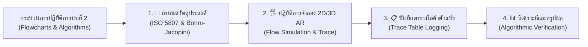
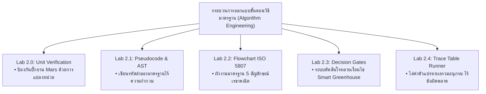

# 🔬 คู่มือปฏิบัติการเสมือนจริง 2D/3D AR MediaPipe Hands ประจำบทที่ 2
## ชุดห้องปฏิบัติการเสมือนจริงเพื่อการจัดการเรียนรู้วิทยาการคำนวณ
### รายวิชา 4122104 วิทยาการคำนวณสำหรับการสอนวิทยาศาสตร์
**ผู้ออกแบบและพัฒนาสื่อ** ผู้ช่วยศาสตราจารย์ ดร.ชีวะ ทัศนา • คณะวิทยาศาสตร์และเทคโนโลยี มหาวิทยาลัยราชภัฏรำไพพรรณี

---

## 🌌 1. สถาปัตยกรรมห้องปฏิบัติการเสมือนจริง 2D/3D

ชุดห้องปฏิบัติการประจำบทที่ 2 มุ่งเน้นการเปลี่ยนขั้นตอนวิธีและผังงานเชิงนามธรรม (Algorithms & Flowcharts) ให้กลายเป็นกระแสการไหลของข้อมูล 3 มิติที่มีการตอบสนองแบบ Interactive Visual Feedback รองรับทั้งโหมด 2D Canvas และ 3D AR MediaPipe Hands

---

## 📚 2. คู่มือการทดลอง 5 ปฏิบัติการเสมือนจริงฉบับสมบูรณ์

---

### 🧪 การทดลองที่ 2.0 แบบจำลองการแปลงหน่วยวิถียานอวกาศและการไหลของผังงาน
* **รหัสโมดูล** `LAB 2.0`
* **รูปแบบการจำลอง** กราฟจำลองวิถียานอวกาศ 2D ควบคู่ผังงาน 3D AR ที่มีลำแสงแสดงกระแสข้อมูลไหลผ่าน
* **ลิงก์เข้าสู่ห้องปฏิบัติการ** [https://tsanaphy2023.github.io/computing-science/simulators/chapter02_visual_flowchart_intro.html](https://tsanaphy2023.github.io/computing-science/simulators/chapter02_visual_flowchart_intro.html)

#### 🎯 1. วัตถุประสงค์การทดลอง
1. เพื่อศึกษาความสำคัญของความถูกต้องเชิงขั้นตอนวิธีและข้อผิดพลาดจากหน่วยวัด (Mars Climate Orbiter Discrepancy: Pound-force vs Newton)
2. เพื่อจำลองการไหลของข้อมูลผ่านสัญลักษณ์ผังงานมาตรฐาน ISO 5807 (Terminator, Process, I/O, Decision)
3. เพื่อคำนวณและปรับเทียบแรงขับดันให้ยานเข้าสู่วงโคจรดาวอังคารได้อย่างปลอดภัย (Orbit Insertion Safety: $150\text{ km} \le h \le 250\text{ km}$)

#### 📐 2. หลักการและทฤษฎี
* **สมการแปลงหน่วยแรงขับดัน**
  $$F_{\text{Newton}} = F_{\text{lbf}} \times 4.4482216152605\text{ N}$$
* **เงื่อนไขความปลอดภัยของวงโคจร**
  $$\text{Safety}(h) = \begin{cases} \text{CRASH (มอดไหม้ในบรรยากาศ)}, & h < 150\text{ km} \\ \text{ORBIT INSERTION SUCCESS}, & 150 \le h \le 250\text{ km} \\ \text{LOST IN SPACE (หลุดวงโคจร)}, & h > 250\text{ km} \end{cases}$$

#### 🛠️ 3. อุปกรณ์และเครื่องมือจำลองเสมือนจริง
1. **3D Mars Orbiter Spacecraft:** แบบจำลองยานอวกาศ 3 มิติพร้อมไอพ่นแรงขับดัน
2. **ISO 5807 Visual Flowchart Node Array:** โหนดผังงาน 3 มิติที่มีลำแสงเลเซอร์วิ่งผ่านตามขั้นตอน
3. **Unit Switcher & Thrust Gauge:** สวิตช์สลับหน่วยวัดระหว่าง Imperial ($lbf \cdot s$) และ Metric ($N \cdot s$)

#### 📝 4. ขั้นตอนการทดลอง
1. เปิดห้องปฏิบัติการเสมือนจริง สังเกตสถานะเริ่มต้นของยานอวกาศที่กำลังเข้าสู่วงโคจรดาวอังคาร
2. ทำการทดลอง **กรณีที่ 1 (ระบบผิดพลาด - ไม่แปลงหน่วย):** ส่งค่าแรงขับดัน $100\text{ lbf} \cdot s$ เข้าสู่ระบบโดยตรง สังเกตระดับความสูงและเส้นทางวิถียาน บันทึกผล
3. กดปุ่ม **RESET**
4. ทำการทดลอง **กรณีที่ 2 (ระบบถูกต้อง - ผ่านโหนดแปลงหน่วย):** เปิดโหนด Process การแปลงหน่วย $F \times 4.448$ สังเกตลำแสงไหลผ่านผังงานและระดับความสูงของยาน
5. บันทึกผลการทดลองลงในตาราง

#### 📋 5. ตารางบันทึกผลการทดลอง

| กรณีทดสอบ (Case) | ค่าแรงขับที่ป้อน | ผ่านการแปลงหน่วยหรือไม่ | แรงลัพธ์ในระบบ (N) | ระดับความสูงวงโคจร ($h$, km) | สถานะความปลอดภัย | การแจ้งเตือนของระบบเสียง (Audio) |
| :---: | :---: | :---: | :---: | :---: | :---: | :---: |
| **Case 1: บั๊กยาน Mars** | $100\text{ lbf}$ | ❌ ไม่แปลงหน่วย | $100\text{ N}$ (น้อยเกินไป) | $57\text{ km}$ | 💥 CRASH (ยานมอดไหม้) | 🚨 เสียง Siren เตือนภัยล้มเหลว |
| **Case 2: ปรับเทียบถูกต้อง**| **$100\text{ lbf}$** | **✅ แปลงคูณ $4.448$** | **$444.82\text{ N}$** | **$193\text{ km}$** | **🎉 ORBIT SUCCESS** | **🎵 เสียง Chime ประสานความสำเร็จ** |
| **Case 3: แรงขับเกิน** | $200\text{ lbf}$ | ✅ แปลงคูณ $4.448$ | $889.64\text{ N}$ | $310\text{ km}$ | ⚠️ LOST IN SPACE | เสียง Harmonic Alert |

#### 📊 6. การวิเคราะห์และสรุปผลการทดลอง
* **การวิเคราะห์** เมื่อระบบไม่มีบล็อกการแปลงหน่วย แรงขับดันที่ส่งให้ยานอวกาศมีค่าน้อยกว่าความเป็นจริงถึง 4.45 เท่า ทำให้ยานลดระดับลงต่ำเกินไปจนมอดไหม้ในชั้นบรรยากาศดาวอังคารที่ความสูง $57\text{ km}$ แต่เมื่อเพิ่มโหนด Process แปลงหน่วย ยานจะเข้าสู่วงโคจรที่ความสูง $193\text{ km}$ ได้อย่างแม่นยำ
* **สรุปผล** ขั้นตอนวิธีที่ดีต้องระบุหน่วยวัดและเงื่อนไขการแปลงข้อมูลอย่างชัดเจนและไม่กำกวม การใช้ผังงานมาตรฐานช่วยให้มองเห็นข้อผิดพลาดของระบบได้ก่อนนำไปใช้งานจริง

---

### 🧪 การทดลองที่ 2.1 ตัววิเคราะห์รหัสลำลองและผังโครงสร้างไวยากรณ์
* **รหัสโมดูล** `LAB 2.1`
* **รูปแบบการจำลอง** 2D Syntax Highlighter ควบคู่ 3D Abstract Syntax Tree (AST) Visualizer
* **ลิงก์เข้าสู่ห้องปฏิบัติการ** [https://tsanaphy2023.github.io/computing-science/simulators/chapter02_pseudocode_linter.html](https://tsanaphy2023.github.io/computing-science/simulators/chapter02_pseudocode_linter.html)

#### 🎯 1. วัตถุประสงค์การทดลอง
1. เพื่อฝึกทักษะการเขียนรหัสลำลอง ตามมาตรฐานวิทยาการคำนวณสากล
2. เพื่อตรวจสอบและแก้ไขข้อผิดพลาดทางโครงสร้างไวยากรณ์ (Syntax & Semantic Linting)
3. เพื่อแปลงรหัสลำลองให้กลายเป็นโครงสร้างต้นไม้วากยสัมพันธ์ (Abstract Syntax Tree - AST 3D)

#### 📐 2. หลักการและทฤษฎี
* **คำสงวนมาตรฐาน ** `BEGIN`, `END`, `INPUT`, `OUTPUT`, `IF-THEN-ELSE-ENDIF`, `WHILE-DO-ENDWHILE`, `FOR-TO-NEXT`
* **หลักการ Indentation (การเยื้องวรรค):** บล็อกคำสั่งภายใต้เงื่อนไขหรือลูปต้องมีการเยื้องวรรคอย่างเคร่งครัด

#### 🛠️ 3. อุปกรณ์และเครื่องมือจำลองเสมือนจริง
1. **Interactive Pseudocode Editor:** กล่องเขียนรหัสลำลองพร้อมระบบตรวจจับคำผิดแบบ Real-time
2. **3D AST Tree Visualizer:** โครงสร้างต้นไม้สามมิติแสดงการแยกกิ่งของคำสั่ง
3. **Linter Rule Validator:** ตัววิเคราะห์กฎ 5 ประการ (No Ambiguity, Valid Keywords, Block Closure)

#### 📝 4. ขั้นตอนการทดลอง
1. เข้าสู่ห้องปฏิบัติการ ทดสอบป้อนรหัสลำลองที่มีข้อผิดพลาด (เช่น ลืม `ENDIF` หรือใช้คำกำกวม)
2. สังเกตการแจ้งเตือน Error ไฮไลต์สีแดงบนโค้ด 2D และสังเกตโหนดกิ่งไม้ 3D ที่หักลง
3. แก้ไขรหัสลำลองให้ถูกต้องตามมาตรฐาน และบันทึกผลการตรวจสอบของ Linter
4. บันทึกผลลงในตาราง

#### 📋 5. ตารางบันทึกผลการทดลอง

| รหัสทดสอบ | โค้จรหัสลำลองที่ป้อน | ผลการตรวจสอบของ Linter | ชนิดของข้อผิดพลาด | สถานะ 3D AST Tree |
| :---: | :--- | :---: | :---: | :---: |
| **Test 1** | `IF temp > 30 THEN spray_water()` *(ลืม ENDIF)* | ❌ LINT ERROR | Block Not Closed (`Missing ENDIF`) | โหนดกิ่งเงื่อนไขสีแดงกระพริบ |
| **Test 2** | `PRINT "Value is " + x` *(ใช้ภาษาเฉพาะ)* | ⚠️ WARNING | Non-Standard Keyword (ควรใช้ `OUTPUT`) | โหนดเตือนสีเหลือง |
| **Test 3** | **`BEGIN ... IF-THEN-ELSE-ENDIF ... END`** | **✅ PASS (100%)** | **ไวยากรณ์สมบูรณ์ถูกต้อง** | **🌟 ต้นไม้ 3D AST สมบูรณ์สีเขียวมรกต** |

#### 📊 6. การวิเคราะห์และสรุปผลการทดลอง
* **การวิเคราะห์** รหัสลำลองที่ขาดคำปิดบล็อก (`ENDIF`, `ENDWHILE`) จะทำให้ตัวแปลภาษาหรือผู้อ่านไม่สามารถทราบขอบเขตการทำงานของคำสั่งได้ ส่งผลให้การสร้างโครงสร้างต้นไม้ AST ล้มเหลว
* **สรุปผล** การเขียนรหัสลำลองที่เป็นมาตรฐานช่วยให้การแปลงไปสู่ภาษาโปรแกรมจริง (เช่น Python, C++, Java) เป็นไปอย่างราบรื่นและปราศจากความกำกวม

---

### 🧪 การทดลองที่ 2.2 สตูดิโอสร้างผังงานมาตรฐาน ISO 5807
* **รหัสโมดูล** `LAB 2.2`
* **รูปแบบการจำลอง** 2D Drag-and-Drop Canvas ควบคู่ 3D AR Spatial Flowchart Grid
* **ลิงก์เข้าสู่ห้องปฏิบัติการ** [https://tsanaphy2023.github.io/computing-science/simulators/chapter02_flowchart_builder.html](https://tsanaphy2023.github.io/computing-science/simulators/chapter02_flowchart_builder.html)

#### 🎯 1. วัตถุประสงค์การทดลอง
1. เพื่อออกแบบและประกอบผังงานมาตรฐาน ISO 5807 สำหรับระบบการตัดสินใจอัจฉริยะ
2. เพื่อตรวจสอบความถูกต้องของการเชื่อมต่อเส้นทางการไหลของข้อมูล (Flowlines & Connectors)
3. เพื่อทดสอบการจำลองการทำงานของผังงานแบบ Step-by-Step ด้วยกระแสแสงเลเซอร์

#### 📐 2. หลักการและทฤษฎี
* **กฎความถูกต้องของผังงาน** 
  * ทุกผังงานต้องมีจุดเริ่มต้น (`START`) และจุดสิ้นสุด (`END`) เพียงอย่างละ 1 จุด
  * สัญลักษณ์การตัดสินใจ (`Decision Diamond`) ต้องมีเส้นทางออกจากโหนดอย่างน้อย 2 เส้นทาง (True / False)

#### 🛠️ 3. อุปกรณ์และเครื่องมือจำลองเสมือนจริง
1. **Toolbox of 5 ISO 5807 Blocks:** กล่องสัญลักษณ์ 5 ชนิดที่สามารถหยิบวางได้
2. **Flowline Connector Tool:** เครื่องมือลากเส้นเชื่อมโยงกระแสข้อมูลพร้อมหัวลูกศร
3. **Execution Simulator Engine:** ตัวขับเคลื่อนกระแสแสงแสดงการทำงานของผังงานทีละบล็อก

#### 📝 4. ขั้นตอนการทดลอง
1. เปิดห้องปฏิบัติการ ใช้ท่าทางมือ Pinch 🤏 หรือคลิกเมาส์หยิบบล็อก `START`, `INPUT`, `DECISION`, `PROCESS`, `END` มาจัดวางบนกระดาน
2. ลากเส้น Flowline เชื่อมต่อแต่ละบล็อกให้เป็นระบบประเมินเกรดนักเรียน ($Score \ge 50$)
3. กดปุ่ม **RUN FLOWCHART** เพื่อปล่อยกระแสแสงเลเซอร์วิ่งผ่านผังงาน
4. ทดสอบป้อนค่า $Score = 75$ และ $Score = 40$ สังเกตเส้นทางที่เลเซอร์เลือกเดิน และบันทึกผลลงในตาราง

#### 📋 5. ตารางบันทึกผลการทดลอง

| ค่าข้อมูลเข้า ($Score$) | เงื่อนไขการตัดสินใจ ($Score \ge 50$) | เส้นทางที่เลเซอร์เลือกเดิน | บล็อกการทำงานถัดไป | ผลลัพธ์ที่แสดง ($Output$) |
| :---: | :---: | :---: | :---: | :---: |
| **75** | $75 \ge 50 \rightarrow$ **TRUE** | เลี้ยวซ้ายสู่กิ่ง True | `PROCESS: Status = "PASS"` | 🟢 `PASS (ผ่านเกณฑ์)` |
| **40** | $40 \ge 50 \rightarrow$ **FALSE** | เลี้ยวขวาสู่กิ่ง False | `PROCESS: Status = "FAIL"` | 🔴 `FAIL (ตกเกณฑ์)` |
| **50** | $50 \ge 50 \rightarrow$ **TRUE** | เลี้ยวซ้ายสู่กิ่ง True | `PROCESS: Status = "PASS"` | 🟢 `PASS (ผ่านพอดี)` |

#### 📊 6. การวิเคราะห์และสรุปผลการทดลอง
* **การวิเคราะห์** ผังงานที่สร้างขึ้นสามารถแยกแยะข้อมูลและกำหนดทิศทางการประมวลผลได้อย่างถูกต้องแม่นยำตามเงื่อนไขทางคณิตศาสตร์ โดยไม่มีสภาวะ Deadlock หรือเส้นทางลอยที่ไม่มีจุดจบ
* **สรุปผล** การออกแบบผังงานช่วยให้การแก้ปัญหามีความชัดเจนเชิงภาพ (Visual Clarity) และช่วยให้สามารถตรวจสอบความครอบคลุมของกรณีทดสอบ (Edge Cases) ได้อย่างสมบูรณ์

---

### 🧪 การทดลองที่ 2.3 ประตูตรรกะและการตัดสินใจหลายเงื่อนไข
* **รหัสโมดูล** `LAB 2.3`
* **รูปแบบการจำลอง** แผงวงจรตรรกะ 2D Schematic ควบคู่ 3D AR Logic Gate Gateway
* **ลิงก์เข้าสู่ห้องปฏิบัติการ** [https://tsanaphy2023.github.io/computing-science/simulators/chapter02_decision_branching.html](https://tsanaphy2023.github.io/computing-science/simulators/chapter02_decision_branching.html)

#### 🎯 1. วัตถุประสงค์การทดลอง
1. เพื่อศึกษาโครงสร้างควบคุมแบบทางเลือกซ้อน (Nested Selection & Multi-branching)
2. เพื่อจำลองระบบควบคุมสภาพแวดล้อมอัตโนมัติในโรงเรือนเกษตรอัจฉริยะ (Smart Greenhouse)
3. เพื่อประเมินผลตรรกะแบบผสม (`AND`, `OR`, `NOT`) ในการสั่งเปิด-ปิดปั๊มพ่นหมอกและพัดลมระบายอากาศ

#### 📐 2. หลักการและทฤษฎี
* **สมการตรรกะควบคุมปั๊มพ่นหมอก**
  $$\text{Pump\_ON} = (\text{Temp} > 35^\circ\text{C}) \land (\text{Humidity} < 40\%) \land (\text{Water\_Level} > 10\%)$$

#### 🛠️ 3. อุปกรณ์และเครื่องมือจำลองเสมือนจริง
1. **Interactive Sensor Knobs:** ปุ่มหมุนปรับอุณหภูมิ, ความชื้น, และระดับน้ำในถัง
2. **3D AR Holographic Greenhouse:** โรงเรือนสามมิติที่แสดงละอองหมอกและพัดลมหมุนจริง
3. **Logic State Monitor:** หน้าจอแสดงสถานะตรรกะ 0/1 ของแต่ละเงื่อนไขแบบเรียลไทม์

#### 📝 4. ขั้นตอนการทดลอง
1. ปรับตั้งค่าตัวแปรใน 4 สถานการณ์ตามตารางบันทึกผล
2. สังเกตสถานะบูลีนของแต่ละเงื่อนไขย่อย และสถานะการทำงานของปั๊มพ่นหมอก
3. บันทึกผลการทำงานของระบบลงในตาราง

#### 📋 5. ตารางบันทึกผลการทดลอง

| สถานการณ์ | อุณหภูมิ ($T$) | ความชื้น ($H$) | ระดับน้ำ ($W$) | $T > 35$ | $H < 40$ | $W > 10$ | สถานะปั๊มพ่นหมอก (Output) | ปรากฏการณ์ 3D / เสียง Synth |
| :---: | :---: | :---: | :---: | :---: | :---: | :---: | :---: | :---: |
| **1. ปกติ** | $28^\circ\text{C}$ | $65\%$ | $80\%$ | 0 (False) | 0 (False) | 1 (True) | ⭕ **OFF (ปิด)** | สภาพแวดล้อมสีเขียวปกติ |
| **2. ร้อนแต่ชื้น** | $38^\circ\text{C}$ | $75\%$ | $80\%$ | 1 (True) | 0 (False) | 1 (True) | ⭕ **OFF (พัดลมระบายแทน)** | พัดลม 3D หมุนเร็ว |
| **3. ร้อนและแห้ง** | **$40^\circ\text{C}$** | **$25\%$** | **$80\%$** | **1 (True)** | **1 (True)** | **1 (True)** | **⚡ ON (เปิดพ่นหมอก)** | **🌧️ หมอก 3D ฟุ้งกระจาย + เสียง Chime** |
| **4. น้ำหมดถัง** | $40^\circ\text{C}$ | $25\%$ | $5\%$ | 1 (True) | 1 (True) | 0 (False) | ⛔ **OFF (Safety Lock)** | 🚨 ไฟสีแดงเตือนน้ำหมดถัง |

#### 📊 6. การวิเคราะห์และสรุปผลการทดลอง
* **การวิเคราะห์** แม้อุณหภูมิจะสูงและความชื้นจะต่ำมากในสถานการณ์ที่ 4 แต่ระบบมีเงื่อนไขความปลอดภัย $W > 10\%$ ดักจับไว้ ทำให้ปั๊มไม่ทำงาน ป้องกันไม่ให้ปั๊มน้ำไหม้เสียหาย
* **สรุปผล** การออกแบบเงื่อนไขการตัดสินใจที่รัดกุมช่วยป้องกันความเสียหายของฮาร์ดแวร์ในระบบ IoT และระบบอัตโนมัติได้อย่างมีประสิทธิภาพ

---

### 🧪 การทดลองที่ 2.4 การไล่ค่าตัวแปรด้วยตารางอนิเมชัน
* **รหัสโมดูล** `LAB 2.4`
* **รูปแบบการจำลอง** ตาราง Trace Table 2D สด ควบคู่ 3D Variable Memory Cubes
* **ลิงก์เข้าสู่ห้องปฏิบัติการ** [https://tsanaphy2023.github.io/computing-science/simulators/chapter02_trace_table_runner.html](https://tsanaphy2023.github.io/computing-science/simulators/chapter02_trace_table_runner.html)

#### 🎯 1. วัตถุประสงค์การทดลอง
1. เพื่อฝึกทักษะการตรวจสอบความถูกต้องของขั้นตอนวิธีด้วยตารางไล่ค่าตัวแปร (Trace Table / Dry Run)
2. เพื่อติดตามการเปลี่ยนแปลงค่าของตัวแปร $i$ และ $Sum$ ในแต่ละรอบของการวนซ้ำ (Iteration)
3. เพื่อค้นหาและกำจัดข้อผิดพลาดประเภท Off-by-One Error และ Infinite Loop

#### 📐 2. หลักการและทฤษฎี
* **ขั้นตอนวิธีหาผลรวมอนุกรม** $S_n = \sum_{i=1}^{n} i = \frac{n(n+1)}{2}$
* **การไล่ค่าสถานะ ** ในแต่ละบรรทัดคำสั่ง ค่าตัวแปรในหน่วยความจำจะถูกอัปเดตตามลำดับเวลา

#### 🛠️ 3. อุปกรณ์และเครื่องมือจำลองเสมือนจริง
1. **Interactive Code Stepper:** ปุ่มก้าวข้ามคำสั่งทีละบรรทัด (`STEP FORWARD ⏭️`)
2. **3D Glowing Memory Cubes:** ลูกบาศก์เรืองแสงแสดงค่าตัวแปร $i$ และ $Sum$ ในอากาศ
3. **Live Trace Grid:** ตารางบันทึกค่าตัวแปรอัตโนมัติในแต่ละรอบ

#### 📝 4. ขั้นตอนการทดลอง
1. รันโปรแกรมคำนวณผลรวม $1$ ถึง $5$ ทีละขั้นตอนด้วยปุ่ม `STEP`
2. สังเกตค่าตัวแปรที่เปลี่ยนไปในแต่ละรอบของการวนซ้ำ
3. บันทึกค่า $i$ และ $Sum$ ลงในตาราง Trace Table จนกระทั่งหลุดออกจากลูป

#### 📋 5. ตารางบันทึกผลการทดลอง

| รอบที่ (Iteration) | บรรทัดคำสั่งที่ทำงาน | ค่าตัวแปร $i$ | ค่าตัวแปร $Sum$ | เงื่อนไขลูป ($i \le 5$) | สถานะลูกบาศก์หน่วยความจำ 3D |
| :---: | :--- | :---: | :---: | :---: | :---: |
| **เริ่มต้น** | `Sum = 0, i = 1` | 1 | 0 | 1 (True) | ลูกบาศก์ $Sum=0$ เรืองแสงสีฟ้า |
| **รอบที่ 1** | `Sum = Sum + i; i = i + 1` | 2 | 1 | 1 (True) | ลูกบาศก์ $Sum=1, i=2$ |
| **รอบที่ 2** | `Sum = Sum + i; i = i + 1` | 3 | 3 | 1 (True) | ลูกบาศก์ $Sum=3, i=3$ |
| **รอบที่ 3** | `Sum = Sum + i; i = i + 1` | 4 | 6 | 1 (True) | ลูกบาศก์ $Sum=6, i=4$ |
| **รอบที่ 4** | `Sum = Sum + i; i = i + 1` | 5 | 10 | 1 (True) | ลูกบาศก์ $Sum=10, i=5$ |
| **รอบที่ 5** | `Sum = Sum + i; i = i + 1` | 6 | 15 | **0 (False - หลุดลูป)** | **🌟 ลูกบาศก์ $Sum=15$ สีทองคำสว่าง** |

#### 📊 6. การวิเคราะห์และสรุปผลการทดลอง
* **การวิเคราะห์** ผลรวมที่คำนวณได้จากตาราง Trace Table คือ $15$ ซึ่งตรงกับสูตรคณิตศาสตร์ $\frac{5(5+1)}{2} = 15$ อย่างสมบูรณ์ และเมื่อจบลูปค่า $i$ จะมีค่าเป็น $6$ ทำให้เงื่อนไข $6 \le 5$ เป็นเท็จและโปรแกรมจบการทำงานอย่างถูกต้อง
* **สรุปผล** ตาราง Trace Table เป็นเครื่องมือทางวิศวกรรมซอฟต์แวร์ที่ทรงพลังที่สุดในการตรวจสอบอัลกอริทึมด้วยมือ (Dry Run) ช่วยให้นักพัฒนาค้นพบข้อผิดพลาดเชิงตรรกะได้ก่อนนำโค้ดไปรันจริง

---

## ❓ 3. สรุปภาพรวมและการประเมินผลการเรียนรู้

### 📝 คำถามทบทวนท้ายบทปฏิบัติการ
1. **การวิเคราะห์บั๊กอวกาศ** เหตุใดความผิดพลาดของยาน Mars Climate Orbiter จึงจัดเป็นความผิดพลาดเชิงขั้นตอนวิธี (Algorithmic Error) มากกว่าความผิดพลาดทางฮาร์ดแวร์?
2. **การประยุกต์ใช้ Trace Table:** หากในแล็บ 2.4 มีการเขียนคำสั่งสลับบรรทัดเป็น `i = i + 1; Sum = Sum + i;` จงสร้างตาราง Trace Table และหาว่าค่า $Sum$ สุดท้ายจะเปลี่ยนเป็นเท่าใด?
3. **การออกแบบผังงาน** ให้นักเรียนเขียนผังงานมาตรฐาน ISO 5807 สำหรับระบบตู้ ATM ที่ตรวจสอบรหัส PIN (อนุญาตให้กรอกผิดได้ไม่เกิน 3 ครั้ง)
