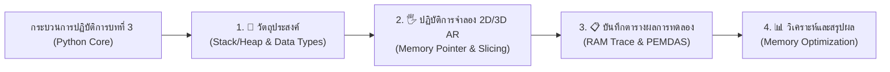

# 🔬 คู่มือปฏิบัติการเสมือนจริง 2D/3D AR MediaPipe Hands ประจำบทที่ 3
## ชุดห้องปฏิบัติการเสมือนจริงเพื่อการจัดการเรียนรู้วิทยาการคำนวณ (Interactive STEM Virtual Labs)
### รายวิชา: 4122104 วิทยาการคำนวณสำหรับการสอนวิทยาศาสตร์ (CS2026)
**ผู้ออกแบบและพัฒนาสื่อ:** ผู้ช่วยศาสตราจารย์ ดร.ชีวะ ทัศนา • คณะวิทยาศาสตร์และเทคโนโลยี มหาวิทยาลัยราชภัฏรำไพพรรณี

---

## 🌌 1. สถาปัตยกรรมห้องปฏิบัติการเสมือนจริง 2D/3D บทที่ 3 (Python Basics & Memory)

---

## 📚 2. คู่มือการทดลอง 5 ปฏิบัติการเสมือนจริงฉบับสมบูรณ์ (5 Complete Lab Modules)

### 🧪 LAB 3.0: แบบจำลองหน่วยความจำ Stack & Heap (Python Memory Architecture)
* **รหัสโมดูล:** `LAB 3.0`
* **รูปแบบการจำลอง:** 2D Stack Frame View $\leftrightarrow$ 3D AR Spatial Heap Memory Blocks
* **ลิงก์เข้าสู่ห้องปฏิบัติการ:** [https://tsanaphy2023.github.io/computing-science/simulators/chapter03_memory_model.html](https://tsanaphy2023.github.io/computing-science/simulators/chapter03_memory_model.html)
* **วัตถุประสงค์:**
  1. ศึกษาความแตกต่างของการเก็บข้อมูลระหว่าง Stack (Primitive Types) และ Heap (Reference Objects)
  2. ติดตามพอยน์เตอร์การชี้ตำแหน่งหน่วยความจำ (Memory Address Pointers)
  3. สังเกตการทำงานของตัวเก็บกวาดขยะหน่วยความจำ (Garbage Collector)
* **ตารางบันทึกผลการทดลอง:**

| คำสั่งภาษา Python | ประเภทตัวแปร | ตำแหน่งจัดเก็บ (Stack/Heap) | ที่อยู่หน่วยความจำ (Address) | ขนาดที่ใช้ (Bytes) |
| :--- | :---: | :---: | :---: | :---: |
| `a = 42` | `int` | Stack Frame | `0x7FFF00` | 28 Bytes |
| `pi = 3.14159` | `float` | Stack Frame | `0x7FFF08` | 24 Bytes |
| `lst = [10, 20, 30]` | `list` | Heap (ชี้จาก Stack) | `0x00A1F0` | 88 Bytes |
| `del lst` | `None` | Heap (ถูก Garbage Collector ล้าง) | `0x000000` | คืนพื้นที่ 88 Bytes |

* **สรุปผล:** ข้อมูลขนาดคงที่และอายุสั้นจะถูกจัดสรรใน Stack อย่างรวดเร็ว ขณะที่ข้อมูลโครงสร้างแบบไดนามิกจะถูกจัดสรรใน Heap และจัดการความปลอดภัยด้วย Garbage Collector

---

### 🧪 LAB 3.1: เมทริกซ์ชนิดข้อมูลและการแปลงชนิด (Data Types & Type Casting)
* **รหัสโมดูล:** `LAB 3.1`
* **รูปแบบการจำลอง:** 2D Interactive Matrix $\leftrightarrow$ 3D Data Cube Hologram
* **ลิงก์เข้าสู่ห้องปฏิบัติการ:** [https://tsanaphy2023.github.io/computing-science/simulators/chapter03_data_types_matrix.html](https://tsanaphy2023.github.io/computing-science/simulators/chapter03_data_types_matrix.html)
* **วัตถุประสงค์:** เพื่อศึกษาพฤติกรรมของ `int`, `float`, `str`, `bool` และผลกระทบของการแปลงชนิดข้อมูล (Type Casting)
* **ตารางบันทึกผลการทดลอง:**

| ค่าเริ่มต้น (Input) | ชนิดเดิม | ฟังก์ชันแปลงค่า | ค่าผลลัพธ์ (Output) | ชนิดใหม่ | การเกิดข้อผิดพลาด |
| :---: | :---: | :---: | :---: | :---: | :---: |
| `"42"` | `str` | `int(x)` | `42` | `int` | ✅ สำเร็จ |
| `"3.14"` | `str` | `int(x)` | — | — | ❌ `ValueError` (มีจุดทศนิยม) |
| `"3.14"` | `str` | `float(x)` | `3.14` | `float` | ✅ สำเร็จ |
| `0` | `int` | `bool(x)` | `False` | `bool` | ✅ ค่าศูนย์เป็นเท็จ |

* **สรุปผล:** การแปลงชนิดข้อมูลต้องสอดคล้องกับรูปแบบวากยสัมพันธ์ สตริงทศนิยมไม่สามารถแปลงเป็น `int` โดยตรงได้ ต้องผ่าน `float()` ก่อน

---

### 🧪 LAB 3.2: ลำดับความสำคัญของตัวดำเนินการ (PEMDAS Operator Hierarchy)
* **รหัสโมดูล:** `LAB 3.2`
* **รูปแบบการจำลอง:** 2D Expression Tree $\leftrightarrow$ 3D Operator Orbit
* **ลิงก์เข้าสู่ห้องปฏิบัติการ:** [https://tsanaphy2023.github.io/computing-science/simulators/chapter03_pemdas_evaluator.html](https://tsanaphy2023.github.io/computing-science/simulators/chapter03_pemdas_evaluator.html)
* **วัตถุประสงค์:** เพื่อประเมินค่านิพจน์คณิตศาสตร์ตามลำดับความสำคัญสากล (Parentheses $
ightarrow$ Exponent $
ightarrow$ Multiply/Divide $
ightarrow$ Add/Subtract)
* **ตารางบันทึกผลการทดลอง:**

| นิพจน์คณิตศาสตร์ | ขั้นที่ 1 (วงเล็บ/ยกกำลัง) | ขั้นที่ 2 (คูณ/หาร) | ขั้นที่ 3 (บวก/ลบ) | ผลลัพธ์สุดท้าย |
| :--- | :---: | :---: | :---: | :---: |
| `2 + 3 * 4 ** 2` | `4 ** 2 = 16` | `3 * 16 = 48` | `2 + 48 = 50` | **50** |
| `(2 + 3) * 4 ** 2` | `(2 + 3) = 5`, `4 ** 2 = 16` | `5 * 16 = 80` | — | **80** |

* **สรุปผล:** วงเล็บมีความสำคัญสูงสุดและสามารถเปลี่ยนทิศทางการประมวลผลของอัลกอริทึมได้อย่างสิ้นเชิง

---

### 🧪 LAB 3.3: การสไลซ์และจัดกระทำสตริง (String Slicing & Indexing)
* **รหัสโมดูล:** `LAB 3.3`
* **รูปแบบการจำลอง:** 2D String Ribbon $\leftrightarrow$ 3D Character Blocks
* **ลิงก์เข้าสู่ห้องปฏิบัติการ:** [https://tsanaphy2023.github.io/computing-science/simulators/chapter03_string_slicing.html](https://tsanaphy2023.github.io/computing-science/simulators/chapter03_string_slicing.html)
* **วัตถุประสงค์:** เข้าถึงข้อมูลอักขระด้วยดัชนีบวกและลบ [start:stop:step]
* **ตารางบันทึกผลการทดลอง:**

| ข้อความต้นฉบับ | รูปแบบสไลซ์ | Start | Stop | Step | ข้อความที่ได้ |
| :---: | :---: | :---: | :---: | :---: | :---: |
| `"COMPUTING"` | `s[0:4]` | 0 | 4 | 1 | `"COMP"` |
| `"COMPUTING"` | `s[-3:]` | -3 | End | 1 | `"ING"` |
| `"COMPUTING"` | `s[::-1]` | End | Start | -1 | `"GNITUPMOC"` (กลับสตริง) |

---

### 🧪 LAB 3.4: ระบบจัดการข้อมูลนำเข้าและแสดงผล (Interactive I/O & Formatting)
* **รหัสโมดูล:** `LAB 3.4`
* **รูปแบบการจำลอง:** 2D Terminal Console $\leftrightarrow$ 3D Holographic Output Screen
* **ลิงก์เข้าสู่ห้องปฏิบัติการ:** [https://tsanaphy2023.github.io/computing-science/simulators/chapter03_interactive_io.html](https://tsanaphy2023.github.io/computing-science/simulators/chapter03_interactive_io.html)
* **วัตถุประสงค์:** ศึกษาการรับข้อมูลผ่าน `input()` และการจัดรูปแบบด้วย F-String
* **ตารางบันทึกผลการทดลอง:**

| ข้อมูลนำเข้า | คำสั่ง F-String | ข้อความแสดงผลที่ได้ |
| :--- | :--- | :--- |
| `name="Dr.Chewa", score=98.5432` | `f"Name: {name}, Score: {score:.2f}"` | `Name: Dr.Chewa, Score: 98.54` |
