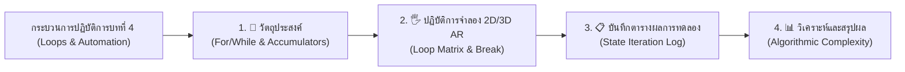

# 🔬 คู่มือปฏิบัติการเสมือนจริง 2D/3D AR MediaPipe Hands ประจำบทที่ 4
## ชุดห้องปฏิบัติการเสมือนจริงเพื่อการจัดการเรียนรู้วิทยาการคำนวณ (Interactive STEM Virtual Labs)
### รายวิชา: 4122104 วิทยาการคำนวณสำหรับการสอนวิทยาศาสตร์ (CS2026)
**ผู้ออกแบบและพัฒนาสื่อ:** ผู้ช่วยศาสตราจารย์ ดร.ชีวะ ทัศนา • คณะวิทยาศาสตร์และเทคโนโลยี มหาวิทยาลัยราชภัฏรำไพพรรณี

---

## 🌌 1. สถาปัตยกรรมห้องปฏิบัติการเสมือนจริง 2D/3D บทที่ 4 (Loops & Automation)

---

## 📚 2. คู่มือการทดลอง 5 ปฏิบัติการเสมือนจริงฉบับสมบูรณ์ (5 Complete Lab Modules)

### 🧪 LAB 4.0: แบบจำลองการวนซ้ำและการควบคุมลูป (Loop Visualizer & Automation)
* **รหัสโมดูล:** `LAB 4.0`
* **รูปแบบการจำลอง:** 2D Loop Matrix $\leftrightarrow$ 3D AR Spinning Torus Loop
* **ลิงก์เข้าสู่ห้องปฏิบัติการ:** [https://tsanaphy2023.github.io/computing-science/simulators/chapter04_loop_visualizer.html](https://tsanaphy2023.github.io/computing-science/simulators/chapter04_loop_visualizer.html)
* **วัตถุประสงค์:** ศึกษาพฤติกรรมการทำงานของลูป `for`, `while`, คำสั่ง `break`, `continue`
* **ตารางบันทึกผลการทดลอง:**

| รอบการวนซ้ำ (i) | คำสั่งประมวลผล | ตัวแปรสะสม Total | ผลของเงื่อนไขพิเศษ | สถานะการทำงาน |
| :---: | :---: | :---: | :---: | :---: |
| 1 | `Total += 1` | 1 | ปกติ | RUNNING |
| 2 | `Total += 2` | 3 | ปกติ | RUNNING |
| 3 | `Total += 3` | 6 | `if i == 3: continue` | ข้ามการพิมพ์ |
| 5 | `Total += 5` | 15 | `if Total >= 15: break` | **TERMINATED (หยุดลูป)** |

* **สรุปผล:** คำสั่ง `break` ช่วยเพิ่มประสิทธิภาพของโปรแกรมโดยการหยุดการทำงานทันทีเมื่อบรรลุเป้าหมาย ทำให้ประหยัดเวลา CPU
