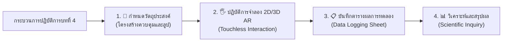

# 🔬 คู่มือปฏิบัติการเสมือนจริง 2D/3D AR MediaPipe Hands ประจำบทที่ 4
## ชุดห้องปฏิบัติการเสมือนจริงเพื่อการจัดการเรียนรู้วิทยาการคำนวณ (Interactive STEM Virtual Labs)
### รายวิชา: 4122104 วิทยาการคำนวณสำหรับการสอนวิทยาศาสตร์ (CS2026)
**ผู้ออกแบบและพัฒนาสื่อ:** ผู้ช่วยศาสตราจารย์ ดร.ชีวะ ทัศนา • คณะวิทยาศาสตร์และเทคโนโลยี มหาวิทยาลัยราชภัฏรำไพพรรณี

---

## 🌌 1. สถาปัตยกรรมห้องปฏิบัติการเสมือนจริง 2D/3D บทที่ 4 (โครงสร้างควบคุมและลูป)

---

## 📚 2. คู่มือการทดลอง 5 ปฏิบัติการเสมือนจริงฉบับสมบูรณ์ (5 Complete Lab Modules)

### 🧪 การทดลองที่ 4.0: แบบจำลองการวนซ้ำและการควบคุมลูป (Loop Visualizer & Automation)
* **รหัสโมดูล:** `LAB 4.0`
* **รูปแบบการจำลอง:** 2D Loop Matrix $\leftrightarrow$ 3D AR Spinning Torus Loop
* **ลิงก์เข้าสู่ห้องปฏิบัติการ:** [https://tsanaphy2023.github.io/computing-science/simulators/chapter04_loop_visualizer.html](https://tsanaphy2023.github.io/computing-science/simulators/chapter04_loop_visualizer.html)

#### 🎯 1. วัตถุประสงค์การทดลอง
1. ศึกษาพฤติกรรมการทำงานของลูป for และ while
2. ตรวจสอบการทำงานของคำสั่ง break และ continue
3. คำนวณผลรวมสะสมในแต่ละรอบการวนซ้ำ

#### 📐 2. หลักการและทฤษฎี (Principles & Theory)
ลูป `for` เหมาะกับการวนซ้ำที่ทราบจำนวนรอบแน่นอน ขณะที่ลูป `while` เหมาะกับการวนซ้ำตามเงื่อนไขบูลีน คำสั่ง `break` ใช้เพื่อออกจากลูปทันที และ `continue` ใช้เพื่อข้ามรอบปัจจุบัน

#### 🛠️ 3. อุปกรณ์และเครื่องมือจำลองเสมือนจริง
1. 3D Spinning Torus Knot
2. Step-by-Step Iteration Stepper
3. Loop State Monitor

#### 📝 4. ขั้นตอนการทดลอง (Experimental Procedures)
1. รันลูป `for i in range(1, 6)` และบันทึกค่าสะสม
2. ทดลองสั่ง `break` เมื่อ $i = 3$
3. ทดลองสั่ง `continue` เมื่อ $i = 3$ และสังเกตผล

#### 📋 5. ตารางบันทึกผลการทดลอง (Data Collection Table)
| รอบที่ (i) | คำสั่งประมวลผล | ตัวแปรสะสม Total | ผลของเงื่อนไขพิเศษ | สถานะการทำงาน |
| :---: | :---: | :---: | :---: | :---: |
| 1 | `Total += 1` | 1 | ปกติ | RUNNING |
| 2 | `Total += 2` | 3 | ปกติ | RUNNING |
| 3 | `Total += 3` | 6 | `if i == 3: continue` | ข้ามการพิมพ์ |
| 5 | `Total += 5` | 15 | `if Total >= 15: break` | **TERMINATED (หยุดลูป)** |

#### 📊 6. การวิเคราะห์และสรุปผลการทดลอง (Conclusion & Analysis)
* **สรุปผล:** การใช้คำสั่ง `break` และ `continue` อย่างเหมาะสมช่วยลดการทำงานที่ไม่จำเป็นของ CPU และเพิ่มประสิทธิภาพของขั้นตอนวิธี

---
## ❓ 3. สรุปภาพรวมและคำถามทบทวนท้ายบทปฏิบัติการ (Assessment & Review)

### 📝 คำถามทบทวนท้ายบทปฏิบัติการ (Post-Lab Review Questions)
1. จงอธิบายการประยุกต์ใช้ความรู้จากห้องปฏิบัติการบทที่ 4 ในการพัฒนาสื่อการสอนวิทยาศาสตร์ในชั้นเรียน
2. ให้นักเรียนเปรียบเทียบข้อดีและข้อจำกัดของการทดลองบนระบบจำลองเสมือนจริง 2D Canvas และ 3D AR MediaPipe Hands
3. ให้ออกแบบใบกิจกรรมการเรียนรู้แบบสืบเสาะ (Inquiry-based Worksheet) สำหรับนักเรียนระดับมัธยมศึกษาโดยใช้ห้องปฏิบัติการนี้
