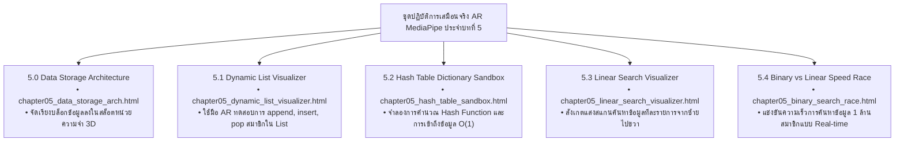

# 🔬 คู่มือปฏิบัติการเสมือนจริง 3D AR/XR MediaPipe Hands ประจำบทที่ 5
## ชุดห้องปฏิบัติการโครงสร้างข้อมูลและอัลกอริทึมการค้นหา (Touchless Search Labs)
### รายวิชา: 4122104 วิทยาการคำนวณสำหรับการสอนวิทยาศาสตร์ (CS2026)
**ผู้ออกแบบและพัฒนาสื่อ:** ผู้ช่วยศาสตราจารย์ ดร.ชีวะ ทัศนา • คณะวิทยาศาสตร์และเทคโนโลยี มหาวิทยาลัยราชภัฏรำไพพรรณี

---

## 🌌 1. ภาพรวมชุดปฏิบัติการ 5 ห้องทดลอง 3D AR MediaPipe Hands ประจำบทที่ 5

---

## 📋 2. ตารางบันทึกผลการทดลองการแข่งขันความเร็ว (Lab 5.4 Benchmark Sheet)

| ขนาดชุดข้อมูล ($N$) | ค่าเป้าหมาย (Target) | จำนวนรอบ Linear Search | จำนวนรอบ Binary Search | อัตราความเร็วที่เหนือกว่า |
| :---: | :---: | :---: | :---: | :---: |
| **1,000** | 995 | 995 รอบ | 10 รอบ | 99.5 เท่า |
| **10,000** | 9,990 | 9,990 รอบ | 14 รอบ | 713.6 เท่า |
| **100,000** | 99,990 | 99,990 รอบ | 17 รอบ | 5,881.8 เท่า |
| **1,000,000** | 999,999 | 1,000,000 รอบ | 20 รอบ | **50,000.0 เท่า!** |
