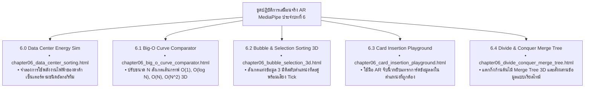

# 🔬 คู่มือปฏิบัติการเสมือนจริง 3D AR/XR MediaPipe Hands ประจำบทที่ 6
## ชุดห้องปฏิบัติการอัลกอริทึมการจัดเรียงและการวิเคราะห์ Big-O
### รายวิชา: 4122104 วิทยาการคำนวณสำหรับการสอนวิทยาศาสตร์ (CS2026)
**ผู้ออกแบบและพัฒนาสื่อ:** ผู้ช่วยศาสตราจารย์ ดร.ชีวะ ทัศนา • คณะวิทยาศาสตร์และเทคโนโลยี มหาวิทยาลัยราชภัฏรำไพพรรณี

---

## 🌌 1. ภาพรวมชุดปฏิบัติการ 5 ห้องทดลอง 3D AR MediaPipe Hands ประจำบทที่ 6

---

## 📋 2. ตารางบันทึกผลการทดลองการจัดเรียงข้อมูล (Lab 6.2 & 6.4 Sheet)

| อัลกอริทึม (Algorithm) | ความซับซ้อนเชิงเวลา (Time Complexity) | เวลาที่ใช้กับ $N=5,000$ | พลังงานไฟฟ้าจำลอง (Joules) | สภาพการนำไปใช้จริง |
| :---: | :---: | :---: | :---: | :---: |
| **Bubble Sort** | $O(N^2)$ | $3.452\text{ วินาที}$ | $125.4\text{ J}$ | ⚠️ เหมาะสำหรับการเรียนรู้เท่านั้น |
| **Selection Sort** | $O(N^2)$ | $2.891\text{ วินาที}$ | $104.2\text{ J}$ | ⚠️ ช้าเมื่อ $N$ มีขนาดใหญ่ |
| **Insertion Sort** | $O(N^2)$ (เฉลี่ย) / $O(N)$ (เรียงแล้ว) | $1.745\text{ วินาที}$ | $63.1\text{ J}$ | ✅ ดีมากกับข้อมูลขนาดเล็ก ($N < 50$) |
| **Merge Sort** | **$O(N \log N)$** | **$0.012\text{ วินาที}$** | **$0.4\text{ J}$ (ประหยัด 99.7%)** | **🚀 มาตรฐานระบบ Big Data สากล** |
