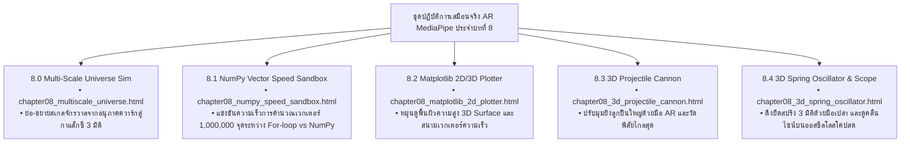

# 🔬 คู่มือปฏิบัติการเสมือนจริง 3D AR/XR MediaPipe Hands ประจำบทที่ 8
## ชุดห้องปฏิบัติการวิทยาศาสตร์เชิงคำนวณและแบบจำลองฟิสิกส์ (Computational Physics Labs)
### รายวิชา: 4122104 วิทยาการคำนวณสำหรับการสอนวิทยาศาสตร์ (CS2026)
**ผู้ออกแบบและพัฒนาสื่อ:** ผู้ช่วยศาสตราจารย์ ดร.ชีวะ ทัศนา • คณะวิทยาศาสตร์และเทคโนโลยี มหาวิทยาลัยราชภัฏรำไพพรรณี

---

## 🌌 1. ภาพรวมชุดปฏิบัติการ 5 ห้องทดลอง 3D AR MediaPipe Hands ประจำบทที่ 8

---

## 📋 2. ตารางบันทึกผลการทดลองโพรเจกไทล์ (Lab 8.3 Projectile Motion Sheet)

| มุมยิง $\theta$ (องศา) | ความเร็วต้น $v_0$ (m/s) | เวลาการบิน $T$ (วินาที) | พิสัยไกลสุด $R$ (เมตร) | ความสูงสูงสุด $H$ (เมตร) |
| :---: | :---: | :---: | :---: | :---: |
| **$15^\circ$** | $50.0\text{ m/s}$ | $2.64\text{ s}$ | $127.46\text{ m}$ | $8.54\text{ m}$ |
| **$30^\circ$** | $50.0\text{ m/s}$ | $5.10\text{ s}$ | $220.78\text{ m}$ | $31.86\text{ m}$ |
| **$45^\circ$ (มุมวิกฤต)** | **$50.0\text{ m/s}$** | **$7.21\text{ s}$** | **$254.93\text{ m}$ (ไกลสุด)** | **$63.73\text{ m}$** |
| **$60^\circ$** | $50.0\text{ m/s}$ | $8.83\text{ s}$ | $220.78\text{ m}$ | $95.59\text{ m}$ |
| **$75^\circ$** | $50.0\text{ m/s}$ | $9.85\text{ s}$ | $127.46\text{ m}$ | $118.92\text{ m}$ |
