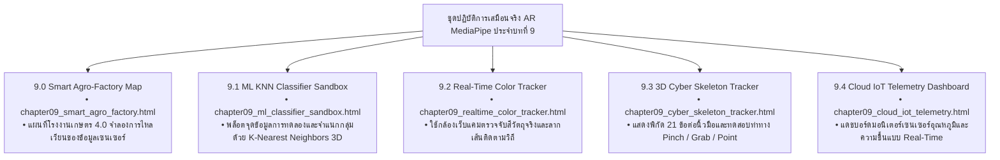

# 🔬 คู่มือปฏิบัติการเสมือนจริง 3D AR/XR MediaPipe Hands ประจำบทที่ 9
## ชุดห้องปฏิบัติการปัญญาประดิษฐ์ คอมพิวเตอร์วิทัศน์ และ IoT
### รายวิชา: 4122104 วิทยาการคำนวณสำหรับการสอนวิทยาศาสตร์ (CS2026)
**ผู้ออกแบบและพัฒนาสื่อ:** ผู้ช่วยศาสตราจารย์ ดร.ชีวะ ทัศนา • คณะวิทยาศาสตร์และเทคโนโลยี มหาวิทยาลัยราชภัฏรำไพพรรณี

---

## 🌌 1. ภาพรวมชุดปฏิบัติการ 5 ห้องทดลอง 3D AR MediaPipe Hands ประจำบทที่ 9

---

## 📋 2. ตารางบันทึกผลการทดลองการตรวจจับท่าทาง (Lab 9.3 Landmark Sheet)

| ท่าทางมือ (Hand Gesture) | ข้อต่อที่ใช้ตรวจจับ (Landmarks) | เงื่อนไขคณิตศาสตร์ (Math Condition) | ผลลัพธ์ในระบบ 3D AR |
| :---: | :---: | :---: | :---: |
| **Point (☝️ ชี้พิกัด)** | Index Tip (8) เหยียดตรง, นิ้วอื่นพับ | $y_8 < y_6$ และ $y_{12} > y_{10}$ | ฉายลำแสงเลเซอร์เล็งพิกัดในอวกาศ 3 มิติ |
| **Pinch (🤏 จีบนิ้ว)** | Thumb Tip (4) ชิด Index Tip (8) | $\text{Distance}(4, 8) < 0.08$ | **จับยึดวัตถุ 3D (Pick & Place)** + เสียง Chime |
| **Fist Grab (✊ กำหมัด)** | ปลายนิ้ว 8, 12, 16, 20 พับเข้าหาฝ่ามือ (0) | $\text{Avg Distance} < 0.12$ | **หมุนมุมมองฉาก 360 องศา (Spatial Orbit)** |
| **Open Palm (🖐️ แบมือ)** | ปลายนิ้วทุกนิ้วเหยียดตรงออก | $\text{Avg Distance} > 0.35$ | **เปิดแถบเมนูโฮโลแกรม (Holographic HUD)** |
