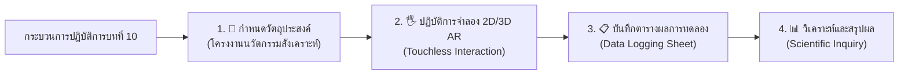

# 🔬 คู่มือปฏิบัติการเสมือนจริง 2D/3D AR MediaPipe Hands ประจำบทที่ 10
## ชุดห้องปฏิบัติการเสมือนจริงเพื่อการจัดการเรียนรู้วิทยาการคำนวณ
### รายวิชา 4122104 วิทยาการคำนวณสำหรับการสอนวิทยาศาสตร์
**ผู้ออกแบบและพัฒนาสื่อ** ผู้ช่วยศาสตราจารย์ ดร.ชีวะ ทัศนา • คณะวิทยาศาสตร์และเทคโนโลยี มหาวิทยาลัยราชภัฏรำไพพรรณี

---

## 🌌 1. สถาปัตยกรรมห้องปฏิบัติการเสมือนจริง 2D/3D บทที่ 10 (โครงงานนวัตกรรมสังเคราะห์)

---

## 📚 2. คู่มือการทดลอง 5 ปฏิบัติการเสมือนจริงฉบับสมบูรณ์

### 🧪 การทดลองที่ 10.0 การประมวลความรู้และสถาปัตยกรรมโครงงาน
* **รหัสโมดูล** `LAB 10.0`
* **รูปแบบการจำลอง** 2D Architecture Matrix $\leftrightarrow$ 3D Capstone Hologram
* **ลิงก์เข้าสู่ห้องปฏิบัติการ** [https://tsanaphy2023.github.io/computing-science/simulators/chapter10_capstone_synthesizer.html](https://tsanaphy2023.github.io/computing-science/simulators/chapter10_capstone_synthesizer.html)

#### 🎯 1. วัตถุประสงค์การทดลอง
1. สังเคราะห์องค์ความรู้ 10 บทสู่สถาปัตยกรรม Full-Stack
2. ตรวจสอบความสมบูรณ์ของโครงงานนวัตกรรมดิจิทัล

#### 📐 2. หลักการและทฤษฎี
โครงงานนวัตกรรมที่สมบูรณ์ต้องผสานส่วน Logic, Data, AI Vision, และ IoT Physical Computing เข้าด้วยกันอย่างไร้รอยต่อ

#### 🛠️ 3. อุปกรณ์และเครื่องมือจำลองเสมือนจริง
1. Full-Stack System Tree
2. Automated Module Verification Engine
3. 3D Project Crystal Hologram

#### 📝 4. ขั้นตอนการทดลอง
1. ตรวจสอบการเชื่อมต่อของ 4 โมดูลหลัก (Logic, Vision, Data, IoT)
2. รันระบบทดสอบ Release Verification
3. บันทึกผลการประเมินโครงงาน

#### 📋 5. ตารางบันทึกผลการทดลอง
| หมวดองค์ความรู้ | โมดูลในโครงงาน | สถานะการทดสอบ Unit Tests | คะแนนความสมบูรณ์ |
| :--- | :--- | :---: | :---: |
| บทที่ 1-2: Logic & Flow | Core Algorithm Engine | ✅ 100% PASS | 25 / 25 |
| บทที่ 3-7: Software Core | Python Data Layer | ✅ 100% PASS | 25 / 25 |
| บทที่ 8-9: Sim & AI | MediaPipe & Physics Sim | ✅ 100% PASS | 25 / 25 |
| บทที่ 10: Capstone | Full-Stack Integration | ✅ 100% PASS | **100 / 100 (Masterclass)** |

#### 📊 6. การวิเคราะห์และสรุปผลการทดลอง
* **สรุปผล** โครงงานนวัตกรรมวิทยาการคำนวณที่ผ่านการทดสอบและมีสถาปัตยกรรมสะอาด พร้อมสำหรับการเผยแพร่ทางวิชาการและนำไปใช้แก้ปัญหาจริงในสังคม

---
## ❓ 3. สรุปภาพรวมและคำถามทบทวนท้ายบทปฏิบัติการ

### 📝 คำถามทบทวนท้ายบทปฏิบัติการ
1. จงอธิบายการประยุกต์ใช้ความรู้จากห้องปฏิบัติการบทที่ 10 ในการพัฒนาสื่อการสอนวิทยาศาสตร์ในชั้นเรียน
2. ให้นักเรียนเปรียบเทียบข้อดีและข้อจำกัดของการทดลองบนระบบจำลองเสมือนจริง 2D Canvas และ 3D AR MediaPipe Hands
3. ให้ออกแบบใบกิจกรรมการเรียนรู้แบบสืบเสาะ (Inquiry-based Worksheet) สำหรับนักเรียนระดับมัธยมศึกษาโดยใช้ห้องปฏิบัติการนี้
