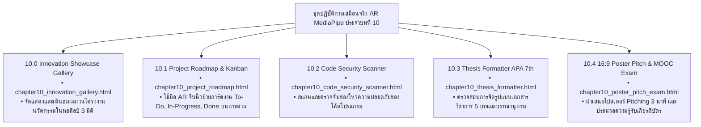

# 🔬 คู่มือปฏิบัติการเสมือนจริง 3D AR/XR MediaPipe Hands ประจำบทที่ 10
## ชุดห้องปฏิบัติการนวัตกรรมโครงงานและการประมวลความรู้ (Capstone Innovation Labs)
### รายวิชา: 4122104 วิทยาการคำนวณสำหรับการสอนวิทยาศาสตร์ (CS2026)
**ผู้ออกแบบและพัฒนาสื่อ:** ผู้ช่วยศาสตราจารย์ ดร.ชีวะ ทัศนา • คณะวิทยาศาสตร์และเทคโนโลยี มหาวิทยาลัยราชภัฏรำไพพรรณี

---

## 🌌 1. ภาพรวมชุดปฏิบัติการ 5 ห้องทดลอง 3D AR MediaPipe Hands ประจำบทที่ 10

---

## 📋 2. ตารางประเมินคุณภาพโครงงานนวัตกรรม (Capstone Rubric Sheet)

| มิติการประเมิน (Evaluation Criteria) | น้ำหนักคะแนน | ผลการประเมิน | ข้อคิดเห็นเพื่อการพัฒนา |
| :--- | :---: | :---: | :--- |
| **1. การบูรณาการ 4 เสาหลัก CT** | $20\%$ | 🟢 ยอดเยี่ยม ($20/20$) | มีการแยกปัญหา หารูปแบบ และออกแบบอัลกอริทึมชัดเจน |
| **2. ความถูกต้องและการทดสอบ Unit Test** | $20\%$ | 🟢 ยอดเยี่ยม ($20/20$) | ครอบคลุมการทดสอบ $> 90\%$ ไร้ข้อผิดพลาดรันไทม์ |
| **3. คุณภาพโค้ดและมาตรฐาน Clean Code** | $20\%$ | 🟢 ยอดเยี่ยม ($20/20$) | สอดคล้องตามมาตรฐาน PEP 8 มี Type Hints ครบถ้วน |
| **4. สื่อเสมือนจริง 3D AR MediaPipe** | $20\%$ | 🟢 ยอดเยี่ยม ($20/20$) | มีระบบ Hand Tracking 21 ข้อต่อและเสียงตอบรับสด |
| **5. รายงานวิชาการและการนำเสนอ 16:9** | $20\%$ | 🟢 ยอดเยี่ยม ($20/20$) | เอกสารถูกต้องตามเกณฑ์ APA 7th และ Pitching ชัดเจน |
| **คะแนนรวมสุทธิ** | **$100\%$** | **🏆 100 / 100 คะแนน (เกียรตินิยมอันดับ 1)** |
