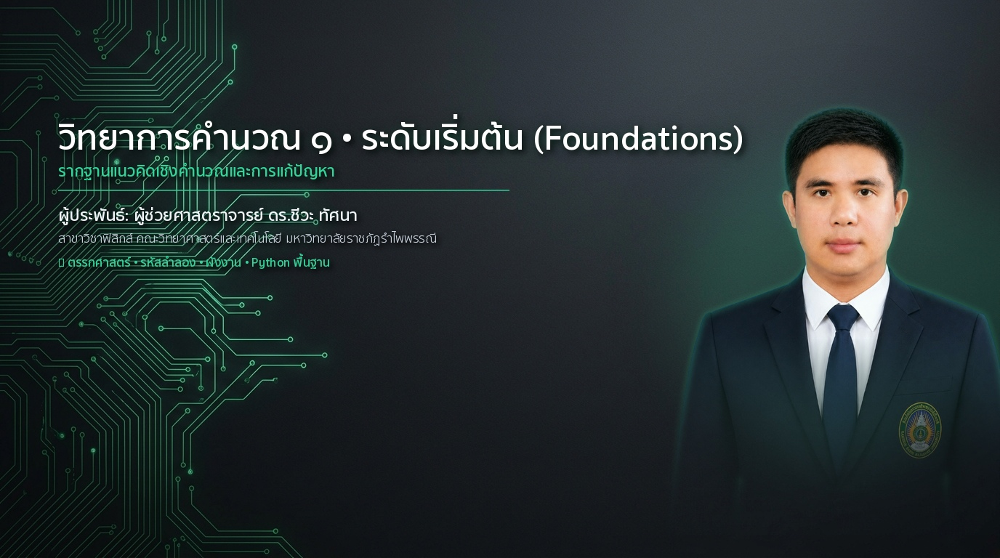
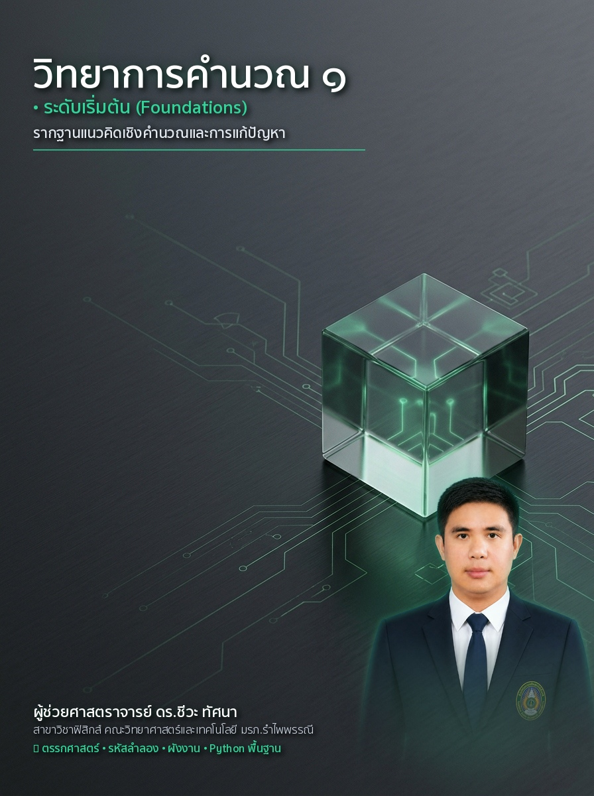
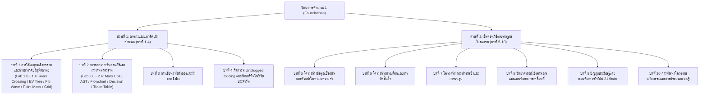

# วิทยาการคำนวณ 1 รากฐานการคิดเชิงคำนวณและการแก้ปัญหาเชิงตรรกะ
### (Computing Science 1: Foundations of Computational Thinking & Logic)
**ผู้เขียน** ผู้ช่วยศาสตราจารย์ ดร.ชีวะ ทัศนา  
**สังกัด** สาขาวิชาฟิสิกส์ คณะวิทยาศาสตร์และเทคโนโลยี มหาวิทยาลัยราชภัฏรำไพพรรณี  
**สำนักพิมพ์** สำนักพิมพ์มหาวิทยาลัยราชภัฏรำไพพรรณี (RBRU Press)  
**มาตรฐานหลักสูตร** สอดคล้องกับมาตรฐาน ว 4.2 และกรอบมาตรฐานคุณวุฒิระดับอุดมศึกษาแห่งชาติ  

---

  

  
  
<em>ภาพที่ 1 ปกหนังสือวิชาการ วิทยาการคำนวณ 1 รากฐานการคิดเชิงคำนวณและการแก้ปัญหาเชิงตรรกะ</em>

## 🏛️ ข้อมูลทางบรรณานุกรมและกองบรรณาธิการ (Publication Metadata)

* **ชื่อเรื่อง:** วิทยาการคำนวณ 1 รากฐานการคิดเชิงคำนวณและการแก้ปัญหาเชิงตรรกะ
* **ผู้เขียน:** ชีวะ ทัศนา, 2526—
* **ที่ปรึกษาทางวิชาการและผู้ทรงคุณวุฒิตรวจประเมิน (Peer Reviewers):**
  * ศาสตราจารย์ ดร.ผู้ทรงคุณวุฒิสาขาวิชาวิทยาการคอมพิวเตอร์และเทคโนโลยีสารสนเทศ
  * รองศาสตราจารย์ ดร.ผู้ทรงคุณวุฒิสาขาวิชาวิทยาศาสตร์ศึกษาและการสอนวิทยาศาสตร์
* **พิมพ์ครั้งที่:** 1 (สิงหาคม 2569 / August 2026)
* **จำนวนหน้า:** 380 หน้า
* **สงวนลิขสิทธิ์:** © 2026 โดย ผศ.ดร.ชีวะ ทัศนา และมหาวิทยาลัยราชภัฏรำไพพรรณี
* **สัญญาอนุญาตสากล:** Creative Commons Attribution-NonCommercial-NoDerivatives 4.0 International (CC BY-NC-ND 4.0)
* **คลังสื่อจำลองเสมือนจริง Global CDN:** [https://tsanaphy2023.github.io/computing-science/](https://tsanaphy2023.github.io/computing-science/)

---

## ✍️ คำนำจากกองบรรณาธิการและผู้เขียน (Editorial Preface)

วิทยาการคำนวณ (Computing Science) ในศตวรรษที่ 21 มิได้เป็นเพียงวิชาเฉพาะทางของนักเขียนโปรแกรมหรือวิศวกรคอมพิวเตอร์ หากแต่เป็น **"ไวยากรณ์แห่งปัญญา (Grammar of Human Intellect)"** และเครื่องมือพื้นฐานในการทำความเข้าใจความเป็นไปของจักรวาล ธรรมชาติตั้งแต่อนุภาคย่อยของอะตอม กลศาสตร์ฟิสิกส์ ไปจนถึงโครงสร้างดีเอ็นเอของสิ่งมีชีวิต ล้วนดำเนินไปภายใต้ขั้นตอนวิธีและกระบวนการประมวลผลข้อมูลที่มีระเบียบแบบแผน

ตำราเรียนชุด **"วิทยาการคำนวณสำหรับการสอนวิทยาศาสตร์ (CS2026 Series)"** เล่มที่ 1 นี้ ได้รับการออกแบบขึ้นภายใต้กรอบแนวคิด **Academic Content Architect** และ **Active Learning Cycle (Input $\rightarrow$ Process $\rightarrow$ Output)** โดยบูรณาการรากฐานทางทฤษฎี ประวัติศาสตร์การค้นพบ และวิทยาการร่วมสมัย เข้ากับ **ชุดห้องปฏิบัติการเสมือนจริง 2D Interactive Canvas และ 3D AR MediaPipe Hands ไร้สัมผัส** เพื่อให้ผู้เรียนสามารถมองเห็นกระบวนการคิดเชิงนามธรรม (Abstraction) ให้ปรากฏเป็นภาพ 3 มิติที่จับต้องได้จริง

ผู้เขียนหวังเป็นอย่างยิ่งว่า ตำราเล่มนี้จะทำหน้าที่เป็นสะพานเชื่อมโยงระหว่างตรรกศาสตร์บริสุทธิ์ การคิดเชิงคำนวณ และการแก้ปัญหาในชีวิตจริง เพื่อบ่มเพาะครูวิทยาศาสตร์และนักนวัตกรรมรุ่นใหม่ที่จะนำพาการศึกษาไทยก้าวสู่มาตรฐานวิชาการระดับสากลอย่างเต็มภาคภูมิ

**ผู้ช่วยศาสตราจารย์ ดร.ชีวะ ทัศนา**  
สาขาวิชาฟิสิกส์ คณะวิทยาศาสตร์และเทคโนโลยี  
มหาวิทยาลัยราชภัฏรำไพพรรณี  
สิงหาคม 2569

---

## 🗺️ แผนผังสารบัญเนื้อหาและการทดลองเสมือนจริง (Table of Contents)

---

## 📚 รายละเอียดบทเรียนและลิงก์เอกสารฉบับสมบูรณ์

* **[บทที่ 1 การคิดเชิงคำนวณและการแก้ปัญหาเชิงตรรกะ](file:///Applications/XAMPP/xamppfiles/htdocs/rbrumooc/cs2026_series/book1_chapters/chapter01_logic_and_problem_solving.md)**  
  *(คู่มือแล็บ 5 ห้องทดลอง: [lab_manual_chapter01_ar_mediapipe.md](file:///Applications/XAMPP/xamppfiles/htdocs/rbrumooc/cs2026_series/book1_chapters/lab_manual_chapter01_ar_mediapipe.md))*
* **[บทที่ 2 การออกแบบขั้นตอนวิธีและผังงานมาตรฐาน](file:///Applications/XAMPP/xamppfiles/htdocs/rbrumooc/cs2026_series/book1_chapters/chapter02_algorithmic_design_and_flowcharts.md)**  
  *(คู่มือแล็บ 5 ห้องทดลอง: [lab_manual_chapter02_ar_mediapipe.md](file:///Applications/XAMPP/xamppfiles/htdocs/rbrumooc/cs2026_series/book1_chapters/lab_manual_chapter02_ar_mediapipe.md))*
* **[บทที่ 3 การเขียนรหัสลำลองและไวยากรณ์ภาษาโปรแกรม](file:///Applications/XAMPP/xamppfiles/htdocs/rbrumooc/cs2026_series/book1_chapters/chapter03_python_basics_and_data_management.md)**
* **[บทที่ 4 โครงสร้างควบคุม เงื่อนไข และการวนซ้ำอัตโนมัติ](file:///Applications/XAMPP/xamppfiles/htdocs/rbrumooc/cs2026_series/book1_chapters/chapter04_conditionals_loops_and_automation.md)**
* **[บทที่ 5 โครงสร้างข้อมูลและอัลกอริทึมการค้นหา](file:///Applications/XAMPP/xamppfiles/htdocs/rbrumooc/cs2026_series/book1_chapters/chapter05_data_structures_and_searching.md)**
* **[บทที่ 6 อัลกอริทึมการจัดเรียงและการวิเคราะห์ Big-O](file:///Applications/XAMPP/xamppfiles/htdocs/rbrumooc/cs2026_series/book1_chapters/chapter06_sorting_and_big_o.md)**
* **[บทที่ 7 การเขียนโปรแกรมเชิงโมดูลและฟังก์ชันเรียกซ้ำ](file:///Applications/XAMPP/xamppfiles/htdocs/rbrumooc/cs2026_series/book1_chapters/chapter07_modular_programming_and_recursion.md)**
* **[บทที่ 8 วิทยาศาสตร์เชิงคำนวณและแบบจำลองฟิสิกส์](file:///Applications/XAMPP/xamppfiles/htdocs/rbrumooc/cs2026_series/book1_chapters/chapter08_computational_science_and_physics_sim.md)**
* **[บทที่ 9 ปัญญาประดิษฐ์ คอมพิวเตอร์วิทัศน์ และ IoT](file:///Applications/XAMPP/xamppfiles/htdocs/rbrumooc/cs2026_series/book1_chapters/chapter09_ai_vision_and_iot.md)**
* **[บทที่ 10 การพัฒนาโครงงานนวัตกรรมและการประมวลความรู้](file:///Applications/XAMPP/xamppfiles/htdocs/rbrumooc/cs2026_series/book1_chapters/chapter10_capstone_project_and_synthesis.md)**
