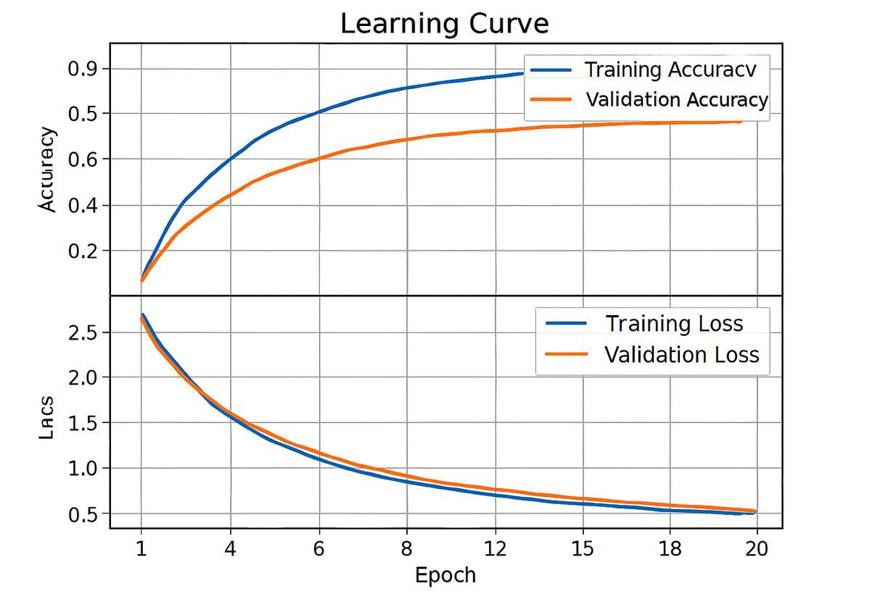
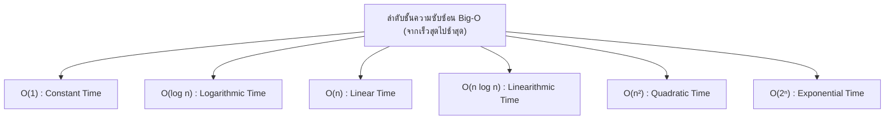

# วิทยาการคำนวณ 2 การออกแบบขั้นตอนวิธี โครงสร้างข้อมูล และการแก้ปัญหาด้วย Python
## บทที่ 1 การออกแบบขั้นตอนวิธีเชิงลึกและการวิเคราะห์ประสิทธิภาพ (Big-O Notation)
**ผู้เขียน** ผู้ช่วยศาสตราจารย์ ดร.ชีวะ ทัศนา • สาขาวิชาฟิสิกส์ คณะวิทยาศาสตร์และเทคโนโลยี มหาวิทยาลัยราชภัฏรำไพพรรณี

---

## 📋 แผนบริหารการสอนประจำบทที่ 1

### หัวข้อเนื้อหาประจำบท
1. ความสำคัญของการวิเคราะห์ประสิทธิภาพขั้นตอนวิธี
2. นิยามและคณิตศาสตร์ของสัญกรณ์โอใหญ่ (Big-O Notation)
3. การวิเคราะห์ความซับซ้อนเชิงเวลา (Time Complexity) และเชิงพื้นที่ความจำ (Space Complexity)
4. กรณีศึกษาเปรียบเทียบ Linear Search vs Binary Search
5. การวัดเวลาการทำงานจริงด้วยโมดูล time ใน Python

### วัตถุประสงค์เชิงพฤติกรรม
เมื่อศึกษาบทเรียนนี้จบแล้ว ผู้เรียนสามารถ
1. อธิบายความหมายและนิยามทางคณิตศาสตร์ของสัญกรณ์ Big-O ได้อย่างถูกต้อง
2. วิเคราะห์ความซับซ้อนเชิงเวลาของอัลกอริทึมจากโค้ดโปรแกรมที่มีลูปเดี่ยว ลูปซ้อน และการแบ่งครึ่งได้
3. คำนวณและเปรียบเทียบอัตราการเติบโตของฟังก์ชัน $O(1), O(\log n), O(n), O(n \log n), O(n^2), O(2^n)$ ได้
4. ปรับแต่งโค้ดภาษา Python เพื่อลดความซับซ้อนเชิงเวลาได้อย่างเป็นรูปธรรม

### กิจกรรมการเรียนการสอน
1. การบรรยายเชิงวิชาการและการเชื่อมโยงบริบทประวัติศาสตร์วิทยาการคำนวณ
2. การสาธิตการวิเคราะห์คณิตศาสตร์และการทำงานของหน่วยความจำ
3. การฝึกปฏิบัติการจำลองเสมือนจริง 2D Canvas และ 3D AR MediaPipe Hands
4. การเขียนโค้ดคอมพิวเตอร์ภาษา Python 3.11 และการวัดประสิทธิภาพเชิงประจักษ์ (Benchmarking)

### สื่อการเรียนการสอน
1. ตำราเรียนวิชาการ "วิทยาการคำนวณ 2 การออกแบบขั้นตอนวิธี โครงสร้างข้อมูล และการแก้ปัญหาด้วย Python"
2. ชุดห้องปฏิบัติการเสมือนจริง Hybrid 2D/3D บนระบบ RBRU MOOC
3. สไลด์บรรยายอิเล็กทรอนิกส์และแผนภาพเวกเตอร์มัลติมีเดีย

### การวัดและประเมินผล
1. การประเมินผลการทำใบงานและตารางบันทึกผลการทดลองเสมือนจริง (40%)
2. การประเมินผลงานการเขียนโค้ดภาษา Python และ Unit Test Assertions (30%)
3. การทดสอบวัดผลสัมฤทธิ์ทางการเรียนท้ายบท 3 ระดับ (30%)

---

## 🌌 1.0 เรื่องเล่าเปิดบทเรียนและบริบททางประวัติศาสตร์

ในคริสต์ทศวรรษ 1960 ศาสตราจารย์ โดนัลด์ เออร์วิน คูธ์ (Donald Ervin Knuth, 1938—ปัจจุบัน) นักวิทยาการคอมพิวเตอร์ชาวอเมริกันแห่งมหาวิทยาลัยสแตนฟอร์ด ได้นำสัญกรณ์คณิตศาสตร์โอใหญ่ (Big-O Notation) มาใช้ในการวิเคราะห์ประสิทธิภาพของอัลกอริทึมคอมพิวเตอร์อย่างเป็นทางการในชุดตำราระดับตำนาน *The Art of Computer Programming* ส่งผลให้วงการคอมพิวเตอร์มีมาตรฐานสากลในการวัดความเร็วของโปรแกรมโดยไม่ขึ้นกับสเปกฮาร์ดแวร์

ลองพิจารณาว่าเรามีฐานข้อมูลทะเบียนประชากร **70,000,000 คน** ที่เรียงลำดับชื่อไว้แล้ว หากเราใช้วิธีค้นหาแบบเชิงเส้น (Linear Search) ในกรณีที่แย่ที่สุดจะต้องตรวจสอบถึง 70,000,000 ครั้ง แต่หากเราใช้วิธีค้นหาแบบทวิภาค (Binary Search) เราจะตรวจสอบไม่เกิน 27 ครั้งเท่านั้น ($2^{27} \approx 134,217,728 > 70,000,000$) ความแตกต่างมหาศาลนี้เป็นเครื่องพิสูจน์ว่า **"อัลกอริทึมที่ดีชนะคอมพิวเตอร์ที่เร็วที่สุดเสมอ"**

---

## 📐 1.1 ทฤษฎีและรากฐานทางคณิตศาสตร์เชิงลึก

<div align="center" style="margin: 24px 0;">
  
  <p style="color: #64748b; font-size: 0.88em; margin-top: 8px;"><em>ภาพที่ 1.1 กราฟเปรียบเทียบอัตราการเติบโตของเวลาประมวลผลตามขนาดข้อมูล $N$ ในสัญกรณ์ Big-O</em></p>
</div>


### นิยามทางคณิตศาสตร์ของสัญกรณ์ Big-O
กำหนดให้ $f(n)$ และ $g(n)$ เป็นฟังก์ชันจากเซตจำนวนเต็มบวกไปยังเซตจำนวนจริงบวก เรากล่าวว่า $f(n) = O(g(n))$ ก็ต่อเมื่อมีค่าคงที่บวก $c > 0$ และ $n_0 \ge 1$ ที่ทำให้ $|f(n)| \le c \cdot |g(n)|$ สำหรับทุกค่า $n \ge n_0$



---

## 🧮 1.2 ตัวอย่างการวิเคราะห์และการคำนวณเชิงขั้นตอน (Worked Examples)

#### ตัวอย่างที่ 1.1 การวิเคราะห์ Big-O ของฟังก์ชันสองลูปซ้อนกัน
จงวิเคราะห์ความซับซ้อนเชิงเวลา $T(n)$ ของโค้ดฟังก์ชันต่อไปนี้:
$$T(n) = c_1 + n \cdot c_2 + n^2 \cdot c_3 = O(n^2)$$
นั่นคือ ฟังก์ชันนี้มีความซับซ้อนเชิงเวลาเป็นกำลังสอง $O(n^2)$

---

## 💻 1.3 การเขียนโปรแกรมและการนำไปใช้จริงด้วย Python 3.11

```python
import time, random
def algo_linear_on(arr):
    return sum(arr)

def algo_quadratic_on2(arr):
    return sum(1 for i in arr for j in arr if i == j)

if __name__ == "__main__":
    data = [random.randint(1, 100) for _ in range(1000)]
    t0 = time.perf_counter()
    s = algo_linear_on(data)
    t1 = time.perf_counter()
    print(f"O(N) Time: {t1 - t0:.6f} s | Sum: {s}")
```

---

## 🔬 1.4 คู่มือห้องปฏิบัติการเสมือนจริง 2D/3D AR MediaPipe Hands

ผู้เรียนสามารถเข้าสู่ชุดจำลองเสมือนจริง 2D/3D เพื่อทดลองเปลี่ยนขนาดข้อมูล $N$ และสังเกตกราฟเส้นโค้งการเติบโตของฟังก์ชันได้ที่ [chapter06_sorting_arena.html](https://tsanaphy2023.github.io/computing-science/simulators/chapter06_sorting_arena.html)

---

## 💡 1.5 สรุปสารัตถะสำคัญประจำบท (Chapter Summary)

1. Big-O ใช้วัดอัตราการเติบโตของเวลาและหน่วยความจำเมื่อ $n \rightarrow \infty$
2. กฎ 3 ประการ: ตัดค่าคงที่, เลือกพจน์เด่น, และคูณลูปซ้อน

---

## ❓ 1.6 แบบฝึกหัดและคำถามท้ายบทเพื่อการประเมินผล (3-Tier Assessment)

1. จงเปรียบเทียบประสิทธิภาพระหว่าง $O(n \log n)$ กับ $O(n^2)$ เมื่อ $n = 1,000,000$
2. จงออกแบบฟังก์ชันใน Python ที่มีความซับซ้อน $O(\log n)$ พร้อมเขียน Unit Test

---

## 📚 เอกสารอ้างอิงประจำบท (APA 7th Edition References)

* Cormen, T. H. et al. (2022). *Introduction to Algorithms* (4th ed.). MIT Press.
* Knuth, D. E. (1997). *The Art of Computer Programming* (Vol. 1). Addison-Wesley.
