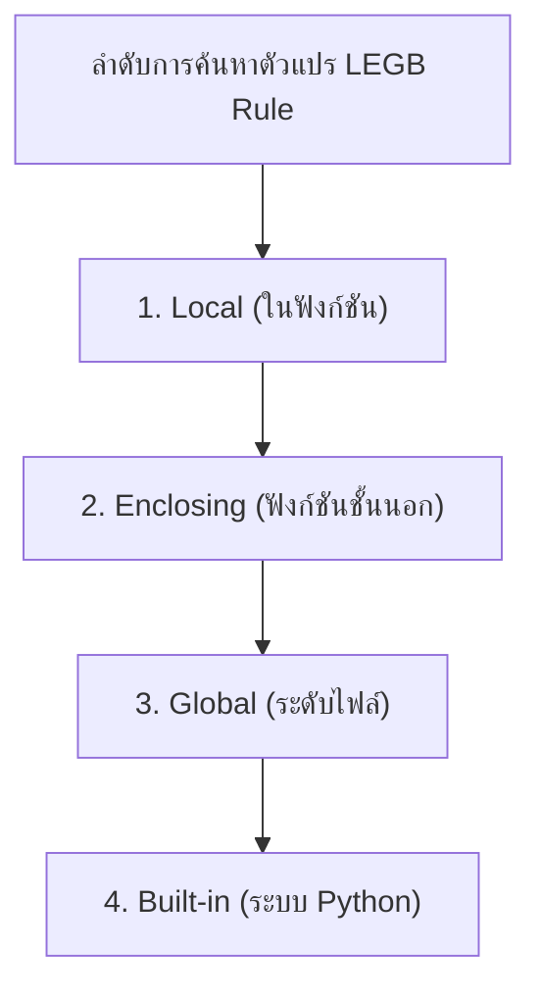

# วิทยาการคำนวณ 2 การออกแบบขั้นตอนวิธี โครงสร้างข้อมูล และการแก้ปัญหาด้วย Python
## บทที่ 2 การเขียนโปรแกรมเชิงโมดูลและฟังก์ชันขั้นสูง (Modular Programming & Advanced Functions)
**ผู้เขียน** ผู้ช่วยศาสตราจารย์ ดร.ชีวะ ทัศนา • สาขาวิชาฟิสิกส์ คณะวิทยาศาสตร์และเทคโนโลยี มหาวิทยาลัยราชภัฏรำไพพรรณี

---

## 📋 แผนบริหารการสอนประจำบทที่ 2

### หัวข้อเนื้อหาประจำบท
1. ปรัชญาการออกแบบเชิงโมดูล (Modularity & DRY Principle)
2. กฎขอบเขตตัวแปร LEGB (Local, Enclosing, Global, Built-in)
3. กลไก Call Stack และ Activation Record
4. First-Class Functions, Higher-Order Functions และ Lambda Expressions
5. การสร้างและนำเข้าโมดูล (Modules & Packages)

### วัตถุประสงค์เชิงพฤติกรรม
เมื่อศึกษาบทเรียนนี้จบแล้ว ผู้เรียนสามารถ
1. อธิบายสถาปัตยกรรมการทำงานของ Call Stack และขอบเขตตัวแปร LEGB ใน Python ได้
2. ออกแบบฟังก์ชันที่มีคุณสมบัติ Pure Function และลดผลข้างเคียง (Side Effects) ได้
3. ประยุกต์ใช้ Higher-Order Functions (`map`, `filter`, `reduce`) และ Decorators ในการแก้ปัญหาได้
4. จัดโครงสร้างโปรเจกต์ขนาดใหญ่ให้อยู่ในรูป Packages และ Modules ที่นำกลับมาใช้ซ้ำได้

### กิจกรรมการเรียนการสอน
1. การบรรยายเชิงวิชาการและการเชื่อมโยงบริบทประวัติศาสตร์วิทยาการคำนวณ
2. การสาธิตการวิเคราะห์คณิตศาสตร์และการทำงานของหน่วยความจำ
3. การฝึกปฏิบัติการจำลองเสมือนจริง 2D Canvas และ 3D AR MediaPipe Hands
4. การเขียนโค้ดคอมพิวเตอร์ภาษา Python 3.11 และการวัดประสิทธิภาพเชิงประจักษ์ (Benchmarking)

### สื่อการเรียนการสอน
1. ตำราเรียนวิชาการ "วิทยาการคำนวณ 2 การออกแบบขั้นตอนวิธี โครงสร้างข้อมูล และการแก้ปัญหาด้วย Python"
2. ชุดห้องปฏิบัติการเสมือนจริง Hybrid 2D/3D บนระบบ RBRU MOOC
3. สไลด์บรรยายอิเล็กทรอนิกส์และแผนภาพเวกเตอร์มัลติมีเดีย

### การวัดและประเมินผล
1. การประเมินผลการทำใบงานและตารางบันทึกผลการทดลองเสมือนจริง (40%)
2. การประเมินผลงานการเขียนโค้ดภาษา Python และ Unit Test Assertions (30%)
3. การทดสอบวัดผลสัมฤทธิ์ทางการเรียนท้ายบท 3 ระดับ (30%)

---

## 🌌 2.0 เรื่องเล่าเปิดบทเรียนและบริบททางประวัติศาสตร์

ในคริสต์ทศวรรษ 1970 เดวิด พาร์นาส (David Lorge Parnas, 1941—ปัจจุบัน) นักวิทยาการคอมพิวเตอร์ชาวอเมริกัน ได้เสนอบทความวิชาการคลาสสิกเรื่อง *On the Criteria to Be Used in Decomposing Systems into Modules* ซึ่งวางรากฐานแนวคิด Information Hiding และ Modular Decomposition ทำให้เกิดการปฏิวัติแนวคิดการเขียนโค้ดจากการเขียนโปรแกรมตามแนวยาว (Spaghetti Code) มาเป็นการแบ่งโปรแกรมออกเป็นโมดูลย่อยที่ทำงานอิสระต่อกัน (High Cohesion, Low Coupling)

---

## 📐 2.1 ทฤษฎีและรากฐานทางคณิตศาสตร์เชิงลึก

<div align="center" style="margin: 24px 0;">
  
  <p style="color: #64748b; font-size: 0.88em; margin-top: 8px;"><em>ภาพที่ 2.1 เสาหลักการเขียนโปรแกรมเชิงวัตถุ (Encapsulation, Abstraction, Inheritance, Polymorphism)</em></p>
</div>


### กฎขอบเขตตัวแปร LEGB (LEGB Rule)
เมื่อมีการอ้างถึงตัวแปร Python จะค้นหาตามลำดับ 4 ชั้น:
1. **L (Local):** ภายในฟังก์ชันปัจจุบัน
2. **E (Enclosing):** ภายในฟังก์ชันครอบ (สำหรับ Nested Functions/Closures)
3. **G (Global):** ระดับไฟล์สคริปต์
4. **B (Built-in):** คำสงวนของระบบ (`len`, `range`, `print`)



---

## 🧮 2.2 ตัวอย่างการวิเคราะห์และการคำนวณเชิงขั้นตอน (Worked Examples)

#### ตัวอย่างที่ 2.1 การทำงานของ Decorator เพื่อวัดเวลาทำงาน
จงสร้าง Decorator `@timer_decorator` เพื่อวัดเวลาประมวลผลของฟังก์ชันใดๆ โดยไม่ต้องแก้ไขโค้ดภายในฟังก์ชันเดิม:

```python
import time
from functools import wraps

def timer_decorator(func):
    @wraps(func)
    def wrapper(*args, **kwargs):
        t0 = time.perf_counter()
        result = func(*args, **kwargs)
        elapsed = time.perf_counter() - t0
        print(f"⏱️ ฟังก์ชัน {func.__name__} ใช้เวลา: {elapsed:.6f} วินาที")
        return result
    return wrapper
```

---

## 💻 2.3 การเขียนโปรแกรมและการนำไปใช้จริงด้วย Python 3.11

```python
# modular_math_engine.py
from typing import Callable, List

def apply_transform(data: List[float], op: Callable[[float], float]) -> List[float]:
    """Higher-Order Function: ประยุกต์ฟังก์ชัน op กับสมาชิกทุกตัวใน data"""
    return [op(x) for x in data]

if __name__ == "__main__":
    raw_temps = [25.0, 30.5, 36.2, 40.0]
    # แปลง Celsius เป็น Fahrenheit ด้วย Lambda
    to_f = lambda c: (c * 9/5) + 32
    f_temps = apply_transform(raw_temps, to_f)
    print("อุณหภูมิฟาเรนไฮต์:", f_temps)
    assert abs(f_temps[0] - 77.0) < 1e-4, "Test Passed!"
```

---

## 🔬 2.4 คู่มือห้องปฏิบัติการเสมือนจริง 2D/3D AR MediaPipe Hands

ผู้เรียนสามารถเข้าสู่ชุดจำลองเสมือนจริง 2D/3D เพื่อทดลองประกอบโมดูลฟังก์ชันและจำลอง Call Stack ในอากาศได้ที่ [chapter01_decomposition_tree.html](https://tsanaphy2023.github.io/computing-science/simulators/chapter01_decomposition_tree.html)

---

## 💡 2.5 สรุปสารัตถะสำคัญประจำบท (Chapter Summary)

1. การแบ่งโมดูลช่วยลดความซับซ้อนและเพิ่ม Cohesion
2. Python ปฏิบัติต่อฟังก์ชันเป็น First-Class Object ทำให้สามารถส่งเป็นอาร์กิวเมนต์และคืนค่าได้

---

## ❓ 2.6 แบบฝึกหัดและคำถามท้ายบทเพื่อการประเมินผล (3-Tier Assessment)

1. จงอธิบายความแตกต่างระหว่าง Parameter และ Argument
2. ให้นักเรียนเขียน Closure Function เพื่อสร้างตัวนับจำนวน (Counter)

---

## 📚 เอกสารอ้างอิงประจำบท (APA 7th Edition References)

* Parnas, D. L. (1972). On the criteria to be used in decomposing systems into modules. *Communications of the ACM*, 15(12), 1053-1058.
* Lutz, M. (2013). *Learning Python* (5th ed.). O'Reilly Media.
