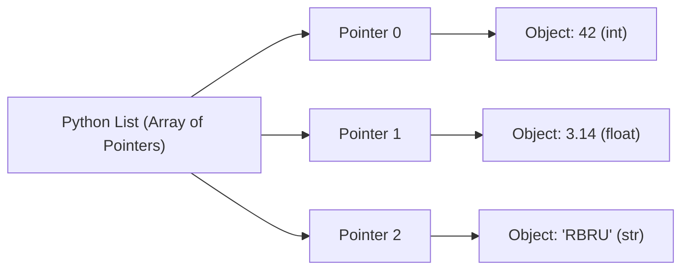

# วิทยาการคำนวณ 2 การออกแบบขั้นตอนวิธี โครงสร้างข้อมูล และการแก้ปัญหาด้วย Python
## บทที่ 3 โครงสร้างข้อมูลลิสต์และการประมวลผลขั้นสูง (Lists & Comprehensions)
**ผู้เขียน** ผู้ช่วยศาสตราจารย์ ดร.ชีวะ ทัศนา • สาขาวิชาฟิสิกส์ คณะวิทยาศาสตร์และเทคโนโลยี มหาวิทยาลัยราชภัฏรำไพพรรณี

---

## 📋 แผนบริหารการสอนประจำบทที่ 3

### หัวข้อเนื้อหาประจำบท
1. สถาปัตยกรรมหน่วยความจำของ Dynamic Array ใน CPython
2. ความซับซ้อนเชิงเวลาของ List Operations (Append, Pop, Insert, Remove)
3. การทำ Shallow Copy vs Deep Copy ในโครงสร้างข้อมูลซ้อน
4. วากยสัมพันธ์และประสิทธิภาพของ List Comprehensions
5. การประยุกต์ใช้ในการประมวลผลข้อมูลวิทยาศาสตร์แบบเวกเตอร์

### วัตถุประสงค์เชิงพฤติกรรม
เมื่อศึกษาบทเรียนนี้จบแล้ว ผู้เรียนสามารถ
1. อธิบายกลไกการจองหน่วยความจำแบบ Over-allocation ของลิสต์ในภาษา Python ได้
2. วิเคราะห์ความซับซ้อนเชิงเวลาของการดำเนินการต่างๆ บนลิสต์ได้
3. เขียนคำสั่ง List, Dict, Set Comprehensions เพื่อลดความยาวและเพิ่มความเร็วของโค้ดได้
4. แก้ปัญหาข้อมูลแบบหลายมิติ (Multi-dimensional Matrices) ได้อย่างถูกต้อง

### กิจกรรมการเรียนการสอน
1. การบรรยายเชิงวิชาการและการเชื่อมโยงบริบทประวัติศาสตร์วิทยาการคำนวณ
2. การสาธิตการวิเคราะห์คณิตศาสตร์และการทำงานของหน่วยความจำ
3. การฝึกปฏิบัติการจำลองเสมือนจริง 2D Canvas และ 3D AR MediaPipe Hands
4. การเขียนโค้ดคอมพิวเตอร์ภาษา Python 3.11 และการวัดประสิทธิภาพเชิงประจักษ์ (Benchmarking)

### สื่อการเรียนการสอน
1. ตำราเรียนวิชาการ "วิทยาการคำนวณ 2 การออกแบบขั้นตอนวิธี โครงสร้างข้อมูล และการแก้ปัญหาด้วย Python"
2. ชุดห้องปฏิบัติการเสมือนจริง Hybrid 2D/3D บนระบบ RBRU MOOC
3. สไลด์บรรยายอิเล็กทรอนิกส์และแผนภาพเวกเตอร์มัลติมีเดีย

### การวัดและประเมินผล
1. การประเมินผลการทำใบงานและตารางบันทึกผลการทดลองเสมือนจริง (40%)
2. การประเมินผลงานการเขียนโค้ดภาษา Python และ Unit Test Assertions (30%)
3. การทดสอบวัดผลสัมฤทธิ์ทางการเรียนท้ายบท 3 ระดับ (30%)

---

## 🌌 3.0 เรื่องเล่าเปิดบทเรียนและบริบททางประวัติศาสตร์

ในคริสต์ศักราช 1991 กีโด ฟาน รอสซัม (Guido van Rossum, 1956—ปัจจุบัน) นักวิทยาการคอมพิวเตอร์ชาวดัตช์ ได้ออกแบบภาษา Python โดยให้ลิสต์ (List) เป็นโครงสร้างข้อมูลพื้นฐานที่มีความยืดหยุ่นสูง โดยเบื้องหลังลิสต์ใน CPython ถูกสร้างขึ้นด้วย **Dynamic Array of Object References** ที่สามารถขยายขนาดอัตโนมัติเมื่อข้อมูลเต็ม ทำให้ผู้เรียนสามารถจัดกระทำข้อมูลที่ซับซ้อนได้ง่ายกว่าภาษา C หรือ Fortran ดั้งเดิมอย่างมหาศาล

---

## 📐 3.1 ทฤษฎีและรากฐานทางคณิตศาสตร์เชิงลึก

### สถาปัตยกรรมหน่วยความจำของ List ใน CPython
ใน CPython ลิสต์คืออาเรย์ของพอยน์เตอร์ขนาดคงที่ที่ชี้ไปยังออบเจกต์ใน Heap Memory เมื่อลิสต์เต็ม ระบบจะทำการ Reallocate หน่วยความจำตามลำดับขนาด:
$$	ext{New\_Size} = 	ext{Size} + (	ext{Size} \gg 3) + (	ext{Size} < 9 \ ? \ 3 : 6)$$



---

## 🧮 3.2 ตัวอย่างการวิเคราะห์และการคำนวณเชิงขั้นตอน (Worked Examples)

#### ตัวอย่างที่ 3.1 การแปลง 2D Matrix เป็น 1D List ด้วย Comprehension
จงแปลงเมทริกซ์ $3 	imes 3$ ให้กลายเป็นลิสต์แถวเดียวที่มีเฉพาะจำนวนคู่:
$$M = egin{bmatrix} 1 & 2 & 3 \ 4 & 5 & 6 \ 7 & 8 & 9 \end{bmatrix} 
ightarrow [2, 4, 6, 8]$$

**วิธีทำ:**
```python
matrix = [[1, 2, 3], [4, 5, 6], [7, 8, 9]]
evens = [x for row in matrix for x in row if x % 2 == 0]
print(evens) # ได้ผลลัพธ์ [2, 4, 6, 8]
```

---

## 💻 3.3 การเขียนโปรแกรมและการนำไปใช้จริงด้วย Python 3.11

```python
# list_performance_benchmark.py
import time

def build_with_loop(n: int) -> list:
    res = []
    for i in range(n):
        if i % 2 == 0:
            res.append(i ** 2)
    return res

def build_with_comprehension(n: int) -> list:
    return [i ** 2 for i in range(n) if i % 2 == 0]

if __name__ == "__main__":
    n = 1_000_000
    t0 = time.perf_counter()
    _ = build_with_loop(n)
    t_loop = time.perf_counter() - t0
    
    t0 = time.perf_counter()
    _ = build_with_comprehension(n)
    t_comp = time.perf_counter() - t0
    
    print(f"Loop Append Time: {t_loop:.4f} s")
    print(f"Comprehension Time: {t_comp:.4f} s (เร็วกว่า {(t_loop/t_comp):.2f} เท่า)")
```

---

## 🔬 3.4 คู่มือห้องปฏิบัติการเสมือนจริง 2D/3D AR MediaPipe Hands

ผู้เรียนสามารถเข้าสู่ชุดจำลองเสมือนจริง 2D/3D เพื่อศึกษาการจัดเรียงอาเรย์ข้อมูลได้ที่ [chapter03_data_types_matrix.html](https://tsanaphy2023.github.io/computing-science/simulators/chapter03_data_types_matrix.html)

---

## 💡 3.5 สรุปสารัตถะสำคัญประจำบท (Chapter Summary)

1. `list.append()` มีค่าเฉลี่ย $O(1)$ แต่ `list.insert(0, x)` มีความซับซ้อน $O(n)$
2. List Comprehension ทำงานเร็วกว่าลูป `append()` แบบดั้งเดิมเนื่องจากได้รับการปรับแต่งระดับ Bytecode (C-Loop)

---

## ❓ 3.6 แบบฝึกหัดและคำถามท้ายบทเพื่อการประเมินผล (3-Tier Assessment)

1. เหตุใดการลบสมาชิกตัวแรกของลิสต์ `del lst[0]` จึงช้ากว่าการลบตัวสุดท้าย `lst.pop()`?
2. ให้นักเรียนเขียน Nested List Comprehension เพื่อสร้างเมทริกซ์เอกลักษณ์ $I_{4 \times 4}$

---

## 📚 เอกสารอ้างอิงประจำบท (APA 7th Edition References)

* Van Rossum, G., & Drake, F. L. (2009). *Python 3 Reference Manual*. CreateSpace.
* McKinney, W. (2022). *Python for Data Analysis* (3rd ed.). O'Reilly Media.
