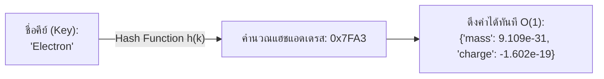
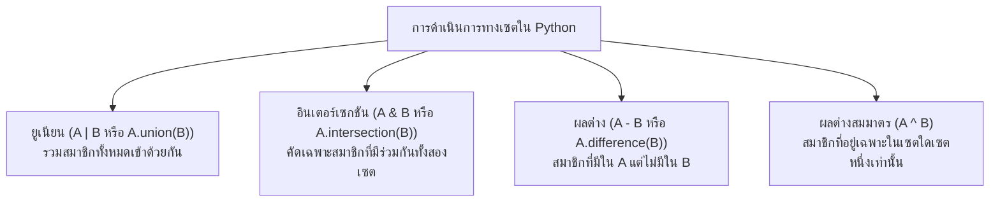

# วิทยาการคำนวณ 2 การออกแบบขั้นตอนวิธี โครงสร้างข้อมูล และการแก้ปัญหาด้วย Python
## บทที่ 4 โครงสร้างข้อมูลเชิงเส้น 2 Tuple, Set และ Dictionary
**ผู้เขียน** ผู้ช่วยศาสตราจารย์ ดร.ชีวะ ทัศนา • สาขาวิชาฟิสิกส์ คณะวิทยาศาสตร์และเทคโนโลยี มหาวิทยาลัยราชภัฏรำไพพรรณี

---

## 🎯 ผลลัพธ์การเรียนรู้ประจำบท
เมื่อศึกษาบทเรียนนี้จบแล้ว ผู้เรียนสามารถ
1. **จำแนกและเปรียบเทียบ ** ความแตกต่างเชิงคุณสมบัติระหว่าง List, Tuple, Set และ Dictionary (Mutability, Ordering, Uniqueness)
2. **ประยุกต์ใช้ ** Tuple สำหรับการจัดเก็บข้อมูลพิกัดที่ไม่ต้องการให้เปลี่ยนแปลง (Immutable Data) และเทคนิค Packing / Unpacking
3. **ดำเนินการทางคณิตศาสตร์ ** กับ Set เช่น ยูเนียน อินเตอร์เซกชัน ผลต่าง และผลต่างสมมาตร
4. **ออกแบบฐานข้อมูลจำลอง ** ด้วย Dictionary เพื่อการค้นหาข้อมูลในเวลาคงที่ $O(1)$ ผ่านระบบ Hash Table

---

## 🌌 4.0 เรื่องเล่าเปิดบทเรียน มนต์วิเศษของตารางแฮช

ลองจินตนาการถึงห้องสมุดที่มีหนังสือ **10,000,000 เล่ม**:
* หากเราเก็บรายชื่อหนังสือไว้ใน **List** แล้วต้องการค้นหาว่ามีหนังสือ *ฟิสิกส์ควอนตัม* อยู่หรือไม่ บรรณารักษ์จะต้องเดินไล่ดูทีละเล่มจากเล่มที่ 1 ถึงเล่มสุดท้าย ($O(n)$)
* แต่หากเราเก็บใน **Dictionary (Hash Table)** เราจะนำชื่อหนังสือไปผ่านฟังก์ชันแฮช (Hash Function) ซึ่งจะคำนวณและชี้ไปยัง **"หมายเลขช่องบนชั้นวางทันที!"** ทำให้หยิบหนังสือได้ในเวลา **$O(1)$ เสมอ ไม่ว่าห้องสมุดจะมีหนังสือ 10 เล่ม หรือ 100 ล้านเล่มก็ตาม!**



นี่คือเหตุผลที่ Dictionary และ Set เป็นหัวใจของระบบฐานข้อมูลขนาดใหญ่ เสิร์ชเอนจินของ Google และระบบตรวจสอบข้อมูลพันธุกรรมระดับโลก

---

## 📊 4.1 ตารางเปรียบเทียบ 4 โครงสร้างข้อมูลแกนกลางใน Python

| คุณสมบัติ | List (`[]`) | Tuple (`()`) | Set (`{}`) | Dictionary (`{k:v}`) |
| :--- | :---: | :---: | :---: | :---: |
| **สัญลักษณ์** | `[1, 2, 3]` | `(1, 2, 3)` | `{1, 2, 3}` | `{"a": 1, "b": 2}` |
| **มีลำดับ ** | ✅ ใช่ | ✅ ใช่ | ❌ ไม่การันตีลำดับ | ✅ ใช่ (ตามลำดับที่แทรก) |
| **แก้ไขค่าได้ ** | ✅ แก้ไขได้ | ❌ แก้ไขไม่ได้ (Immutable) | ✅ แก้ไขได้ | ✅ แก้ไขได้ |
| **สมาชิกซ้ำได้ **| ✅ ซ้ำได้ | ✅ ซ้ำได้ | ❌ สมาชิกต้องไม่ซ้ำกัน | ❌ คีย์ต้องไม่ซ้ำกัน |
| **การเข้าถึงข้อมูล** | ดัชนี `[0]` | ดัชนี `[0]` | ลูป หรือ `in` | คีย์ `["key"]` |
| **ค้นหาข้อมูล (`in`)** | **$O(n)$** | **$O(n)$** | **$O(1)$ ⚡** | **$O(1)$ ⚡** |

---

## 🔒 4.2 ทูเพิล และการกระจายตัวแปร

เนื่องจาก Tuple ไม่สามารถแก้ไขค่าได้ (Immutable) จึงปลอดภัยจากการถูกแก้ไขโดยไม่ตั้งใจ และใช้หน่วยความจำน้อยกว่า List

```python
# พิกัด 3 มิติของดาวเทียม
satellite_pos = (120.45, -45.12, 6371.0)

# Tuple Unpacking: กระจายตัวแปรในบรรทัดเดียว
longitude, latitude, altitude = satellite_pos
print(f"🛰️ ดาวเทียมอยู่ที่ระดับความสูง: {altitude} km")
```

---

## ⭕ 4.3 เซต และการดำเนินการทางทฤษฎีเซต



---

## 📖 4.4 พจนานุกรม และระบบฐานข้อมูลตารางธาตุ

```python
# periodic_table_lookup.py
# โปรแกรมค้นหาข้อมูลธาตุและคุณสมบัติทางฟิสิกส์ด้วย Dictionary
# ผู้เขียน: ผศ.ดร.ชีวะ ทัศนา (มรภ.รำไพพรรณี)

elements_db = {
    "H": {"name": "Hydrogen", "atomic_num": 1, "atomic_weight": 1.008, "state": "Gas"},
    "He": {"name": "Helium", "atomic_num": 2, "atomic_weight": 4.0026, "state": "Gas"},
    "C": {"name": "Carbon", "atomic_num": 6, "atomic_weight": 12.011, "state": "Solid"},
    "Au": {"name": "Gold", "atomic_num": 79, "atomic_weight": 196.97, "state": "Solid"},
}

def lookup_element(symbol: str):
    """ค้นหาข้อมูลธาตุในเวลา O(1) พร้อมการป้องกัน KeyError ด้วยเมธอด get()"""
    element = elements_db.get(symbol.strip().capitalize())
    if element:
        print(f"✨ ข้อมูลธาตุ [{symbol.upper()}]:")
        print(f"   • ชื่อเต็ม:        {element['name']}")
        print(f"   • เลขอะตอม (Z):    {element['atomic_num']}")
        print(f"   • มวลอะตอม:        {element['atomic_weight']} u")
        print(f"   • สถานะที่อุณหภูมิห้อง: {element['state']}")
    else:
        print(f"❌ ไม่พบสัญลักษณ์ธาตุ '{symbol}' ในฐานข้อมูล")

if __name__ == "__main__":
    print("=" * 60)
    print("🔬 ระบบค้นหาข้อมูลตารางธาตุอัจฉริยะ (Periodic Table Hash Lookup)")
    print("=" * 60)
    lookup_element("Au")
    print("-" * 60)
    lookup_element("Uranium") # กรณีไม่พบ
    print("=" * 60)
```

---

## 💡 4.5 สรุปใจความสำคัญและแบบฝึกหัดท้ายบทที่ 4

### 📌 สรุปประเด็นสำคัญ
1. ใช้ **Tuple** เมื่อข้อมูลมีจำนวนคงที่และไม่ต้องการให้ถูกแก้ไข เช่น พิกัด $(x,y,z)$ หรือค่าสี RGB
2. ใช้ **Set** เมื่อต้องการกำจัดค่าที่ซ้ำซ้อนอย่างรวดเร็ว หรือต้องการตรวจสอบสมาชิกด้วยความเร็ว $O(1)$
3. ใช้ **Dictionary** เมื่อต้องการจัดเก็บข้อมูลในรูปแบบคู่กุญแจ-ค่า (Key-Value) สำหรับการค้นหาที่รวดเร็วระดับ $O(1)$

---

### 📝 แบบฝึกหัดทบทวน 3 ระดับ

#### ระดับที่ 1 ความรู้ความเข้าใจพื้นฐาน
1. จงระบุว่าคำสั่งต่อไปนี้ถูกต้องหรือไม่ หากผิดเกิดจากสาเหตุใด
   * (A) `t = (1, 2, 3); t[0] = 10`
   * (B) `s = {1, 2, [3, 4]}`
   * (C) `d = {[1, 2]: "value"}`
2. กำหนดให้ `A = {1, 2, 3, 4}` และ `B = {3, 4, 5, 6}` จงหาผลลัพธ์ของ `A & B`, `A | B`, และ `A - B`

#### ระดับที่ 2 การวิเคราะห์และประยุกต์ใช้
3. กำหนดให้มีรายชื่อนักศึกษาที่ลงทะเบียนซ้ำซ้อนในกิจกรรม `attendees = [สมชาย, สมหญิง, สมชาย, วิชัย, สมหญิง, กานดา]` จงเขียนโค้ดภาษา Python บรรทัดเดียวเพื่อนับจำนวนนักศึกษาที่ไม่ซ้ำกัน

#### ระดับที่ 3 การคิดขั้นสูงและบูรณาการ
4. จงเขียนโปรแกรม **"ตัวนับความถี่ของคำ (Word Frequency Counter)"** ที่รับข้อความยาว 1 ย่อหน้า แล้วคืนค่าเป็น Dictionary ที่แสดงจำนวนครั้งที่แต่ละคำปรากฏ พร้อมแสดงคำที่ปรากฏบ่อยที่สุด 3 อันดับแรก
