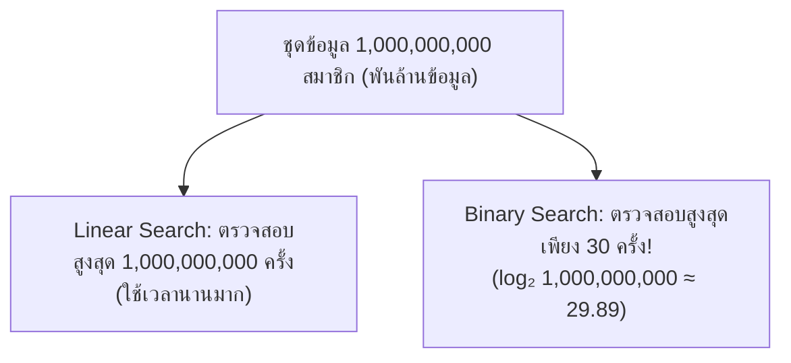
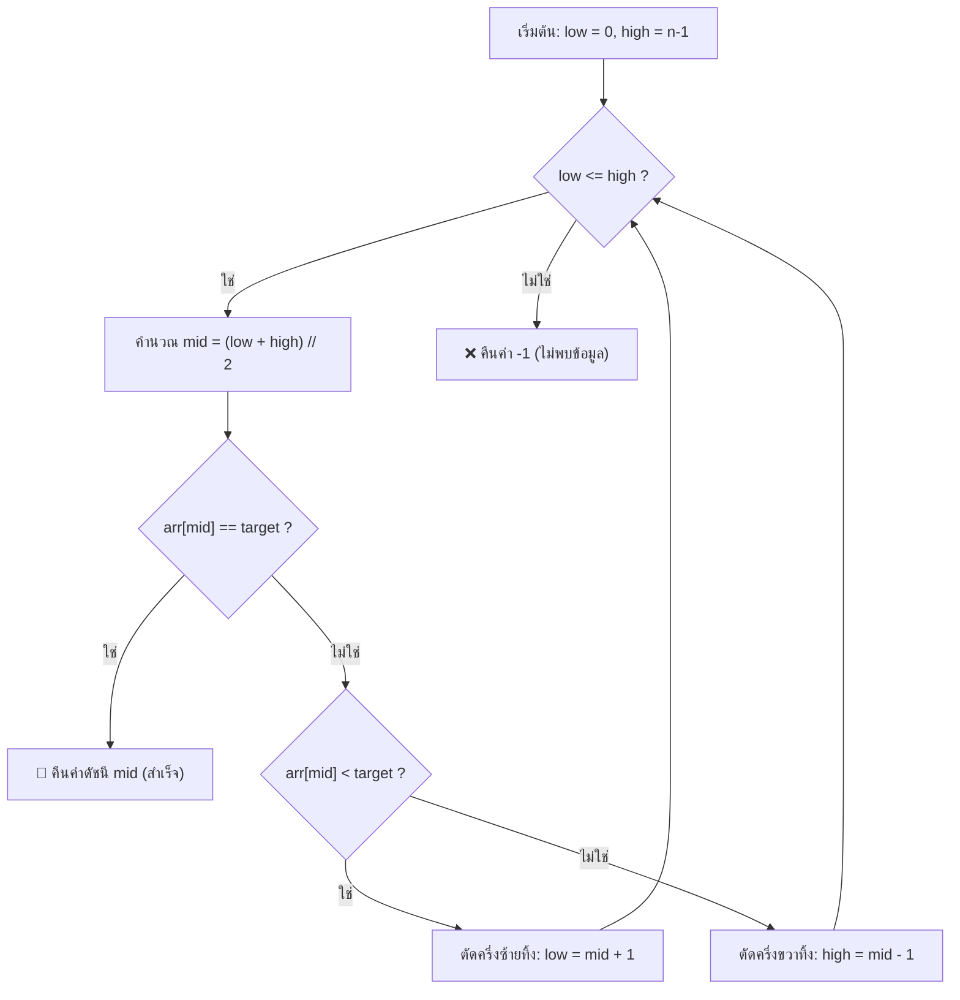

# วิทยาการคำนวณ 2: การออกแบบขั้นตอนวิธี โครงสร้างข้อมูล และการแก้ปัญหาด้วย Python
## บทที่ 5 อัลกอริทึมการค้นหาข้อมูล (Searching Algorithms)
**ผู้เขียน:** ผู้ช่วยศาสตราจารย์ ดร.ชีวะ ทัศนา • สาขาวิชาฟิสิกส์ คณะวิทยาศาสตร์และเทคโนโลยี มหาวิทยาลัยราชภัฏรำไพพรรณี

---

## 🎯 ผลลัพธ์การเรียนรู้ประจำบท (Behavioral Learning Outcomes)
เมื่อศึกษาบทเรียนนี้จบแล้ว ผู้เรียนสามารถ:
1. **อธิบาย (Explain)** กลไกการทำงาน ข้อดี และข้อจำกัดของอัลกอริทึมการค้นหาเชิงเส้น (Linear Search) และการค้นหาแบบทวิภาค (Binary Search)
2. **พิสูจน์ (Prove)** ความซับซ้อนเชิงเวลา $O(n)$ vs $O(\log n)$ และอธิบายเงื่อนไขความจำเป็นของการจัดเรียงข้อมูลก่อนทำ Binary Search
3. **เขียนโค้ด (Implement in Python)** อัลกอริทึม Binary Search ทั้งแบบวนซ้ำ (Iterative) และแบบเรียกซ้ำ (Recursive)
4. **วัดและเปรียบเทียบ (Benchmark)** ประสิทธิภาพการค้นหาในชุดข้อมูลขนาดใหญ่ระดับหลายล้านข้อมูลได้อย่างแม่นยำ

---

## 🌌 5.0 เรื่องเล่าเปิดบทเรียน: การค้นหาอนุภาคในข้อมูลขนาดเพตะไบต์

ที่สถาบันวิจัยนิวเคลียร์ยุโรป (CERN) เครื่องเร่งอนุภาค Large Hadron Collider (LHC) สร้างข้อมูลการชนกันของโปรตอนมากถึง **1,000,000 กิกะไบต์ (1 Petabyte) ในทุกๆ 1 วินาที**

หากนักฟิสิกส์ใช้วิธีสแกนข้อมูลทีละเรคคอร์ด (Linear Search) เพื่อตามหาการมีอยู่ของ **อนุภาคฮิกส์โบซอน (Higgs Boson)** พวกเขาจะต้องใช้เวลาคำนวณนานหลายร้อยปี! แต่ด้วย **ขั้นตอนวิธีค้นหาแบบทวิภาค (Binary Search) และโครงสร้างดัชนีขั้นสูง** การสืบค้นสามารถทำได้เสร็จสิ้นภายใน **ไม่กี่มิลลิวินาที!**



---

## 🔍 5.1 การค้นหาเชิงเส้น (Linear Search)

อัลกอริทึมที่เรียบง่ายที่สุด โดยเริ่มตรวจสอบสมาชิกตัวแรก ($i=0$) ไปจนถึงตัวสุดท้าย ($i=n-1$) ทีละตัว:

* **ข้อดี:** ใช้ได้กับข้อมูลทุกรูปแบบ โดย **ไม่จำเป็นต้องเรียงลำดับข้อมูลก่อน**
* **ความซับซ้อน:**
  * กรณีดีที่สุด (Best Case): **$O(1)$** (พบที่ตัวแรกสุด)
  * กรณีแย่ที่สุด (Worst Case): **$O(n)$** (พบที่ตัวสุดท้าย หรือไม่พบเลย)

```python
def linear_search(arr: list, target) -> int:
    """ค้นหาเชิงเส้น คืนค่าดัชนีที่พบ หรือ -1 หากไม่พบ"""
    for index, value in enumerate(arr):
        if value == target:
            return index
    return -1
```

---

## ⚡ 5.2 การค้นหาแบบทวิภาค (Binary Search)

### กฎเหล็กสำคัญ:
ข้อมูล **ต้องได้รับการจัดเรียงลำดับ (Sorted Data) เรียบร้อยแล้วเท่านั้น!**

### ขั้นตอนการทำงาน:
1. กำหนดขอบเขตการค้นหาด้วยตัวชี้ `low = 0` และ `high = len(arr) - 1`
2. คำนวณตำแหน่งตรงกลาง:
   $$mid = low + \lfloor \frac{high - low}{2} \rfloor$$
3. เปรียบเทียบค่าที่ตำแหน่ง `mid` กับ `target`:
   * หาก `arr[mid] == target` $\rightarrow$ พบเป้าหมาย คืนค่า `mid` ทันที ($O(1)$)
   * หาก `arr[mid] < target` $\rightarrow$ เป้าหมายต้องอยู่ครึ่งขวา ให้ปรับ `low = mid + 1`
   * หาก `arr[mid] > target` $\rightarrow$ เป้าหมายต้องอยู่ครึ่งซ้าย ให้ปรับ `high = mid - 1`
4. ทำซ้ำจนกระทั่ง `low > high` (แปลว่าไม่พบข้อมูล คืนค่า `-1`)



---

## 💻 5.3 โค้ดคอมพิวเตอร์: การประลองความเร็ว Linear vs Binary Search

```python
# search_algorithms_benchmark.py
# โปรแกรมเปรียบเทียบความเร็ว Linear Search vs Binary Search บนข้อมูล 10,000,000 ตัว
# ผู้เขียน: ผศ.ดร.ชีวะ ทัศนา (มรภ.รำไพพรรณี)

import time

def binary_search(sorted_arr: list, target: int) -> int:
    """การค้นหาแบบทวิภาค O(log n)"""
    low = 0
    high = len(sorted_arr) - 1
    
    while low <= high:
        mid = (low + high) // 2
        if sorted_arr[mid] == target:
            return mid
        elif sorted_arr[mid] < target:
            low = mid + 1
        else:
            high = mid - 1
    return -1

def main():
    print("=" * 65)
    print("🚀 การประลองความเร็ว: Linear Search vs Binary Search")
    print("=" * 65)
    
    # สร้างชุดข้อมูลที่เรียงลำดับแล้ว 10,000,000 สมาชิก
    N = 10_000_000
    print(f"📦 กำลังสร้างชุดข้อมูลจำนวน {N:,} รายการ...")
    dataset = list(range(N))
    target_value = 9_999_995  # อยู่เกือบท้ายสุด (Worst Case)
    
    # 1. ทดสอบ Linear Search
    t0 = time.perf_counter()
    linear_idx = -1
    for i, val in enumerate(dataset):
        if val == target_value:
            linear_idx = i
            break
    t_linear = time.perf_counter() - t0
    
    # 2. ทดสอบ Binary Search
    t0 = time.perf_counter()
    binary_idx = binary_search(dataset, target_value)
    t_binary = time.perf_counter() - t0
    
    print("-" * 65)
    print(f"🎯 เป้าหมาย: {target_value:,}")
    print(f"• Linear Search: พบที่ดัชนี {linear_idx} | ใช้เวลา: {t_linear:.6f} วินาที")
    print(f"• Binary Search: พบที่ดัชนี {binary_idx} | ใช้เวลา: {t_binary:.8f} วินาที")
    if t_binary > 0:
        speedup = t_linear / t_binary
        print(f"⚡ Binary Search เร็วกว่า Linear Search ถึง: {speedup:,.0f} เท่า!")
    print("=" * 65)

if __name__ == "__main__":
    main()
```

---

## 💡 5.4 สรุปใจความสำคัญและแบบฝึกหัดท้ายบทที่ 5

### 📌 สรุปประเด็นสำคัญ
1. **Linear Search ($O(n)$)** ยืดหยุ่น ไม่ต้องเรียงข้อมูล แต่ช้ามากเมื่อข้อมูลมีขนาดใหญ่
2. **Binary Search ($O(\log n)$)** ตัดพื้นที่การค้นหาลงครึ่งหนึ่งในทุกรอบ ทำให้ค้นหาข้อมูล 1 พันล้านรายการได้ใน 30 ขั้นตอน
3. ค่าใช้จ่ายในการจัดเรียงข้อมูล 1 ครั้งจะคุ้มค่าอย่างยิ่ง หากเราต้องทำการค้นหาข้อมูลนั้นซ้ำๆ หลายครั้ง

---

### 📝 แบบฝึกหัดทบทวน 3 ระดับ (Exercises)

#### ระดับที่ 1: ความรู้ความเข้าใจพื้นฐาน (Basic Knowledge)
1. หากชุดข้อมูลมีขนาด $N = 1,048,576$ รายการ ในกรณีที่แย่ที่สุด Binary Search จะต้องทำการเปรียบเทียบข้อมูลสูงสุดกี่ครั้ง
2. เหตุใดการคำนวณ `mid = (low + high) // 2` ในภาษาโปรแกรมบางภาษา (เช่น C/Java) อาจเกิดข้อผิดพลาด Integer Overflow และควรแก้ไขอย่างไร

#### ระดับที่ 2: การวิเคราะห์และประยุกต์ใช้ (Analytical Application)
3. กำหนดให้ `arr = [2, 5, 8, 12, 16, 23, 38, 56, 72, 91]` จงเขียนตาราง Trace Table แสดงค่า `low`, `high`, `mid` ในการค้นหาค่าเป้าหมาย `target = 23` ด้วย Binary Search

#### ระดับที่ 3: การคิดขั้นสูงและบูรณาการ (Advanced Synthesis)
4. จงเขียนฟังก์ชัน `find_first_and_last_position(arr, target)` โดยดัดแปลง Binary Search เพื่อหาตำแหน่งเริ่มต้นและตำแหน่งสิ้นสุดของตัวเลขที่ซ้ำกันในรายการที่เรียงแล้ว ในเวลา $O(\log n)$
