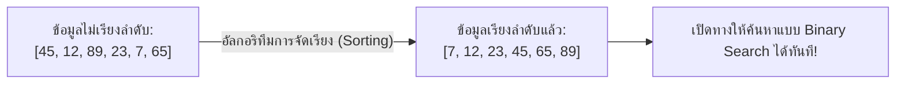
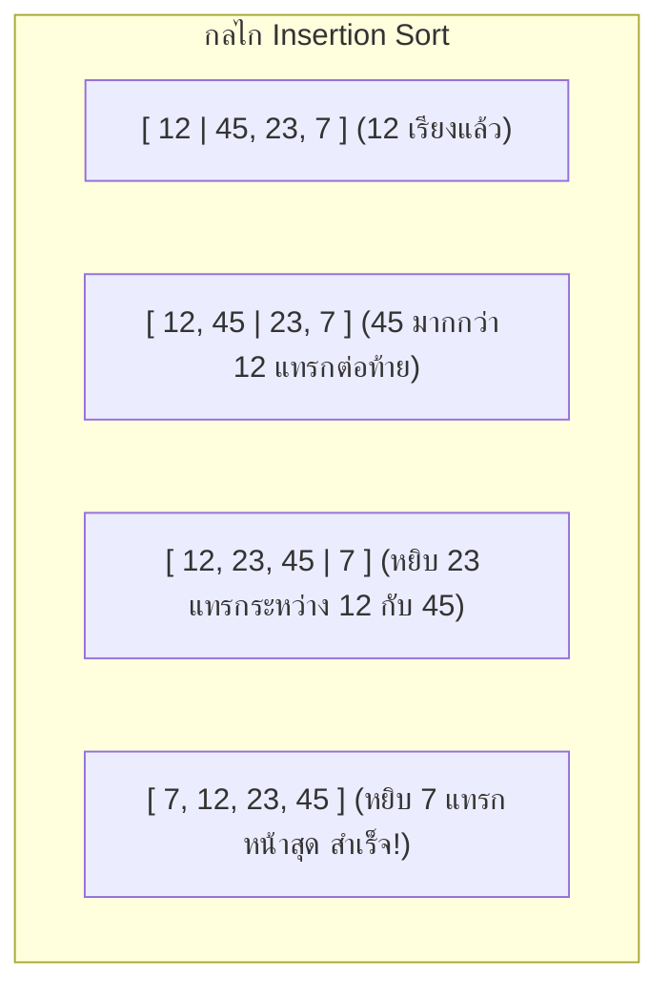
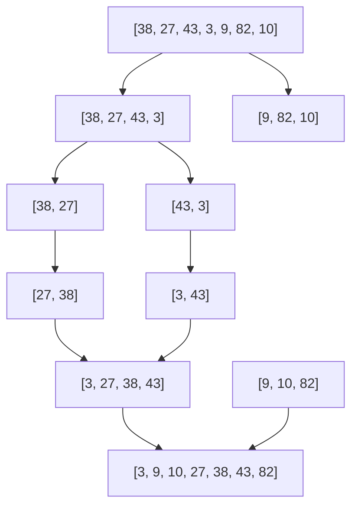

# วิทยาการคำนวณ 2 การออกแบบขั้นตอนวิธี โครงสร้างข้อมูล และการแก้ปัญหาด้วย Python
## บทที่ 6 อัลกอริทึมการจัดเรียงข้อมูล
**ผู้เขียน** ผู้ช่วยศาสตราจารย์ ดร.ชีวะ ทัศนา • สาขาวิชาฟิสิกส์ คณะวิทยาศาสตร์และเทคโนโลยี มหาวิทยาลัยราชภัฏรำไพพรรณี

---

## 🎯 ผลลัพธ์การเรียนรู้ประจำบท
เมื่อศึกษาบทเรียนนี้จบแล้ว ผู้เรียนสามารถ
1. **อธิบาย ** กลไกการทำงาน ความเสถียร (Stability) และความซับซ้อน Big-O ของอัลกอริทึมการจัดเรียงข้อมูลแบบคลาสสิก
2. **วิเคราะห์และเปรียบเทียบ ** ประสิทธิภาพระหว่าง Bubble Sort, Selection Sort, Insertion Sort ($O(n^2)$) และ Merge Sort ($O(n \log n)$)
3. **ออกแบบและเขียนโค้ด ** อัลกอริทึมการแบ่งแยกเพื่อพิชิต (Divide & Conquer) ใน Merge Sort
4. **เลือกใช้อัลกอริทึมการจัดเรียง ** ให้เหมาะสมกับขนาดและลักษณะเฉพาะของข้อมูลในสถานการณ์จริง

---

## 🌌 6.0 เรื่องเล่าเปิดบทเรียน ทำไมโลกจึงต้องจัดเรียงข้อมูล?

ประมาณการกันว่า **มากกว่า 25% ของเวลาการคำนวณทั้งหมดของศูนย์ข้อมูล (Data Centers) ทั่วโลก ถูกใช้ไปกับการ "จัดเรียงข้อมูล (Sorting)"**

ไม่ว่าจะเป็นการเรียงลำดับราคาสินค้าใน Shopee/Lazada, การจัดอันดับผลการค้นหาบน Google, หรือการจัดลำดับยีนในรหัสพันธุกรรม การจัดเรียงข้อมูลเป็น เงื่อนไขเบื้องต้น ที่ทำให้อัลกอริทึมอื่นๆ (เช่น Binary Search) สามารถทำงานได้ด้วยความเร็วแสง



---

## 📊 6.1 ตารางเปรียบเทียบ 4 อัลกอริทึมการจัดเรียงข้อมูลยอดนิยม

| อัลกอริทึม | Best Case | Average Case | Worst Case | Space Complexity | ความเสถียร (Stable) | จุดเด่นที่เหมาะสม |
| :--- | :---: | :---: | :---: | :---: | :---: | :--- |
| **Bubble Sort** | $O(n)$ | $O(n^2)$ | $O(n^2)$ | $O(1)$ | ✅ Stable | ใช้เพื่อการเรียนการสอน |
| **Selection Sort** | $O(n^2)$ | $O(n^2)$ | $O(n^2)$ | $O(1)$ | ❌ Unstable | จำนวนครั้งการสลับค่าน้อยที่สุด |
| **Insertion Sort** | $O(n)$ | $O(n^2)$ | $O(n^2)$ | $O(1)$ | ✅ Stable | ข้อมูลมีขนาดเล็ก หรือเรียงมาเกือบหมดแล้ว |
| **Merge Sort** | **$O(n \log n)$** | **$O(n \log n)$** | **$O(n \log n)$** | $O(n)$ | ✅ Stable | ข้อมูลขนาดใหญ่ การันตีความเร็วคงที่ |

---

## 🫧 6.2 อัลกอริทึมการจัดเรียงระดับพื้นฐาน ($O(n^2)$)

### 1. บับเบิลซอร์ต
เปรียบเทียบสมาชิกทีละคู่ที่อยู่ติดกัน หากตัวหน้ามากกว่าตัวหลัง ให้สลับตำแหน่งกัน (Swap) ค่าที่มากที่สุดจะค่อยๆ ลอยขึ้นไปอยู่ท้ายสุด เหมือนฟองสบู่

### 2. ซีเลกชันซอร์ต
วนลูปหา **ค่าที่น้อยที่สุด ** ในส่วนที่ยังไม่เรียง แล้วนำมาสลับกับตำแหน่งแรก ทำซ้ำเช่นนี้ไปเรื่อยๆ

### 3. อินเซอร์ชันซอร์ต
หยิบสมาชิกทีละตัวมา **แทรก ** ลงในตำแหน่งที่ถูกต้องของส่วนหน้าที่เรียงลำดับแล้ว คล้ายกับการจัดเรียงไพ่ในมือ



---

## ⚡ 6.3 เมิร์จซอร์ต การแบ่งแยกเพื่อพิชิต

Merge Sort แบ่งปัญหาออกเป็น 3 ขั้นตอน
1. **Divide:** แบ่งลิสต์ครึ่งหนึ่งออกเป็น 2 ส่วนย่อยซ้ำๆ จนเหลือสมาชิกเพียง 1 ตัว
2. **Conquer:** ลิสต์ที่มีสมาชิก 1 ตัว ถือว่าเรียงลำดับแล้วโดยปริยาย
3. **Combine (Merge):** รวมลิสต์ย่อย 2 ลิสต์ที่เรียงแล้วเข้าด้วยกันทีละคู่ จนได้ลิสต์ใหญ่ที่สมบูรณ์



---

## 💻 6.4 โค้ดคอมพิวเตอร์ Merge Sort และการทดสอบจับเวลาจริง

```python
# sorting_algorithms_suite.py
# โปรแกรมรวบรวมและเปรียบเทียบอัลกอริทึมการจัดเรียงข้อมูล
# ผู้เขียน: ผศ.ดร.ชีวะ ทัศนา (มรภ.รำไพพรรณี)

import time
import random

def merge_sort(arr: list) -> list:
    """Merge Sort O(n log n) Divide and Conquer"""
    if len(arr) <= 1:
        return arr
        
    mid = len(arr) // 2
    left_half = merge_sort(arr[:mid])
    right_half = merge_sort(arr[mid:])
    
    # รวม 2 ซีกที่เรียงแล้วเข้าด้วยกัน (Merge Step)
    merged = []
    i = j = 0
    while i < len(left_half) and j < len(right_half):
        if left_half[i] <= right_half[j]:
            merged.append(left_half[i])
            i += 1
        else:
            merged.append(right_half[j])
            j += 1
            
    merged.extend(left_half[i:])
    merged.extend(right_half[j:])
    return merged

def insertion_sort(arr: list) -> list:
    """Insertion Sort O(n^2)"""
    a = arr.copy()
    for i in range(1, len(a)):
        key = a[i]
        j = i - 1
        while j >= 0 and a[j] > key:
            a[j + 1] = a[j]
            j -= 1
        a[j + 1] = key
    return a

def main():
    print("=" * 65)
    print("📊 การประลองความเร็ว: Insertion Sort O(n²) vs Merge Sort O(n log n)")
    print("=" * 65)
    
    N = 8000
    print(f"📦 สุ่มสร้างข้อมูลตัวเลข {N:,} จำนวน...")
    dataset = [random.randint(1, 100000) for _ in range(N)]
    
    # 1. วัดเวลา Insertion Sort
    t0 = time.perf_counter()
    res_ins = insertion_sort(dataset)
    t_ins = time.perf_counter() - t0
    
    # 2. วัดเวลา Merge Sort
    t0 = time.perf_counter()
    res_mrg = merge_sort(dataset)
    t_mrg = time.perf_counter() - t0
    
    print("-" * 65)
    print(f"• Insertion Sort O(n²):     ใช้เวลา {t_ins:.4f} วินาที")
    print(f"• Merge Sort O(n log n):    ใช้เวลา {t_mrg:.4f} วินาที")
    if t_mrg > 0:
        print(f"⚡ Merge Sort เร็วกว่าถึง:    {t_ins / t_mrg:,.1f} เท่า!")
    print(f"✅ ความถูกต้องของการเรียง: {res_ins == res_mrg == sorted(dataset)}")
    print("=" * 65)

if __name__ == "__main__":
    main()
```

---

## 💡 6.5 สรุปใจความสำคัญและแบบฝึกหัดท้ายบทที่ 6

### 📌 สรุปประเด็นสำคัญ
1. **Bubble, Selection, Insertion Sort** เหมาะสำหรับข้อมูลขนาดเล็ก แต่มี Time Complexity เป็น $O(n^2)$ จึงไม่เหมาะกับข้อมูลขนาดใหญ่
2. **Merge Sort** นำหลักการ Divide & Conquer มาใช้ ทำให้มีความเร็วการันตีที่ $O(n \log n)$ เสมอในทุกกรณี
3. ฟังก์ชัน `sorted()` หรือ `.sort()` ใน Python ใช้ **Timsort** ซึ่งเป็นลูกผสมอันทรงพลังระหว่าง Insertion Sort และ Merge Sort

---

### 📝 แบบฝึกหัดทบทวน 3 ระดับ

#### ระดับที่ 1 ความรู้ความเข้าใจพื้นฐาน
1. อธิบายความหมายของคำว่า **"ความเสถียรของขั้นตอนวิธีจัดเรียง (Stable Sorting)"** และเหตุใดจึงมีความสำคัญในการจัดเรียงข้อมูลที่มีคีย์ซ้ำกัน
2. เพราะเหตุใด Merge Sort จึงต้องใช้หน่วยความจำเพิ่มเติม (Space Complexity) เป็น $O(n)$

#### ระดับที่ 2 การวิเคราะห์และประยุกต์ใช้
3. กำหนดให้ `arr = [64, 25, 12, 22, 11]` จงเขียนลำดับของข้อมูลในแต่ละรอบ (Pass 1 ถึง Pass 4) เมื่อจัดเรียงด้วย Selection Sort

#### ระดับที่ 3 การคิดขั้นสูงและบูรณาการ
4. จงเขียนโปรแกรมจัดเรียงรายชื่อนักศึกษาตาม **"เกรดเฉลี่ย (GPAX) จากมากไปน้อย"** และหากเกรดเฉลี่ยเท่ากัน ให้เรียงตาม **ชื่อภาษาไทยตามพจนานุกรม** โดยใช้อัลกอริทึมที่เสถียร
