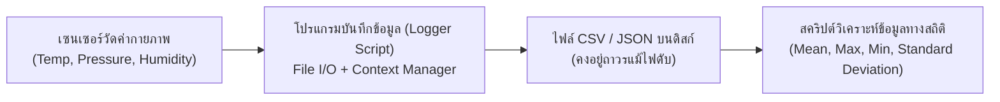

# วิทยาการคำนวณ 2 การออกแบบขั้นตอนวิธี โครงสร้างข้อมูล และการแก้ปัญหาด้วย Python
## บทที่ 7 การจัดการไฟล์และการวิเคราะห์ข้อมูล
**ผู้เขียน** ผู้ช่วยศาสตราจารย์ ดร.ชีวะ ทัศนา • สาขาวิชาฟิสิกส์ คณะวิทยาศาสตร์และเทคโนโลยี มหาวิทยาลัยราชภัฏรำไพพรรณี

---

## 🎯 ผลลัพธ์การเรียนรู้ประจำบท
เมื่อศึกษาบทเรียนนี้จบแล้ว ผู้เรียนสามารถ
1. **อธิบาย ** วงจรชีวิตของไฟล์ (File Lifecycle) และการใช้บริบทตัวจัดการ (`with` Context Manager) เพื่อป้องกันปัญหาหน่วยความจำและ File Descriptor รั่วไหล
2. **อ่านและเขียน ** ข้อมูลไฟล์ข้อความ (Text Files), ไฟล์ตารางเชิงโครงสร้าง (CSV), และไฟล์โครงสร้างลำดับชั้น (JSON) ด้วยไลบรารีมาตรฐาน
3. **ประมวลผลและสกัดข้อมูล ** จากชุดข้อมูลบันทึกผลการทดลองทางวิทยาศาสตร์จริง (Scientific Sensor Logs)
4. **พัฒนาโปรแกรมวิเคราะห์ข้อมูล ** เพื่อคำนวณค่าทางสถิติและสร้างรายงานสรุปอัตโนมัติ

---

## 🌌 7.0 เรื่องเล่าเปิดบทเรียน กล่องดำบันทึกข้อมูลและสถานีตรวจวัดอุตุนิยมวิทยา

สถานีตรวจวัดสภาพอากาศอัตโนมัติ (Automated Weather Station) ที่ติดตั้งอยู่บนยอดเขาบันทึกค่าอุณหภูมิ ความกดอากาศ ความชื้นสัมพัทธ์ และความเร็วลมในทุกๆ 1 นาที ตลอด 365 วัน ข้อมูลมากกว่า **525,600 แถวต่อปี** จะถูกบันทึกเก็บไว้ในรูปแบบ **ไฟล์ CSV และ JSON**



หากไม่มีระบบ **การจัดการไฟล์ ** ข้อมูลทั้งหมดที่ประมวลผลใน RAM จะสูญหายไปทันทีที่โปรแกรมปิดตัวลง การจัดการไฟล์จึงเป็นสะพานเชื่อมระหว่างโลกการประมวลผลชั่วคราวสู่การจัดเก็บข้อมูลถาวรในระยะยาว

---

## 📂 7.1 การจัดการไฟล์ด้วย Context Manager (`with` Statement)

<div style="background: linear-gradient(135deg, #f0fdf4, #dcfce7); border-left: 5px solid #16a34a; border-radius: 12px; padding: 18px 22px; margin: 20px 0; color: #14532d;">
  <h4 style="color: #15803d; margin-top: 0;">📌 กฎเหล็ก: ใช้ <code>with open(...)</code> เสมอ!</h4>
  <p style="margin: 0; line-height: 1.75;">
    การใช้คำสั่ง <code>with open('file.txt', 'r', encoding='utf-8') as f:</code> จะรับประกันว่าระบบจะทำการ <strong>ปิดไฟล์ (close) โดยอัตโนมัติ 100%</strong> เสมอ แม้ว่าจะเกิดข้อผิดพลาด (Exception) ระหว่างการทำงานก็ตาม
  </p>
</div>

### โหมดการเปิดไฟล์หลัก 
* `'r'` : **Read (อ่านอย่างเดียว)** - เกิด error หากไฟล์ไม่มีอยู่จริง
* `'w'` : **Write (เขียนใหม่)** - สร้างไฟล์ใหม่ หรือลบเนื้อหาเดิมทิ้งทั้งหมดแล้วเขียนใหม่
* `'a'` : **Append (เขียนต่อท้าย)** - เพิ่มข้อมูลต่อจากบรรทัดสุดท้าย โดยไม่ลบของเดิม
* `encoding='utf-8'` : **สำคัญมาก!** เพื่อรองรับภาษาไทยและอักขระพิเศษสากล

---

## 📊 7.2 การจัดการไฟล์ CSV ด้วยโมดูล `csv`

```python
import csv

# การเขียนข้อมูลลงไฟล์ CSV ด้วย csv.DictWriter
weather_data = [
    {"timestamp": "2026-08-22 08:00", "temp_c": 26.5, "humidity": 82.0, "status": "Clear"},
    {"timestamp": "2026-08-22 12:00", "temp_c": 34.2, "humidity": 55.0, "status": "Sunny"},
    {"timestamp": "2026-08-22 18:00", "temp_c": 29.0, "humidity": 70.0, "status": "Cloudy"},
]

with open('weather_log.csv', 'w', newline='', encoding='utf-8') as f:
    fieldnames = ["timestamp", "temp_c", "humidity", "status"]
    writer = csv.DictWriter(f, fieldnames=fieldnames)
    writer.writeheader()
    writer.writerows(weather_data)
```

---

## 🌳 7.3 การจัดการไฟล์ JSON ด้วยโมดูล `json`

**JSON (JavaScript Object Notation)** เหมาะสำหรับข้อมูลที่มีโครงสร้างลำดับชั้นซับซ้อน (Nested Structure):

```mermaid
graph TD
    PythonObj["Python Data Structure\n(Dict, List, Int, Str)"] --"json.dump() / json.dumps() (Serialization)"--> JSONText["JSON Text String / .json File\n{\"station_id\": \"RBRU-01\", \"sensors\": [...]}"]
    JSONText --"json.load() / json.loads() (Deserialization)"--> PythonObj
```

---

## 💻 7.4 โค้ดคอมพิวเตอร์ ระบบวิเคราะห์ข้อมูลการทดลองและสร้างรายงานสรุปอัตโนมัติ

```python
# scientific_data_analytics.py
# โปรแกรมอ่านไฟล์ข้อมูลการทดลองทางวิทยาศาสตร์และคำนวณสถิติอัตโนมัติ
# ผู้เขียน: ผศ.ดร.ชีวะ ทัศนา (มรภ.รำไพพรรณี)

import csv
import json
import os

def generate_sample_csv(filename: str):
    """สร้างไฟล์ CSV ตัวอย่างบันทึกค่าความดันและอุณหภูมิของการทดลองก๊าซ"""
    data = [
        {"run_id": 1, "volume_L": 10.0, "temp_K": 300.0, "pressure_atm": 2.46},
        {"run_id": 2, "volume_L": 8.0,  "temp_K": 300.0, "pressure_atm": 3.08},
        {"run_id": 3, "volume_L": 6.0,  "temp_K": 300.0, "pressure_atm": 4.10},
        {"run_id": 4, "volume_L": 4.0,  "temp_K": 300.0, "pressure_atm": 6.15},
        {"run_id": 5, "volume_L": 2.0,  "temp_K": 300.0, "pressure_atm": 12.30},
    ]
    with open(filename, 'w', newline='', encoding='utf-8') as f:
        writer = csv.DictWriter(f, fieldnames=["run_id", "volume_L", "temp_K", "pressure_atm"])
        writer.writeheader()
        writer.writerows(data)

def analyze_physics_experiment(csv_file: str, json_summary_file: str):
    """อ่านไฟล์ CSV และคำนวณค่าคงตัวของก๊าซ (P*V) พร้อมบันทึกผลเป็น JSON"""
    pv_constants = []
    
    with open(csv_file, 'r', encoding='utf-8') as f:
        reader = csv.DictReader(f)
        for row in reader:
            p = float(row["pressure_atm"])
            v = float(row["volume_L"])
            pv = p * v
            pv_constants.append(pv)
            
    avg_pv = sum(pv_constants) / len(pv_constants)
    summary = {
        "experiment": "Boyle's Law Gas Experiment (กฎของบอยล์: P*V = Constant)",
        "total_data_points": len(pv_constants),
        "pv_values": pv_constants,
        "average_pv_constant": round(avg_pv, 4),
        "is_valid_boyle_law": all(abs(pv - avg_pv) < 0.1 for pv in pv_constants)
    }
    
    # บันทึกเป็น JSON
    with open(json_summary_file, 'w', encoding='utf-8') as f:
        json.dump(summary, f, indent=4, ensure_ascii=False)
        
    print(f"✅ บันทึกรายงานสรุปเป็น JSON สำเร็จ: {json_summary_file}")
    print(json.dumps(summary, indent=2, ensure_ascii=False))

def main():
    print("=" * 65)
    print("🔬 ระบบวิเคราะห์และบันทึกข้อมูลการทดลองฟิสิกส์ (Data Analytics Lab)")
    print("=" * 65)
    
    csv_name = "gas_experiment_data.csv"
    json_name = "gas_experiment_summary.json"
    
    generate_sample_csv(csv_name)
    analyze_physics_experiment(csv_name, json_name)
    
    # ล้างไฟล์ชั่วคราว
    if os.path.exists(csv_name): os.remove(csv_name)
    if os.path.exists(json_name): os.remove(json_name)
    print("=" * 65)

if __name__ == "__main__":
    main()
```

---

## 💡 7.5 สรุปใจความสำคัญและแบบฝึกหัดท้ายบทที่ 7

### 📌 สรุปประเด็นสำคัญ
1. ใช้ `with open(..., encoding='utf-8')` เสมอ เพื่อการจัดการหน่วยความจำที่ปลอดภัยและรองรับภาษาไทย
2. **CSV** เหมาะสำหรับข้อมูลตารางแถว-คอลัมน์ (Tabular Data)
3. **JSON** เหมาะสำหรับข้อมูลเชิงวัตถุที่มีลำดับชั้นและการเชื่อมต่อ API

---

### 📝 แบบฝึกหัดทบทวน 3 ระดับ

#### ระดับที่ 1 ความรู้ความเข้าใจพื้นฐาน
1. จงระบุความแตกต่างระหว่างฟังก์ชัน `json.dump()` กับ `json.dumps()` ในภาษา Python
2. หากเราเปิดไฟล์ด้วยโหมด `'w'` ซ้ำกับไฟล์ที่มีข้อมูลอยู่แล้ว ผลลัพธ์ของไฟล์เดิมจะเป็นอย่างไร

#### ระดับที่ 2 การวิเคราะห์และประยุกต์ใช้
3. จงเขียนฟังก์ชัน `count_lines_and_words(filename)` ที่อ่านไฟล์ข้อความภาษาอังกฤษ แล้วคืนค่าจำนวนบรรทัด และจำนวนคำทั้งหมดในไฟล์

#### ระดับที่ 3 การคิดขั้นสูงและบูรณาการ
4. จงเขียนโปรแกรมอ่านไฟล์บันทึกการทำธุรกรรม `transactions.csv` (ประกอบด้วยคอลัมน์ `date, customer_id, amount, category`) แล้วสรุปยอดเงินรวมแยกตามหมวดหมู่ (`category`) พร้อมบันทึกผลลัพธ์เป็นไฟล์ `category_summary.json`
