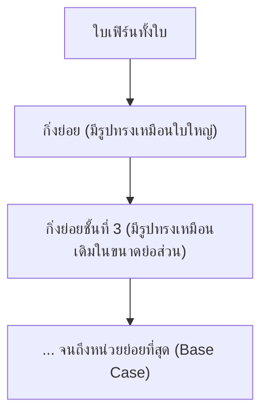
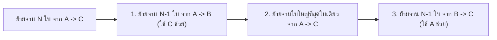

# วิทยาการคำนวณ 2: การออกแบบขั้นตอนวิธี โครงสร้างข้อมูล และการแก้ปัญหาด้วย Python
## บทที่ 8 การคิดแบบเรียกซ้ำและการประยุกต์แบบจำลองวิทยาศาสตร์ (Recursion & Scientific Simulation)
**ผู้เขียน:** ผู้ช่วยศาสตราจารย์ ดร.ชีวะ ทัศนา • สาขาวิชาฟิสิกส์ คณะวิทยาศาสตร์และเทคโนโลยี มหาวิทยาลัยราชภัฏรำไพพรรณี

---

## 🎯 ผลลัพธ์การเรียนรู้ประจำบท (Behavioral Learning Outcomes)
เมื่อศึกษาบทเรียนนี้จบแล้ว ผู้เรียนสามารถ:
1. **อธิบาย (Explain)** กลไกการทำงานของฟังก์ชันเรียกซ้ำ (Recursion), บทบาทของ Call Stack, และการป้องกันปัญหา Stack Overflow ด้วยเงื่อนไขหยุด (Base Case)
2. **ออกแบบและเขียนโค้ด (Design & Code Recursive Algorithms)** สำหรับการแก้ปัญหาคลาสสิก เช่น ปริศนาหอคอยฮานอย (Tower of Hanoi) และลำดับฟีโบนัชชี (Fibonacci Sequence)
3. **ประยุกต์ใช้เทคนิค Memoization (Optimize with Dynamic Programming)** เพื่อลดความซับซ้อนเชิงเวลาจาก $O(2^n)$ ให้เหลือเพียง $O(n)$
4. **สร้างแบบจำลองฟิสิกส์เชิงคำนวณ (Build Physics Simulations)** จำลองระบบการสั่นของสปริง (Harmonic Oscillator) ด้วยระเบียบวิธีเชิงตัวเลขของออยเลอร์ (Euler's Method)

---

## 🌌 8.0 เรื่องเล่าเปิดบทเรียน: ความงดงามของแฟร็กทัลและฟังก์ชันที่เรียกตัวเอง

หากเราพิจารณา **ใบเฟิร์น (Fern Leaf)** หรือ **เกล็ดหิมะ (Snowflake Fractal)** เราจะพบว่าส่วนประกอบย่อยของใบเฟิร์นแต่ละกิ่ง มีรูปร่างและลวดลายเหมือนกับใบเฟิร์นทั้งใบทุกประการในขนาดย่อส่วน (Self-similarity)



ในทางวิทยาการคอมพิวเตอร์ เราเรียกกระบวนการที่ **ฟังก์ชันเรียกใช้งานตัวเองเพื่อแก้ปัญหาเดิมในขนาดที่เล็กลง** ว่า **"การคิดแบบเรียกซ้ำ (Recursion)"**

---

## 🏛️ 8.1 กายวิภาคของฟังก์ชันเรียกซ้ำ (The Anatomy of Recursion)

ฟังก์ชันเรียกซ้ำที่สมบูรณ์ **ต้องมี 2 องค์ประกอบนี้เสมอ**:

<div style="background: linear-gradient(135deg, #eff6ff, #dbeafe); border-left: 5px solid #2563eb; border-radius: 12px; padding: 18px 22px; margin: 20px 0; color: #1e3a8a;">
  <h4 style="color: #1d4ed8; margin-top: 0;">📌 2 กฎเหล็กของฟังก์ชันเรียกซ้ำ</h4>
  <ol style="margin: 0; line-height: 1.75;">
    <li><strong>1. Base Case (กรณีฐาน/เงื่อนไขหยุด):</strong> จุดที่ปัญหาเล็กจนตอบได้ทันทีโดยไม่ต้องเรียกซ้ำอีก เพื่อป้องกันการเกิดลูปไม่รู้จบและ <code>RecursionError: maximum recursion depth exceeded</code></li>
    <li><strong>2. Recursive Case (กรณีเรียกซ้ำ):</strong> การแปลงปัญหาให้อยู่ในรูปของปัญหาย่อยของฟังก์ชันเดิม แต่มีขนาดข้อมูลที่เล็กลงและ <strong>ขยับเข้าใกล้ Base Case เสมอ</strong></li>
  </ol>
</div>

### ตัวอย่าง: การหาค่าแฟกทอเรียล $N!$
$$N! = \begin{cases} 1 & \text{ถ้า } N = 0 \text{ หรือ } 1 \quad (\text{Base Case}) \\ N \times (N-1)! & \text{ถ้า } N > 1 \quad (\text{Recursive Case}) \end{cases}$$

```python
def factorial_recursive(n: int) -> int:
    if n <= 1:           # Base Case
        return 1
    return n * factorial_recursive(n - 1) # Recursive Case
```

---

## 🏰 8.2 ปริศนาหอคอยฮานอย (Tower of Hanoi)

การย้ายจาน $N$ ใบจากเสา $A$ ไปยังเสา $C$ โดยใช้เสา $B$ พักจาน โดยมีกฎว่า:
1. ย้ายจานได้ทีละ 1 ใบเท่านั้น
2. ห้ามวางจานใหญ่ทับบนจานเล็กเด็ดขาด



จำนวนขั้นตอนการย้ายทั้งหมดสำหรับจาน $N$ ใบ คือ **$2^N - 1$ ครั้ง**

---

## 🔬 8.3 แบบจำลองฟิสิกส์เชิงคำนวณ: การสั่นของมวลติดสปริง (Harmonic Oscillator)

ระบบมวล $m$ ติดสปริงค่าคงที่ $k$ เคลื่อนที่ตามกฎข้อที่ 2 ของนิวตัน:
$$F = -kx = m \cdot a \implies a(t) = \frac{d^2x}{dt^2} = -\frac{k}{m}x(t)$$

การแก้สมการเชิงอนุพันธ์ด้วย **Euler-Cromer Numerical Integration ($\Delta t$):**
1. คำนวณความเร่ง: $a_{t} = -\frac{k}{m} x_{t}$
2. อัปเดตความเร็ว: $v_{t+\Delta t} = v_{t} + a_{t} \cdot \Delta t$
3. อัปเดตตำแหน่ง: $x_{t+\Delta t} = x_{t} + v_{t+\Delta t} \cdot \Delta t$

---

## 💻 8.4 โค้ดคอมพิวเตอร์: หอคอยฮานอยและแบบจำลองการสั่นของสปริง

```python
# recursion_and_spring_simulation.py
# โปรแกรมแก้ปัญหาหอคอยฮานอย และจำลองการสั่นของมวลติดสปริง
# ผู้เขียน: ผศ.ดร.ชีวะ ทัศนา (มรภ.รำไพพรรณี)

import math

def solve_hanoi(n: int, source: str, target: str, auxiliary: str, step_counter: list):
    """ฟังก์ชันแก้ปัญหาหอคอยฮานอยแบบเรียกซ้ำ"""
    if n == 1:
        step_counter[0] += 1
        print(f"   ขั้นตอนที่ {step_counter[0]:<3}: ย้ายจาน 1 จาก เสา [{source}] -> เสา [{target}]")
        return
        
    solve_hanoi(n - 1, source, auxiliary, target, step_counter)
    step_counter[0] += 1
    print(f"   ขั้นตอนที่ {step_counter[0]:<3}: ย้ายจาน {n} จาก เสา [{source}] -> เสา [{target}]")
    solve_hanoi(n - 1, auxiliary, target, source, step_counter)

def simulate_spring_oscillation(mass_kg: float, k_spring: float, x0: float, dt: float, total_time: float):
    """จำลองการเคลื่อนที่แบบฮาร์มอนิกอย่างง่ายด้วยระเบียบวิธี Euler-Cromer"""
    print("\n" + "=" * 65)
    print(f"🌀 ผลการจำลองการสั่นของสปริง (m = {mass_kg} kg, k = {k_spring} N/m, x0 = {x0} m)")
    omega = math.sqrt(k_spring / mass_kg)
    period = 2.0 * math.pi / omega
    print(f"   • ความถี่เชิงมุม (ω): {omega:.2f} rad/s | คาบการสั่น (T): {period:.2f} s")
    print("-" * 65)
    print(f"{'เวลา t (s)':<10} | {'ตำแหน่ง x (m)':<15} | {'ความเร็ว v (m/s)':<18} | {'พลังงานรวม E (J)':<15}")
    print("-" * 65)
    
    t = 0.0
    x = x0
    v = 0.0
    
    while t <= total_time:
        # พลังงานรวมกล (E = 0.5*m*v^2 + 0.5*k*x^2)
        energy = 0.5 * mass_kg * (v ** 2) + 0.5 * k_spring * (x ** 2)
        print(f"{t:<10.2f} | {x:<15.4f} | {v:<18.4f} | {energy:<15.4f}")
        
        # Euler-Cromer Step
        a = -(k_spring / mass_kg) * x
        v = v + a * dt
        x = x + v * dt
        t += dt
        
    print("=" * 65)

def main():
    print("=" * 65)
    print("🏰 การแก้ปัญหาหอคอยฮานอยสำหรับจาน N = 3 ใบ")
    print("=" * 65)
    counter = [0]
    solve_hanoi(3, "A (ต้นทาง)", "C (เป้าหมาย)", "B (เสาพัก)", counter)
    print(f"🎯 ย้ายสำเร็จทั้งหมด: {counter[0]} ขั้นตอน (สูตร 2^3 - 1 = {2**3 - 1})")
    
    # จำลองการสั่นของสปริง 2 วินาที
    simulate_spring_oscillation(mass_kg=1.0, k_spring=39.478, x0=0.1, dt=0.2, total_time=2.0)

if __name__ == "__main__":
    main()
```

---

## 💡 8.5 สรุปใจความสำคัญและแบบฝึกหัดท้ายบทที่ 8

### 📌 สรุปประเด็นสำคัญ
1. **Recursion** ช่วยให้การเขียนโค้ดสำหรับปัญหาที่มีลักษณะ Self-similarity (เช่น ต้นไม้, กราฟ, หอคอยฮานอย) มีความกระชับและงดงาม
2. ทุกฟังก์ชันเรียกซ้ำต้องมี **Base Case** ที่ถูกต้องเพื่อไม่ให้เกิด Stack Overflow
3. การจำลองทางฟิสิกส์เชิงคำนวณด้วย **Euler-Cromer Method** สามารถแปลงสมการเชิงอนุพันธ์อันดับ 2 ของการสั่นให้กลายเป็นการอัปเดตสถานะแบบลูปที่แม่นยำสูง

---

### 📝 แบบฝึกหัดทบทวน 3 ระดับ (Exercises)

#### ระดับที่ 1: ความรู้ความเข้าใจพื้นฐาน (Basic Knowledge)
1. หากเราต้องการย้ายจานในหอคอยฮานอยจำนวน $N = 64$ ใบ ตามตำนานโบราณ จะต้องใช้จำนวนขั้นตอนการย้ายทั้งหมดกี่ครั้ง และหากย้ายได้วินาทีละ 1 ครั้ง จะต้องใช้เวลากี่ปี
2. อธิบายความแตกต่างระหว่างการทำงานของ **Call Stack** ในฟังก์ชันแบบวนซ้ำ (Loop) เทียบกับฟังก์ชันเรียกซ้ำ (Recursion)

#### ระดับที่ 2: การวิเคราะห์และประยุกต์ใช้ (Analytical Application)
3. จงเขียนฟังก์ชันเรียกซ้ำ `sum_of_digits(n)` ที่คำนวณผลรวมของเลขโดดในจำนวนเต็มบวก เช่น `sum_of_digits(12345)` $\rightarrow 1+2+3+4+5 = 15$

#### ระดับที่ 3: การคิดขั้นสูงและบูรณาการ (Advanced Synthesis)
4. ฟังก์ชันคำนวณลำดับฟีโบนัชชีแบบเรียกซ้ำดั้งเดิม $Fib(n) = Fib(n-1) + Fib(n-2)$ มีความซับซ้อนเชิงเวลาเป็น $O(2^n)$ จงเขียนฟังก์ชัน `fibonacci_memo(n)` โดยใช้เทคนิค **Memoization (การจดจำผลลัพธ์ด้วย Dictionary)** เพื่อปรับปรุงให้มีความซับซ้อนเชิงเวลาลดลงเหลือเพียง $O(n)$
