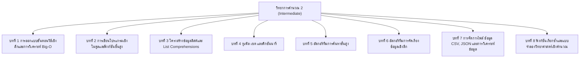

# วิทยาการคำนวณ 2 การออกแบบขั้นตอนวิธี โครงสร้างข้อมูล และการแก้ปัญหาด้วย Python
**ผู้เขียน** ผู้ช่วยศาสตราจารย์ ดร.ชีวะ ทัศนา  
**สังกัด** สาขาวิชาฟิสิกส์ คณะวิทยาศาสตร์และเทคโนโลยี มหาวิทยาลัยราชภัฏรำไพพรรณี  
**สำนักพิมพ์** สำนักพิมพ์มหาวิทยาลัยราชภัฏรำไพพรรณี (RBRU Press)  

---

  

  
  
<em>ภาพที่ 1 ปกหนังสือวิชาการ วิทยาการคำนวณ 2 การออกแบบขั้นตอนวิธี โครงสร้างข้อมูล และการแก้ปัญหาด้วย Python</em>

## 🏛️ ข้อมูลทางบรรณานุกรมและกองบรรณาธิการ

* **ชื่อเรื่อง** วิทยาการคำนวณ 2 การออกแบบขั้นตอนวิธี โครงสร้างข้อมูล และการแก้ปัญหาด้วย Python
* **ผู้เขียน** ชีวะ ทัศนา, 2526—
* **พิมพ์ครั้งที่** 1 (สิงหาคม 2569 / August 2026)
* **จำนวนหน้า** 350 หน้า
* **สงวนลิขสิทธิ์** © 2026 โดย ผศ.ดร.ชีวะ ทัศนา และมหาวิทยาลัยราชภัฏรำไพพรรณี
* **สัญญาอนุญาตสากล** CC BY-NC-ND 4.0 International

---

## ✍️ คำนำจากกองบรรณาธิการและผู้เขียน

การเขียนโปรแกรมคอมพิวเตอร์มิใช่เพียงการจดจำไวยากรณ์ของภาษา แต่คือ **การออกแบบสถาปัตยกรรมทางความคิดและการจัดสรรทรัพยากรอย่างมีประสิทธิภาพสูงสุด** เมื่อขนาดของข้อมูลในโลกจริงเพิ่มขึ้นในอัตราเร่ง อัลกอริทึมที่ไม่มีการวิเคราะห์ประสิทธิภาพอาจทำให้ระบบคอมพิวเตอร์หยุดชะงักและล้มเหลวได้

ตำราเล่มที่ 2 นี้ มุ่งเน้นการเจาะลึกโครงสร้างข้อมูลขั้นสูง (Lists, Tuples, Sets, Dictionaries, Hash Tables), การวิเคราะห์ประสิทธิภาพเชิงเวลาและเชิงพื้นที่ด้วยสัญกรณ์ Big-O Notation, อัลกอริทึมการค้นหาและการจัดเรียงข้อมูล, การจัดการไฟล์และการวิเคราะห์ข้อมูลเบื้องต้น, ตลอดจนฟังก์ชันเรียกซ้ำ และแบบจำลองคณิตศาสตร์เชิงคำนวณ พร้อมตัวอย่างโค้ดภาษา Python 3.11 ที่สมบูรณ์และทดสอบได้จริง

---

## 🗺️ แผนผังสารบัญเนื้อหาเล่มที่ 2

---

## 📚 รายละเอียดบทเรียนและลิงก์เอกสารฉบับสมบูรณ์ (เล่ม 2)

* **[บทที่ 1 การออกแบบขั้นตอนวิธีเชิงลึกและการวิเคราะห์ประสิทธิภาพ Big-O](file:///Applications/XAMPP/xamppfiles/htdocs/rbrumooc/cs2026_series/book2_chapters/chapter01_algorithmic_design_and_big_o.md)**
* **[บทที่ 2 การเขียนโปรแกรมเชิงโมดูลและฟังก์ชันขั้นสูง](file:///Applications/XAMPP/xamppfiles/htdocs/rbrumooc/cs2026_series/book2_chapters/chapter02_modular_programming_and_functions.md)**
* **[บทที่ 3 โครงสร้างข้อมูลลิสต์และการประมวลผลขั้นสูง](file:///Applications/XAMPP/xamppfiles/htdocs/rbrumooc/cs2026_series/book2_chapters/chapter03_lists_and_comprehensions.md)**
* **[บทที่ 4 ทูเพิล เซต และดิกชันนารี](file:///Applications/XAMPP/xamppfiles/htdocs/rbrumooc/cs2026_series/book2_chapters/chapter04_tuples_sets_dictionaries.md)**
* **[บทที่ 5 อัลกอริทึมการค้นหาขั้นสูง](file:///Applications/XAMPP/xamppfiles/htdocs/rbrumooc/cs2026_series/book2_chapters/chapter05_searching_algorithms.md)**
* **[บทที่ 6 อัลกอริทึมการจัดเรียงข้อมูลเชิงลึก](file:///Applications/XAMPP/xamppfiles/htdocs/rbrumooc/cs2026_series/book2_chapters/chapter06_sorting_algorithms.md)**
* **[บทที่ 7 การจัดการไฟล์ ข้อมูล CSV, JSON และการวิเคราะห์ข้อมูลเบื้องต้น](file:///Applications/XAMPP/xamppfiles/htdocs/rbrumooc/cs2026_series/book2_chapters/chapter07_file_io_csv_json_analytics.md)**
* **[บทที่ 8 ฟังก์ชันเรียกซ้ำและแบบจำลองวิทยาศาสตร์เชิงคำนวณ](file:///Applications/XAMPP/xamppfiles/htdocs/rbrumooc/cs2026_series/book2_chapters/chapter08_recursion_and_scientific_modeling.md)**
