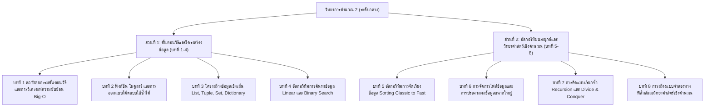

# โครงร่างตำราวิชาการ เล่มที่ 2: วิทยาการคำนวณระดับกลาง
## ชื่อหนังสือ: วิทยาการคำนวณ 2: การออกแบบขั้นตอนวิธี โครงสร้างข้อมูล และการแก้ปัญหาด้วย Python
### (Computing Science II: Algorithmic Design, Data Structures & Problem Solving with Python)
**ผู้เขียน:** ผู้ช่วยศาสตราจารย์ ดร.ชีวะ ทัศนา  
**สังกัด:** สาขาวิชาฟิสิกส์ คณะวิทยาศาสตร์และเทคโนโลยี มหาวิทยาลัยราชภัฏรำไพพรรณี  
**มาตรฐานหลักสูตร:** สอดคล้องกับมาตรฐานการเรียนรู้ ว 4.2 ระดับมัธยมศึกษาตอนปลาย / ปริญญาตรีหมวดศึกษาทั่วไปและวิชาชีพครู

---

## 🎯 วัตถุประสงค์และภาพรวมของตำราเล่มที่ 2
ตำราเล่มนี้ยกระดับทักษะจากระดับเริ่มต้น สู่ **การแก้ปัญหาที่มีความซับซ้อนด้วยคอมพิวเตอร์อย่างเป็นระบบ (Computational Problem Solving)** โดยมุ่งเน้นการวิเคราะห์ความต้องการของระบบ (Input, Output, Constraints), การเลือกใช้ **โครงสร้างข้อมูล (Data Structures)** ที่เหมาะสม, การออกแบบ **ขั้นตอนวิธีการค้นหาและจัดเรียงข้อมูล (Searching & Sorting Algorithms)**, การวิเคราะห์ประสิทธิภาพของอัลกอริทึม (Time & Space Complexity / Big-O), และการใช้ภาษา Python ในการจำลองปรากฏการณ์ทางวิทยาศาสตร์และคณิตศาสตร์

---

## 📑 สารบัญและโครงสร้างเนื้อหารายบท (8 บทเรียนมาตรฐาน)

---

### บทที่ 1 สถาปัตยกรรมขั้นตอนวิธีและการวิเคราะห์ความซับซ้อน
* **1.0 เรื่องเล่าเปิดบทเรียนและการประลองความเร็วของอัลกอริทึม**
  * กรณีศึกษา: ทำไมโค้ดที่ให้ผลลัพธ์ถูกต้องเหมือนกัน ตัวหนึ่งใช้เวลา 1 วินาที แต่อีกตัวใช้เวลา 100 ปี
* **1.1 กระบวนการวิเคราะห์โจทย์และระบุตัวแปร 3 ประการ**
  * ข้อมูลเข้า (Inputs & Pre-conditions)
  * ข้อมูลออก (Expected Outputs & Post-conditions)
  * ข้อจำกัดและเงื่อนไขขอบเขต (Constraints & Edge Cases)
* **1.2 นิยามและความสำคัญของการวิเคราะห์ประสิทธิภาพ (Algorithm Efficiency)**
  * Time Complexity (ความซับซ้อนเชิงเวลา) และ Space Complexity (ความซับซ้อนเชิงเนื้อที่)
* **1.3 สัญกรณ์โอใหญ่ (Big-O Notation)**
  * ลำดับการเติบโต: $O(1), O(\log n), O(n), O(n \log n), O(n^2), O(2^n), O(n!)$
  * กราฟเปรียบเทียบและการประเมิน Best-case, Average-case, และ Worst-case
* **1.4 กฎการคำนวณ Big-O จากโค้ดลูปเดี่ยวและลูปซ้อน**
* **1.5 สรุปบทเรียนและแบบฝึกหัดคำนวณ Big-O**

---

### บทที่ 2 ฟังก์ชัน โมดูลาร์ และการออกแบบโค้ดแบบใช้ซ้ำได้
* **2.0 เรื่องเล่าเปิดบทเรียนและศิลปะการแบ่งงานอย่างเป็นระเบียบ (Modularity)**
* **2.1 นิยามของฟังก์ชันและการส่งผ่านพารามิเตอร์ (Parameters & Arguments)**
  * Positional Arguments, Keyword Arguments, Default Parameters
* **2.2 ค่าคืนกลับ (Return Values) และขอบเขตของตัวแปร (Scope: Local vs Global)**
* **2.3 หลักการเขียนฟังก์ชันที่ดี (Single Responsibility Principle & Pure Functions)**
* **2.4 การสร้างและนำเข้าโมดูล (Python Modules & Packages)**
  * การใช้งานไลบรารีมาตรฐาน: `math`, `random`, `datetime`
* **2.5 สรุปบทเรียนและตัวอย่างการสร้างโมดูลแปลงหน่วยฟิสิกส์สากล**

---

### บทที่ 3 โครงสร้างข้อมูลเชิงเส้น List, Tuple, Set, Dictionary
* **3.0 เรื่องเล่าเปิดบทเรียนและตู้จัดเก็บข้อมูลดิจิทัล**
* **3.1 รายการแบบไดนามิก (Lists)**
  * Indexing, Slicing, List Methods (append, extend, insert, remove, pop)
  * List Comprehension สำหรับการแปลงข้อมูลอย่างรวดเร็ว
* **3.2 ทูเพิล (Tuples) และการจัดการข้อมูลคงที่ (Immutability)**
  * การใช้ Tuple สำหรับเก็บพิกัด 3 มิติ $(x, y, z)$ และค่าคงที่
* **3.3 เซต (Sets) และการดำเนินการทางคณิตศาสตร์**
  * Union ($\cup$), Intersection ($\cap$), Difference ($-$), และการตัดข้อมูลซ้ำซ้อน
* **3.4 พจนานุกรม (Dictionaries) และโครงสร้าง Key-Value**
  * การค้นหาข้อมูลด้วย Hash Map ในเวลา $O(1)$
  * การจัดการข้อมูลซ้อนกัน (Nested Dictionaries)
* **3.5 สรุปบทเรียนและตารางเปรียบเทียบการเลือกใช้โครงสร้างข้อมูล**

---

### บทที่ 4 อัลกอริทึมการค้นหาข้อมูล Linear และ Binary Search
* **4.0 เรื่องเล่าเปิดบทเรียนและการตามหาเข็มในมหาสมุทรข้อมูล**
* **4.1 การค้นหาแบบเชิงเส้น (Linear Search / Sequential Search)**
  * กลไกการทำงาน, รหัสลำลอง, และการเขียนโค้ด Python
  * การวิเคราะห์ประสิทธิภาพ: Best-case $O(1)$, Worst-case $O(n)$
* **4.2 การค้นหาแบบทวิภาค (Binary Search)**
  * เงื่อนไขสำคัญ: ข้อมูลต้องผ่านการจัดเรียงลำดับล่วงหน้า (Sorted Data)
  * กลไกการแบ่งครึ่งช่วงค้นหา (Pointers: Left, Mid, Right)
  * การวิเคราะห์ประสิทธิภาพ: $O(\log n)$ และตาราง Trace Table
* **4.3 การเปรียบเทียบประสิทธิภาพระหว่าง Linear Search และ Binary Search บนข้อมูลขนาดใหญ่**
* **4.4 การค้นหาด้วยตารางแฮช (Hash Table Lookup) เบื้องต้น**
* **4.5 สรุปบทเรียนและแบบฝึกหัดการประยุกต์ค้นหารายชื่อสารเคมีในฐานข้อมูล**

---

### บทที่ 5 อัลกอริทึมการจัดเรียงข้อมูล Sorting Classic to Fast
* **5.0 เรื่องเล่าเปิดบทเรียนและระเบียบที่สร้างขึ้นจากความสับสนวุ่นวาย**
* **5.1 บับเบิลซอร์ต (Bubble Sort): การสลับค่าของฟองสบู่**
  * กลไกการเปรียบเทียบคู่ติดกัน, Pass-by-Pass Trace, และ Optimization ด้วย Flag
  * Time Complexity: $O(n^2)$
* **5.2 ซีเลกชันซอร์ต (Selection Sort): การเลือกค่าน้อยที่สุดมาวางหน้า**
  * กลไกการสแกนหา Minimum Index และการสลับค่า (Swapping)
  * Time Complexity: $O(n^2)$
* **5.3 อินเซอร์ชันซอร์ต (Insertion Sort): การจัดเรียงไพ่ในมือ**
  * กลไกการเลื่อนแทรกข้อมูลในส่วนที่เรียงลำดับแล้ว
  * เหมาะสมอย่างยิ่งสำหรับข้อมูลที่เกือบเรียงแล้ว (Adaptive $O(n)$)
* **5.4 เมิร์จซอร์ต (Merge Sort) เบื้องต้น: พลังแห่งการแบ่งแยกแล้วพิชิต**
  * กลไก Divide, Conquer, and Combine ในเวลา $O(n \log n)$
* **5.5 สรุปบทเรียนและตารางเปรียบเทียบความเสถียร (Stability) และความเร็ว**

---

### บทที่ 6 การจัดการไฟล์ข้อมูลและการประมวลผลข้อมูลขนาดใหญ่
* **6.0 เรื่องเล่าเปิดบทเรียนและการเชื่อมต่อโปรแกรมกับโลกภายนอก**
* **6.1 การเปิด อ่าน และเขียนไฟล์ข้อความ (Text File I/O)**
  * โหมดการเปิดไฟล์ (`r`, `w`, `a`), Context Manager (`with open()`)
* **6.2 การประมวลผลไฟล์ตารางข้อมูล (CSV Processing)**
  * การใช้โมดูล `csv` ในการอ่านข้อมูลเซนเซอร์สภาพอากาศ
* **6.3 การประมวลผลไฟล์โครงสร้างมาตรฐานสากล (JSON Processing)**
  * การแปลง Python Dictionary $\leftrightarrow$ JSON String (`json.loads`, `json.dumps`)
  * การเชื่อมต่อและดึงข้อมูลจาก Open Web API
* **6.4 การจัดการข้อผิดพลาดและข้อยกเว้น (Exception Handling: try-except-finally)**
* **6.5 สรุปบทเรียนและมินิโปรเจกต์ระบบบันทึกค่าอุณหภูมิห้องทดลอง**

---

### บทที่ 7 การคิดแบบเรียกซ้ำ Recursion และ Divide & Conquer
* **7.0 เรื่องเล่าเปิดบทเรียนและภาพสะท้อนในกระจกเงาไม่รู้จบ**
* **7.1 นิยามและโครงสร้างของฟังก์ชันเรียกซ้ำ (Recursive Function)**
  * องค์ประกอบสำคัญ 2 ส่วน: Base Case (กรณีหยุด) และ Recursive Step (กรณีย่อย)
* **7.2 ตัวอย่างคลาสสิกของ Recursion**
  * แฟกทอเรียล ($n! = n \times (n-1)!$)
  * ลำดับฟีโบนัชชี ($F_n = F_{n-1} + F_{n-2}$) และข้อควรระวังเรื่อง Call Stack Overflow
* **7.3 ปริศนาหอคอยฮานอย (Tower of Hanoi)**
  * การพิสูจน์ทางคณิตศาสตร์ $2^n - 1$ ขั้นตอน และขั้นตอนวิธีแบบเรียกซ้ำ
* **7.4 การเปรียบเทียบระหว่าง Recursion และ Iteration (ข้อดี-ข้อเสีย-การใช้หน่วยความจำ)**
* **7.5 สรุปบทเรียนและแผนผัง Call Stack Visualizer**

---

### บทที่ 8 การสร้างแบบจำลองทางฟิสิกส์และวิทยาศาสตร์เชิงคำนวณ
* **8.0 เรื่องเล่าเปิดบทเรียนและห้องทดลองเสมือนบนหน้าจอคอมพิวเตอร์**
* **8.1 การคำนวณเวกเตอร์และเมทริกซ์ด้วยไลบรารี NumPy**
  * การสร้าง Array, Vectorized Operations, การคำนวณ Dot Product และ Cross Product
* **8.2 การแสดงผลข้อมูลและการพล็อตผลลัพธ์ด้วย Matplotlib**
  * กราฟเส้น, กราฟแท่ง, Scatter Plot, และการสร้างภาพ 2 มิติ
* **8.3 แบบจำลองการเคลื่อนที่แบบโพรเจกไทล์ (Projectile Motion Simulation)**
  * การคำนวณวิถีโค้งแบบมีแรงต้านอากาศ (Euler's Method)
* **8.4 แบบจำลองการสั่นของมวลติดสปริงและการแกว่งของลูกตุ้ม (Harmonic Oscillator)**
* **8.5 สรุปภาพรวมเล่มที่ 2 และการเตรียมความพร้อมสู่วิทยาการคำนวณขั้นสูง**

---

## 📊 ตารางมาตรฐานผลลัพธ์การเรียนรู้ (OBE & Bloom's Taxonomy Mapping)

| บทที่ | หัวข้อหลัก | Bloom's Taxonomy | OBE Learning Outcome (CLO) |
| :---: | :--- | :---: | :--- |
| **1** | การวิเคราะห์ขั้นตอนวิธี | L4 (Analyze), L5 (Evaluate) | วิเคราะห์ Input/Output/Constraints และประเมิน Big-O Complexity ได้อย่างถูกต้อง |
| **2** | การเขียนฟังก์ชันโมดูล | L3 (Apply), L6 (Create) | ออกแบบและสร้างฟังก์ชันโมดูลาร์ที่มีการส่งผ่านพารามิเตอร์และนำกลับมาใช้ซ้ำได้ |
| **3** | โครงสร้างข้อมูลเชิงเส้น | L3 (Apply), L4 (Analyze) | เลือกใช้ List, Tuple, Set, Dict ในการจัดเก็บและประมวลผลข้อมูลได้อย่างเหมาะสม |
| **4** | อัลกอริทึมการค้นหา | L4 (Analyze), L5 (Evaluate) | เปรียบเทียบและประยุกต์ใช้ Linear และ Binary Search ได้อย่างมีประสิทธิภาพ |
| **5** | อัลกอริทึมการจัดเรียง | L4 (Analyze), L6 (Create) | ออกแบบและเขียนโค้ด Sorting Algorithms พร้อมวิเคราะห์กรณีศึกษาที่เหมาะสม |
| **6** | การจัดการไฟล์ข้อมูล | L3 (Apply), L4 (Analyze) | เขียนโปรแกรมอ่านและเขียนไฟล์ CSV, JSON และจัดการ Exception ได้อย่างเสถียร |
| **7** | การคิดแบบเรียกซ้ำ | L4 (Analyze), L6 (Create) | ออกแบบและพิสูจน์อัลกอริทึมแบบ Recursion พร้อมกำหนด Base Case ได้แม่นยำ |
| **8** | วิทยาศาสตร์เชิงคำนวณ | L5 (Evaluate), L6 (Create) | สร้างแบบจำลองและพล็อตผลการคำนวณปรากฏการณ์ทางวิทยาศาสตร์ด้วย Python |
