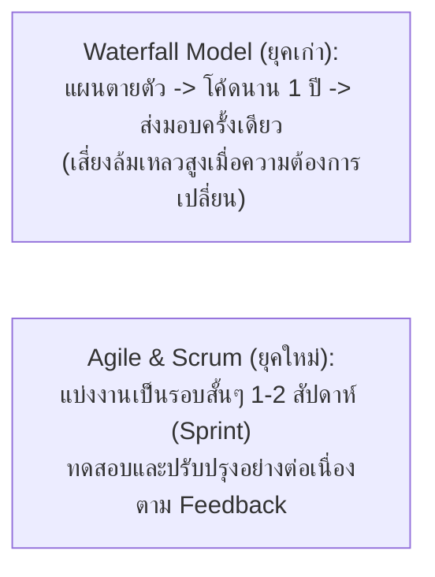
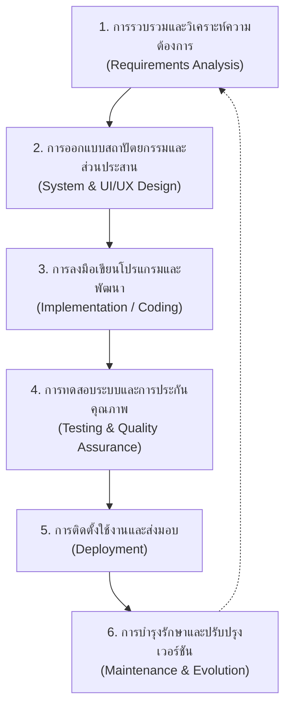
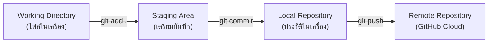

# วิทยาการคำนวณ 3: การพัฒนาโครงงานบูรณาการ ปัญญาประดิษฐ์ และนวัตกรรมการจัดการเรียนรู้วิทยาศาสตร์
## บทที่ 1 วงจรการพัฒนาโครงงานคอมพิวเตอร์และการบริหารงานสมัยใหม่ (SDLC, Agile & Git Collaboration)
**ผู้เขียน:** ผู้ช่วยศาสตราจารย์ ดร.ชีวะ ทัศนา • สาขาวิชาฟิสิกส์ คณะวิทยาศาสตร์และเทคโนโลยี มหาวิทยาลัยราชภัฏรำไพพรรณี

---

## 🎯 ผลลัพธ์การเรียนรู้ประจำบท (Behavioral Learning Outcomes)
เมื่อศึกษาบทเรียนนี้จบแล้ว ผู้เรียนสามารถ:
1. **อธิบาย (Explain)** ลำดับขั้นตอนของวงจรการพัฒนาซอฟต์แวร์ (SDLC) และเปรียบเทียบข้อดี-ข้อจำกัดระหว่าง Waterfall Model และ Agile / Scrum Methodology
2. **ประยุกต์ใช้ (Apply)** เครื่องมือควบคุมเวอร์ชัน (Git & GitHub) ในการทำงานร่วมกันเป็นทีม การแตกกิ่ง (Branching), การรวมโค้ด (Merging), และการแก้ไขข้อขัดแย้ง (Conflict Resolution)
3. **จัดทำ (Formulate)** ตารางแผนงานโครงงาน (Gantt Chart), แผนผังงานมอบหมาย (WBS), และบอร์ดติดตามงาน (Kanban Board)
4. **วางกรอบการทำงาน (Establish Workflow)** สำหรับการพัฒนาโครงงานนวัตกรรมคอมพิวเตอร์ได้อย่างเป็นมืออาชีพ

---

## 🌌 1.0 เรื่องเล่าเปิดบทเรียน: จากวิกฤตซอฟต์แวร์สู่ระเบียบวิธี Agile

ในช่วงทศวรรษ 1960–1990 โครงการพัฒนาซอฟต์แวร์และระบบคอมพิวเตอร์ขนาดใหญ่มากกว่า **68% ประสบความล้มเหลว** ส่งมอบงานล่าช้า งบประมาณบานปลาย หรือไม่สามารถตอบโจทย์ผู้ใช้งานจริงได้ ปรากฏการณ์นี้ถูกเรียกว่า **"วิกฤตซอฟต์แวร์ (Software Crisis)"**

สาเหตุหลักเกิดจากการใช้โมเดลแบบ **Waterfall (น้ำตก)** ที่ต้องออกแบบทุกอย่างให้เสร็จสิ้น 100% ตั้งแต่วันแรกโดยไม่มีการปรับเปลี่ยน แต่ในโลกความเป็นจริง ความต้องการของผู้ใช้และเทคโนโลยีเปลี่ยนแปลงตลอดเวลา



การก้าวขึ้นสู่การทำ **โครงงานนวัตกรรมคอมพิวเตอร์ (Capstone Project)** จึงต้องเริ่มต้นด้วย **"การบริหารจัดการเชิงระบบ (Project Lifecycle Management)"**

---

## 🔄 1.1 วงจรการพัฒนาซอฟต์แวร์ 6 ขั้นตอน (The 6 Stages of SDLC)



---

## 🛠️ 1.2 การทำงานร่วมกันด้วย Git & GitHub (Version Control Mastery)

**Git** คือระบบควบคุมเวอร์ชันแบบกระจายศูนย์ (Distributed Version Control System) ที่บันทึกประวัติการเปลี่ยนแปลงของไฟล์ทุกบรรทัด

### คำสั่ง Git แกนกลางที่ใช้ในโครงงานจริง:

| คำสั่ง (Command) | ความหมายทางปฏิบัติ |
| :--- | :--- |
| `git init` | เริ่มต้นสร้างคลังเก็บโค้ด (Repository) ในเครื่อง |
| `git status` | ตรวจสอบสถานะของไฟล์ (Tracked / Untracked / Modified) |
| `git add .` | นำไฟล์ที่แก้ไขทั้งหมดเข้าสู่พื้นที่เตรียมบันทึก (Staging Area) |
| `git commit -m "feat: add hand tracking"` | บันทึกการเปลี่ยนแปลงถาวรพร้อมข้อความอธิบาย (Commit) |
| `git branch feature/ai-vision` | สร้างกิ่งการทำงานใหม่เพื่อพัฒนาฟีเจอร์แยก โดยไม่กระทบโค้ดหลัก |
| `git checkout feature/ai-vision` | สลับไปทำงานบนกิ่งที่กำหนด |
| `git merge feature/ai-vision` | รวมโค้ดจากกิ่งฟีเจอร์กลับเข้าสู่กิ่งหลัก (`main`) |
| `git push -u origin main` | ส่งประวัติ Commit ขึ้นสู่คลาวด์ GitHub |



---

## 📋 1.3 เครื่องมือวางแผนโครงงาน: WBS, Gantt Chart และ Kanban Board

<div style="background: linear-gradient(135deg, #f8fafc, #f1f5f9); border-left: 5px solid #0284c7; border-radius: 12px; padding: 18px 22px; margin: 20px 0; color: #0f172a;">
  <h4 style="color: #0369a1; margin-top: 0;">📌 3 เครื่องมือแกนกลางในการบริหารโครงงานวิทยาการคำนวณ</h4>
  <ol style="margin: 0; line-height: 1.75;">
    <li><strong>WBS (Work Breakdown Structure):</strong> แผนผังย่อยงานใหญ่เป็นภารกิจย่อยที่มีผู้รับผิดชอบชัดเจน</li>
    <li><strong>Gantt Chart:</strong> แผนภูมิแสดงแถบเวลาเริ่มต้น-สิ้นสุดของแต่ละภารกิจเพื่อควบคุมกำหนดส่ง (Milestones)</li>
    <li><strong>Kanban Board (Trello / GitHub Projects):</strong> กระดานติดตามสถานะงาน 3 ช่องหลัก: <code>To Do (รอดำเนินการ)</code> $\rightarrow$ <code>In Progress (กำลังทำ)</code> $\rightarrow$ <code>Done (เสร็จสิ้น)</code></li>
  </ol>
</div>

---

## 💻 1.4 โค้ดคอมพิวเตอร์: ระบบจำลองบอร์ดคัมบังอัตโนมัติ (CLI Kanban Tracker)

```python
# simple_kanban_tracker.py
# โปรแกรมจำลองระบบบริหารจัดการโครงงานแบบ Kanban CLI
# ผู้เขียน: ผศ.ดร.ชีวะ ทัศนา (มรภ.รำไพพรรณี)

class KanbanTask:
    def __init__(self, task_id: int, title: str, assignee: str, priority: str):
        self.task_id = task_id
        self.title = title
        self.assignee = assignee
        self.priority = priority # HIGH, MEDIUM, LOW
        self.status = "TO_DO"    # TO_DO, IN_PROGRESS, DONE

class KanbanBoard:
    def __init__(self, project_name: str):
        self.project_name = project_name
        self.tasks = []
        self._next_id = 1
        
    def add_task(self, title: str, assignee: str, priority: str = "MEDIUM"):
        task = KanbanTask(self._next_id, title, assignee, priority)
        self.tasks.append(task)
        self._next_id += 1
        
    def move_task(self, task_id: int, new_status: str):
        for task in self.tasks:
            if task.task_id == task_id:
                task.status = new_status
                return True
        return False
        
    def display_board(self):
        print("=" * 75)
        print(f"📌 KANBAN BOARD: {self.project_name.upper()}")
        print("=" * 75)
        columns = ["TO_DO", "IN_PROGRESS", "DONE"]
        titles = ["📋 TO DO (รอดำเนินการ)", "⚡ IN PROGRESS (กำลังพัฒนา)", "✅ DONE (เสร็จสมบูรณ์)"]
        
        for col, col_title in zip(columns, titles):
            col_tasks = [t for t in self.tasks if t.status == col]
            print(f"\n{col_title} ({len(col_tasks)} รายการ):")
            print("-" * 55)
            if not col_tasks:
                print("   (ว่างเปล่า)")
            for t in col_tasks:
                print(f"   [{t.task_id}] {t.title:<30} | รับผิดชอบ: {t.assignee:<12} | ลำดับ: {t.priority}")
        print("\n" + "=" * 75)

if __name__ == "__main__":
    board = KanbanBoard("โครงงานระบบตรวจจับท่าทางมือควบคุมการทดลองฟิสิกส์")
    board.add_task("ออกแบบวงจรเซนเซอร์ LiDAR", "สมชาย", "HIGH")
    board.add_task("เทรนโมเดล MediaPipe Hands", "ดร.ชีวะ", "HIGH")
    board.add_task("เขียนรายงานโครงงาน บทที่ 1", "กานดา", "MEDIUM")
    board.add_task("สร้างเว็บแอปพลิเคชัน Three.js", "สมศักดิ์", "MEDIUM")
    
    # อัปเดตสถานะงาน
    board.move_task(2, "IN_PROGRESS")
    board.move_task(3, "DONE")
    
    board.display_board()
```

---

## 💡 1.5 สรุปใจความสำคัญและแบบฝึกหัดท้ายบทที่ 1

### 📌 สรุปประเด็นสำคัญ
1. **SDLC และ Agile** ช่วยให้การพัฒนาโครงงานเป็นไปอย่างเป็นระบบ ลดความเสี่ยง และตอบสนองต่อผู้ใช้งานจริงได้อย่างรวดเร็ว
2. **Git & GitHub** เป็นทักษะจำเป็นสำหรับนักพัฒนายุคใหม่ในการทำงานร่วมกันเป็นทีมโดยไม่เกิดปัญหาไฟล์เขียนทับกัน
3. การวางแผนด้วย **WBS, Gantt Chart และ Kanban** ช่วยให้สมาชิกทุกคนเห็นเป้าหมายและเส้นตายของงานอย่างชัดเจน

---

### 📝 แบบฝึกหัดทบทวน 3 ระดับ (Exercises)

#### ระดับที่ 1: ความรู้ความเข้าใจพื้นฐาน (Basic Knowledge)
1. จงอธิบายความแตกต่างระหว่างการพัฒนาแบบ **Waterfall** กับ **Agile (Scrum)** ในมิติของการรับมือกับการเปลี่ยนแปลงความต้องการ (Changing Requirements)
2. เมื่อเกิดสถานการณ์ **Merge Conflict** ใน Git เกิดจากสาเหตุใด และมีขั้นตอนการแก้ไขอย่างไร

#### ระดับที่ 2: การวิเคราะห์และประยุกต์ใช้ (Analytical Application)
3. ให้นักเรียนจัดทำแผนผัง **WBS (Work Breakdown Structure)** สำหรับโครงงาน *"ระบบรดน้ำแปลงทดลองเกษตรอัจฉริยะด้วย IoT"* โดยแบ่งงานออกเป็น 4 หมวดหมู่งานหลักและภารกิจย่อยอย่างน้อยหมวดละ 3 ภารกิจ

#### ระดับที่ 3: การคิดขั้นสูงและบูรณาการ (Advanced Synthesis)
4. จงเขียนชุดคำสั่ง Git Bash ตั้งแต่การสร้าง Repository การสร้าง Branch ฟีเจอร์ใหม่ การ Commit และการ Push ขึ้น GitHub เพื่อส่งงานอาจารย์
