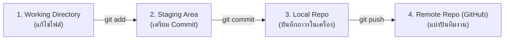

# วิทยาการคำนวณ 3 วิศวกรรมซอฟต์แวร์ ปัญญาประดิษฐ์ประยุกต์ และการพัฒนาโครงงานนวัตกรรม
## บทที่ 1 วงจรการพัฒนาระบบ ซอฟต์แวร์ อไจล์ และการควบคุมเวอร์ชัน Git (SDLC, Agile & Git)
**ผู้เขียน** ผู้ช่วยศาสตราจารย์ ดร.ชีวะ ทัศนา • สาขาวิชาฟิสิกส์ คณะวิทยาศาสตร์และเทคโนโลยี มหาวิทยาลัยราชภัฏรำไพพรรณี

---

## 📋 แผนบริหารการสอนประจำบทที่ 1

### หัวข้อเนื้อหาประจำบท
1. วงจรการพัฒนาซอฟต์แวร์ (Software Development Life Cycle - SDLC)
2. ปรัชญาและระเบียบวิธี Agile และ Scrum Framework
3. สถาปัตยกรรมระบบ Distributed Version Control (Git Internals)
4. การทำงานร่วมกันบน GitHub: Branching Strategy, Pull Requests, และ CI/CD
5. การจัดการข้อขัดแย้งของโค้ด (Merge Conflict Resolution)

### วัตถุประสงค์เชิงพฤติกรรม
เมื่อศึกษาบทเรียนนี้จบแล้ว ผู้เรียนสามารถ
1. อธิบายขั้นตอนของวงจรการพัฒนาซอฟต์แวร์ SDLC และการเปรียบเทียบ Waterfall vs Agile ได้
2. ประยุกต์ใช้ Scrum Artifacts (Product Backlog, Sprint, User Stories) ในการวางแผนโครงการได้
3. ใช้คำสั่ง Git ในการบันทึกสถานะ (Commit), แตกกิ่ง (Branch), และรวมโค้ด (Merge) ได้อย่างชำนาญ
4. แก้ไขปัญหา Merge Conflict และจัดการคลังโค้ดบน GitHub ตามมาตรฐานสากลได้

### กิจกรรมการเรียนการสอน
1. การบรรยายเชิงวิชาการด้านวิศวกรรมซอฟต์แวร์ ปัญญาประดิษฐ์ และนวัตกรรมดิจิทัล
2. การวิเคราะห์กรณีศึกษาและการจำลองสถานการณ์จริง (Case Studies & Project Simulations)
3. การฝึกปฏิบัติการจำลองเสมือนจริง 2D/3D AR MediaPipe Hands และ AI Vision
4. การพัฒนาชิ้นงานโครงงานนวัตกรรมและการทดสอบซอฟต์แวร์ตามมาตรฐานสากล

### สื่อการเรียนการสอน
1. ตำราเรียนวิชาการ "วิทยาการคำนวณ 3 วิศวกรรมซอฟต์แวร์ ปัญญาประดิษฐ์ประยุกต์ และการพัฒนาโครงงานนวัตกรรม"
2. ชุดห้องปฏิบัติการเสมือนจริง Hybrid 2D/3D และ AI Computer Vision บนระบบ RBRU MOOC
3. สไลด์บรรยายอิเล็กทรอนิกส์และเอกสารมาตรฐาน IEEE/ISO

### การวัดและประเมินผล
1. การประเมินผลการทำใบงานและโครงงานนวัตกรรมปฏิบัติการ (40%)
2. การประเมินผลงานการเขียนโค้ดและสถาปัตยกรรมระบบ (30%)
3. การทดสอบวัดผลสัมฤทธิ์ทางการเรียนและการนำเสนอผลงาน (30%)

---

## 🌌 1.0 เรื่องเล่าเปิดบทเรียนและบริบททางประวัติศาสตร์

ในคริสต์ศักราช 2001 กลุ่มนักพัฒนาซอฟต์แวร์ระดับนำ 17 คนได้ร่วมประชุมกันที่สกีรีสอร์ตในรัฐยูทาห์ และได้ประกาศ *Agile Manifesto* ซึ่งปฏิวัติแนวคิดการพัฒนาซอฟต์แวร์ทั่วโลก โดยเปลี่ยนจากการยึดติดกับเอกสารหนาเตอะในรูปแบบ Waterfall มาเป็นการเน้น **"การส่งมอบซอฟต์แวร์ที่ทำงานได้จริง (Working Software) อย่างรวดเร็วและการตอบสนองต่อการเปลี่ยนแปลง"** 

ต่อมาในปี 2005 ลินุส ทอร์วัลด์ส (Linus Torvalds, 1969—ปัจจุบัน) ผู้สร้าง Linux ได้สร้างระบบ Git ขึ้นมาเพื่อจัดการโค้ดเคอร์เนลขนาดใหญ่ โดยใช้สถาปัตยกรรม Directed Acyclic Graph (DAG) และ Cryptographic Hash SHA-1 ส่งผลให้ Git กลายเป็นหัวใจสำคัญของวิศวกรรมซอฟต์แวร์ยุคใหม่อย่างแท้จริง

---

## 📐 1.1 ทฤษฎีและรากฐานทางวิชาการเชิงลึก

### สถาปัตยกรรมสถานะทั้ง 4 ของ Git (4 Git Areas)
Git จัดการไฟล์ผ่าน 4 สถานะที่เชื่อมโยงกันอย่างเป็นระบบ:
1. **Working Directory:** โฟลเดอร์ทำงานที่มีไฟล์จริง
2. **Staging Area (Index):** พื้นที่พักข้อมูลก่อนการบันทึก (`git add`)
3. **Local Repository:** ฐานข้อมูลประวัติการแก้ไขในเครื่อง (`git commit`)
4. **Remote Repository:** คลังโค้ดส่วนกลางบนคลาวด์ เช่น GitHub (`git push`)



---

## 🧮 1.2 ตัวอย่างการวิเคราะห์และการประยุกต์ใช้จริง (Worked Examples)

#### ตัวอย่างที่ 1.1 ลำดับคำสั่ง Git สำหรับการพัฒนาฟีเจอร์ใหม่ (Git Feature Branch Workflow)
จงแสดงชุดคำสั่ง Git เพื่อสร้างกิ่งใหม่ `feature-login`, เพิ่มโค้ด, บันทึก commit, และผสานกลับเข้าสู่ `main`:

```bash
# 1. ตรวจสอบและดึงโค้ดล่าสุด
git checkout main
git pull origin main

# 2. สร้างและสลับไปยังกิ่งฟีเจอร์ใหม่
git checkout -b feature-login

# 3. เพิ่มไฟล์และบันทึก Commit
git add login.py test_login.py
git commit -m "feat: implement secure OAuth2 login flow"

# 4. สลับกลับมาที่ main และทำการ Merge
git checkout main
git merge --no-ff feature-login

# 5. ส่งขึ้นสู่ GitHub Remote
git push origin main
```

---

## 💻 1.3 การเขียนโปรแกรมและการพัฒนาซอฟต์แวร์ด้วย Python 3.11

```python
# git_hook_validator.py
# สคริปต์ Pre-commit Hook สำหรับตรวจสอบคุณภาพโค้ดก่อนทำการ Git Commit
import sys
import subprocess

def run_linter() -> bool:
    print("🔍 กำลังตรวจสอบไวยากรณ์และความถูกต้องของโค้ด...")
    result = subprocess.run(["python3", "-m", "py_compile", "main.py"], capture_output=True, text=True)
    if result.returncode != 0:
        print("❌ ข้อผิดพลาด: โค้ดมี Syntax Error กรุณาแก้ไขก่อน Commit!")
        print(result.stderr)
        return False
    print("✅ ผ่านการตรวจสอบไวยากรณ์ 100% OK")
    return True

if __name__ == "__main__":
    if not run_linter():
        sys.exit(1)
    sys.exit(0)
```

---

## 🔬 1.4 คู่มือห้องปฏิบัติการเสมือนจริง 2D/3D AR MediaPipe Hands

ผู้เรียนสามารถเข้าสู่ชุดจำลองเสมือนจริง 2D/3D เพื่อทดลองประกอบโครงสร้างสถาปัตยกรรมระบบได้ที่ [chapter10_capstone_synthesizer.html](https://tsanaphy2023.github.io/computing-science/simulators/chapter10_capstone_synthesizer.html)

---

## 💡 1.5 สรุปสารัตถะสำคัญประจำบท (Chapter Summary)

1. SDLC และ Agile ช่วยให้โครงการซอฟต์แวร์มีความยืดหยุ่นและส่งมอบงานได้ตรงความต้องการของผู้ใช้
2. Git เป็นระบบควบคุมเวอร์ชันแบบกระจายศูนย์ที่ช่วยให้ทีมงานพัฒนาโค้ดร่วมกันได้อย่างปลอดภัย

---

## ❓ 1.6 แบบฝึกหัดและคำถามท้ายบทเพื่อการประเมินผล (3-Tier Assessment)

1. จงอธิบายความแตกต่างระหว่าง `git merge` และ `git rebase`
2. ให้ออกแบบ User Story และ Acceptance Criteria สำหรับระบบลงทะเบียนเรียนออนไลน์

---

## 📚 เอกสารอ้างอิงประจำบท (APA 7th Edition References)

* Beck, K. et al. (2001). *Manifesto for Agile Software Development*. Agile Alliance.
* Chacon, S., & Straub, B. (2014). *Pro Git* (2nd ed.). Apress.
* Pressman, R. S., & Maxim, B. R. (2020). *Software Engineering: A Practitioner's Approach* (9th ed.). McGraw-Hill.
