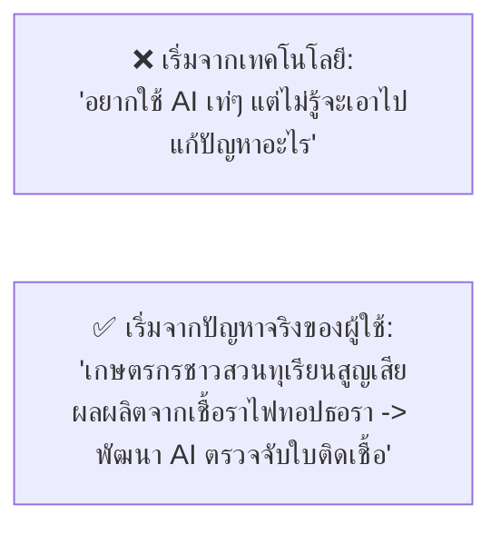
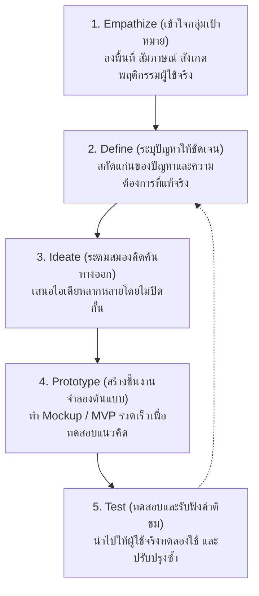

# วิทยาการคำนวณ 3: การพัฒนาโครงงานบูรณาการ ปัญญาประดิษฐ์ และนวัตกรรมการจัดการเรียนรู้วิทยาศาสตร์
## บทที่ 2 การกำหนดปัญหา การสืบค้นวรรณกรรม และการจัดทำข้อเสนอโครงงาน
**ผู้เขียน:** ผู้ช่วยศาสตราจารย์ ดร.ชีวะ ทัศนา • สาขาวิชาฟิสิกส์ คณะวิทยาศาสตร์และเทคโนโลยี มหาวิทยาลัยราชภัฏรำไพพรรณี

---

## 🎯 ผลลัพธ์การเรียนรู้ประจำบท (Behavioral Learning Outcomes)
เมื่อศึกษาบทเรียนนี้จบแล้ว ผู้เรียนสามารถ:
1. **วิเคราะห์และระบุปัญหา (Identify & Formulate Problems)** ในชีวิตจริง ชุมชน และภาคอุตสาหกรรม ด้วยกระบวนการคิดเชิงออกแบบ (Design Thinking) และแผนภาพต้นไม้ปัญหา (Problem Tree Analysis)
2. **สืบค้นวรรณกรรมทางวิชาการ (Conduct Literature Reviews)** จากฐานข้อมูลสากล (IEEE, ScienceDirect, Google Scholar, ThaiJO) ด้วยตัวดำเนินการตรรกะแบบบูลีนได้อย่างมีประสิทธิภาพ
3. **จัดทำข้อเสนอโครงงาน (Write Project Proposals)** ที่มีวัตถุประสงค์ตามเกณฑ์ SMART และถูกต้องตามระเบียบแบบแผนวิชาการ
4. **อ้างอิงเอกสาร (Format References)** ตามมาตรฐานสากล APA 7th Edition และหลีกเลี่ยงการคัดลอกผลงานทางวิชาการ (Plagiarism)

---

## 🌌 2.0 เรื่องเล่าเปิดบทเรียน: นวัตกรรมที่เปลี่ยนโลกเริ่มต้นจากการ "ตั้งคำถามที่ถูกต้อง"

อัลเบิร์ต ไอน์สไตน์ (Albert Einstein) เคยกล่าวไว้ว่า: **"หากข้าพเจ้ามีเวลา 1 ชั่วโมงในการกอบกู้โลก ข้าพเจ้าจะใช้เวลา 55 นาทีแรกในการทำความเข้าใจปัญหา และใช้เวลา 5 นาทีสุดท้ายในการลงมือแก้ปัญหา"**

ความผิดพลาดอันดับหนึ่งของผู้ทำโครงงานคอมพิวเตอร์ คือการกระโดดลงไปเขียนโค้ดทันทีโดยที่ยังไม่เข้าใจว่า **"ปัญหาที่แท้จริงคืออะไร และใครคือผู้ที่เดือดร้อนจากปัญหานั้น (User Pain Points)"**

---

## 🧠 2.1 กระบวนการคิดเชิงออกแบบ 5 ขั้นตอน (Design Thinking for Innovation)

---

## 🌳 2.2 แผนภาพต้นไม้ปัญหา (Problem Tree Analysis)

  <h4 style="color: #854d0e; margin-top: 0;">🌲 โครงสร้างของต้นไม้ปัญหา</h4>
  

    • <strong>ใบและกิ่งก้าน (Effects):</strong> ผลกระทบที่มองเห็นภายนอก เช่น ผลผลิตทุเรียนลดลง 30%, เกษตรกรขาดทุน 
    • <strong>ลำต้น (Core Problem):</strong> ปัญหาแกนกลาง เช่น ตรวจพบโรครากเน่าโคนเน่าช้าเกินไป 
    • <strong>ราก (Root Causes):</strong> สาเหตุรากเหง้าที่แท้จริง เช่น ขาดเซนเซอร์วัดความชื้นสะสมใต้ดินลึก 30 cm, สภาพใบติดเชื้อระยะแรกมองด้วยตาเปล่ายาก
  

---

## 📚 2.3 เทคนิคการสืบค้นวรรณกรรมวิชาการและการอ้างอิง APA 7th

### ตัวดำเนินการสืบค้นขั้นสูง (Boolean Search Operators):
* `"smart agriculture" AND ("deep learning" OR "YOLOv8") AND (durian OR fruit)`
* `site:.ac.th "การตรวจจับศัตรูพืช" filetype:pdf`

### รูปแบบการอ้างอิงมาตรฐาน APA 7th Edition:
* **บทความวารสาร:**  
  Author, A. A., & Author, B. B. (Year). Title of article. *Title of Periodical*, *Volume*(Issue), pages. https://doi.org/xxxx
* **ตัวอย่าง:**  
  Thassana, C., & Janthamalee, J. (2026). Precision agriculture through IoT edge computing and computer vision. *Journal of Applied Science and Technology*, *14*(2), 145–158.

---

## 📋 2.4 โครงสร้างเอกสารข้อเสนอโครงงาน (Project Proposal Template)

1. **ชื่อโครงงาน (Project Title):** ภาษาไทยและภาษาอังกฤษ
2. **คณะผู้จัดทำและอาจารย์ที่ปรึกษา**
3. **ความเป็นมาและความสำคัญของปัญหา (Background & Significance)**
4. **วัตถุประสงค์ของโครงงาน (Objectives - SMART Criteria):**
   * $S$ - Specific (เฉพาะเจาะจง)
   * $M$ - Measurable (วัดผลเป็นตัวเลขได้ เช่น ความแม่นยำ $\ge 90\%$)
   * $A$ - Achievable (ปฏิบัติได้จริง)
   * $R$ - Relevant (สอดคล้องกับปัญหา)
   * $T$ - Time-bound (มีกรอบเวลาชัดเจน)
5. **ขอบเขตของโครงงาน (Project Scope)**
6. **ทฤษฎีและงานวิจัยที่เกี่ยวข้อง (Literature Review)**
7. **วิธีดำเนินการและแผนการดำเนินงาน (Methodology & Gantt Chart)**
8. **ประโยชน์ที่คาดว่าจะได้รับ (Expected Outcomes)**
9. **เอกสารอ้างอิง (References - APA 7th)**

---

## 💡 2.5 สรุปใจความสำคัญและแบบฝึกหัดท้ายบทที่ 2

### 📌 สรุปประเด็นสำคัญ
1. การทำโครงงานที่ดีต้องเริ่มจากการทำความเข้าใจ **Pain Points** ของผู้ใช้อย่างแท้จริงด้วย Design Thinking
2. **Problem Tree Analysis** ช่วยแยกแยะระหว่าง "สาเหตุรากเหง้า (Root Cause)" กับ "อาการของปัญหา (Symptom)"
3. การเขียนวัตถุประสงค์ตามเกณฑ์ **SMART** ช่วยให้การวัดผลสัมฤทธิ์ของโครงงานมีความชัดเจนและโปร่งใส

---

### 📝 แบบฝึกหัดทบทวน 3 ระดับ (Exercises)

#### ระดับที่ 1: ความรู้ความเข้าใจพื้นฐาน (Basic Knowledge)
1. จงอธิบายความหมายของเกณฑ์ **SMART** ในการตั้งวัตถุประสงค์ของโครงงาน พร้อมยกตัวอย่างวัตถุประสงค์ที่ดี 1 ข้อ
2. จงระบุความแตกต่างระหว่างการอ้างอิงในเนื้อหา (In-text Citation) แบบเน้นผู้แต่ง กับแบบเน้นเนื้อความตามหลัก APA 7th

#### ระดับที่ 2: การวิเคราะห์และประยุกต์ใช้ (Analytical Application)
3. ให้นักเรียนเลือกปัญหาในโรงเรียนหรือมหาวิทยาลัยมา 1 ปัญหา แล้วเขียน **แผนภาพต้นไม้ปัญหา (Problem Tree)** แสดงสาเหตุรากเหง้าอย่างน้อย 3 สาเหตุ และผลกระทบอย่างน้อย 3 ประการ

#### ระดับที่ 3: การคิดขั้นสูงและบูรณาการ (Advanced Synthesis)
4. จงร่าง **ข้อเสนอโครงงานฉบับย่อ (1-Page Proposal Draft)** สำหรับโครงงานวิทยาการคำนวณที่บูรณาการกับวิทยาศาสตร์หรือชุมชนท้องถิ่น โดยมีหัวข้อครบถ้วนตามแบบแผนวิชาการ
