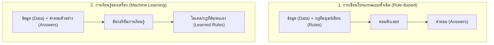
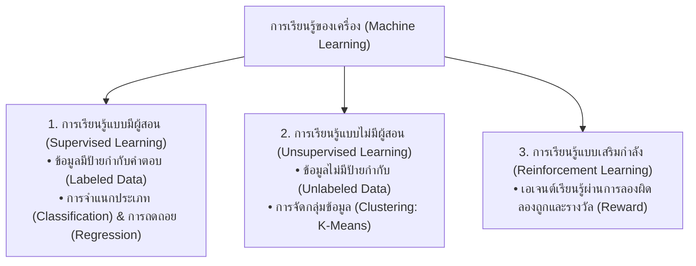
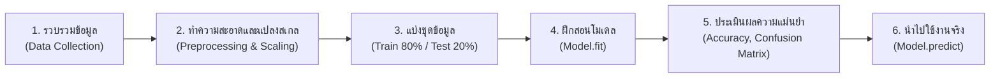

# วิทยาการคำนวณ 3 การพัฒนาโครงงานบูรณาการ ปัญญาประดิษฐ์ และนวัตกรรมการจัดการเรียนรู้วิทยาศาสตร์
## บทที่ 3 ปัญญาประดิษฐ์และการเรียนรู้ของเครื่องเชิงประยุกต์
**ผู้เขียน** ผู้ช่วยศาสตราจารย์ ดร.ชีวะ ทัศนา • สาขาวิชาฟิสิกส์ คณะวิทยาศาสตร์และเทคโนโลยี มหาวิทยาลัยราชภัฏรำไพพรรณี

---

## 🎯 ผลลัพธ์การเรียนรู้ประจำบท
เมื่อศึกษาบทเรียนนี้จบแล้ว ผู้เรียนสามารถ
1. **อธิบาย ** ความแตกต่างระหว่างการเขียนโปรแกรมแบบดั้งเดิม (Rule-based Programming) กับการเรียนรู้ของเครื่อง (Machine Learning)
2. **จำแนกประเภท ** ของการเรียนรู้ของเครื่อง (Supervised, Unsupervised, Reinforcement Learning) และเลือกใช้อัลกอริทึมที่เหมาะสมกับชนิดข้อมูล
3. **ดำเนินงานตามกระบวนการ ** ตั้งแต่การเตรียมข้อมูล (Preprocessing), การแบ่งชุดข้อมูล (Train/Test Split), การฝึกฝนโมเดล (Model Training), และการประเมินผล
4. **พัฒนาและประเมิน ** โมเดลจำแนกประเภท (Classification) และการถดถอย (Regression) ด้วยไลบรารี Scikit-learn ได้อย่างแม่นยำ

---

## 🌌 3.0 เรื่องเล่าเปิดบทเรียน จากกฎตายตัวสู่คอมพิวเตอร์ที่เรียนรู้ได้เอง

ในการเขียนโปรแกรมยุคดั้งเดิม มนุษย์ต้องเขียน **กฎทุกข้อ ** ขึ้นมาเอง หากเราต้องการสร้างโปรแกรมตรวจจับอีเมลสแปม เราต้องเขียนคำสั่ง `if` นับพันบรรทัดเพื่อดักคำว่า *ถูกหวย*, *โอนเงินด่วน*, หรือ *โปรโมชั่น* ซึ่งผู้ส่งสแปมสามารถหลบเลี่ยงได้ง่ายๆ เพียงแค่เปลี่ยนการสะกดคำ

แต่ในยุคของ **ปัญญาประดิษฐ์และการเรียนรู้ของเครื่อง ** เราเปลี่ยนกระบวนทัศน์ใหม่ โดยการป้อน **ข้อมูลตัวอย่าง ** และ **คำตอบที่ถูกต้อง ** ให้คอมพิวเตอร์ แล้วให้คอมพิวเตอร์เป็นผู้ **"ค้นพบกฎและความสัมพันธ์ด้วยตนเอง (Rules / Patterns)"**



---

## 🧭 3.1 สามกระบวนทัศน์หลักของการเรียนรู้ของเครื่อง



---

## ⚙️ 3.2 กระบวนการพัฒนาโมเดลการเรียนรู้ของเครื่อง



### การวัดประสิทธิภาพโมเดลการจำแนกประเภท 
* **Accuracy (ความแม่นยำรวม):** สัดส่วนการทำนายถูกต้องทั้งหมด
* **Precision (ความแม่นยำของผลบวก):** ในกลุ่มที่ทำนายว่าเป็นบวก ถูกจริงเท่าใด
* **Recall (ความครอบคลุม):** ในกลุ่มที่เป็นบวกจริงทั้งหมด โมเดลจับได้เท่าใด
* **F1-Score:** ค่าเฉลี่ยฮาร์โมนิก (Harmonic Mean) ระหว่าง Precision และ Recall:
  $$F_1 = 2 \times \frac{\text{Precision} \times \text{Recall}}{\text{Precision} + \text{Recall}}$$

---

## 💻 3.3 โค้ดคอมพิวเตอร์ การสร้างโมเดลจำแนกสายพันธุ์พืชด้วย Scikit-learn

```python
# applied_machine_learning_pipeline.py
# โปรแกรมจำแนกสายพันธุ์ดอกไม้ด้วยอัลกอริทึม K-Nearest Neighbors (KNN) และ Random Forest
# ผู้เขียน: ผศ.ดร.ชีวะ ทัศนา (มรภ.รำไพพรรณี)

from sklearn.datasets import load_iris
from sklearn.model_selection import train_test_split
from sklearn.preprocessing import StandardScaler
from sklearn.neighbors import KNeighborsClassifier
from sklearn.ensemble import RandomForestClassifier
from sklearn.metrics import accuracy_score, classification_report, confusion_matrix

def main():
    print("=" * 70)
    print("🤖 ระบบการเรียนรู้ของเครื่องเชิงประยุกต์ (Applied Machine Learning Lab)")
    print("=" * 70)
    
    # 1. โหลดชุดข้อมูลมาตรฐาน Iris Dataset
    iris = load_iris()
    X = iris.data    # คุณลักษณะ 4 ด้าน (ความยาว/กว้างของกลีบเลี้ยงและกลีบดอก)
    y = iris.target  # คำตอบ: 0: Setosa, 1: Versicolor, 2: Virginica
    
    print(f"📦 จำนวนตัวอย่างข้อมูลทั้งหมด: {X.shape[0]} ตัวอย่าง | จำนวนฟีเจอร์: {X.shape[1]}")
    
    # 2. แบ่งชุดข้อมูล Train 75% และ Test 25% (Stratified)
    X_train, X_test, y_train, y_test = train_test_split(X, y, test_size=0.25, random_state=42, stratify=y)
    
    # 3. การปรับสเกลข้อมูลให้เป็นมาตรฐาน (StandardScaler)
    scaler = StandardScaler()
    X_train_scaled = scaler.fit_transform(X_train)
    X_test_scaled = scaler.transform(X_test)
    
    # 4. ฝึกสอนโมเดล Random Forest Classifier
    rf_model = RandomForestClassifier(n_estimators=100, random_state=42)
    rf_model.fit(X_train_scaled, y_train)
    
    # 5. ทำนายผลและประเมินประสิทธิภาพ
    y_pred = rf_model.predict(X_test_scaled)
    acc = accuracy_score(y_test, y_pred)
    
    print("\n" + "-" * 70)
    print(f"🎯 ผลการประเมินโมเดล Random Forest:")
    print(f"   • ความถูกต้องแม่นยำรวม (Accuracy): {acc * 100:.2f}%")
    print("\n📊 รายงานจำแนกประเภท (Classification Report):")
    print(classification_report(y_test, y_pred, target_names=iris.target_names))
    
    print("🧩 เมทริกซ์ความสับสน (Confusion Matrix):")
    print(confusion_matrix(y_test, y_pred))
    
    # 6. การทดสอบทำนายข้อมูลใหม่ที่ไม่เคยเห็นมาก่อน (Inference)
    new_sample = [[5.1, 3.5, 1.4, 0.2]] # ลักษณะดอกไม้ปริศนา
    new_sample_scaled = scaler.transform(new_sample)
    prediction = rf_model.predict(new_sample_scaled)[0]
    prob = rf_model.predict_proba(new_sample_scaled)[0][prediction]
    
    print("-" * 70)
    print(f"🔍 ผลการวิเคราะห์ดอกไม้ปริศนา: {iris.target_names[prediction].upper()}")
    print(f"   • ระดับความเชื่อมั่น (Confidence): {prob * 100:.2f}%")
    print("=" * 70)

if __name__ == "__main__":
    main()
```

---

## 💡 3.4 สรุปใจความสำคัญและแบบฝึกหัดท้ายบทที่ 3

### 📌 สรุปประเด็นสำคัญ
1. **Supervised Learning** ต้องการข้อมูลที่มีป้ายกำกับคำตอบ เหมาะสำหรับงานพยากรณ์และจำแนกประเภท
2. การแบ่งชุดข้อมูล **Train/Test Split** และการปรับสเกลข้อมูล (Normalization / Standardization) เป็นขั้นตอนที่ขาดไม่ได้เพื่อป้องกันปัญหา Overfitting
3. ค่า **F1-Score และ Confusion Matrix** ให้มุมมองการประเมินที่ลึกซึ้งและน่าเชื่อถือกว่าการดูค่า Accuracy เพียงอย่างเดียวเมื่อข้อมูลมีความไม่สมดุล (Imbalanced Data)

---

### 📝 แบบฝึกหัดทบทวน 3 ระดับ

#### ระดับที่ 1 ความรู้ความเข้าใจพื้นฐาน
1. จงอธิบายความแตกต่างระหว่างงานประเภท **Classification** (การจำแนกประเภท) กับ **Regression** (การถดถอย) พร้อมยกตัวอย่างงานละ 1 กรณี
2. อธิบายความหมายของปรากฏการณ์ **Overfitting** ในโมเดล Machine Learning และแนวทางในการแก้ไข

#### ระดับที่ 2 การวิเคราะห์และประยุกต์ใช้
3. หากโมเดลตรวจจับโรคมะเร็งมีค่า Confusion Matrix: $TP = 90, FP = 10, FN = 5, TN = 895$ จงคำนวณหาค่า Accuracy, Precision, Recall และวิเคราะห์ว่าในทางการแพทย์เราควรให้ความสำคัญกับค่า Precision หรือ Recall มากกว่ากัน

#### ระดับที่ 3 การคิดขั้นสูงและบูรณาการ
4. จงเขียนสคริปต์ Python ใช้โมเดล **Linear Regression** ของ Scikit-learn เพื่อสร้างสมการทำนายค่าความดันบรรยากาศ ($P$) จากระดับความสูงจากระดับน้ำทะเล ($h$) พร้อมคำนวณค่า $R^2$ Score และค่า Mean Squared Error (MSE)
