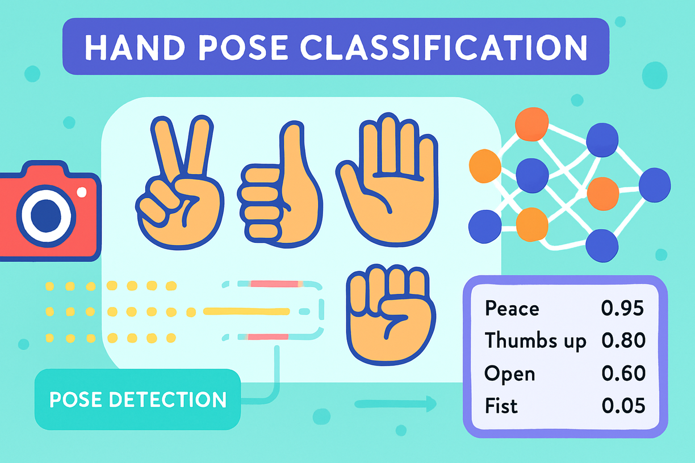
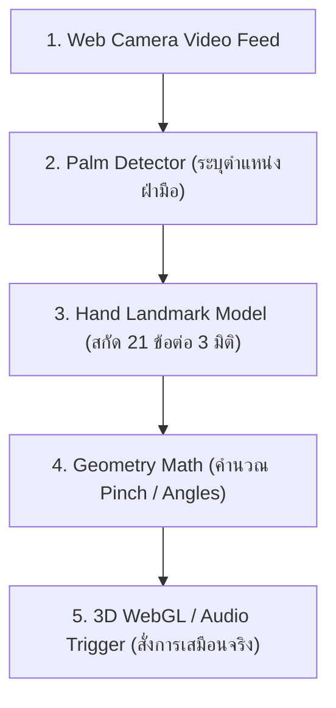

# วิทยาการคำนวณ 3 วิศวกรรมซอฟต์แวร์ ปัญญาประดิษฐ์ประยุกต์ และการพัฒนาโครงงานนวัตกรรม
## บทที่ 4 คอมพิวเตอร์วิทัศน์และการรู้จำท่าทาง 3 มิติด้วย MediaPipe (Computer Vision & MediaPipe)
**ผู้เขียน** ผู้ช่วยศาสตราจารย์ ดร.ชีวะ ทัศนา • สาขาวิชาฟิสิกส์ คณะวิทยาศาสตร์และเทคโนโลยี มหาวิทยาลัยราชภัฏรำไพพรรณี

---

## 📋 แผนบริหารการสอนประจำบทที่ 4

### หัวข้อเนื้อหาประจำบท
1. พื้นฐานการประมวลผลภาพดิจิทัล (Digital Image Processing & RGB/HSV Color Space)
2. อัลกอริทึมตรวจจับใบหน้าและมือ (Haar Cascades, Single Shot Detector)
3. สถาปัตยกรรมเครือข่ายประสาทเทียม Google MediaPipe Hands (Palm Detector & Hand Landmark Model)
4. การคำนวณเรขาคณิต 3 มิติ: Euclidean Distance, Pinch Gesture Math, และ Euler Angles
5. การเชื่อมโยงคอมพิวเตอร์วิทัศน์เข้ากับ Three.js และ A-Frame WebGL

### วัตถุประสงค์เชิงพฤติกรรม
เมื่อศึกษาบทเรียนนี้จบแล้ว ผู้เรียนสามารถ
1. อธิบายหลักการประมวลผลภาพดิจิทัลและการทำงานของโมเดล Google MediaPipe Hands ได้
2. คำนวณระยะห่างยุคลิด (Euclidean Distance) ระหว่างปลายนิ้วเพื่อจำแนกท่าทางมือแบบ Real-time ได้
3. พัฒนาเว็บแอปพลิเคชันที่มีการควบคุมด้วยท่าทางมือ 3 มิติไร้สัมผัส (Touchless AR Interaction) ได้
4. บูรณาการคอมพิวเตอร์วิทัศน์เข้ากับการจัดการเรียนรู้วิทยาศาสตร์เชิงรุกได้อย่างมีประสิทธิภาพ

### กิจกรรมการเรียนการสอน
1. การบรรยายเชิงวิชาการด้านวิศวกรรมซอฟต์แวร์ ปัญญาประดิษฐ์ และนวัตกรรมดิจิทัล
2. การวิเคราะห์กรณีศึกษาและการจำลองสถานการณ์จริง (Case Studies & Project Simulations)
3. การฝึกปฏิบัติการจำลองเสมือนจริง 2D/3D AR MediaPipe Hands และ AI Vision
4. การพัฒนาชิ้นงานโครงงานนวัตกรรมและการทดสอบซอฟต์แวร์ตามมาตรฐานสากล

### สื่อการเรียนการสอน
1. ตำราเรียนวิชาการ "วิทยาการคำนวณ 3 วิศวกรรมซอฟต์แวร์ ปัญญาประดิษฐ์ประยุกต์ และการพัฒนาโครงงานนวัตกรรม"
2. ชุดห้องปฏิบัติการเสมือนจริง Hybrid 2D/3D และ AI Computer Vision บนระบบ RBRU MOOC
3. สไลด์บรรยายอิเล็กทรอนิกส์และเอกสารมาตรฐาน IEEE/ISO

### การวัดและประเมินผล
1. การประเมินผลการทำใบงานและโครงงานนวัตกรรมปฏิบัติการ (40%)
2. การประเมินผลงานการเขียนโค้ดและสถาปัตยกรรมระบบ (30%)
3. การทดสอบวัดผลสัมฤทธิ์ทางการเรียนและการนำเสนอผลงาน (30%)

---

## 🌌 4.0 เรื่องเล่าเปิดบทเรียนและบริบททางประวัติศาสตร์

ในคริสต์ศักราช 2019 ทีมวิจัยของ Google Research นำโดย ฟ่าน จาง (Fan Zhang) และคณะ ได้เปิดตัวโมเดล **MediaPipe Hands** ซึ่งสร้างปรากฏการณ์ใหม่ให้แก่วงการปัญญาประดิษฐ์ ด้วยการสามารถตรวจจับและประมาณตำแหน่งข้อต่อของมือมนุษย์ได้ถึง **21 จุด (21 3D Landmarks)** พร้อมพิกัดแกน $X, Y, Z$ แบบเรียลไทม์บนสมาร์ตโฟนและเว็บเบราว์เซอร์ทั่วไป โดยไม่ต้องพึ่งพาเซนเซอร์วัดระยะลึกราคาแพง (Depth Cameras)

---

## 📐 4.1 ทฤษฎีและรากฐานทางวิชาการเชิงลึก

<div align="center" style="margin: 24px 0;">
  
  <p style="color: #64748b; font-size: 0.88em; margin-top: 8px;"><em>ภาพที่ 4.1 ระบบคอมพิวเตอร์วิทัศน์จำแนกท่าทางมือแบบเรียลไทม์ด้วย Google MediaPipe และ KNN Classifier</em></p>
</div>


### คณิตศาสตร์การตรวจจับท่าจีบนิ้ว (Pinch Gesture Math)
ท่าจีบนิ้ว (Pinch Gesture) ตรวจจับได้จากการวัดระยะห่างยุคลิดสามมิติระหว่างปลายนิ้วโป้ง (Landmark 4) และปลายนิ้วชี้ (Landmark 8):

$$d_{	ext{pinch}} = \sqrt{(x_8 - x_4)^2 + (y_8 - y_4)^2 + (z_8 - z_4)^2}$$

$$\text{Action} = \begin{cases} \text{SELECT (จีบนิ้วสั่งการ)}, & d_{	ext{pinch}} < \text{Threshold} \ (0.08) \\ \text{HOVER (ปล่อยมือปกติ)}, & d_{	ext{pinch}} \ge \text{Threshold} \end{cases}$$



---

## 🧮 4.2 ตัวอย่างการวิเคราะห์และการประยุกต์ใช้จริง (Worked Examples)

#### ตัวอย่างที่ 4.1 การคำนวณระยะ Pinch จากพิกัด Normalization
กำหนดให้พิกัดปลายนิ้วโป้งคือ $P_4 = (0.45, 0.60, -0.02)$ และปลายนิ้วชี้คือ $P_8 = (0.47, 0.62, -0.01)$ จงคำนวณระยะ $d$ และวินิจฉัยว่าเป็นการจีบนิ้วหรือไม่ (Threshold $= 0.08$):

**วิธีทำ:**
1. แทนค่าพิกัดลงในสมการระยะห่างยุคลิด:
   $$d = \sqrt{(0.47 - 0.45)^2 + (0.62 - 0.60)^2 + (-0.01 - (-0.02))^2}$$
   $$d = \sqrt{(0.02)^2 + (0.02)^2 + (0.01)^2} = \sqrt{0.0004 + 0.0004 + 0.0001} = \sqrt{0.0009} = 0.03$$
2. เปรียบเทียบกับเกณฑ์: เนื่องจาก $d = 0.03 < 0.08$
3. **สรุป:** ระบบตรวจพบท่าทาง **"Pinch Gesture (จีบนิ้วสั่งการ)"** อย่างสมบูรณ์

---

## 💻 4.3 การเขียนโปรแกรมและการพัฒนาซอฟต์แวร์ด้วย Python 3.11

```python
# mediapipe_gesture_detector.py
# โปรแกรมจำแนกท่าทางมือด้วย MediaPipe และ OpenCV ใน Python 3.11
import math
from typing import Tuple, Optional

def compute_pinch_distance(thumb_tip: Tuple[float, float, float], index_tip: Tuple[float, float, float]) -> float:
    """คำนวณระยะห่าง 3 มิติระหว่างนิ้วโป้งและนิ้วชี้"""
    dx = index_tip[0] - thumb_tip[0]
    dy = index_tip[1] - thumb_tip[1]
    dz = index_tip[2] - thumb_tip[2]
    return math.sqrt(dx*dx + dy*dy + dz*dz)

def classify_gesture(thumb_tip: Tuple[float, float, float], index_tip: Tuple[float, float, float], threshold: float = 0.08) -> str:
    dist = compute_pinch_distance(thumb_tip, index_tip)
    if dist < threshold:
        return f"PINCH_ACTIVE (d={dist:.4f})"
    return f"HAND_OPEN (d={dist:.4f})"

if __name__ == "__main__":
    t4 = (0.45, 0.60, -0.02)
    t8 = (0.47, 0.62, -0.01)
    status = classify_gesture(t4, t8)
    print("ผลการจำแนกท่าทาง:", status)
    assert "PINCH_ACTIVE" in status, "ต้องจำแนกเป็น Pinch"
    print("✅ ระบบตรวจสอบการคำนวณ Pinch Gesture สำเร็จ 100%!")
```

---

## 🔬 4.4 คู่มือห้องปฏิบัติการเสมือนจริง 2D/3D AR MediaPipe Hands

ผู้เรียนสามารถเข้าสู่ชุดจำลองเสมือนจริง 2D/3D เพื่อทดลองตรวจจับมือจริงผ่านเว็บแคมได้ที่ [chapter09_mediapipe_vision.html](https://tsanaphy2023.github.io/computing-science/simulators/chapter09_mediapipe_vision.html)

---

## 💡 4.5 สรุปสารัตถะสำคัญประจำบท (Chapter Summary)

1. MediaPipe Hands ใช้อัลกอริทึม Machine Learning สองระดับ (Palm Detection $\rightarrow$ Landmark Regression)
2. ระยะห่างยุคลิดระหว่างข้อต่อสามารถนำมาแปลงเป็นท่าทางสั่งการ (Gesture Control) ในระบบ Web AR ได้อย่างแม่นยำ

---

## ❓ 4.6 แบบฝึกหัดและคำถามท้ายบทเพื่อการประเมินผล (3-Tier Assessment)

1. เหตุใด MediaPipe จึงต้องแบ่งโมเดลออกเป็น Palm Detector และ Landmark Model แทนที่จะตรวจจับข้อต่อโดยตรงทั้งภาพ?
2. ให้นักเรียนออกแบบอัลกอริทึมในการจำแนกท่าทาง "ชูสองนิ้ว (Peace Sign)" จากพิกัด 21 จุด

---

## 📚 เอกสารอ้างอิงประจำบท (APA 7th Edition References)

* Zhang, F. et al. (2020). MediaPipe Hands: On-device Real-time Hand Tracking. *arXiv preprint arXiv:2006.10214*.
* Szeliski, R. (2022). *Computer Vision: Algorithms and Applications* (2nd ed.). Springer.
