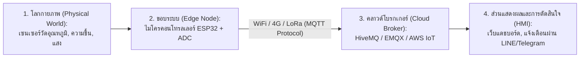
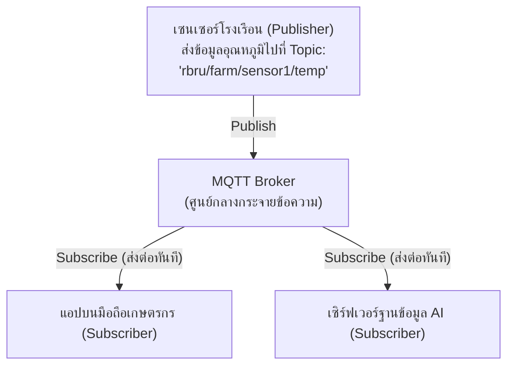

# วิทยาการคำนวณ 3 การพัฒนาโครงงานบูรณาการ ปัญญาประดิษฐ์ และนวัตกรรมการจัดการเรียนรู้วิทยาศาสตร์
## บทที่ 5 อินเทอร์เน็ตของสรรพสิ่งและระบบตรวจวัดทางกายภาพอัจฉริยะ
**ผู้เขียน** ผู้ช่วยศาสตราจารย์ ดร.ชีวะ ทัศนา • สาขาวิชาฟิสิกส์ คณะวิทยาศาสตร์และเทคโนโลยี มหาวิทยาลัยราชภัฏรำไพพรรณี

---

## 🎯 ผลลัพธ์การเรียนรู้ประจำบท
เมื่อศึกษาบทเรียนนี้จบแล้ว ผู้เรียนสามารถ
1. **อธิบาย ** สถาปัตยกรรมการทำงานของระบบอินเทอร์เน็ตของสรรพสิ่ง (Internet of Things - IoT) และการประมวลผลทางกายภาพ (Physical Computing)
2. **จำแนกและเลือกใช้ ** ไมโครคอนโทรลเลอร์ (ESP32, Micro:bit, Raspberry Pi Pico) ร่วมกับเซนเซอร์แอนะล็อกและดิจิทัล (GPIO, ADC, PWM)
3. **ประยุกต์ใช้โปรโตคอลสื่อสาร ** มาตรฐาน MQTT (Publish/Subscribe) และ HTTP REST API ในการรับส่งข้อมูลผ่านระบบคลาวด์
4. **พัฒนาระบบตรวจสอบทางไกล ** เพื่อบันทึกค่าทางฟิสิกส์และสิ่งแวดล้อมแบบเรียลไทม์

---

## 🌌 5.0 เรื่องเล่าเปิดบทเรียน สะพานเชื่อมโลกกายภาพสู่เครือข่ายคลาวด์

ในอดีต หากเราต้องการทราบอุณหภูมิในโรงเรือนเพาะปลูกหรือวัดค่าระดับน้ำในเขื่อน นักฟิสิกส์ต้องเดินไปอ่านค่าจากมาตรวัดปรอทด้วยตนเอง แต่ในยุคของ **Internet of Things (IoT)** อุปกรณ์และเซนเซอร์นับหมื่นล้านตัวทั่วโลกสามารถ พูดคุยและส่งข้อมูลหากัน ผ่านเครือข่ายไร้สายได้ตลอด 24 ชั่วโมง



IoT จึงเป็นหัวใจสำคัญของการปฏิวัติสู่ **เกษตรแม่นยำสูง **, **เมืองอัจฉริยะ **, และ **ระบบตรวจวัดทางฟิสิกส์อัตโนมัติ**

---

## 🔌 5.1 สัญญาณกายภาพและอินเตอร์เฟซฮาร์ดแวร์

### 1. ขาเชื่อมต่ออินพุต/เอาต์พุตดิจิทัล
* รับหรือจ่ายสัญญาณได้เพียง 2 ระดับ: **HIGH ($3.3\text{V} / 5\text{V}$) หรือ LOW ($0\text{V}$)**

### 2. การแปลงสัญญาณแอนะล็อกเป็นดิจิทัล
แปลงระดับแรงดันไฟฟ้าต่อเนื่อง ($0 - 3.3\text{V}$) ให้กลายเป็นตัวเลขดิจิทัล
* **ADC 10 บิต:** ให้ค่าตัวเลข $0 - 1023$ ($2^{10} - 1$)
* **ADC 12 บิต (ESP32):** ให้ค่าตัวเลข $0 - 4095$ ($2^{12} - 1$)

$$\text{Voltage (V)} = \frac{\text{ADC Value}}{4095} \times 3.3\text{ V}$$

### 3. การมอดูเลตความกว้างพัลส์
การปรับสัดส่วนเวลาเปิด-ปิดสัญญาณ (Duty Cycle) เพื่อควบคุมความสว่างของหลอดไฟ LED หรือความเร็วของมอเตอร์

---

## 📡 5.2 สถาปัตยกรรมโปรโตคอล MQTT

โปรโตคอล **MQTT (Message Queuing Telemetry Transport)** เป็นโปรโตคอลที่มีขนาดแพ็กเก็ตเล็กมาก (Lightweight) ใช้พลังงานต่ำ และเหมาะอย่างยิ่งสำหรับอุปกรณ์ IoT:



---

## 💻 5.3 โค้ดคอมพิวเตอร์ ระบบจำลอง IoT Telemetry Client ด้วย Python

```python
# iot_telemetry_simulator.py
# โปรแกรมจำลองการอ่านค่าเซนเซอร์ IoT และแปลงข้อมูลส่งผ่านโครงสร้าง MQTT/JSON
# ผู้เขียน: ผศ.ดร.ชีวะ ทัศนา (มรภ.รำไพพรรณี)

import json
import time
import random

class SmartIoTSensorNode:
    def __init__(self, node_id: str, location: str):
        self.node_id = node_id
        self.location = location
        
    def read_physical_sensors(self) -> dict:
        """จำลองการอ่านค่าเซนเซอร์กายภาพจากฮาร์ดแวร์จริง"""
        # อุณหภูมิ (°C), ความชื้น (%), ความชื้นดิน (%), แสง (Lux)
        temp_c = round(random.uniform(28.0, 38.5), 2)
        humidity_pct = round(random.uniform(50.0, 85.0), 2)
        soil_moisture_raw = random.randint(1200, 3800) # ADC 12-bit
        soil_pct = round((1.0 - (soil_moisture_raw / 4095.0)) * 100.0, 2)
        lux = round(random.uniform(100.0, 45000.0), 1)
        
        payload = {
            "node_id": self.node_id,
            "location": self.location,
            "timestamp": time.strftime("%Y-%m-%d %H:%M:%S"),
            "telemetry": {
                "temperature_c": temp_c,
                "humidity_percent": humidity_pct,
                "soil_moisture_percent": soil_pct,
                "light_lux": lux
            },
            "system_status": {
                "battery_voltage": 3.95,
                "wifi_rssi_dbm": -58
            }
        }
        return payload

def main():
    print("=" * 70)
    print("📡 ระบบส่งข้อมูลโทรมาตร IoT สู่คลาวด์ (Smart IoT Telemetry Stream)")
    print("=" * 70)
    
    node = SmartIoTSensorNode("ESP32-NODE-01", "สวนทุเรียนแปลงวิจัยฟิสิกส์เกษตร มรภ.รำไพพรรณี")
    
    # จำลองการส่งข้อมูล 3 แพ็กเก็ต
    for i in range(1, 4):
        data_packet = node.read_physical_sensors()
        json_message = json.dumps(data_packet, indent=2, ensure_ascii=False)
        
        print(f"\n📦 [แพ็กเก็ตที่ {i}] Topic: 'rbru/agriphysics/telemetry'")
        print(json_message)
        print("-" * 70)
        time.sleep(0.5)

if __name__ == "__main__":
    main()
```

---

## 💡 5.4 สรุปใจความสำคัญและแบบฝึกหัดท้ายบทที่ 5

### 📌 สรุปประเด็นสำคัญ
1. **IoT และ Physical Computing** เปลี่ยนข้อมูลทางกายภาพ (อุณหภูมิ แสง แรงดัน) ให้เป็นข้อมูลดิจิทัลที่ประมวลผลได้
2. **ADC** มีหน้าที่แปลงค่าแรงดันไฟฟ้าต่อเนื่องเป็นตัวเลขตามความละเอียดบิต ($2^N - 1$)
3. **MQTT Protocol** เป็นหัวใจของการสื่อสารข้อมูลแบบเรียลไทม์ที่ประหยัดแบนด์วิดท์สูงสุด

---

### 📝 แบบฝึกหัดทบทวน 3 ระดับ

#### ระดับที่ 1 ความรู้ความเข้าใจพื้นฐาน
1. ในโมเดลการสื่อสารแบบ **MQTT** อธิบายบทบาทหน้าที่ของ: (A) Publisher, (B) Subscriber, (C) Broker
2. ไมโครคอนโทรลเลอร์ที่มี ADC ขนาด 10 บิต ($0-1023$) รับแรงดันอ้างอิง $5.0\text{ V}$ หากอ่านค่า ADC ได้ $512$ แรงดันไฟฟ้าจริงมีค่ากี่โวลต์

#### ระดับที่ 2 การวิเคราะห์และประยุกต์ใช้
3. ให้นักเรียนออกแบบผังวงจรและโฟลว์การส่งข้อมูลของโครงงาน **ระบบแจ้งเตือนน้ำท่วมในชุมชนริมแม่น้ำจันทบุรี** โดยใช้เซนเซอร์อัลตราโซนิก (HC-SR04) และบอร์ด ESP32

#### ระดับที่ 3 การคิดขั้นสูงและบูรณาการ
4. จงเขียนโปรแกรม Python ตรวจสอบข้อมูลสตรีม JSON จากเซนเซอร์ หากพบว่า `temperature_c > 40.0` หรือ `battery_voltage < 3.3` ให้ส่งคำสั่งยิงแจ้งเตือนผ่าน Webhook หรือ API ทันที
