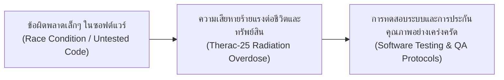
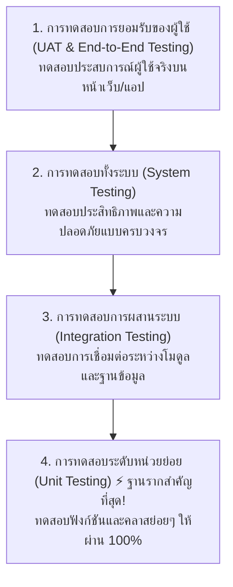
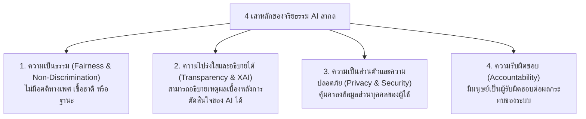

# วิทยาการคำนวณ 3: การพัฒนาโครงงานบูรณาการ ปัญญาประดิษฐ์ และนวัตกรรมการจัดการเรียนรู้วิทยาศาสตร์
## บทที่ 6 การทดสอบระบบ การประกันคุณภาพ และจริยธรรมดิจิทัล (System Testing, QA, PDPA & AI Ethics)
**ผู้เขียน:** ผู้ช่วยศาสตราจารย์ ดร.ชีวะ ทัศนา • สาขาวิชาฟิสิกส์ คณะวิทยาศาสตร์และเทคโนโลยี มหาวิทยาลัยราชภัฏรำไพพรรณี

---

## 🎯 ผลลัพธ์การเรียนรู้ประจำบท (Behavioral Learning Outcomes)
เมื่อศึกษาบทเรียนนี้จบแล้ว ผู้เรียนสามารถ:
1. **อธิบาย (Explain)** ลำดับชั้นของการทดสอบซอฟต์แวร์ (Unit Testing, Integration Testing, System Testing, UAT) และเทคนิคการออกแบบกรณีทดสอบ (Boundary Value Analysis)
2. **เขียนชุดทดสอบอัตโนมัติ (Implement Automated Tests)** ด้วยโมดูล `unittest` / `pytest` ในภาษา Python เพื่อรับประกันความถูกต้องของซอฟต์แวร์
3. **วิเคราะห์และปฏิบัติตาม (Comply with PDPA)** กฎหมายคุ้มครองข้อมูลส่วนบุคคล และหลักการความมั่นคงปลอดภัยสารสนเทศ (CIA Triad)
4. **ประเมินจริยธรรมปัญญาประดิษฐ์ (Evaluate AI Ethics)** ในมิติของความโปร่งใส (Explainability), ความเป็นธรรม (Algorithmic Fairness), และการลดอคติในข้อมูล (Bias Mitigation)

---

## 🌌 6.0 เรื่องเล่าเปิดบทเรียน: อุบัติเหตุทางการแพทย์และความรับผิดชอบของนักพัฒนา

ในปี ค.ศ. 1985–1987 เครื่องฉายรังสีรักษามะเร็ง **Therac-25** เกิดข้อผิดพลาดของซอฟต์แวร์ (Race Condition Bug) ทำให้เครื่องยิงรังสีพลังงานสูงเกินขนาดที่กำหนดถึง **100 เท่า** ส่งผลให้ผู้ป่วยได้รับบาดเจ็บสาหัสและเสียชีวิตหลายราย



บทเรียนราคาแพงนี้ตอกย้ำว่า **"ซอฟต์แวร์และ AI ที่ดีไม่ได้วัดกันที่ฟีเจอร์ที่เยอะ แต่ต้องมีความถูกต้อง เสถียร ปลอดภัย และมีจริยธรรมสูงสุด"**

---

## 🧪 6.1 ลำดับชั้นการทดสอบซอฟต์แวร์ (Testing Pyramid)



### เทคนิคการออกแบบกรณีทดสอบกล่องดำ (Black-Box Test Cases):
* **Equivalence Partitioning (การแบ่งส่วนความเท่าเทียม):** แบ่งช่วงข้อมูลเป็นกลุ่มที่ถูกต้อง (Valid) และไม่ถูกต้อง (Invalid)
* **Boundary Value Analysis (การวิเคราะห์ค่าขอบเขต):** การทดสอบที่จุดรอยต่อ เช่น ขอบเขตอายุ $1-100$ ให้ทดสอบที่ $0, 1, 2, 99, 100, 101$ (จุดที่มักพบบั๊กมากที่สุด)

---

## 🔒 6.2 พ.ร.บ. คุ้มครองข้อมูลส่วนบุคคล (PDPA) และความปลอดภัยสารสนเทศ

<div style="background: linear-gradient(135deg, #fef2f2, #fee2e2); border-left: 5px solid #ef4444; border-radius: 12px; padding: 18px 22px; margin: 20px 0; color: #7f1d1d;">
  <h4 style="color: #991b1b; margin-top: 0;">🛡️ ข้อกำหนดสำคัญตามกฎหมาย PDPA (พ.ศ. 2562)</h4>
  <ul style="margin: 0; line-height: 1.75;">
    <li><strong>Consent (ความยินยอม):</strong> ต้องขอความยินยอมอย่างชัดเจนก่อนเก็บรวบรวมข้อมูลส่วนบุคคล (ชื่อ ภาพถ่าย เบอร์โทร พิกัด GPS)</li>
    <li><strong>Purpose Limitation (จำกัดวัตถุประสงค์):</strong> ใช้ข้อมูลเฉพาะตามวัตถุประสงค์ที่แจ้งไว้เท่านั้น ห้ามนำไปขายหรือส่งต่อ</li>
    <li><strong>Data Minimization (เก็บเท่าที่จำเป็น):</strong> เก็บเฉพาะข้อมูลที่จำเป็นต่อการทำงานของระบบ</li>
    <li><strong>Security Safeguards:</strong> ต้องมีการเข้ารหัสข้อมูล (Encryption เช่น Hashing SHA-256) ป้องกันข้อมูลรั่วไหล</li>
  </ul>
</div>

---

## ⚖️ 6.3 จริยธรรมปัญญาประดิษฐ์และความเป็นธรรมของอัลกอริทึม (AI Ethics)



---

## 💻 6.4 โค้ดคอมพิวเตอร์: ชุดทดสอบอัตโนมัติด้วย Python `unittest`

```python
# test_physics_engine.py
# โปรแกรมทดสอบหน่วยย่อยอัตโนมัติ (Automated Unit Testing) สำหรับโมดูลคำนวณฟิสิกส์
# ผู้เขียน: ผศ.ดร.ชีวะ ทัศนา (มรภ.รำไพพรรณี)

import unittest
import math

def calculate_pendulum_period(length_m: float, g: float = 9.81) -> float:
    """ฟังก์ชันคำนวณคาบการแกว่งของลูกตุ้ม T = 2*pi*sqrt(L/g)"""
    if length_m < 0 or g <= 0:
        raise ValueError("ความยาวเชือกและความเร่งโน้มถ่วงต้องเป็นค่าบวกเท่านั้น")
    return 2.0 * math.pi * math.sqrt(length_m / g)

class TestPhysicsFunctions(unittest.TestCase):
    """ชุดการทดสอบอัตโนมัติ (Automated Test Suite)"""
    
    def test_standard_period(self):
        """กรณีทดสอบที่ 1: ความยาวเชือกมาตรฐาน 1 เมตร"""
        period = calculate_pendulum_period(1.0, 9.81)
        self.assertAlmostEqual(period, 2.006, places=3)
        
    def test_zero_length(self):
        """กรณีทดสอบที่ 2: ความยาวเชือก 0 เมตร (Boundary Value)"""
        period = calculate_pendulum_period(0.0, 9.81)
        self.assertEqual(period, 0.0)
        
    def test_negative_length_raises_error(self):
        """กรณีทดสอบที่ 3: ความยาวเชือกติดลบ ต้อง Throw ValueError ทันที"""
        with self.assertRaises(ValueError):
            calculate_pendulum_period(-5.0, 9.81)

if __name__ == "__main__":
    print("=" * 65)
    print("🧪 เริ่มต้นรันชุดทดสอบความถูกต้องของซอฟต์แวร์ (Unit Test Runner)")
    print("=" * 65)
    unittest.main(verbosity=2)
```

---

## 💡 6.5 สรุปใจความสำคัญและแบบฝึกหัดท้ายบทที่ 6

### 📌 สรุปประเด็นสำคัญ
1. **Unit Testing** เป็นด่านแรกและด่านที่สำคัญที่สุดในการป้องกันข้อผิดพลาดของระบบ
2. การพัฒนาแอปพลิเคชันและโครงงานต้องปฏิบัติตามกฎหมาย **PDPA** และมาตรฐานความปลอดภัยอย่างเคร่งครัด
3. การพัฒนา AI ต้องคำนึงถึง **จริยธรรม ความเป็นธรรม และความโปร่งใส** เพื่อไม่ให้เกิดอคติต่อกลุ่มคนในสังคม

---

### 📝 แบบฝึกหัดทบทวน 3 ระดับ (Exercises)

#### ระดับที่ 1: ความรู้ความเข้าใจพื้นฐาน (Basic Knowledge)
1. จงอธิบายความแตกต่างระหว่างการทดสอบแบบ **White-Box Testing** กับ **Black-Box Testing**
2. หลักการ **CIA Triad** ในความมั่นคงปลอดภัยไซเบอร์ ประกอบด้วย 3 องค์ประกอบใดบ้าง

#### ระดับที่ 2: การวิเคราะห์และประยุกต์ใช้ (Analytical Application)
3. หากระบบรับข้อมูลเกรดของนักเรียนตั้งแต่ $0$ ถึง $100$ จงออกแบบกรณีทดสอบด้วยเทคนิค **Boundary Value Analysis (BVA)** มา 6 กรณีทดสอบ

#### ระดับที่ 3: การคิดขั้นสูงและบูรณาการ (Advanced Synthesis)
4. ในการพัฒนาระบบตรวจจับใบหน้าเพื่อเช็คชื่อเข้าชั้นเรียน ให้นักเรียนวิเคราะห์ความเสี่ยงด้าน **PDPA** และ **AI Ethics** พร้อมเสนอแนวทางป้องกันความเสี่ยง 3 ข้อ
