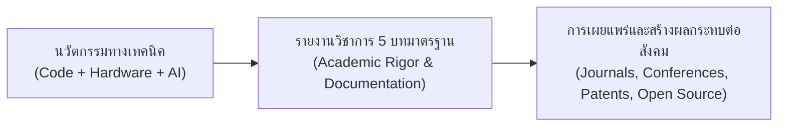
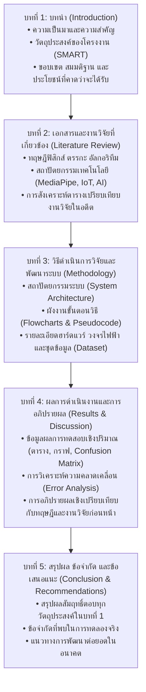
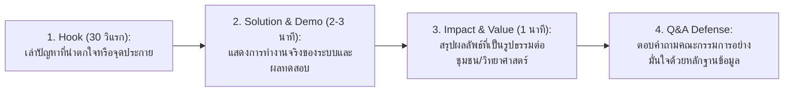

# วิทยาการคำนวณ 3 การพัฒนาโครงงานบูรณาการ ปัญญาประดิษฐ์ และนวัตกรรมการจัดการเรียนรู้วิทยาศาสตร์
## บทที่ 7 การเขียนรายงานวิชาการ 5 บท และการจัดทำเอกสารเผยแพร่
**ผู้เขียน** ผู้ช่วยศาสตราจารย์ ดร.ชีวะ ทัศนา • สาขาวิชาฟิสิกส์ คณะวิทยาศาสตร์และเทคโนโลยี มหาวิทยาลัยราชภัฏรำไพพรรณี

---

## 🎯 ผลลัพธ์การเรียนรู้ประจำบท
เมื่อศึกษาบทเรียนนี้จบแล้ว ผู้เรียนสามารถ
1. **อธิบาย ** โครงสร้าง มาตรฐาน และระเบียบแบบแผนการเขียนรายงานโครงงานวิชาการ 5 บท ตามเกณฑ์มหาวิทยาลัยราชภัฏรำไพพรรณีและมาตรฐานสากล
2. **เรียบเรียงและสังเคราะห์ ** ผลการดำเนินงาน การวิเคราะห์ทางสถิติ และการอภิปรายผล (Discussion) ในบทที่ 4 และ 5 ได้อย่างมีหลักการทางวิทยาศาสตร์
3. **ออกแบบโปสเตอร์วิชาการ ** อัตราส่วน 16:9 / A0 ที่มีลำดับชั้นทางสายตา (Visual Hierarchy) และคมชัดระดับสากล
4. **นำเสนอผลงานและสาธิต ** โครงงานนวัตกรรมในการสอบป้องกัน (Project Defense) และการแข่งขันระดับชาติได้อย่างน่าประทับใจ

---

## 🌌 7.0 เรื่องเล่าเปิดบทเรียน วิทยาศาสตร์ที่ไม่ถูกสื่อสาร คือวิทยาศาสตร์ที่ไร้ตัวตน

นักดาราศาสตร์ผู้ยิ่งใหญ่แห่งศตวรรษที่ 20 คาร์ล เซแกน (Carl Sagan) กล่าวไว้ว่า: **การทำงานทางวิทยาศาสตร์ไม่เคยเสร็จสมบูรณ์ จนกว่าผลงานนั้นจะถูกถ่ายทอด อธิบาย และเผยแพร่ให้ผู้อื่นเข้าใจได้อย่างแจ่มแจ้ง**

แม้ว่าท่านจะพัฒนาโมเดล AI ที่ยอดเยี่ยมที่สุด หรือเขียนโค้ดที่ไร้บั๊ก แต่หากไม่สามารถถ่ายทอดคุณค่า วิธีการ และผลกระทบของโครงงานผ่าน **รายงานวิชาการ 5 บท** และ **การนำเสนออย่างมืออาชีพ** ผลงานนวัตกรรมนั้นก็ยากที่จะได้รับการยอมรับ ต่อยอด หรือนำไปใช้ประโยชน์ในระดับชาติ

---

## 📑 7.1 โครงสร้างรายงานโครงงานวิชาการ 5 บทมาตรฐาน

---

## 🎨 7.2 ศิลปะการออกแบบโปสเตอร์วิชาการ 16 9

  <h4 style="color: #15803d; margin-top: 0;">📌 กฎ 3 ข้อของโปสเตอร์วิชาการระดับสากล</h4>
  <ol style="margin: 0; line-height: 1.75;">
    <li><strong>3-Second Rule:</strong> ผู้เดินผ่านต้องเข้าใจหัวข้อโครงงานและจุดเด่นหลักได้ภายใน 3 วินาทีแรก</li>
    <li><strong>Visual Hierarchy:</strong> ใช้รูปภาพ กราฟ แผนผังระบบ และการ์ดสรุปตัวเลขเด่น มากกว่าตัวหนังสือยาวๆ (สัดส่วนภาพต่อข้อความ 60:40)</li>
    <li><strong>QR Code Call-to-Action:</strong> ฝัง QR Code ลิงก์ตรงไปยังคลังซอร์สโค้ด GitHub และเว็บสาธิตจำลองสด (Live Interactive Web Demo)</li>
  </ol>

---

## 🎤 7.3 เทคนิคการนำเสนอและการสอบป้องกันโครงงาน

---

## 💡 7.4 สรุปใจความสำคัญและแบบฝึกหัดท้ายบทที่ 7

### 📌 สรุปประเด็นสำคัญ
1. **รายงาน 5 บท** เป็นบันทึกหลักฐานทางวิชาการที่ต้องมีความสอดคล้อง (Alignment) ตั้งแต่วัตถุประสงค์ในบทที่ 1 ไปจนถึงข้อสรุปในบทที่ 5
2. **การอภิปรายผล (Discussion ในบทที่ 4)** คือส่วนที่แสดงความลึกซึ้งทางปัญญาของนักวิจัย โดยต้องอธิบาย ทำไมผลจึงเป็นเช่นนั้น ไม่ใช่แค่การอ่านตัวเลขในตารางซ้ำ
3. **โปสเตอร์และการนำเสนอ** ต้องกระชับ ทรงพลัง เน้นภาพกราฟิก และมี Live Demonstration

---

### 📝 แบบฝึกหัดทบทวน 3 ระดับ

#### ระดับที่ 1 ความรู้ความเข้าใจพื้นฐาน
1. จงอธิบายความแตกต่างระหว่าง **บทคัดย่อ ** กับ **บทสรุปผลการทดลอง (Conclusion ในบทที่ 5)**
2. เพราะเหตุใดเราจึงห้ามนำ ความคิดเห็นส่วนตัวที่ไม่มีข้อมูลรองรับ มาเขียนในบทที่ 4 (ผลการทดลอง)

#### ระดับที่ 2 การวิเคราะห์และประยุกต์ใช้
3. ให้นักเรียนเขียน **"บทคัดย่อภาษาไทย (Thai Abstract)"** ความยาวไม่เกิน 250 คำ สำหรับโครงงานคอมพิวเตอร์ที่ตนเองสนใจ โดยให้มีองค์ประกอบครบถ้วน: วัตถุประสงค์, วิธีดำเนินการ, ผลการทดลอง, และสรุปประโยชน์

#### ระดับที่ 3 การคิดขั้นสูงและบูรณาการ
4. จงออกแบบเค้าโครงร่างภาพของ **โปสเตอร์วิชาการ 16:9 (Wireframe Poster Layout)** โดยจัดวางตำแหน่งหัวข้อ โลโก้มหาวิทยาลัย รูปภาพระบบ ผลการทดลอง และ QR Code ให้สวยงามตามหลัก Visual Hierarchy
