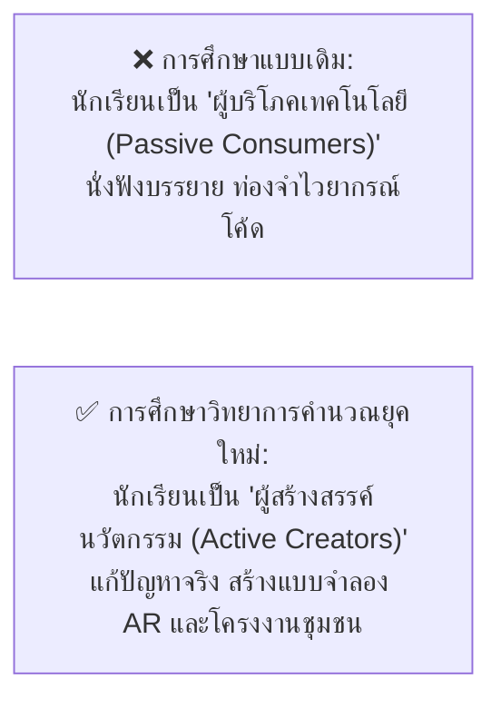
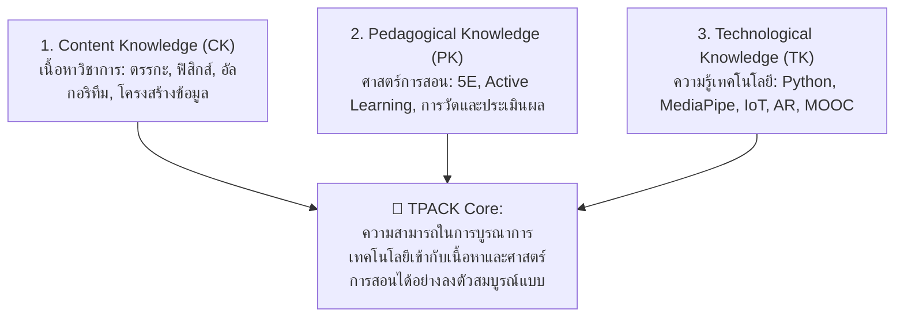
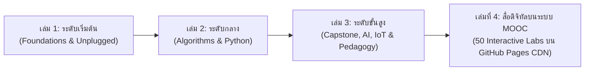

# วิทยาการคำนวณ 3 การพัฒนาโครงงานบูรณาการ ปัญญาประดิษฐ์ และนวัตกรรมการจัดการเรียนรู้วิทยาศาสตร์
## บทที่ 8 นวัตกรรมการจัดการเรียนรู้วิทยาการคำนวณสำหรับครูยุคใหม่
**ผู้เขียน** ผู้ช่วยศาสตราจารย์ ดร.ชีวะ ทัศนา • สาขาวิชาฟิสิกส์ คณะวิทยาศาสตร์และเทคโนโลยี มหาวิทยาลัยราชภัฏรำไพพรรณี

---

## 🎯 ผลลัพธ์การเรียนรู้ประจำบท
เมื่อศึกษาบทเรียนนี้จบแล้ว ผู้เรียนสามารถ
1. **อธิบาย ** กรอบแนวคิด TPACK (Technological Pedagogical Content Knowledge) และทฤษฎีการสร้างสรรค์ความรู้ด้วยปัญญา (Constructionism) ในการสอนวิทยาการคำนวณ
2. **ออกแบบแผนการจัดการเรียนรู้เชิงรุก ** ตามกระบวนการสืบเสาะ 5 ขั้น (5E Instructional Model) และสะเต็มศึกษา (STEM/STEAM Education)
3. **สร้างเครื่องมือวัดและประเมินผล ** ตามสภาพจริง (Authentic Assessment) ทั้งด้านทักษะกระบวนการคิด ทักษะการเขียนโปรแกรม และทักษะการแก้ปัญหา
4. **บูรณาการสื่อนวัตกรรมดิจิทัล ** เช่น AR Simulators, MediaPipe, และ MOOC เพื่อยกระดับห้องเรียนวิทยาการคำนวณในศตวรรษที่ 21

---

## 🌌 8.0 เรื่องเล่าเปิดบทเรียน จากผู้บริโภคเทคโนโลยีสู่ผู้สร้างสรรค์นวัตกรรม

เซย์มัวร์ พาเพิร์ต (Seymour Papert) นักคณิตศาสตร์และนักการศึกษาผู้บุกเบิกแห่ง MIT Media Lab กล่าวไว้ว่า: **"บทบาทที่ยิ่งใหญ่ที่สุดของคอมพิวเตอร์ในการศึกษา ไม่ใช่การนำมาใช้เพื่อสอนเด็ก แต่คือการให้เด็กได้เป็นผู้สั่งการคอมพิวเตอร์ เพื่อสร้างสรรค์องค์ความรู้ขึ้นในสมองของตนเอง (Constructionism)"**

วิชาวิทยาการคำนวณจึงไม่ใช่เพียงวิชาคอมพิวเตอร์ทั่วไป แต่เป็น **วิชาแห่งการฝึกทักษะชีวิตและความคิดสร้างสรรค์** สำหรับเยาวชนในศตวรรษที่ 21

---

## 🏛️ 8.1 กรอบแนวคิด TPACK สำหรับครูวิทยาการคำนวณ

---

## 🔄 8.2 การออกแบบกิจกรรมการเรียนรู้แบบ Active Learning

  <h4 style="color: #1d4ed8; margin-top: 0;">📌 5 ขั้นตอนของการจัดกิจกรรมสืบเสาะวิทยาการคำนวณ</h4>
  <ol style="margin: 0; line-height: 1.75;">
    <li><strong>1. Engagement (กระตุ้นความสนใจ):</strong> เปิดด้วยปริศนา เกม Unplugged หรือคลิปวิดีโอสถานการณ์ปัญหาจริงในชุมชน</li>
    <li><strong>2. Exploration (สำรวจและค้นหา):</strong> ให้นักเรียนลงมือทดลองใน Interactive Sandbox หรือต่อวงจรเซนเซอร์ด้วยตนเองเป็นกลุ่ม</li>
    <li><strong>3. Explanation (อธิบายและลงข้อสรุป):</strong> นักเรียนนำเสนอผลการค้นพบ ครูเชื่อมโยงสู่ทฤษฎีและสมการคณิตศาสตร์</li>
    <li><strong>4. Elaboration (ขยายความรู้):</strong> มอบหมายโจทย์ท้าทายระดับสูงขึ้น หรือให้นำโค้ดไปประยุกต์กับบริบทใหม่</li>
    <li><strong>5. Evaluation (ประเมินผล):</strong> ประเมินตามสภาพจริงด้วยเกณฑ์รูบริกส์ (Rubrics) และการสะท้อนคิด (Reflection)</li>
  </ol>

---

## 🏆 8.3 เกณฑ์การวัดและประเมินผลตามสภาพจริง

| มิติการประเมิน | ยอดเยี่ยม (4 คะแนน) | ดี (3 คะแนน) | พอใช้ (2 คะแนน) | ปรับปรุง (1 คะแนน) |
| :--- | :--- | :--- | :--- | :--- |
| **1. ทักษะแนวคิดเชิงคำนวณ ** | ย่อยปัญหาและสกัดแก่นนามธรรมได้อย่างสมบูรณ์แบบ | วิเคราะห์ปัญหาได้ดี มีขั้นตอนวิธีชัดเจน | ย่อยปัญหาได้บางส่วน ขาดความกระชับ | ไม่สามารถแยกแยะปัญหาได้ |
| **2. ความถูกต้องและการจัดโครงสร้างโค้ด** | โค้ดสะอาด เป็นโมดูล ไร้บั๊ก มีเอกสารกำกับ | โค้ดทำงานได้ถูกต้อง แต่อ่านยากเล็กน้อย | โค้ดมีข้อผิดพลาดบางกรณี | โค้ดรันไม่ผ่าน |
| **3. การคิดสร้างสรรค์และบูรณาการ** | สร้างสรรค์นวัตกรรมใหม่ตอบโจทย์ผู้ใช้จริง | โครงงานมีประโยชน์แต่ดัดแปลงจากตัวอย่างเดิม | โครงงานเป็นไปตามเกณฑ์ขั้นต่ำ | ขาดความคิดสร้างสรรค์ |
| **4. การสื่อสารและการนำเสนอ** | ถ่ายทอดเข้าใจง่าย มั่นใจ ตอบคำถามมีหลักฐาน | นำเสนอได้ดี สื่อสารประเด็นหลักได้ครบ | นำเสนอติดขัด ขาดการสาธิตระบบ | ไม่สามารถสื่อสารผลงานได้ |

---

## 🎓 8.4 สรุปภาพรวมชุดตำราวิทยาการคำนวณ 3 เล่ม และการก้าวสู่สื่อดิจิทัล MOOC (เล่มที่ 4)

ขอแสดงความยินดีและชื่นชมผู้เรียน นักศึกษาครู และคณาจารย์ทุกท่านที่ได้ร่วมเดินทางผ่านการศึกษา **ชุดตำราวิทยาการคำนวณครบทั้ง 3 เล่ม 3 ระดับ**:

องค์ความรู้ทั้งหมดนี้พร้อมแล้วที่จะถูกนำไปถ่ายทอด สานต่อ และสร้างแรงบันดาลใจให้กับเยาวชนและสังคมไทย เพื่อสร้างสรรค์อนาคตที่ขับเคลื่อนด้วยวิทยาการและปัญญาประดิษฐ์อย่างยั่งยืน!

---

### 📝 แบบฝึกหัดทบทวน 3 ระดับ

#### ระดับที่ 1 ความรู้ความเข้าใจพื้นฐาน
1. จงอธิบายความหมายของแนวคิด **Constructionism** ของ Seymour Papert และความแตกต่างจากการเรียนรู้แบบ Passive Learning
2. ในกรอบแนวคิด **TPACK** ส่วนที่เป็นจุดตัดระหว่างเทคโนโลยีและศาสตร์การสอนเรียกว่าอะไร และมีความสำคัญอย่างไร

#### ระดับที่ 2 การวิเคราะห์และประยุกต์ใช้
3. ให้นักเรียนเขียน **แผนการจัดการเรียนรู้ 1 คาบ (50 นาที)** ในหัวข้อ *"การสอนเรื่องโครงสร้างเงื่อนไข if-else ผ่านกิจกรรมจำลองระบบเซนเซอร์อัตโนมัติ"* ตามกระบวนการ 5E Model

#### ระดับที่ 3 การคิดขั้นสูงและบูรณาการ
4. จงออกแบบ **เกณฑ์การประเมินรูบริกส์ (Scoring Rubrics 4 ระดับ)** สำหรับประเมินโครงงานปัญญาประดิษฐ์ (AI Capstone Project) ของนักเรียนระดับมัธยมศึกษาตอนปลาย หรือระดับอุดมศึกษา
