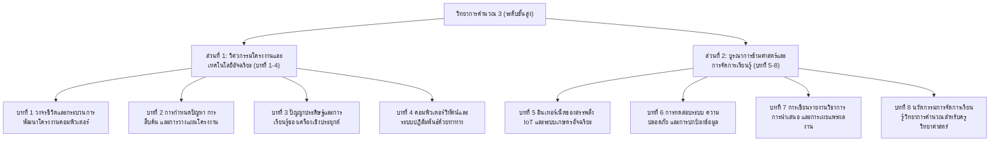

# โครงร่างตำราวิชาการ เล่มที่ 3: วิทยาการคำนวณระดับขั้นสูง
## ชื่อหนังสือ: วิทยาการคำนวณ 3: การพัฒนาโครงงานบูรณาการ ปัญญาประดิษฐ์ และนวัตกรรมการจัดการเรียนรู้วิทยาศาสตร์
### (Computing Science III: Integrated Project Development, AI & Science Pedagogical Innovation)
**ผู้เขียน:** ผู้ช่วยศาสตราจารย์ ดร.ชีวะ ทัศนา  
**สังกัด:** สาขาวิชาฟิสิกส์ คณะวิทยาศาสตร์และเทคโนโลยี มหาวิทยาลัยราชภัฏรำไพพรรณี  
**มาตรฐานหลักสูตร:** สำหรับนักศึกษาระดับปริญญาตรี ครูวิทยาศาสตร์ และผู้พัฒนาโครงงานนวัตกรรมดิจิทัล

---

## 🎯 วัตถุประสงค์และภาพรวมของตำราเล่มที่ 3
ตำราเล่มนี้เป็นจุดสูงสุดของชุดตำราวิทยาการคำนวณ มุ่งเน้นการถ่ายทอดองค์ความรู้สู่ **การลงมือปฏิบัติจริง (Hands-on Capstone Projects)** และการประยุกต์ใช้เทคโนโลยีขั้นสูง เช่น **ปัญญาประดิษฐ์ (AI / Machine Learning)**, **อินเทอร์เน็ตของสรรพสิ่ง (IoT)**, **คอมพิวเตอร์วิทัศน์ (Computer Vision)**, และ **แบบจำลองทางกายภาพ 3 มิติ (Physical Simulators)** เพื่อสร้างสรรค์โครงงานบูรณาการข้ามศาสตร์ที่แก้ปัญหาในชีวิตจริง และแนะนำกรอบการออกแบบการจัดการเรียนรู้วิทยาการคำนวณสำหรับครูยุคใหม่อย่างมืออาชีพ

---

## 📑 สารบัญและโครงสร้างเนื้อหารายบท (8 บทเรียนมาตรฐาน)

---

### บทที่ 1 วงจรชีวิตและกระบวนการพัฒนาโครงงานคอมพิวเตอร์
* **1.0 เรื่องเล่าเปิดบทเรียนและจากแนวคิดบนกระดาษสู่นวัตกรรมเปลี่ยนโลก**
* **1.1 วัฏจักรการพัฒนาซอฟต์แวร์และโครงงาน (Software Development Life Cycle - SDLC)**
  * แบบดั้งเดิม (Waterfall Model) และแบบคล่องตัว (Agile & Scrum Framework)
* **1.2 การบริหารจัดการโครงงานด้วยเครื่องมือดิจิทัล**
  * การจัดทำ Kanban Board (Trello / GitHub Projects)
  * การควบคุมเวอร์ชันของซอร์สโค้ดด้วย Git และ GitHub
* **1.3 การทำงานร่วมกันเป็นทีม (Collaborative Development)**
  * บทบาทหน้าที่: Product Owner, Scrum Master, Developer, QA Tester
* **1.4 จริยธรรมและกฎหมายลิขสิทธิ์ซอฟต์แวร์ (Open Source Licenses, Creative Commons)**
* **1.5 สรุปบทเรียนและเกณฑ์การบริหารโครงงานวิชาการ**

---

### บทที่ 2 การกำหนดปัญหา การสืบค้น และการวางแผนโครงงาน
* **2.0 เรื่องเล่าเปิดบทเรียนและพลังของการตั้งคำถามที่ถูกต้อง**
* **2.1 เทคนิคการค้นหาและนิยามปัญหาจากชีวิตจริงและชุมชน**
  * กระบวนการคิดเชิงออกแบบ (Design Thinking: Empathize $\rightarrow$ Define $\rightarrow$ Ideate $\rightarrow$ Prototype $\rightarrow$ Test)
* **2.2 การสืบค้นวรรณกรรมและงานวิจัยที่เกี่ยวข้อง (Literature Review)**
  * การใช้ฐานข้อมูลวิชาการสากล (Google Scholar, IEEE, ScienceDirect, ThaiJO)
* **2.3 การเขียนข้อเสนอโครงงาน (Project Proposal)**
  * ความเป็นมาและโจทย์วิจัย, วัตถุประสงค์ที่วัดผลได้ (SMART Objectives), ขอบเขตโครงงาน
* **2.4 การวางแผนงานด้วยแผนภูมิแกนต์ (Gantt Chart) และการบริหารความเสี่ยง**
* **2.5 สรุปบทเรียนและตัวอย่างแบบฟอร์มข้อเสนอโครงงานระดับชาติ**

---

### บทที่ 3 ปัญญาประดิษฐ์และการเรียนรู้ของเครื่องเชิงประยุกต์
* **3.0 เรื่องเล่าเปิดบทเรียนและการปฏิวัติวงการวิทยาศาสตร์ด้วย AI**
* **3.1 แนวคิดพื้นฐานของ Machine Learning (Supervised, Unsupervised, Reinforcement)**
* **3.2 การจำแนกประเภทข้อมูล (Classification) และการถดถอย (Regression)**
  * K-Nearest Neighbors (KNN), Decision Tree, Linear Regression
* **3.3 โครงข่ายประสาทเทียมเบื้องต้น (Artificial Neural Networks - ANN)**
  * สถาปัตยกรรม Perceptron, Activation Functions (ReLU, Sigmoid)
* **3.4 การประยุกต์ใช้ AI ในวิทยาศาสตร์: การทำนายผลผลิตพืช, การวิเคราะห์สารประกอบ**
* **3.5 สรุปบทเรียนและโค้ดตัวอย่างการเทรนโมเดลด้วย Scikit-learn**

---

### บทที่ 4 คอมพิวเตอร์วิทัศน์และระบบปฏิสัมพันธ์ด้วยท่าทาง
* **4.0 เรื่องเล่าเปิดบทเรียนและเมื่อคอมพิวเตอร์มองเห็นโลก 3 มิติ**
* **4.1 พื้นฐานการประมวลผลภาพดิจิทัล (Digital Image Processing with OpenCV)**
  * การแปลงปริภูมิสี (RGB $\rightarrow$ Grayscale $\rightarrow$ HSV), Thresholding, Contours
* **4.2 ระบบตรวจจับวัตถุและใบหน้า (Face & Object Detection)**
* **4.3 การติดตามท่าทางมือ 21 ข้อต่อ 3 มิติด้วย MediaPipe Hands**
  * การคำนวณระยะห่างยุคลิด (Euclidean Distance) เพื่อตรวจจับการหยิบจับ (Pinch Gesture)
* **4.4 การสร้างห้องปฏิบัติการเสมือนจริงและการควบคุม AR ด้วยมือเปล่า**
* **4.5 สรุปบทเรียนและโครงงานตัวอย่าง "ระบบควบคุมการทดลองฟิสิกส์ไร้สัมผัส"**

---

### บทที่ 5 อินเทอร์เน็ตของสรรพสิ่ง IoT และระบบเกษตรอัจฉริยะ
* **5.0 เรื่องเล่าเปิดบทเรียนและการเชื่อมต่อสรรพสิ่งสู่อินเทอร์เน็ต**
* **5.1 สถาปัตยกรรมระบบ IoT (Sensors $\rightarrow$ Microcontroller $\rightarrow$ Cloud $\rightarrow$ Dashboard)**
* **5.2 ฮาร์ดแวร์ควบคุมและการอ่านค่าเซนเซอร์**
  * บอร์ดไมโครคอนโทรลเลอร์ (Micro:bit, ESP32, Arduino)
  * เซนเซอร์อุณหภูมิ ความชื้น แสง ค่า pH และระดับน้ำ
* **5.3 โปรโตคอลการสื่อสารข้อมูลสำหรับ IoT (HTTP REST API, MQTT WebSockets)**
* **5.4 โครงงานบูรณาการ: ระบบฟาร์มเกษตรอัจฉริยะ (Smart AgriPhysics Farm)**
  * การควบคุมระบบรดน้ำอัตโนมัติตามค่าความชื้นในดินและพยากรณ์อากาศ AI
* **5.5 สรุปบทเรียนและผังวงจรอิเล็กทรอนิกส์มาตรฐาน**

---

### บทที่ 6 การทดสอบระบบ ความปลอดภัย และการปกป้องข้อมูล
* **6.0 เรื่องเล่าเปิดบทเรียนและความสำคัญของคุณภาพและความมั่นคงปลอดภัย**
* **6.1 ระเบียบวิธีทดสอบซอฟต์แวร์ (Software Testing Methodologies)**
  * Unit Testing, Integration Testing, System Testing, User Acceptance Testing (UAT)
* **6.2 การวิเคราะห์ข้อผิดพลาดและบั๊ก (Debugging & Profiling Tools)**
* **6.3 ความมั่นคงปลอดภัยไซเบอร์เบื้องต้น (Cybersecurity Fundamentals)**
  * การเข้ารหัสข้อมูล (Encryption), การป้องกันการโจมตี SQL Injection / XSS
* **6.4 กฎหมายคุ้มครองข้อมูลส่วนบุคคล (PDPA) และจริยธรรมข้อมูลขนาดใหญ่**
* **6.5 สรุปบทเรียนและแบบประเมินคุณภาพโครงงาน (QA Checklist)**

---

### บทที่ 7 การเขียนรายงานวิชาการ การนำเสนอ และการเผยแพร่ผลงาน
* **7.0 เรื่องเล่าเปิดบทเรียนและศิลปะการสื่อสารคุณค่าของนวัตกรรม**
* **7.1 โครงสร้างรายงานโครงงาน 5 บทตามมาตรฐานวิชาการ**
  * บทที่ 1 บทนำ, บทที่ 2 เอกสารและงานวิจัยที่เกี่ยวข้อง, บทที่ 3 วิธีดำเนินงาน
  * บทที่ 4 ผลการดำเนินงานและการทดสอบ, บทที่ 5 สรุปผล อภิปราย และข้อเสนอแนะ
* **7.2 การเขียนบทคัดย่อภาษาไทยและภาษาอังกฤษ (Abstract Writing)**
* **7.3 การออกแบบโปสเตอร์วิชาการ (Academic Poster Design 16:9 & A0)**
  * การจัด Visual Hierarchy, การใช้กราฟิกและตารางสรุปผล
* **7.4 ทักษะการนำเสนอผลงานด้วยวาจา (Pitching & Oral Presentation)**
* **7.5 สรุปบทเรียนและคู่มือเตรียมความพร้อมสู่การแข่งขันโครงงานระดับชาติ**

---

### บทที่ 8 นวัตกรรมการจัดการเรียนรู้วิทยาการคำนวณสำหรับครูวิทยาศาสตร์
* **8.0 เรื่องเล่าเปิดบทเรียนและบทบาทของครูผู้จุดประกายความคิดสร้างสรรค์**
* **8.1 ทฤษฎีการสอนวิทยาการคำนวณร่วมสมัย (Pedagogical Frameworks)**
  * Constructionism (การสร้างความรู้ด้วยตนเองจากการสร้างชิ้นงาน)
  * Problem-Based Learning (PBL) และ Challenge-Based Learning (CBL)
* **8.2 การบูรณาการวิทยาการคำนวณเข้ากับสาระการเรียนรู้วิทยาศาสตร์ (Physics, Bio, Chem)**
  * Computational Physics, Bioinformatics, Computational Chemistry
* **8.3 การออกแบบแผนการจัดการเรียนรู้และใบกิจกรรมเชิงรุก (Active Learning Lesson Plan)**
* **8.4 การวัดและประเมินผลตามสภาพจริง (Authentic Assessment & Rubrics)**
* **8.5 สรุปภาพรวมชุดตำราวิทยาการคำนวณ 3 เล่มและทิศทางอนาคต**

---

## 📊 ตารางมาตรฐานผลลัพธ์การเรียนรู้ (OBE & Bloom's Taxonomy Mapping)

| บทที่ | หัวข้อหลัก | Bloom's Taxonomy | OBE Learning Outcome (CLO) |
| :---: | :--- | :---: | :--- |
| **1** | วงจรพัฒนาโครงงาน | L4 (Analyze), L5 (Evaluate) | บริหารจัดการวงจรชีวิตโครงงานและทำงานร่วมกันเป็นทีมด้วย Git/Agile ได้อย่างมีประสิทธิภาพ |
| **2** | การกำหนดปัญหาและแผนงาน | L4 (Analyze), L6 (Create) | กำหนดโจทย์วิจัย สืบค้นวรรณกรรม และเขียนข้อเสนอโครงงานระดับวิชาชีพ |
| **3** | ปัญญาประดิษฐ์ประยุกต์ | L4 (Analyze), L6 (Create) | พัฒนาและประยุกต์ใช้โมเดล Machine Learning ในการแก้ปัญหาทางวิทยาศาสตร์ |
| **4** | คอมพิวเตอร์วิทัศน์และ AR | L5 (Evaluate), L6 (Create) | สร้างระบบตรวจจับภาพและควบคุมการทดลองเสมือนจริงด้วย MediaPipe 3D |
| **5** | ระบบ IoT และเกษตรอัจฉริยะ | L4 (Analyze), L6 (Create) | ออกแบบและสร้างระบบ IoT เชื่อมต่อเซนเซอร์และคลาวด์เพื่อการบูรณาการจริง |
| **6** | การทดสอบและความปลอดภัย | L5 (Evaluate) | ดำเนินการทดสอบระบบแบบรอบด้านและปฏิบัติตามมาตรฐาน PDPA/ความปลอดภัย |
| **7** | การเขียนรายงานและนำเสนอ | L6 (Create) | เขียนรายงาน 5 บท ออกแบบโปสเตอร์ และนำเสนอผลงานเชิงวิชาการอย่างน่าสนใจ |
| **8** | นวัตกรรมการสอนวิทยาศาสตร์ | L5 (Evaluate), L6 (Create) | ออกแบบแผนการจัดการเรียนรู้บูรณาการวิทยาการคำนวณกับวิทยาศาสตร์อย่างเป็นรูปธรรม |
