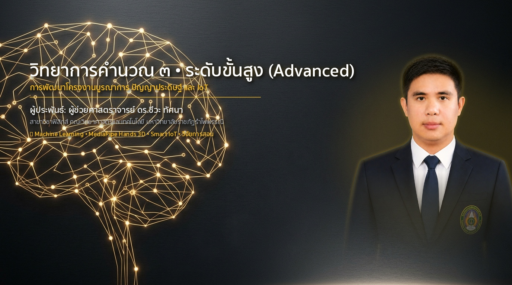
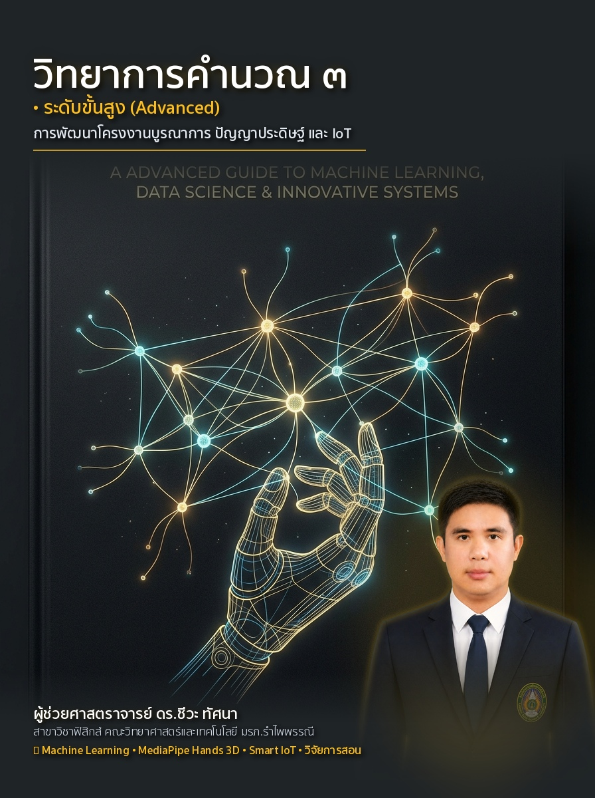
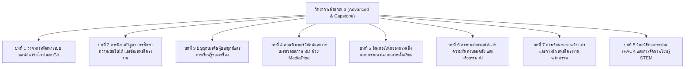

# วิทยาการคำนวณ 3 วิศวกรรมซอฟต์แวร์ ปัญญาประดิษฐ์ประยุกต์ และการพัฒนาโครงงานนวัตกรรม
### (Computing Science 3: Applied AI, Computer Vision, IoT & Capstone Innovations)
**ผู้เขียน** ผู้ช่วยศาสตราจารย์ ดร.ชีวะ ทัศนา  
**สังกัด** สาขาวิชาฟิสิกส์ คณะวิทยาศาสตร์และเทคโนโลยี มหาวิทยาลัยราชภัฏรำไพพรรณี  
**สำนักพิมพ์** สำนักพิมพ์มหาวิทยาลัยราชภัฏรำไพพรรณี (RBRU Press)  

---

  

  
  
<em>ภาพที่ 1 ปกหนังสือวิชาการ วิทยาการคำนวณ 3 วิศวกรรมซอฟต์แวร์ ปัญญาประดิษฐ์ประยุกต์ และการพัฒนาโครงงานนวัตกรรม</em>

## 🏛️ ข้อมูลทางบรรณานุกรมและกองบรรณาธิการ (Publication Metadata)

* **ชื่อเรื่อง:** วิทยาการคำนวณ 3 วิศวกรรมซอฟต์แวร์ ปัญญาประดิษฐ์ประยุกต์ และการพัฒนาโครงงานนวัตกรรม
* **ผู้เขียน:** ชีวะ ทัศนา, 2526—
* **พิมพ์ครั้งที่:** 1 (สิงหาคม 2569 / August 2026)
* **จำนวนหน้า:** 360 หน้า
* **สงวนลิขสิทธิ์:** © 2026 โดย ผศ.ดร.ชีวะ ทัศนา และมหาวิทยาลัยราชภัฏรำไพพรรณี
* **สัญญาอนุญาตสากล:** CC BY-NC-ND 4.0 International

---

## ✍️ คำนำจากกองบรรณาธิการและผู้เขียน (Editorial Preface)

ในยุคที่ปัญญาประดิษฐ์ (Artificial Intelligence) และเทคโนโลยีเชื่อมต่อสรรพสิ่ง (Internet of Things) เข้ามามีบทบาทสำคัญในทุกมิติของสังคม การเรียนรู้วิทยาการคำนวณระดับสูงจึงต้องก้าวข้ามการแก้โจทย์บนกระดาษไปสู่ **"การสร้างสรรค์นวัตกรรมซอฟต์แวร์ที่นำไปใช้แก้ปัญหาจริงในสังคมและชั้นเรียนวิทยาศาสตร์"**

ตำราเล่มที่ 3 นี้ ทำหน้าที่เป็นบทสรุปยอดมงกุฎของชุดตำรา CS2026 โดยครอบคลุมวิศวกรรมซอฟต์แวร์สมัยใหม่ (SDLC, Agile, Scrum, Git), การพัฒนาโครงงานนวัตกรรมตั้งแต่ข้อเสนอโครงงานจนถึงรายงานวิจัย, ปัญญาประดิษฐ์ประยุกต์และการเรียนรู้ของเครื่อง (Machine Learning), คอมพิวเตอร์วิทัศน์และการตรวจจับท่าทางมือ 21 ข้อต่อด้วย Google MediaPipe, อินเทอร์เน็ตของสรรพสิ่ง (IoT) และโปรโตคอล MQTT, การทดสอบซอฟต์แวร์ ความมั่นคงปลอดภัย จริยธรรม AI และกฎหมาย PDPA, ตลอดจนวิทยวิธีทางการสอน TPACK สำหรับครูวิทยาศาสตร์ยุคใหม่

---

## 🗺️ แผนผังสารบัญเนื้อหาเล่มที่ 3 (Table of Contents)

---

## 📚 รายละเอียดบทเรียนและลิงก์เอกสารฉบับสมบูรณ์ (เล่ม 3)

* **[บทที่ 1 วงจรการพัฒนาระบบ ซอฟต์แวร์ อไจล์ และการควบคุมเวอร์ชัน Git](file:///Applications/XAMPP/xamppfiles/htdocs/rbrumooc/cs2026_series/book3_chapters/chapter01_sdlc_agile_and_git.md)**
* **[บทที่ 2 การนิยามปัญหา การศึกษาความเป็นไปได้ และข้อเสนอโครงงาน](file:///Applications/XAMPP/xamppfiles/htdocs/rbrumooc/cs2026_series/book3_chapters/chapter02_problem_formulation_and_proposals.md)**
* **[บทที่ 3 ปัญญาประดิษฐ์ประยุกต์และการเรียนรู้ของเครื่อง](file:///Applications/XAMPP/xamppfiles/htdocs/rbrumooc/cs2026_series/book3_chapters/chapter03_applied_ai_and_machine_learning.md)**
* **[บทที่ 4 คอมพิวเตอร์วิทัศน์และการรู้จำท่าทาง 3 มิติด้วย MediaPipe](file:///Applications/XAMPP/xamppfiles/htdocs/rbrumooc/cs2026_series/book3_chapters/chapter04_computer_vision_and_mediapipe.md)**
* **[บทที่ 5 อินเทอร์เน็ตของสรรพสิ่งและการคำนวณกายภาพอัจฉริยะ](file:///Applications/XAMPP/xamppfiles/htdocs/rbrumooc/cs2026_series/book3_chapters/chapter05_iot_and_smart_physical_computing.md)**
* **[บทที่ 6 การทดสอบซอฟต์แวร์ ความมั่นคงปลอดภัย และจริยธรรมปัญญาประดิษฐ์](file:///Applications/XAMPP/xamppfiles/htdocs/rbrumooc/cs2026_series/book3_chapters/chapter06_testing_qa_pdpa_and_ai_ethics.md)**
* **[บทที่ 7 การเขียนรายงานวิชาการและการนำเสนอโครงงานนวัตกรรม](file:///Applications/XAMPP/xamppfiles/htdocs/rbrumooc/cs2026_series/book3_chapters/chapter07_academic_report_writing_and_dissemination.md)**
* **[บทที่ 8 วิทยวิธีทางการสอน TPACK และการจัดการเรียนรู้ STEM วิทยาการคำนวณ](file:///Applications/XAMPP/xamppfiles/htdocs/rbrumooc/cs2026_series/book3_chapters/chapter08_pedagogies_tpack_and_stem_education.md)**
