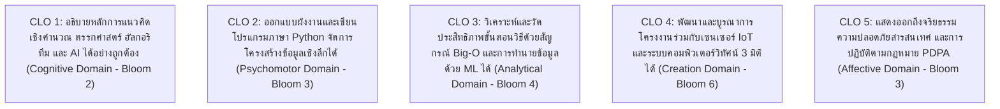
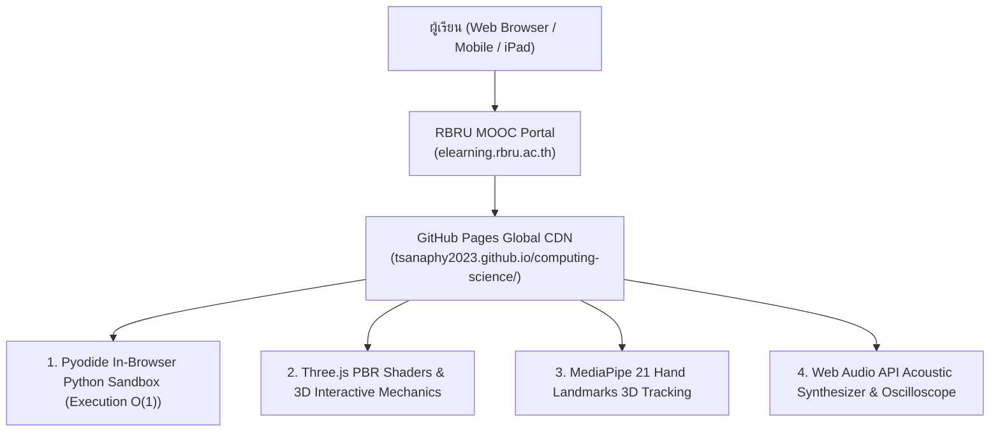

# วิทยาการคำนวณ 4 สื่อการเรียนรู้ดิจิทัลและคู่มือปฏิบัติการเสมือนจริงบนระบบ MOOC
## หมวดหมู่ที่ 0 ข้อมูลและข้อตกลงรายวิชา
**ผู้พัฒนาหลักสูตร** ผู้ช่วยศาสตราจารย์ ดร.ชีวะ ทัศนา • สาขาวิชาฟิสิกส์ คณะวิทยาศาสตร์และเทคโนโลยี มหาวิทยาลัยราชภัฏรำไพพรรณี  
**ระบบเผยแพร่** RBRU MOOC (elearning.rbru.ac.th) & GitHub Pages Global CDN

---

## 🏛️ 0.1 ปฐมนิเทศและคำอธิบายรายวิชา

### รหัสและชื่อรายวิชา
* **ชื่อภาษาไทย** สื่อการเรียนรู้ดิจิทัลและคู่มือปฏิบัติการเสมือนจริงวิทยาการคำนวณและปัญญาประดิษฐ์
* **ชื่อภาษาอังกฤษ** Digital Learning Media & Virtual Interactive Labs for Computing Science and AI
* **จำนวนหน่วยกิต** 3 หน่วยกิต (3-0-6)
* **แพลตฟอร์มการเรียนรู้** RBRU MOOC Platform • 100% Online Lifelong Learning

### คำอธิบายรายวิชา
ศึกษาและฝึกปฏิบัติการเสมือนจริงเกี่ยวกับแนวคิดเชิงคำนวณ การใช้เหตุผลเชิงตรรกะ การเขียนรหัสลำลองและผังงานมาตรฐานสากล การพัฒนาโปรแกรมด้วยภาษา Python โครงสร้างข้อมูลเชิงเส้นและตารางแฮช อัลกอริทึมการค้นหาและการจัดเรียงข้อมูล การวิเคราะห์ความซับซ้อน Big-O สถาปัตยกรรมโปรแกรมเชิงโมดูลและการจัดการไฟล์ การสร้างแบบจำลองทางฟิสิกส์และคณิตศาสตร์ การประยุกต์ใช้ปัญญาประดิษฐ์ (AI) การเรียนรู้ของเครื่อง (Machine Learning) คอมพิวเตอร์วิทัศน์ตรวจจับท่าทางมือ 3 มิติ (MediaPipe Hands) และอินเทอร์เน็ตของสรรพสิ่ง (IoT) ผ่านชุดสื่อจำลองสถานการณ์เสมือนจริง 50 ปฏิบัติการบนระบบคลาวด์ระดับโลก

---

## 🎯 0.2 แผนผังผลลัพธ์การเรียนรู้ประจำรายวิชา

---

## 🌐 0.3 สถาปัตยกรรม 50 ปฏิบัติการเสมือนจริง

หลักสูตรดิจิทัลนี้ถูกออกแบบด้วยเทคโนโลยี **WebAssembly (Pyodide), Three.js PBR Physical Shaders, MediaPipe AI, และ GitHub Pages CDN** ทำให้ผู้เรียนสามารถรันโค้ดและทดลองฟิสิกส์ 3D ได้ทันทีบนเว็บเบราว์เซอร์ทุกอุปกรณ์โดยไม่ต้องติดตั้งโปรแกรมใดๆ

---

## 📊 0.4 แผนผัง 10 หมวดหมู่วิชาหลัก (Sections 1 ถึง 10 รวม 50 โมดูลบทเรียน)

| หมวดที่ | หัวข้อหลักสูตรดิจิทัลบน MOOC | จำนวนตอนย่อย | ชุดจำลองเสมือนจริงที่ฝังในระบบ |
| :---: | :--- | :---: | :--- |
| **Section 1** | **ตรรกะและกระบวนการคิดเชิงคำนวณ** | 5 โมดูล | Logic Truth Table Simulator, River Crossing Game |
| **Section 2** | **การออกแบบขั้นตอนวิธีและผังงานมาตรฐาน** | 5 โมดูล | Interactive Flowchart Engine, Trace Table Runner |
| **Section 3** | **พื้นฐานการเขียนโปรแกรมและการจัดการข้อมูล** | 5 โมดูล | In-browser Python Sandbox, Kinetic Energy Calc |
| **Section 4** | **โครงสร้างควบคุม เงื่อนไข และการทำซ้ำ** | 5 โมดูล | Greenhouse IoT Climate Controller Simulator |
| **Section 5** | **โครงสร้างข้อมูลและอัลกอริทึมการค้นหา** | 5 โมดูล | Linear vs Binary Search Live Race (10M Items) |
| **Section 6** | **อัลกอริทึมการจัดเรียงและการวิเคราะห์ Big-O** | 5 โมดูล | 4-Algorithm Sorting Visualizer & Master Theorem |
| **Section 7** | **การเขียนโปรแกรมเชิงโมดูลและฟังก์ชันเรียกซ้ำ** | 5 โมดูล | Tower of Hanoi 3D Sim, Vector Math Module |
| **Section 8** | **วิทยาศาสตร์เชิงคำนวณและแบบจำลองฟิสิกส์** | 5 โมดูล | Projectile Motion $\Delta t$ Sim, Spring Oscillator |
| **Section 9** | **ปัญญาประดิษฐ์ คอมพิวเตอร์วิทัศน์ และ IoT** | 5 โมดูล | MediaPipe 3D Hand Tracking, Scikit-learn Classifier |
| **Section 10** | **การพัฒนาโครงงานบูรณาการและการเผยแพร่** | 5 โมดูล | Gantt & Kanban CLI, 5-Chapter Thesis Template |

---

## 🎓 0.5 เกณฑ์การประเมินผลและการรับใบประกาศนียบัตร
* **แบบทดสอบท้ายโมดูล (Formative Quizzes 50 ชุด):** ร้อยละ 40
* **ใบงานปฏิบัติการเสมือนจริง ** ร้อยละ 30
* **แบบทดสอบประมวลความรู้ปลายภาค ** ร้อยละ 30
* **เกณฑ์การสำเร็จการศึกษา** ได้คะแนนรวมไม่ต่ำกว่า **ร้อยละ 70 ($\ge 70\%$)** จะได้รับใบประกาศนียบัตรดิจิทัล (Digital Certificate with Verification QR Code) จากมหาวิทยาลัยราชภัฏรำไพพรรณี
